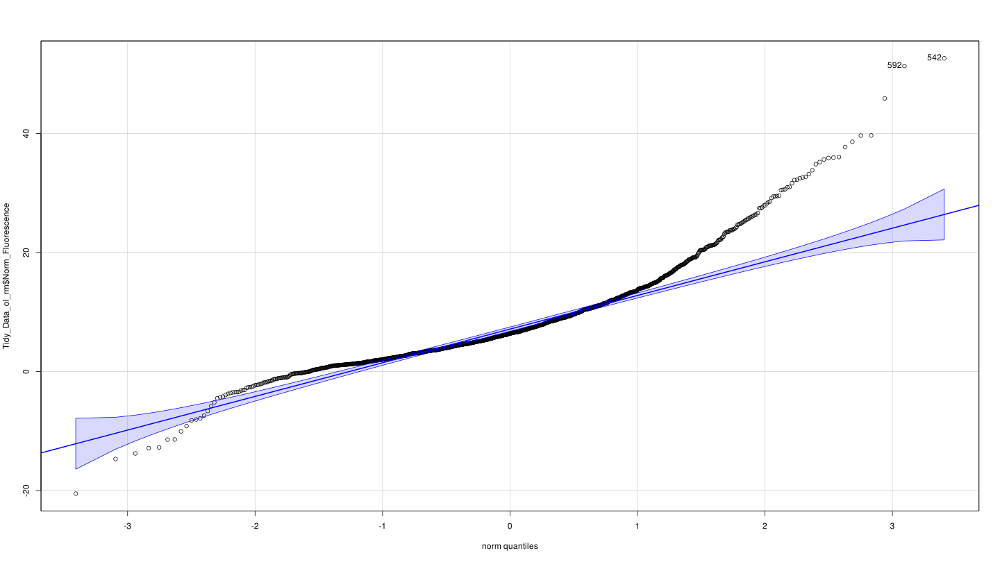
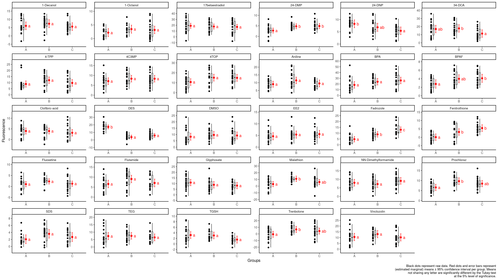
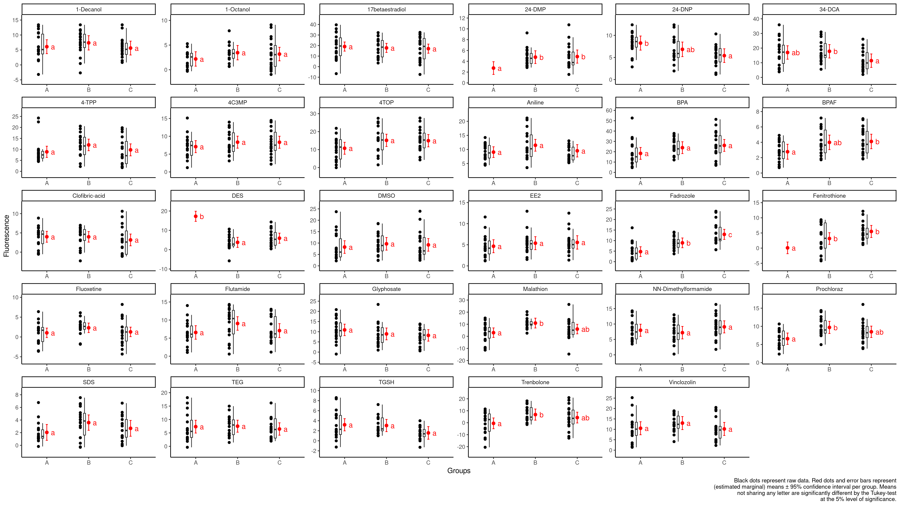

```{r setup, include=FALSE}
#knitr::opts_chunk$set(echo = TRUE)
```

```{r Libraries, include = FALSE}
library(plyr)
library(data.table)
library(abind)
library(dplyr)
library(tidyr)
library(readr)
library(car)
library(purrr)
library(broom)
library(naniar)
library(ggplot2)
library(DescTools)
library(tidyverse)
library(outliers)
library(future) 
library(future.apply) # from original future author
library(furrr) # use future.apply but similar to purrr package
future::plan(multisession, workers = availableCores()) # windows, Mac needs multicore
library(ggrepel)
library(scales)
library(emmeans)
library(multcomp)
library(multcompView)
library(DT)
```

```{r directory_and_metadata, include=FALSE}
getwd() #Output should be "/*/*/MoltToxLab/Alamar_Blue" or something similar
folderNames <-
  list.files("Data/Sub/")#Character list of all folders in /Data/Sub/
folder <- folderNames
files_in_folder <-
  list.files(paste0("Data/Sub/", folder), full.names = TRUE, pattern = "*.txt") #Character list of all files in each folder (alphabetical order)
fileNames <-   list.files(paste0("Data/Sub/", folder), full.names = FALSE, pattern = "*.txt") #Character list of all files in each folder (alphabetical order)
```

```{r import, include=FALSE}
# #Easy way to import the data is to just read my final .csv tables...
# #all the data in the directory
Tidy_Data <-
  read_csv(file = "Data/Alamar_Blue_Tidy_Data_29chems.csv")
Tidy_Data_ol_rm <-
  read_csv(file = "Data/Alamar_Blue_Tidy_Data_29chems_outliers_rm.csv")
# #or
# Tylers_Data <- 
#   read_csv(file = "Data/Alamar_Blue_Tylers_Data.csv")
```

```{r importing_raw_data, eval=FALSE, echo=TRUE}
#How I produced the final .csv tables...


#Read in Data
list <- list() #Create an empty list
for (k in files_in_folder) {
  list[[k]] <-
    fread(
      file = k,
      skip = 12, #We want to just read in the second data bloack fromt he raw .txt friles from the spectrophotometer read-out
      nrows = 8, #Stop reading after the data frame has been read in
      select = c(3:11), #Select just the 9 columns that contain the data and no white space
      header = FALSE,
      data.table = TRUE
    ) # Using fread because it is really quick and multicore. It's faster than read_tsv for example
}
names(list) <- str_split(string = names(list), pattern = "/", simplify = TRUE)[,4]
#Create a quick functioin to remove the pesky empty row between the data and the blank well controls
cleanup <- function(x) {
  x <- x[-7, ]
  return(x)
}
#Remove those pesky rows
list <- lapply(list, FUN = cleanup)


#Subset data
#Data is listed in alphabetical order in 'list' object
#REVIEW: Not ideal way to subset data... naming rows by Chemical - Dose can fix this and make subsetting more streamlined
Baseline_1 <-
  c(seq(
    from = 3,
    to = length(files_in_folder),
    by = 4
  )) #WARNING: seq() to argument is dynamic... will change with more data
Baseline_2 <- c(seq(
  from = 4,
  to = length(files_in_folder),
  by = 4
))
h24_1 <-
  c(seq(
    from = 1,
    to = length(files_in_folder),
    by = 4
  )) #leading h because object can't start with numeric
h24_2 <- c(seq(
  from = 2,
  to = length(files_in_folder),
  by = 4
))
#These objects represent the numnber in 1:4 that corresponds to the 24h and baseline plates... so we have 1-4 replicated 26 times (because we have 26 chemicals in the data frame)... 4*26=104
#Create your 4 dataframes to prepare for creating average data sets
list[Baseline_1] #Check and see that the output is Baseline_1.txt files
Base_1_dfl <- plyr::ldply(list[Baseline_1]) #Here we are subsetting the list object which contains data from each plate (replicated twice to control for instrument reading errors). Each subset contains data for different replicates (2) and two time points (baseline and 24h) = 4 different data frames
list[Baseline_2]
Base_2_dfl <- plyr::ldply(list[Baseline_2])
list[h24_1]
h24_1_dfl <- plyr::ldply(list[h24_1])
list[h24_2]
h24_2_dfl <- plyr::ldply(list[h24_2])
#Simple average of the two data sets (Day 0 - Baseline, and Day 1 - 24h)
Baseline_avg <-
  rbind(Base_1_dfl, Base_2_dfl) %>% #Change
  mutate(
    Chemical = str_split(
      string = .id,
      pattern = "_",
      simplify = TRUE
    )[, 1],
    Measurement_1 = paste0(
      str_split(
        string = .id,
        pattern = "_",
        simplify = TRUE
      )[, 2],
      "_",
      str_split(
        string = .id,
        pattern = "_",
        simplify = TRUE
      )[, 3]
    )
  ) %>%
  mutate(Measurement = str_remove(string = Measurement_1, pattern = ".txt")) %>%
  mutate(Dose = rep(
    c(
      "Dose_1",
      "Dose_2",
      "Dose_3",
      "Dose_4",
      "Dose_5",
      "Dose_6",
      "Blank"
    ),
    times = length(folderNames) * 2
  )) %>%
  pivot_longer(cols = V3:V11, values_to = "Fluorescence", names_to = "name") %>%
  mutate(is_empty = if_else(
    condition = (name %in% c("V7", "V8", "V9", "V10", "V11")) &
      Dose == "Blank",
    true = TRUE,
    false = FALSE
  )) %>%
  filter(is_empty != TRUE) %>%
  dplyr::select(Chemical, Dose, name, Fluorescence, Measurement) %>%
  pivot_wider(names_from = Measurement, values_from = Fluorescence) %>%
  mutate(Baseline_Fluorescence = (Baseline_1 + Baseline_2) / 2) %>% #Change
  dplyr::select(-name)

h24_avg <-
  rbind(h24_1_dfl, h24_2_dfl) %>% #Change
  mutate(
    Chemical = str_split(
      string = .id,
      pattern = "_",
      simplify = TRUE
    )[, 1],
    Measurement_1 = paste0(
      str_split(
        string = .id,
        pattern = "_",
        simplify = TRUE
      )[, 2],
      "_",
      str_split(
        string = .id,
        pattern = "_",
        simplify = TRUE
      )[, 3]
    )
  ) %>%
  mutate(Measurement = str_remove(string = Measurement_1, pattern = ".txt")) %>%
  mutate(Dose = rep(
    c(
      "Dose_1",
      "Dose_2",
      "Dose_3",
      "Dose_4",
      "Dose_5",
      "Dose_6",
      "Blank"
    ),
    times = length(folderNames) * 2
  )) %>%
  pivot_longer(cols = V3:V11, values_to = "Fluorescence") %>%
  mutate(is_empty = if_else(
    condition = (name %in% c("V7", "V8", "V9", "V10", "V11")) &
      Dose == "Blank",
    true = TRUE,
    false = FALSE
  )) %>%
  filter(is_empty != TRUE) %>%
  dplyr::select(Chemical, Dose, name, Fluorescence, Measurement) %>%
  pivot_wider(names_from = Measurement, values_from = Fluorescence) %>%
  mutate(h24_Fluorescence = (`24h_1` + `24h_2`) / 2) %>% #Change
  dplyr::select(-name)


Baseline_avg #Combined data frame for every chemical (including blank wells)
h24_avg #Combine data frame
rm(Base_1_dfl,
   Base_2_dfl,
   h24_1_dfl,
   h24_2_dfl,
   Baseline_1,
   Baseline_2,
   h24_1,
   h24_2) #Cleaning up the work environment

#at this point what we have is the unprocessed single-plate reads for both time points (Day 0 and Day 1)... Next we are going to pull out the blank wells and replace any outliers with NAs


#Subset the control data (First 4 cells by column of every 7th row)
#testing and manually verifying with raw data
# test <- Baseline_avg[c(seq(from = 7, to = 182, by = 7)),]
# row.names(test) <- folderNames
# test


#Pulling out the blank 'control' wells for normalization later
#Baseline avg blank well
Base_control <- Baseline_avg %>%
  filter(Dose == "Blank") %>%
  group_by(Chemical, Dose) %>%
  summarise(Base_Fluorescence = mean(Baseline_Fluorescence))
  
#24h avg blank well
h24_control <- h24_avg %>%
  filter(Dose == "Blank") %>%
  group_by(Chemical, Dose) %>%
  summarise(h24_Fluorescence = mean(h24_Fluorescence))

#Creating the normalization factor to be applied to the Delta data frame in the next step
Blank_Data <- full_join(x = Base_control, y = h24_control) %>%
  rename(Baseline_Blank = Base_Fluorescence,
         h24_Blank = h24_Fluorescence) %>%
  group_by(Chemical) %>%
  dplyr::select(-Dose)
# Blank_Delta <- full_join(x = Base_control, y = h24_control) %>%
#   mutate(Fluorescence = h24_Fluorescence-Base_Fluorescence)
# Blank_Delta


#Tidy up the data
Delta <- cbind(Baseline_avg, h24_avg) %>%
  subset(., select = which(!duplicated(names(.)))) %>%
  mutate(Delta_Fluorescence = .$h24_Fluorescence-.$Baseline_Fluorescence)

#Assign Dose Values
AllDoses <-
  read.csv(file = "MetaData.csv",
           skip = 1,
           header = TRUE)
AllDoses_2 <- AllDoses %>%
  gather(key = Dose, value = "Dose(mg/L)", Dose_1:Dose_6)

#Final Data Frame
Tidy_Data <- Delta %>%
  inner_join(AllDoses_2) %>%
  arrange(Chemical) %>%
  #separate(Chemical, into = c("Chemical", "Date"), sep = "_") %>% #Seperating chemical and date variable
  #mutate(Date = NULL, Dose = NULL) %>% #Getting rid of date variable
  mutate(Group = rep(c("A", "B", "C"), each = 3, length.out = length(folderNames)*9*6)) %>%
  mutate(Animal = rep(1:54, times = length(folderNames))) %>%
  dplyr::select(Chemical, `Dose(mg/L)`, Dose, Animal, Group, everything())
#Ignore warning message... it shous up because separate finds 3 different chunks (because year, month, date are also separated by an undercore... We are discarding the variable anyway)


# #Normalize
# Blank_Delta <- Blank_Delta %>%
#   dplyr::select(Chemical, Fluorescence) %>%
#   rename(Norm_factor = Fluorescence)
# 
# Tidy_Data <- Tidy_Data %>%
#   group_by(Chemical) %>%
#   inner_join(Blank_Delta) %>%
#   mutate(Norm_Fluorescence = Delta_Fluorescence - Norm_factor) #Creating the new normalized column and giving it a more informative column name
#   #mutate(Fluorescence = NULL, Norm_factor = NULL) #Getting rid of the now useless variables
# 


#Normalize v2 (Normalizing baseline and 24h separately then calculating delta fluorescence instead of normalizing the delta fluorescence value by the change in the blank over 24hours)
Tidy_Data <- Tidy_Data %>%
  group_by(Chemical) %>%
  inner_join(Blank_Data, by = join_by(Chemical)) %>%
  mutate(Norm_Baseline_Fluorescence = Baseline_Fluorescence - Baseline_Blank,
         Norm_h24_Fluorescence = h24_Fluorescence - h24_Blank,
         Delta_Fluorescence = Norm_h24_Fluorescence-Norm_Baseline_Fluorescence,
         Relative_Delta_Fluorescence = Norm_h24_Fluorescence/Norm_Baseline_Fluorescence)

#Where delta fluorescence is NA
Tidy_Data %>%
  mutate(is_NA = is.na(Relative_Delta_Fluorescence)) %>%
  filter(is_NA == TRUE)
  #None
```

```{r 2.testing_assumptions_ofnormality_and_homogeneity_of_variance_with_outliers, echo=FALSE}
#Test of normalization
#
#ggsave(plot = gg_qqplot, filename = "Output/Images/qqplot.png", device = "png", bg = "white")

#Test of normal distribution faceted by chemical
Tidy_Data %>%
  group_by(Chemical) %>%
  ggplot(aes(sample = Relative_Delta_Fluorescence)) +
  geom_qq() +
  geom_qq_line() +
  facet_wrap(~ Chemical, scales = "free") +
  ylab("Sample") +
  xlab("Theoretical") +
  theme_classic() +
  ggtitle("QQ plots showing approximately normal distributions for each experiment
          without outliers removed")
```

```{r Legacy_Outlier_removal_code_chunks_using Grubb's_Test, include=FALSE}


# #Testing for Outliers... Norm_Fluorescence Column
# input_Tidy_Data <- Tidy_Data %>%
#   group_by(Chemical) %>%
#   dplyr::select(Norm_Fluorescence) %>%
#   mutate(Norm_Fluorescence = round(Norm_Fluorescence, digits = 3)) %>% #Bug with grubbs and large decimal places
#   # filter(Chemical %in% c("BPA", "BPAF")) %>% #Testing with smaller data set
#   nest()
# 
# grubbs.flag <- function(x) {
#   outliers <- NULL
#   test <- x
#   grubbs.result <- grubbs.test(test)
#   pv <- grubbs.result$p.value
#   while(pv < 0.05) {
#     outliers <- c(outliers,as.numeric(strsplit(grubbs.result$alternative," ")[[1]][3]))
#     test <- x[!x %in% outliers]
#     grubbs.result <- grubbs.test(test)
#     pv <- grubbs.result$p.value
#   }
#   return(data.frame(Norm_Fluorescence=x,Outlier=(x %in% outliers)))
# }
# 
# grubbs_results <- input_Tidy_Data %>%
#   mutate(grubbs_results = map(data, ~grubbs.flag(x = .x[[1]])))
# 
# Tidy_Data_join <- grubbs_results %>%
#   dplyr::select(-data) %>%
#   unnest(cols = c(grubbs_results))
# 
# Tidy_Data_test <- Tidy_Data %>%
#   mutate(Norm_Fluorescence = round(Norm_Fluorescence, digits = 3)) %>%
#   inner_join(Tidy_Data_join, by = c("Chemical", "Norm_Fluorescence"))
# Tidy_Data_test <- Tidy_Data_test[-which(duplicated(Tidy_Data_test)),] #Delete duplicates introduced by join
# 
# test <- Tidy_Data_test %>%
#   group_by(Chemical, Dose) %>%
#   tally()
# 
# #Outliers flagged
# Tidy_Data <- Tidy_Data_test %>%
#   mutate(Outlier = Outlier.x)
# 
# #Outliers removed
# Tidy_Data_ol_rm <- Tidy_Data %>%
#   mutate(across(
#     .cols = c("Norm_Fluorescence"),
#     .fns = ~ replace(x = ., list = Outlier, values = NA) 
#   ))
# 
# #-----------------------------------------------------------------------------#
# #Testing for Outliers... Relative Change in Fluorescene column (Relative_Delta_Fluorescence)
input_Tidy_Data <- Tidy_Data %>%
  group_by(Chemical) %>%
  dplyr::select(Relative_Delta_Fluorescence) %>%
  mutate(Relative_Delta_Fluorescence = round(Relative_Delta_Fluorescence, digits = 3)) %>% #Bug with grubbs and large decimal places
  # filter(Chemical %in% c("BPA", "BPAF")) %>% #Testing with smaller data set
  nest()

grubbs.flag <- function(x) {
  outliers <- NULL
  test <- x
  grubbs.result <- grubbs.test(test)
  pv <- grubbs.result$p.value
  while(pv < 0.05) {
    outliers <- c(outliers,as.numeric(strsplit(grubbs.result$alternative," ")[[1]][3]))
    test <- x[!x %in% outliers]
    grubbs.result <- grubbs.test(test)
    pv <- grubbs.result$p.value
  }
  return(data.frame(Relative_Delta_Fluorescence=x,Outlier=(x %in% outliers)))
}

grubbs_results <- input_Tidy_Data %>%
  mutate(grubbs_results = map(data, ~grubbs.flag(x = .x[[1]])))

Tidy_Data_join <- grubbs_results %>%
  dplyr::select(-data) %>%
  unnest(cols = c(grubbs_results))

Tidy_Data_test <- Tidy_Data %>%
  mutate(Relative_Delta_Fluorescence = round(Relative_Delta_Fluorescence, digits = 3)) %>%
  inner_join(Tidy_Data_join, by = c("Chemical", "Relative_Delta_Fluorescence"))
Tidy_Data_test <- Tidy_Data_test[-which(duplicated(Tidy_Data_test)),] #Delete duplicates introduced by join

test <- Tidy_Data_test %>%
  group_by(Chemical, Dose) %>%
  tally()

#Outliers flagged
Tidy_Data <- Tidy_Data_test %>%
  mutate(Outlier = Outlier.y)

#Outliers removed
Tidy_Data_ol_rm <- Tidy_Data %>%
  mutate(across(
    .cols = c("Relative_Delta_Fluorescence"),
    .fns = ~ replace(x = ., list = Outlier, values = NA)
  ))

#-----------------------------------------------------------------------------#

#Subsetting Tyler's Data
Tylers_Data <- Tidy_Data %>%
  filter(Chemical %in% c("BPA", "BPAF", "DES", "EE2", "TGSH"))

#Writing the Data to the 'getwd()/Data/' Directory
write_csv(x = Tidy_Data, file = "Data/Alamar_Blue_Tidy_Data_29chems.csv")
write_csv(x = Tidy_Data_ol_rm, file = "Data/Alamar_Blue_Tidy_Data_29chems_outliers_rm.csv")
write_csv(x = Tylers_Data, file = "Data/Alamar_Blue_Tylers_Data.csv")

```

```{r 1.testing_assumptions_ofnormality_and_homogeneity_of_variance, echo=FALSE}
#Mean and StDev of Delta of each Dose
DoseSummary <- Tidy_Data %>%
  group_by(Chemical, `Dose(mg/L)`) %>%
  summarise(
    StDev = sd(Relative_Delta_Fluorescence, na.rm = TRUE),
    Mean = mean(Relative_Delta_Fluorescence, na.rm = TRUE),
    .groups = "keep"
  )
DT::datatable(DoseSummary)
```

```{r 3.testing_assumptions_ofnormality_and_homogeneity_of_variance_without_outliers_removed, echo=TRUE}
#Homogeneity of Variance
LeveneResults <- Tidy_Data_ol_rm %>%
  group_by(Chemical) %>%
  summarise(leveneTest(Relative_Delta_Fluorescence, as.factor(`Dose(mg/L)`)))
#Adding an is.significant column to easily parse significant values in a spreadsheet
LeveneResults <- LeveneResults %>%
  na.omit() %>%
  mutate(is.significant = if_else(
    condition = `Pr(>F)` < 0.05,
    true = TRUE,
    false = FALSE
  ))

DT::datatable(LeveneResults)

#Var Check
var_check <- Tidy_Data_ol_rm %>%
  group_by(Chemical, Dose) %>%
  dplyr::mutate(variance = var(Relative_Delta_Fluorescence, na.rm = TRUE)) %>%
  dplyr::summarise(variance) %>%
  unique()

# General rule of thumb is that ANOVA/ANCOVA is robust enough to tolerate minor differences in variance across groups. The largest group variance can be up to 4 times the smallest without posing problems. 
var_check_2 <- var_check %>%
  group_by(Chemical) %>%
  dplyr::summarise(max = max(variance), min = min(variance), check = if_else(condition = max <= min*4, true = "OK", false = "Not OK"))

#Table shows mostly homogeneous variance except for flutamide

write_csv(x = LeveneResults, file = "Output/Levene_Test_Results.csv")
#rm(VarianceCheck)
```


```{r 1.ANCOVA_results, echo=TRUE}
#ANCOVA
ANCOVA <- Tidy_Data_ol_rm %>%
  group_by(Chemical) %>%
  nest() %>%
  mutate(model = map(data, ~ aov(
    Relative_Delta_Fluorescence ~ as.factor(`Dose(mg/L)`) + as.factor(Group),
    data = .
  ))) %>% #Where 'Group' is the dose group replicate... group A B or C for one of 3 petri dishes in the dose group... This tells us if there were human error in making sure each replicate got the same dose
  dplyr::select(model)

ANCOVACheck <- ANCOVA %>%
  mutate(model_tidy = map(model, tidy)) %>%
  unnest(model_tidy)

ANCOVACheck <- ANCOVACheck %>%
  mutate(adj_p.value = p.adjust(p.value, method = "fdr")) %>%
  mutate(is.significant = if_else(
    condition = adj_p.value <= 0.05,
    true = TRUE,
    false = FALSE
  ))
DT::datatable(ANCOVACheck) #Final Data Frame for the ANCOVA... will write later
```

```{r 2.ANCOVA_results, echo=TRUE}
ANCOVA_Sig_Results <-
  ANCOVACheck[which(ANCOVACheck$adj_p.value[] <= 0.05), ]
DT::datatable(ANCOVA_Sig_Results) #Just the significant results of the ANCOVA
#Saving the ANCOVA Results
write_csv(x = ANCOVACheck, file = "Output/ANCOVA_Results.csv") #ANCOVA
```

```{r 2.PostHoc_TukeysHSD, echo=TRUE, warning=FALSE, message=FALSE}
#TukeyHSD's Test on Groups - testing for 'Group Effects'
Tukey_results <- ANCOVA %>%
  mutate(model = map(model, ~ TukeyHSD(x = .x))) #Performing the Tukey's test and saving it is a variable

#%%%%%%%%%%%%%%%%%%%%%%%%%%%%%%%%%%%%%%%%%%%%%%%%%%%%%%%%%%%%%%%%%%%%%%%%%%%%%
#Following guide here https://schmidtpaul.github.io/DSFAIR/compactletterdisplay.html
#contrasts
#option 1
option1 <- Tukey_results %>%
  mutate(data = map(model, ~ broom::tidy(x = .x)))
#option 2
option2 <- ANCOVA %>%
  mutate(option2 = map(model, ~ emmeans::emmeans(object = .x, specs = "Group"))) %>%
  mutate(option2 = map(option2, ~ pairs(x = .x,  adjust = "Tukey")))
#option 3
option3 <- ANCOVA %>%
  mutate(option3 = map(model, ~ multcomp::cld(emmeans::emmeans(object = .x, specs = "Group"), adjust = "Tukey", details = TRUE, Letters = letters, alpha = 0.05)))

#uniform format
option1 <- option1 %>%
  dplyr::select(data) %>%
  unnest(cols = c(data)) %>% #Tidying Output
  filter(term == "as.factor(Group)") %>%
  mutate(adj.p.value = p.adjust(adj.p.value, method = "fdr"))

option2 <- option2 %>%
  dplyr::select(option2) %>%
  mutate(data = map(option2, ~ as_tibble(x = .x))) %>%
  dplyr::select(data) %>%
  unnest(cols = c(data)) %>%
  mutate(adj.p.value = p.adjust(p.value, method = "fdr"))
  
option3_t <- option3 %>%
  dplyr::select(option3) %>%
  mutate(data = map(option3, pluck(.x = "comparisons"))) %>%
  mutate(data2 = map(data, ~ as_tibble(x = .x))) %>%
  dplyr::select(data2) %>%
  unnest(cols = c(data2)) %>%
  mutate(adj.p.value = p.adjust(p.value, method = "fdr"))
option3 <- option3 %>%
  dplyr::select(option3) %>%
  mutate(data = map(option3, pluck(.x = "emmeans"))) %>%
  mutate(data2 = map(data, ~ as_tibble(x = .x))) %>%
  dplyr::select(data2) %>%
  unnest(cols = c(data2))

#%%%%%%%%%%%%%%%%%%%%%%%%%%%%%%%%%%%%%%%%%%%%%%%%%%%%%%%%%%%%%%%%%%%%%%%%%%%%%


#TukeyHSD's Test on Groups - testing for 'Group Effects' continued
Tukey_results <- Tukey_results %>% 
  mutate(data = map(model, ~ broom::tidy(x = .x))) %>%
  dplyr::select(-model) %>% 
  unnest(cols = c(data)) %>% #Tidying Output
  mutate(adj.p.value = p.adjust(adj.p.value, method = "fdr"))

Tukey_Sig_results <- Tukey_results %>%
  filter(adj.p.value < 0.05)

Tukey_join_to_Tidy <- Tukey_results %>%
  filter(term == "as.factor(Group)") %>%
  mutate(Group = str_split(string = contrast, pattern = "-", simplify = TRUE)[,1],
         contrast = str_split(string = contrast, pattern = "-", simplify = TRUE)[,2],
         Group_1 = Group,
         contrast_1 = contrast) %>%
  pivot_longer(cols = c(Group, contrast), values_to = "Group", names_to = "X") %>%
  mutate(contrast = if_else(condition = X == "contrast", true = Group_1, false = contrast_1)) %>%
  dplyr::select(Chemical, Group, contrast, term, null.value, estimate, conf.low, conf.high, adj.p.value)

gg_Tukey <- Tukey_join_to_Tidy %>%
  dplyr::select(Chemical, Group, contrast, adj.p.value)


#Write to a .csv
write_csv(Dunnett_comb, file = "Output/Dunnett_test_results.csv")
write_csv(Tukey_results, file = "Output/Tukey_HSD_results.csv")
#write_csv(option_3_t)


DT::datatable(Tukey_results)
```

```{r 1.PostHoc_Dunnett, echo=TRUE}
#PostHoc tests
set.seed(2345)

#Dunnett's Test
Dunnett_results <- Tidy_Data_ol_rm %>%
  group_by(Chemical) %>%
  nest() %>%
  mutate(model = map(data, ~ DunnettTest(
    x = .$Norm_Fluorescence, g = .$`Dose(mg/L)`
  ), data = .)) #Performing the Dunnett's test and saving it is a variable

#Creating list of summaries
#Since the PostHocTest object cannot be coerced to a tidy tibble using tidy()... we got creative
Dunnett_list <-
  list() #What we are trying to do is index the results and see what the significant results were... so we are using a list which can be later coerced into a tibble to easily index...
for (i in 1:length(unique(Tidy_Data$Chemical))) {
  Dunnett_list[[Dunnett_results$Chemical[i]]] <-
    Dunnett_results$model[[i]][["0"]] %>% #Take Dunnett's test results without any of the fancy summary information and shove it into a named list
    as.data.frame() %>% #Coerce to a data frame temporarily so what we can take the row names of the reults and turn them into a variable with rownames_to_column
    rownames_to_column(var = "dose")
}
Dunnett_comb <-
  plyr::ldply(Dunnett_list) #this function combines all of the lists together and gives them a variable name according to the chemical
Dunnett_comb$dose = substr(Dunnett_comb$dose,
                           start = 1,
                           stop = nchar(Dunnett_comb$dose) - 2) %>%
  as.numeric() #Here we are fixing the dose column... the dose column has the test dose related to the control... but we just want to see what the test dose is without it giving us redundant information about the comparison to the control for every observation...
Dunnett_comb <- as_tibble(Dunnett_comb) #Coerce to a tidy tibble
#Great, a nice tibble that we can export

#Now just to add one more column
Dunnett_comb <- Dunnett_comb %>%
  mutate(adj_p.value = p.adjust(pval, method = "fdr")) %>%
  mutate(is.significant = if_else(
    condition = pval < 0.05,
    true = TRUE,
    false = FALSE
  ))
DT::datatable(Dunnett_comb)

#Write to a .csv
write_csv(Dunnett_comb, file = "Output/Dunnett_test_results.csv")

# #indexing what the significant results were...
# Dunnett_Sig_Results <-
#   Dunnett_comb[which(Dunnett_comb$pval <= 0.05), ]
# Dunnett_Sig_Results
# #Cool!
```


```{r 1.plot_Group_variance_check, echo=FALSE}
#Group Variance v2
y_values_4_geom_text <- Tidy_Data_ol_rm %>%
  group_by(Chemical) %>%
  summarise(max_y = max(Norm_Fluorescence, na.rm = TRUE))
gg_Tukey <- gg_Tukey %>%
  inner_join(y_values_4_geom_text)
gg_data <- Tidy_Data_ol_rm %>%
  na.omit() %>%
  group_by(Chemical) %>%
  mutate(Norm_Fluorescence_show = as.numeric(
    between(
      x = Norm_Fluorescence,
      left = quantile(Norm_Fluorescence, na.rm = TRUE)[2] - 1.5 * IQR(Norm_Fluorescence, na.rm = TRUE),
      right = quantile(Norm_Fluorescence, na.rm = TRUE)[4] + 1.5 * IQR(Norm_Fluorescence, na.rm = TRUE)
    )
  )) %>%
  mutate(
    Norm_Fluorescence_ol_rm = if_else(Norm_Fluorescence_show == 1, true = Norm_Fluorescence, false = NULL)
  ) %>%
  dplyr::select(
    Chemical,
    Group,
    Dose,
    `Dose(mg/L)`,
    Norm_Fluorescence,
    Norm_Fluorescence_show,
    Norm_Fluorescence_ol_rm
  )
model <- ANCOVA
model_means_cld <- option3 %>%
  group_by(Chemical) %>%
  mutate(Group = fct_reorder(Group, emmean)) %>%
  mutate(cont_group = .group)
# gg_data <- gg_data %>%
#   group_by(Chemical) %>%
#   mutate(Group = fct_relevel(Group, levels(model_means_cld$Group)))

p <- ggplot() +
  #y axis
  scale_y_continuous(
    name = "Fluorescence",
    breaks = pretty_breaks(),
    expand = expansion(mult = (c(0.2, 0.2)))
  ) +
  #x axis
  scale_x_discrete(
    name = "Groups"
  ) +
  #layout
  theme_classic() +
  #black data points
  geom_point(
    data = gg_data,
    aes(y = Norm_Fluorescence, x = Group),
    position = position_nudge(x = -0.2)
  ) +
  #black boxplot
  geom_boxplot(
    data = gg_data,
    aes(y = Norm_Fluorescence, x = Group),
    width = 0.05,
    outlier.shape = NA,
    position = position_nudge(x = -0.1)
  ) +
  #red mean value
  geom_point(
    data = model_means_cld,
    aes(y = emmean, x = Group),
    size = 2,
    color = "red"
  ) +
  #red mean errorbar
  geom_errorbar(
    data = model_means_cld,
    aes(ymin = lower.CL, ymax = upper.CL, x = Group),
    width = 0.05,
    color = "red"
  ) +
  #red letters
  geom_text(
    data = model_means_cld,
    aes(
      y = emmean,
      x = Group,
      label = str_trim(cont_group)
    ),
    position = position_nudge(x = 0.1),
    hjust = 0,
    color = "red"
  ) +
  facet_wrap( ~ Chemical, scales = "free") +
  labs(
    caption = str_wrap("Black dots represent raw data. Red dots and error bars represent (estimated marginal) means ± 95% confidence interval per group. Means not sharing any letter are significantly different by the Tukey-test at the 5% level of significance.", width = 70)
  )
```

```{r 2.plot_Group_variance_check, echo=FALSE}
ggsave(
  width = 1920,
  height = 1080,
  units = "px",
  scale = 3,
  filename = "Output/Images/Alamar_Blue_Group_Eff_Tukey.png",
  plot = p,
  path = getwd(),
  device = "png"
)
```

```{r 3.plot_Group_variance_check, echo=FALSE}

```

```{r 4.plot_z_scores_after_removing_outlier_groups, echo=FALSE}
# Remove those groups that are outliers as seen in Alamar_Blue_Group_Eff_Tukey.png
#No code for this step right now, just did it in excel...


# 24-DMP - Group A
# DES - Group A
# Fadrozole - All--None?
# Fenitrothione - Group A

Tidy_Data_ol_rm <- read_csv(file = "Data/Alamar_Blue_clean_dat.csv")

y_values_4_geom_text <- Tidy_Data_ol_rm %>%
  group_by(Chemical) %>%
  summarise(max_y = max(Norm_Fluorescence, na.rm = TRUE))
gg_Tukey <- gg_Tukey %>%
  inner_join(y_values_4_geom_text)
gg_data <- Tidy_Data_ol_rm %>%
  na.omit() %>%
  group_by(Chemical) %>%
  mutate(Norm_Fluorescence_show = as.numeric(
    between(
      x = Norm_Fluorescence,
      left = quantile(Norm_Fluorescence, na.rm = TRUE)[2] - 1.5 * IQR(Norm_Fluorescence, na.rm = TRUE),
      right = quantile(Norm_Fluorescence, na.rm = TRUE)[4] + 1.5 * IQR(Norm_Fluorescence, na.rm = TRUE)
    )
  )) %>%
  mutate(
    Norm_Fluorescence_ol_rm = if_else(Norm_Fluorescence_show == 1, true = Norm_Fluorescence, false = NULL)
  ) %>%
  dplyr::select(
    Chemical,
    Group,
    Dose,
    `Dose(mg/L)`,
    Norm_Fluorescence,
    Norm_Fluorescence_show,
    Norm_Fluorescence_ol_rm
  )
model <- ANCOVA
model_means_cld <- option3 %>%
  group_by(Chemical) %>%
  mutate(Group = fct_reorder(Group, emmean)) %>%
  mutate(cont_group = .group)
# gg_data <- gg_data %>%
#   group_by(Chemical) %>%
#   mutate(Group = fct_relevel(Group, levels(model_means_cld$Group)))

p <- ggplot() +
  #y axis
  scale_y_continuous(
    name = "Fluorescence",
    breaks = pretty_breaks(),
    expand = expansion(mult = (c(0.2, 0.2)))
  ) +
  #x axis
  scale_x_discrete(
    name = "Groups"
  ) +
  #layout
  theme_classic() +
  #black data points
  geom_point(
    data = gg_data,
    aes(y = Norm_Fluorescence, x = Group),
    position = position_nudge(x = -0.2)
  ) +
  #black boxplot
  geom_boxplot(
    data = gg_data,
    aes(y = Norm_Fluorescence, x = Group),
    width = 0.05,
    outlier.shape = NA,
    position = position_nudge(x = -0.1)
  ) +
  #red mean value
  geom_point(
    data = model_means_cld,
    aes(y = emmean, x = Group),
    size = 2,
    color = "red"
  ) +
  #red mean errorbar
  geom_errorbar(
    data = model_means_cld,
    aes(ymin = lower.CL, ymax = upper.CL, x = Group),
    width = 0.05,
    color = "red"
  ) +
  #red letters
  geom_text(
    data = model_means_cld,
    aes(
      y = emmean,
      x = Group,
      label = str_trim(cont_group)
    ),
    position = position_nudge(x = 0.1),
    hjust = 0,
    color = "red"
  ) +
  facet_wrap( ~ Chemical, scales = "free") +
  labs(
    caption = str_wrap("Black dots represent raw data. Red dots and error bars represent (estimated marginal) means ± 95% confidence interval per group. Means not sharing any letter are significantly different by the Tukey-test at the 5% level of significance.", width = 70)
  )
```

```{r 5.plot_z_scores_after_removing_outlier_groups, echo=FALSE}
ggsave(
  width = 1920,
  height = 1080,
  units = "px",
  scale = 3,
  filename = "Output/Images/Alamar_Blue_Group_Eff_Tukey_group_ol_rm.png",
  plot = p,
  path = getwd(),
  device = "png"
)
```

```{r 6.plot_z_scores_OL_removed, echo=FALSE}

```