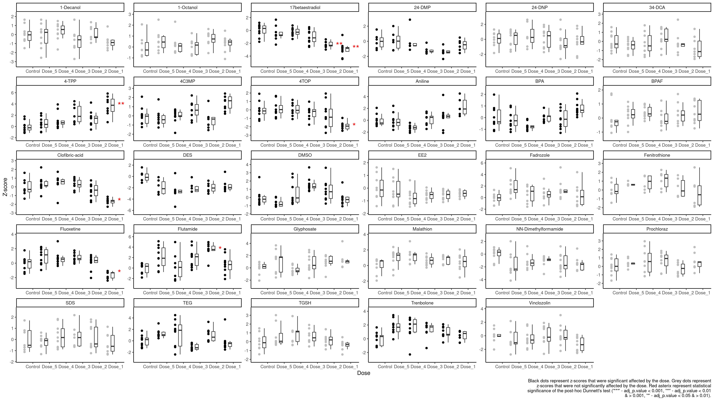

```{r setup, include=FALSE}
#knitr::opts_chunk$set(echo = TRUE)
```

```{r library, warning=FALSE, include=FALSE, message=FALSE}
library(tidyverse)
library(purrr)
library(broom)
library(DescTools)
library(scales)
library(DT)
```

```{r 1.Transform, echo=TRUE}
clean_dat <- read_csv(file = "Data/Alamar_Blue_clean_dat.csv")

control_mean_sd <- clean_dat %>%
  group_by(Chemical) %>%
  filter(Dose == "Dose_6") %>%
  summarise(control_mean = mean(Norm_Fluorescence, na.rm = TRUE),
         control_sd = sd(Norm_Fluorescence, na.rm = TRUE))

clean_dat <- inner_join(clean_dat, control_mean_sd, by = c("Chemical"))

z_dat <- clean_dat %>%
  group_by(Chemical) %>%
  mutate(z_score = (Norm_Fluorescence-control_mean)/control_sd) %>%
  dplyr::select(Chemical, Dose, `Dose(mg/L)`, Animal, Group, control_mean, control_sd, Norm_Fluorescence, z_score, Outlier)

write_csv(z_dat, file = "Data/z-score_data.csv")
```

```{r 2.Transform, echo=FALSE}
hist(z_dat$z_score)
```

```{r 3.ANOVA, echo=TRUE}
model <- z_dat %>%
  group_by(Chemical) %>%
  nest() %>%
  mutate(model = purrr::map(data, ~ aov(z_score ~ as.factor(`Dose(mg/L)`), data = .))) %>%
  dplyr::select(-data)

ANOVA <- z_dat %>%
  group_by(Chemical) %>%
  nest() %>%
  mutate(model = purrr::map(data, ~ aov(z_score ~ as.factor(`Dose(mg/L)`), data = .))) %>%
  dplyr::select(-data) %>%
  mutate(model_tidy = purrr::map(model, broom::tidy)) %>%
  unnest(model_tidy) %>%
  mutate(adj_p.value = p.adjust(p.value, method = "fdr")) %>%
  mutate(is.significant = if_else(
    condition = adj_p.value <= 0.05,
    true = TRUE,
    false = FALSE
  ))

DT::datatable(ANOVA)

write_csv(ANOVA, file = "Output/z-score_ANOVA.csv")
```

```{r 4.Post-Hoc, echo=TRUE}
set.seed(89473)

Dunnett_results <- z_dat %>%
  group_by(Chemical) %>%
  nest() %>%
  mutate(model = map(data, ~ DunnettTest(
    x = .$z_score, g = .$`Dose(mg/L)`
  ), data = .)) #Performing the Dunnett's test and saving it is a variable

#Creating list of summaries
#Since the PostHocTest object cannot be coerced to a tidy tibble using tidy()... we got creative
Dunnett_list <-
  list() #What we are trying to do is index the results and see what the significant results were... so we are using a list which can be later coerced into a tibble to easily index...
for (i in 1:length(unique(clean_dat$Chemical))) {
  Dunnett_list[[Dunnett_results$Chemical[i]]] <-
    Dunnett_results$model[[i]][["0"]] %>% #Take Dunnett's test results without any of the fancy summary information and shove it into a named list
    as.data.frame() %>% #Coerce to a data frame temporarily so what we can take the row names of the reults and turn them into a variable with rownames_to_column
    rownames_to_column(var = "dose")
}
Dunnett_comb <-
  plyr::ldply(Dunnett_list) #this function combines all of the lists together and gives them a variable name according to the chemical
Dunnett_comb$dose = substr(Dunnett_comb$dose,
                           start = 1,
                           stop = nchar(Dunnett_comb$dose) - 2) %>%
  as.numeric() #Here we are fixing the dose column... the dose column has the test dose related to the control... but we just want to see what the test dose is without it giving us redundant information about the comparison to the control for every observation...
Dunnett_comb <- as_tibble(Dunnett_comb) #Coerce to a tidy tibble

#Now just to add one more column
Dunnett_comb <- Dunnett_comb %>%
  mutate(adj_p.value = p.adjust(pval, method = "fdr")) %>%
  mutate(is.significant = if_else(
    condition = pval < 0.05,
    true = TRUE,
    false = FALSE
  ))

write_csv(Dunnett_comb, file = "Output/z-score_Dunnett.csv")

DT::datatable(Dunnett_comb)
```

```{r 5.Plot, include=FALSE}
y_values_4_geom_text <- z_dat %>%
  group_by(Chemical, Dose) %>%
  summarise(max_y = max(z_score, na.rm = TRUE),
            min_y = min(z_score, na.rm = TRUE),
            median_y = median(z_score, na.rm = TRUE))

AllDoses <-
  read.csv(file = "MetaData.csv",
           skip = 1,
           header = TRUE)
AllDoses_2 <- AllDoses %>%
  gather(key = Dose, value = "Dose(mg/L)", Dose_1:Dose_6) %>%
  mutate(Dose = if_else(condition = Dose == "Dose_6", true = "Control", false = Dose))

gg_Dunnett <- Dunnett_comb %>%
  rename(Chemical = .id,
         `Dose(mg/L)` = dose) %>%
  inner_join(y_values_4_geom_text) %>%
  inner_join(AllDoses_2)

gg_ANOVA <- ANOVA %>%
  na.omit() %>%
  dplyr::select(Chemical, term, adj_p.value, is.significant)

gg_data <- z_dat %>%
  inner_join(gg_ANOVA) %>%
  na.omit() %>%
  group_by(Chemical) %>%
  mutate(z_score_show = as.numeric(
    between(
      x = z_score,
      left = quantile(z_score, na.rm = TRUE)[2] - 1.5 * IQR(z_score, na.rm = TRUE),
      right = quantile(z_score, na.rm = TRUE)[4] + 1.5 * IQR(z_score, na.rm = TRUE)
    )
  )) %>%
  mutate(Dose = if_else(condition = Dose == "Dose_6", true = "Control", false = Dose)) %>%
  mutate(
    z_score_ol_rm = if_else(z_score_show == 1, true = z_score, false = NULL),
    Dose = factor(Dose, levels = c("Control", "Dose_5", "Dose_4", "Dose_3", "Dose_2", "Dose_1"), ordered = TRUE)
  ) %>%
  dplyr::select(
    Chemical,
    Group,
    Dose,
    `Dose(mg/L)`,
    z_score,
    z_score_show,
    z_score_ol_rm,
    term,
    adj_p.value,
    is.significant
  )
```

```{r 6.Plot, include=FALSE}
p <- ggplot() +
  #y axis
  scale_y_continuous(
    name = "Z-score",
    breaks = pretty_breaks(),
    expand = expansion(mult = (c(0.2, 0.2)))
  ) +
  #x axis
  scale_x_discrete(
    name = "Dose",
    expand = expansion(mult = (c(0.2, 0.1)))
  ) +
  #layout
  theme_classic() +
  #black data points
  geom_point(
    data = gg_data,
    aes(y = z_score, x = Dose, group = Dose, color = is.significant),
    position = position_nudge(x = -0.5),
    show.legend = FALSE
  ) +
  scale_color_manual(values = c("TRUE" = "black", "FALSE" = "grey")) +
  #black boxplot
  geom_boxplot(
    data = gg_data,
    aes(y = z_score, x = Dose, group = Dose),
    width = 0.2,
    outlier.shape = NA,
    position = position_nudge(x = -0.2)
  ) +
  #red text
  geom_text(
    data = gg_Dunnett,
    aes(
      label = if_else(
        condition = adj_p.value > 0.1,
        true = "",
        false = if_else(
          condition = adj_p.value <= 0.1 &
            adj_p.value > 0.05,
          true = "",
          if_else(
            condition = adj_p.value <= 0.05 &
              adj_p.value > 0.01,
            true = "*",
            false = if_else(
              condition = adj_p.value <= 0.01 &
                adj_p.value > 0.001,
              true = "**",
              false = if_else(adj_p.value <= 0.001 &
                                adj_p.value >= 0, true = "***", false = "")
            )
          )
        )
      ),
      group = Dose,
      y = median_y,
      x = Dose,
    ),
    position = position_nudge(x = 0.1),
    hjust = 0,
    color = "red",
    size = 6
  ) +
  facet_wrap( ~ Chemical, scales = "free") +
  labs(
    caption = str_wrap("Black dots represent z-scores that were significant affected by the dose. Grey dots represent z-scores that were not significantly affected by the dose. Red asterix represent statistical significance of the post-hoc Dunnett's test ('***' - adj_p.value < 0.001, '**' - adj_p.value < 0.01 & > 0.001, '*' - adj_p.value < 0.05 & > 0.01).", width = 100))

```

```{r 7.Plot, include=FALSE}
ggsave(
  width = 1920,
  height = 1080,
  units = "px",
  scale = 3,
  filename = "Output/Images/Alamar_Blue_z-scores.png",
  plot = p,
  path = getwd(),
  device = "png"
)
```

```{r 8.Plot,echo=FALSE}

```