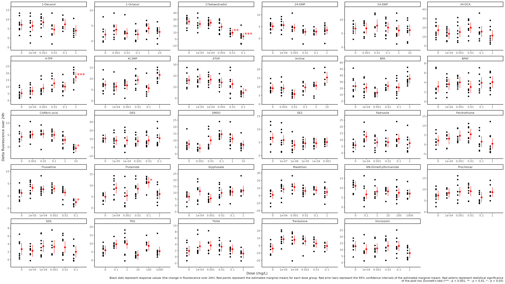

```{r setup, include=FALSE}
#knitr::opts_chunk$set(echo = TRUE)
```

```{r Libraries, include = FALSE}
#library(plyr)
library(data.table)
library(abind)
library(dplyr)
library(tidyr)
library(readr)
library(car)
library(purrr)
library(broom)
library(naniar)
library(ggplot2)
library(DescTools)
library(tidyverse)
library(outliers)
library(future) 
library(future.apply) # from original future author
library(furrr) # use future.apply but similar to purrr package
future::plan(multisession, workers = availableCores()) # windows, Mac needs multicore
library(ggrepel)
library(scales)
library(emmeans)
library(multcomp)
library(multcompView)
library(DT)
```

```{r directory_and_metadata, include=FALSE}
getwd() #Output should be "/*/*/MoltToxLab/Alamar_Blue" or something similar
folderNames <-
  list.files("Data/Sub/")#Character list of all folders in /Data/Sub/
folder <- folderNames
files_in_folder <-
  list.files(paste0("Data/Sub/", folder), full.names = TRUE, pattern = "*.txt") #Character list of all files in each folder (alphabetical order)
fileNames <-   list.files(paste0("Data/Sub/", folder), full.names = FALSE, pattern = "*.txt") #Character list of all files in each folder (alphabetical order)
```

```{r import, include=FALSE}
# #Easy way to import the data is to just read my final .csv tables...
# #all the data in the directory
Tidy_Data <-
  read_csv(file = "Data/Alamar_Blue_Tidy_Data_29chems.csv")
Tidy_Data_ol_rm <-
  read_csv(file = "Data/Alamar_Blue_Tidy_Data_29chems_outliers_rm.csv")
# #or
# Tylers_Data <- 
#   read_csv(file = "Data/Alamar_Blue_Tylers_Data.csv")
```

```{r 1.testing_assumptions_ofnormality_and_homogeneity_of_variance, echo=FALSE}
#Mean and StDev of Delta of each Dose
DoseSummary <- Tidy_Data_ol_rm %>%
  group_by(Chemical, `Dose(mg/L)`) %>%
  summarise(
    StDev = sd(Delta_Fluorescence, na.rm = TRUE),
    Mean = mean(Delta_Fluorescence, na.rm = TRUE),
    .groups = "keep"
  )
DT::datatable(DoseSummary)
```

```{r 3.testing_assumptions_ofnormality_and_homogeneity_of_variance_without_outliers_removed, echo=TRUE}
#Homogeneity of Variance
LeveneResults <- Tidy_Data_ol_rm %>%
  group_by(Chemical) %>%
  summarise(leveneTest(Delta_Fluorescence, as.factor(`Dose(mg/L)`)))
#Adding an is.significant column to easily parse significant values in a spreadsheet
LeveneResults <- LeveneResults %>%
  na.omit() %>%
  mutate(is.significant = if_else(
    condition = `Pr(>F)` < 0.05,
    true = TRUE,
    false = FALSE
  ))

DT::datatable(LeveneResults)

#Var Check
var_check <- Tidy_Data_ol_rm %>%
  group_by(Chemical, Dose) %>%
  dplyr::mutate(variance = var(Delta_Fluorescence, na.rm = TRUE)) %>%
  dplyr::summarise(variance) %>%
  unique()

# General rule of thumb is that ANOVA/ANCOVA is robust enough to tolerate minor differences in variance across groups. The largest group variance can be up to 4 times the smallest without posing problems. 
var_check_2 <- var_check %>%
  group_by(Chemical) %>%
  dplyr::summarise(max = max(variance), min = min(variance), check = if_else(condition = max <= min*4, true = "OK", false = "Not OK"))

#Table shows mostly homogeneous variance except for flutamide

write_csv(x = LeveneResults, file = "Output/Levene_Test_Results.csv")
#rm(VarianceCheck)
```

```{r 1.ANCOVA_results, echo=TRUE}
#NOT A GOOD MODEL BECAUSE SUBGROUPS ARE NOT A CONTINUOUS VARIABLE


#ANCOVA
ANCOVA <- Tidy_Data_ol_rm %>%
  mutate(`Dose(mg/L)` = as.factor(`Dose(mg/L)`),
         Dose = factor(Dose, levels = c("Dose_6", "Dose_5", "Dose_4", "Dose_3", "Dose_2", "Dose_1"), ordered = TRUE),
         Group = as.factor(Group)) %>%
  group_by(Chemical) %>%
  nest() %>%
  mutate(model = map(data, ~ aov(
    Delta_Fluorescence ~ Dose + Group,
    data = .
  ))) %>% #Where 'Group' is the dose group replicate... group A B or C for one of 3 petri dishes in the dose group... This tells us if there were human error in making sure each replicate got the same dose
  dplyr::select(model)

ANCOVACheck <- ANCOVA %>%
  mutate(model_tidy = map(model, tidy)) %>%
  unnest(model_tidy)

ANCOVACheck <- ANCOVACheck %>%
  ungroup() %>%
  mutate(adj_p.value = p.adjust(p.value, method = "fdr")) %>%
  mutate(is.significant = if_else(
    condition = adj_p.value <= 0.05,
    true = TRUE,
    false = FALSE
  ))
DT::datatable(ANCOVACheck) #Final Data Frame for the ANCOVA... will write later
```

```{r 2.ANCOVA_results, echo=TRUE}
ANCOVA_Sig_Results <-
  ANCOVACheck[which(ANCOVACheck$adj_p.value[] <= 0.05), ]
DT::datatable(ANCOVA_Sig_Results) #Just the significant results of the ANCOVA
#Saving the ANCOVA Results
write_csv(x = ANCOVACheck, file = "Output/ANCOVA_Results.csv") #ANCOVA
```

```{r 1.ANOVA_results, echo=TRUE}
#ANOVA
ANOVA <- Tidy_Data_ol_rm %>%
  mutate(`Dose(mg/L)` = as.factor(`Dose(mg/L)`),
         Dose = factor(Dose, levels = c("Dose_6", "Dose_5", "Dose_4", "Dose_3", "Dose_2", "Dose_1"), ordered = TRUE),
         Group = as.factor(Group)) %>%
  group_by(Chemical) %>%
  nest() %>%
  mutate(model = map(data, ~ aov(
    Delta_Fluorescence ~ Dose,
    data = .
  ))) %>% #Where 'Group' is the dose group replicate... group A B or C for one of 3 petri dishes in the dose group... This tells us if there were human error in making sure each replicate got the same dose
  dplyr::select(model)

ANOVACheck <- ANOVA %>%
  mutate(model_tidy = map(model, tidy)) %>%
  unnest(model_tidy)

ANOVACheck <- ANOVACheck %>%
  ungroup() %>%
  mutate(adj_p.value = p.adjust(p.value, method = "fdr")) %>%
  mutate(is.significant = if_else(
    condition = adj_p.value <= 0.05,
    true = TRUE,
    false = FALSE
  ))
DT::datatable(ANOVACheck) #Final Data Frame for the ANCOVA... will write later
```

```{r 2.ANOVA_results, echo=TRUE}
ANOVA_Sig_Results <-
  ANOVACheck[which(ANOVACheck$adj_p.value[] <= 0.05), ]
DT::datatable(ANOVA_Sig_Results) #Just the significant results of the ANCOVA
#Saving the ANCOVA Results
write_csv(x = ANOVACheck, file = "Output/ANOVA_Results.csv") #ANCOVA
```

```{r 1.ANOVA-two-way_results, echo=TRUE}
#Two-Way ANOVA
ANOVA_2 <- Tidy_Data_ol_rm %>%
  group_by(Chemical) %>%
  mutate(`Dose(mg/L)` = as.factor(`Dose(mg/L)`),
         Dose = factor(Dose, levels = c("Dose_6", "Dose_5", "Dose_4", "Dose_3", "Dose_2", "Dose_1"), ordered = TRUE),
         Group = as.factor(Group)) %>%
  nest() %>%
  dplyr::mutate(model = map(data, ~ aov(
    Delta_Fluorescence ~ Dose * Group,
    data = .
  ))) %>% #Where 'Group' is the dose group replicate... group A B or C for one of 3 petri dishes in the dose group... Tukey's results showed us that there is a significant interaction between the subgroups and the repsonse variable
  dplyr::select(model)

ANOVACheck_2 <- ANOVA_2 %>%
  mutate(model_tidy = map(model, tidy)) %>%
  unnest(model_tidy)

ANOVACheck_2 <- ANOVACheck_2 %>%
  ungroup() %>%
  mutate(adj_p.value = p.adjust(p.value, method = "fdr")) %>%
  mutate(is.significant = if_else(
    condition = adj_p.value <= 0.05,
    true = TRUE,
    false = FALSE
  ))
DT::datatable(ANOVACheck_2) #Final Data Frame for the ANOVA... will write later
```

```{r 2.ANCOVA_results, echo=TRUE}
ANOVA_2_Sig_Results <-
  ANOVACheck_2[which(ANOVACheck_2$adj_p.value[] <= 0.05), ]
ANOVA_2_Sig_Results <- ANOVA_2_Sig_Results %>%
  dplyr::select(Chemical, term, df, statistic, adj_p.value)

#Saving the ANCOVA Results
write_csv(x = ANOVACheck_2, file = "Output/Two_way_ANOVA_Results.csv") #ANOVA
DT::datatable(ANOVA_2_Sig_Results) #Just the significant results of the ANCOVA
```

```{r Check_if_ANOVA_and_two-way-ANOVA_models_are_different, echo=FALSE, include=FALSE}
chemicalNames <- unique(Tidy_Data_ol_rm$Chemical)
model_check <- map2(.x = ANOVA$model, .y = ANOVA_2$model, .f = anova)
names(model_check) <- chemicalNames

list <- list()
for (i in names(model_check)) {
  temp <- broom::tidy(model_check[[i]])
  list[[i]] <- temp
}
names(list) <- chemicalNames
model_check_2 <- plyr::ldply(list)
model_check_2_adj <- model_check_2 %>%
  na.omit() %>%
  ungroup() %>%
  mutate(adj.p.value = p.adjust(p.value, method = "fdr"))


write_csv(model_check_2, "Output/Comparison_two_way_ANOVA_and_ANOVA.csv")
#These results tell me that ANCOVA is perfectly legitimate since the interaction effects between the two independent variables is weak
```

```{r 1.PostHoc_Dunnett, echo=TRUE}
#PostHoc tests
set.seed(2345)

AllDoses <-
  read.csv(file = "MetaData.csv",
           skip = 1,
           header = TRUE)
AllDoses_2 <- AllDoses %>%
  gather(key = Dose, value = "Dose(mg/L)", Dose_1:Dose_6) %>%
  mutate(Dose = if_else(condition = Dose == "Dose_6", true = "Control", false = Dose))

#Performing Dunnett's test on a two-way ANOVA

library(multcomp)

fit_dunnett <- ANOVA %>%
  dplyr::mutate(Dunnett = map(model, ~ glht(.x, linfct = mcp(Dose="Dunnett")))) %>%
  dplyr::mutate(tidy_Dunnett = map(Dunnett, ~ broom::tidy(.x))) %>%
  dplyr::mutate(tidy_Dunnett_1 = map(tidy_Dunnett, ~ mutate(.x, Chemical = Chemical)))

Dunnett_comb <- plyr::ldply(fit_dunnett$tidy_Dunnett_1) %>%
  dplyr::mutate(Dose = str_split(contrast, pattern = " - ", simplify = TRUE)[,1]) %>%
  dplyr::select(Chemical, Dose, estimate, std.error, statistic, adj.p.value) %>%
  dplyr::ungroup() %>%
  dplyr::mutate(adj.p.value = p.adjust(adj.p.value, method = "fdr")) # p-values not already adjusted

#Emmeans for multiple comparisons
control <- c("Dose_6")
option3_1 <- fit_dunnett %>%
    mutate(option3 = map(model, ~ multcomp::cld(emmeans::emmeans(object = .x, specs = pairwise~Dose), details = TRUE, Letters = letters, alpha = 0.05)))

# #Emmmeans data frame
option3 <- option3_1 %>%
    dplyr::select(option3) %>%
    mutate(data = map(option3, pluck(.x = "emmeans"))) %>%
    mutate(data2 = map(data, ~ as_tibble(x = .x))) %>%
    dplyr::select(data2) %>%
    unnest(cols = c(data2))
# 
# 
model <- fit_dunnett$Dunnett
model_means_cld <- option3 %>%
  group_by(Chemical) %>%
  dplyr::mutate(Group = forcats::fct_reorder(Dose, emmean, .na_rm = TRUE)) %>%
  dplyr::mutate(cont_group = .group) %>%
  dplyr::mutate(Dose = if_else(condition = Dose == "Dose_6", true = "Control", false = Dose),
                Group = if_else(condition = Dose == "Dose_6", true = "Control", false = Dose)) %>%
  dplyr::mutate(
    Dose = factor(Dose, levels = c("Control", "Dose_5", "Dose_4", "Dose_3", "Dose_2", "Dose_1"), ordered = TRUE),
    Group = factor(Dose, levels = c("Control", "Dose_5", "Dose_4", "Dose_3", "Dose_2", "Dose_1"), ordered = TRUE)
  ) %>%
  dplyr::mutate(adj_factor = emmean/4) %>%
  dplyr::inner_join(AllDoses_2)

write_csv(Dunnett_comb, "Output/ANOVA_Dunnetts_Results.csv")
write_csv(model_means_cld, "Output/ANOVA_Dunnetts_Compact_Letter_Display_EmMeans.csv")
#This was my old code to run Dunnett's test using a one-way ANOVA. However, we know now that we must use a two-way ANOVA because of interactions between the subgroups and dose groups. So we will use a different method that utilized the `multcomp` package

# #Dunnett's Test
# Dunnett_results <- Tidy_Data_ol_rm %>%
#   group_by(Chemical) %>%
#   nest() %>%
#   mutate(model = map(data, ~ DunnettTest(
#     x = .$Delta_Fluorescence, g = .$Dose, control = "Dose_6"
#   ), data = .)) #Performing the Dunnett's test and saving it is a variable
# 
# #Creating list of summaries
# #Since the PostHocTest object cannot be coerced to a tidy tibble using tidy()... we got creative
# Dunnett_list <-
#   list() #What we are trying to do is index the results and see what the significant results were... so we are using a list which can be later coerced into a tibble to easily index...
# for (i in 1:length(unique(Tidy_Data_ol_rm$Chemical))) {
#   Dunnett_list[[Dunnett_results$Chemical[i]]] <-
#     Dunnett_results$model[[i]][["Dose_6"]] %>% #Take Dunnett's test results without any of the fancy summary information and shove it into a named list
#     as.data.frame() %>% #Coerce to a data frame temporarily so what we can take the row names of the reults and turn them into a variable with rownames_to_column
#     rownames_to_column(var = "dose")
# }
# Dunnett_comb <-
#   plyr::ldply(Dunnett_list) #this function combines all of the lists together and gives them a variable name according to the chemical
# Dunnett_comb$Dose = substr(Dunnett_comb$dose,
#                            start = 1,
#                            stop = nchar(Dunnett_comb$dose) - 7) #Here we are fixing the dose column... the dose column has the test dose related to the control... but we just want to see what the test dose is without it giving us redundant information about the comparison to the control for every observation...
# Dunnett_comb <- as_tibble(Dunnett_comb) #Coerce to a tidy tibble
# #Great, a nice tibble that we can export
# 
# #Now just to add one more column
# Dunnett_comb <- Dunnett_comb %>%
#   mutate(adj.p.value = p.adjust(pval, method = "fdr")) %>%
#   mutate(is.significant = if_else(
#     condition = pval < 0.05,
#     true = TRUE,
#     false = FALSE
#   )) %>%
#   dplyr::select(-dose)
# DT::datatable(Dunnett_comb)

#Write to a .csv

# 
# # #indexing what the significant results were...
Dunnett_Sig_Results <-
  Dunnett_comb[which(Dunnett_comb$adj.p.value <= 0.05), ]

Dunnett_Sig_Results
# # #Cool!
```

```{r 5.Plot_preparations, include=FALSE}
y_values_4_geom_text <- Tidy_Data_ol_rm %>%
  group_by(Chemical, Dose) %>%
  summarise(max_y = max(Delta_Fluorescence, na.rm = TRUE),
            min_y = min(Delta_Fluorescence, na.rm = TRUE),
            median_y = median(Delta_Fluorescence, na.rm = TRUE))

gg_Dunnett <- Dunnett_comb %>%
  inner_join(y_values_4_geom_text) %>%
  inner_join(AllDoses_2) %>%
  inner_join(model_means_cld)

gg_ANCOVA <- ANOVACheck %>%
  dplyr::filter(term == "Dose") %>%
  dplyr::select(Chemical, term, adj_p.value, is.significant)

gg_data <- Tidy_Data_ol_rm %>%
  inner_join(gg_ANCOVA) %>%
  na.omit() %>%
  group_by(Chemical) %>%
  mutate(Delta_Fluorescence_show = as.numeric(
    dplyr::between(
      x = Delta_Fluorescence,
      left = quantile(Delta_Fluorescence, na.rm = TRUE)[2] - 1.5 * IQR(Delta_Fluorescence, na.rm = TRUE),
      right = quantile(Delta_Fluorescence, na.rm = TRUE)[4] + 1.5 * IQR(Delta_Fluorescence, na.rm = TRUE)
    )
  )) %>%
  mutate(Dose = if_else(condition = Dose == "Dose_6", true = "Control", false = Dose)) %>%
  mutate(
    Delta_Fluorescence_ol_rm = if_else(Delta_Fluorescence_show == 1, true = Delta_Fluorescence, false = NA),
    Dose = factor(Dose, levels = c("Control", "Dose_5", "Dose_4", "Dose_3", "Dose_2", "Dose_1"), ordered = TRUE)
  ) %>%
  dplyr::select(
    Chemical,
    Group,
    Dose,
    `Dose(mg/L)`,
    Delta_Fluorescence,
    Delta_Fluorescence_show,
    Delta_Fluorescence_ol_rm,
    term,
    adj_p.value,
    is.significant
  )
```

```{r 6.Plot, include=FALSE}
p <- ggplot() +
  #y axis
  scale_y_continuous(
    name = "Delta fluorescence over 24h",
    breaks = pretty_breaks(),
    expand = expansion(mult = (c(0.2, 0.2)))
  ) +
  #x axis
  scale_x_discrete(
    name = "Dose (mg/L)",
    expand = expansion(mult = (c(0.2, 0.2))),
    breaks = waiver()
  ) +
  #layout
  theme_classic() +
  #black data points
  geom_point(
    data = gg_data,
    aes(y = Delta_Fluorescence, x = as.factor(`Dose(mg/L)`), group = as.factor(`Dose(mg/L)`)),
    position = position_nudge(x = -0.2),
    show.legend = FALSE
  ) +
  #scale_color_manual(values = c("TRUE" = "black", "FALSE" = "grey")) +
  #black boxplot
  # geom_boxplot(
  #   data = gg_data,
  #   aes(y = Delta_Fluorescence, x = as.factor(`Dose(mg/L)`), group = as.factor(`Dose(mg/L)`)),
  #   width = 0.2,
  #   outlier.shape = NA,
  #   position = position_nudge(x = -0.3),
  #   show.legend = FALSE
  # ) +
  #red mean value
  geom_point(
    data = model_means_cld,
    aes(y = emmean, x = as.factor(`Dose(mg/L)`)),
    size = 2,
    color = "red",
    position = position_nudge(x = 0)
  ) +
  #red mean errorbar
  geom_errorbar(
    data = model_means_cld,
    aes(ymin = lower.CL, ymax = upper.CL, x = as.factor(`Dose(mg/L)`)),
    width = 0.05,
    color = "red",
    position = position_nudge(x = 0)
  ) +
  #red asterix
  geom_text(
    data = gg_Dunnett,
    aes(
      label = if_else(
        condition = adj.p.value > 0.1,
        true = "",
        false = if_else(
          condition = adj.p.value <= 0.1 &
            adj.p.value > 0.05,
          true = "",
          if_else(
            condition = adj.p.value <= 0.05 &
              adj.p.value > 0.01,
            true = "*",
            false = if_else(
              condition = adj.p.value <= 0.01 &
                adj.p.value > 0.001,
              true = "**",
              false = if_else(adj.p.value <= 0.001 &
                                adj.p.value >= 0, true = "***", false = "")
            )
          )
        )
      ),
      group = as.factor(`Dose(mg/L)`),
      y = emmean,
      x = as.factor(`Dose(mg/L)`),
    ),
    position = position_nudge(x = 0.1, y = 0),
    hjust = 0,
    vjust = 0,
    color = "red",
    size = 6
  ) +
  #red letters
  # geom_text(
  #   data = model_means_cld,
  #   aes(
  #     y = emmean,
  #     x = as.factor(`Dose(mg/L)`),
  #     label = str_trim(cont_group),
  #   ),
  #   position = position_nudge(x = 0.2, y = -0.1),
  #   hjust = 0.5,
  #   vjust = 1,
  #   color = "red"
  # ) +
  facet_wrap( ~ Chemical, scales = "free") +
  labs(
    caption = str_wrap("Black dots represent response values (the change in fluorescence over 24h). Red points represent the estimated marginal means for each dose group. Red error bars represent the 95% confidence intervals of the estimated marginal means. Red asterix represent statistical significance of the post hoc Dunnett's test (*** - p < 0.001, ** - p < 0.01, * - p < 0.05)", width = 280))

```

```{r 7.Plot, include=FALSE}
ggsave(
  width = 1920,
  height = 1080,
  units = "px",
  scale = 3.5,
  filename = "Output/Images/Alamar_Blue_Change_in_Fluorescence.png",
  plot = p,
  path = getwd(),
  device = "png"
)
```

```{r 8.Plot,echo=FALSE}

```

