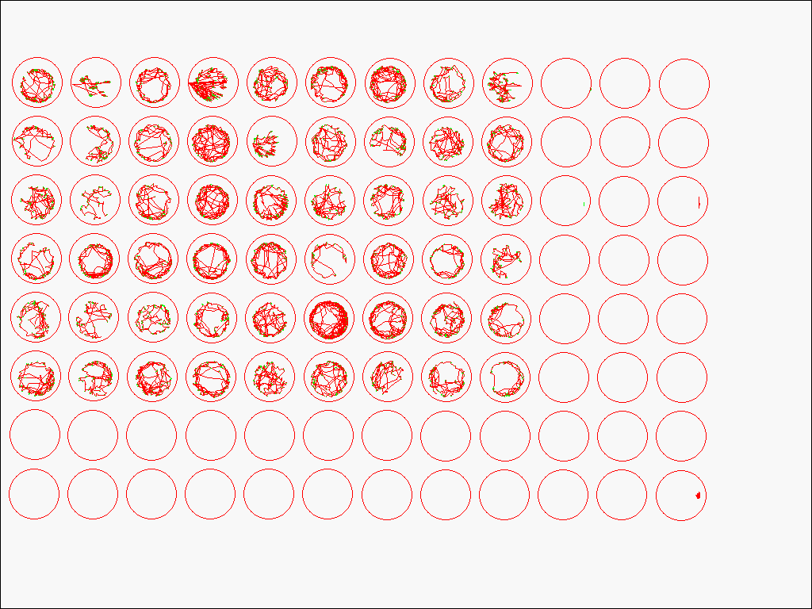

```{r 1setup, include=FALSE}
knitr::opts_chunk$set(echo = TRUE)
options(scipen = 9)
```

```{r 2libraries, include=FALSE}
library(knitr)
library(kableExtra)
library(gridExtra)
library(rlang)
library(Rcurvep)
library(DescTools)
library(plyr)
library(ggplot2)
library(dplyr)
library(tidyr)
library(readr)
library(stringr)
library(tibble)
library(data.table)
library(car)
library(lazyeval)
source("Functions/cal_auc_simi_endpoints.R")
source("Functions/behavioural_endpoint_calc.R")
source("Functions/RCurveP_Data_Wrangling_Functions.R")
```


# Toxicology Behavioural Analysis Report

## Version Control
```{r 3version_control, comment="", class.source ='fold-hide'}
# - My Machine Info:
#   - R version 4.2.1 (2022-06-23)
#   - Platform: x86_64-pc-linux-gnu (64-bit)         5.11.0-34-generic / Ubuntu 22.04.1 LTS
#   - Desktop: GNOME 3.36.5
#   - Hardware: CPU - Intel Core i5-9400F 6 core 4.1GHz / RAM - 15924MiB
```

## Background
  The data supplied in the zip folder pertains to behavioural data collected from 5 day-old (120hpf) zebrafish embryos using a [Viewpoint ZebraBox and Viewpoint ZebraLab software](https://www.viewpoint.fr/en/p/equipment/zebrabox-for-embryos-or-larvae/publications).\
The dose ranges chosen for the exposure studies were extremely low for an acute-exposure study. We chose such low doses ranges because we are also conducting an RNA-sequencing dose-response analysis as well, which is much more sensitive (can detect changes earlier -- at lower doses) than the behavioural analysis.\
  Chemical exposures are performed in glass petri dishes (3 dishes per dose group -- A,B,C) for 120 hours post-fertilization.
```{r 4figure1, echo=FALSE, fig.align='center', fig.cap='Figure 1. The experimental layout of the 5-day chemical exposures in petri dishes prior to the behavioural assay', out.height="50%", out.width="50%"}
knitr::include_graphics("./Data/5-Day_Exposure_Layout.png")

```

On the final exposure day, embryos are pipetted into 96-Well plates.
There are 26 experiments/plates included in the data set, each a unique chemical, and each with 6 different dose groups including a vehicle control group. There are 9 fish per dose group and 6 dose groups -- 54 fish per plate
```{r 5figure2, echo=FALSE, fig.align='center', fig.cap='Figure 2. The behavioural assay plate layout for an individual experiment. In total, 54 5-day old embryos, 9 for each dose, are transferred to a 96-well plate in exposure media', out.height="60%", out.width="60%"}
knitr::include_graphics("./Data/96-Well_Plate_Layout.png")
```

The behavioural data is collected using an infrared camera over a 50-minute period where the first 20 minutes allow the zebrafish embryos to acclimate to their environment, and for the next 30 minutes there are 5-minute cycles of light and darkness -- 96-well plate format. Zebrafish naturally tend to be more active in the dark. Neurotoxic chemicals may change the swimming behaviours of fish
```{r 6experiment_protocol_visualization, echo=FALSE, fig.align='center', fig.cap='Figure 3. A visual representation of the behavioural assay protocol', out.height="75%", out.width="75%"}
ggplot(data = data.frame(x = c(1:50), y = c(1:50))) + 
  geom_blank(aes(x = x, y = y)) + 
  geom_rect(
  data = data.frame(start = c(20, 30, 40), end = c(25, 35, 45)),
  aes(
    xmin = start,
    xmax = end,
    ymin = -Inf,
    ymax = Inf
  ),
  fill = 'black',
  alpha = 0.2
) + 
  geom_vline(xintercept = 20, linetype = "dashed") + ylab("response") + xlab("time in minutes") + 
  geom_text(data = data.frame(
  xvar = c(10, 22.5, 27.5, 32.5, 37.5, 42.5, 47.5),
  yvar = c(25, 40, 10, 40, 10, 40, 10),
  labvar = c("Acclimation", "Dark", "Light", "Dark", "Light", "Dark", "Light")
),
aes(x = xvar, y = yvar, label = labvar))
```

The infrared camera traces the swim paths of fish during the entire experiment. A one-minute snapshot of raw swim paths look like this:
```{r 7figure4, echo=FALSE, fig.align='center', fig.cap='Figure 4. An example of what the raw swim-path tracing looks like from the Viewpoint Zebrabox infrared camera and Viewpoint Zebralab software', out.height="50%", out.width="50%"}

```
The raw data contain many variables that we will explore once we import the data. You can browse the meta data in the next section of this report.

## Directory & Meta Data
```{r 8directory, include=FALSE}
dir <- paste0(getwd(), "/Data/All")
```

```{r 9directory_files_filenames, include=FALSE}
fileNames <- list.files("Data/Raw") #Get the name of each .csv file
chemicalNames <- str_split(string = fileNames, pattern = ".csv", simplify = TRUE)[,1] #Identify the chemicals included in the files
metaData <- read.csv(file = "Data/MetaData.csv") #Import the Meta Data that includes information about the data in the folders
#CAS is the Chemical Abstract Service, MOA is the Mode of Action. This table includes useful information about the exposure concentrations for each chemical dose in mg/L. We'll use this later to create our final data frame
HighDose <- setNames(metaData[,6], chemicalNames) #subsetting metadata
```

```{r 10metadata_table, echo=FALSE}
metaData %>%
  select(NAME, plate_id, MOA, Dose1:Dose5) %>%
  kable(
    col.names = c(
      "Chemical Name",
      "Plate ID",
      "Mode of Action",
      "Dose 1 (High)",
      "Dose 2",
      "Dose 3",
      "Dose 4",
      "Dose 5 (Low)"
    ),
    align = "lllrrrrr",
    caption = "Table 1. Information about each chemical included in the experiment with dose information in mg/L"
  ) %>%
  kable_styling(full_width = TRUE) %>%
  scroll_box(height = "400px")
```

## Importing the raw data files & taking a glimpse

Glimpse the raw data to see the structure of each variable, the number of observations and the class of the `raw_data` object
```{r 11glimpse_raw_data, echo=FALSE, collapse=TRUE}
list <- list()
for (i in 1:length(fileNames)) {
  list[[i]] <- read_delim(file = paste0("Data/Raw/", fileNames[[i]]),
                          col_names = TRUE,
                          col_types = "cclnninninninnin", #Where c is character, l is logical, n is numeric, i is integer
                          na = c("", 'NA', "NA", "\t NA", "\tNA") #Specify what to consider NA
  )
}
names(list) <- chemicalNames #Name List objects
raw_data <- as_tibble(rbindlist(list, idcol = "plate_id")) #name the plates by the chemical names
glimpse(raw_data)
class(raw_data)
```
From the glimpse it can be seen that there are 17 variables in the tibble/data frame:

* `plate_id` the chemical used in the exposure experiment
* `animal` represents individual animals in the experiment
* `Treatment` The Dose group, and internal replicate (petri dish A, B or C)
* `an` Unknown/not useful
* `start` start time of observation in seconds
* `end` end time of observation in seconds
* `inact` Inactivity Counts | the number of times the fish went from being active to inactive over the observation time
* `inadur` Inactivity Duration | the duration of time, in seconds, the fish went from being active to inactive over the observation time (1 minute)
* `inadist` Inactivity Distance | the distance travelled by inactive observations (this value should be 0)
* `smlct` Small Activity Counts | the number of times the fish had a small burst of swim activity over the observation time (1 minute)
* `smldur` Small Activity Duration | the duration of the small burst of swim activity over the observation time (1 minute)
* `smldist` Small Activity Distance | The distance travelled during small bursts of activity
* `larct` Large Activity Counts | the number of times the fish had a large burst of swim activity over the observation time (1 minute)
* `lardur` Large Activity Duration | the duration of the large burst of swim activity over the observation time (1 minute)
* `lardist` Large Activity Distance | The distance travelled during large bursts of activity
* `emptyct` Counts that were neither inactive or active (data recording artifact)
* `emptydur` duration of time fish was neither inactive, or active (data recording artifact) | Almost acts like a confidence value. The closer it is to 60, the more unreliable the data are

## Investigating `raw_data`
### Checking expectations
#### Number of observations/rows
It is expected that the raw data wil have `r 96*50*26` rows because there are 96 wells, 50 minutes, and 26 different plates
```{r 12n_rows, echo=TRUE, collapse=TRUE}
nrow(raw_data)
```
However, there are `r nrow(raw_data)` rows present in the raw data. This expectation was violated because each observation is duplicated
```{r 13duplicates, echo=FALSE}
raw_data %>%
  select(plate_id, Treatment, an, end, smldist, lardist, emptyct, emptydur)
```
By looking at just the head of `raw_data`, it can be seen that the variable `an` has a `TRUE` and `FALSE` row for each individual observation. The only difference between these duplicate rows is that the `FALSE` rows retain information about `emptyct` and `emptydur`.\
```{r 14nrow_filtered_raw_data, echo=TRUE, collapse=TRUE}
raw_data <- raw_data %>%
  filter(an == FALSE) %>% # Removing duplicate rows
  select(-c(an)) # This variable is not very useful anymore, so removing
nrow(raw_data)
```
After filtering for just the false values, there are now `r nrow(raw_data)` rows.\ 
There are `r nrow(raw_data) - (96*50*29)` extra observations in `raw_data` because there are some extra observations past 50 minutes.\ 
```{r 15nrow_raw_data_filtered_2, echo=TRUE, collapse=TRUE}
raw_data <- raw_data %>%
  filter(end <= 3000) # Deleting observations past 50 mins (3000 seconds)
nrow(raw_data)
identical(as.numeric(nrow(raw_data)), (96 * 50 * 29)) # is the expected number of rows consistent with the observed number of rows after processing?
```
After ensuring there are no observations past the 50-minute mark, there are now `r nrow(raw_data)` rows, as expected.

#### Treatment-level NAs
It is expected that wells 10:12, 22:24, 34:36, 46:48, 58:60, 70:96 will all be `NA` in the `Treatment` column because these are all empty wells (Figure 2). Each plate has  `r (3*6) + (12*2)` empty wells. This means that all `NA` treatments should be `r 42*50*29` observations long. After removing `NA`s there should be `r nrow(raw_data)-(42*50*29)` rows in `raw_data`.
```{r 16removeNAs, echo=TRUE, collapse=TRUE}
raw_data <- raw_data %>%
  filter(Treatment != is.na(Treatment))
nrow(raw_data)
identical(as.numeric(nrow(raw_data)), (54 * 50 * 29)) # Does the expected number of rows match the observed number of rows after filtering?
```

#### Variable Distributions & Outliers

Quick visualizations of the distributions of each variable are a fast and easy way to learn a lot about the data such as the range, distribution of observations, and outliers.\
\
First, the 'counts' variable distributions will be investigated.
```{r 17qplots_counts, echo=FALSE, warning=FALSE, message=FALSE, fig.height=6 , fig.align='center', fig.cap="Figure 5. Quick plots of the 'counts' variables in the `raw_data` object", out.height= "150%", out.width= "150%"}
grid.arrange(
  qplot(
    data = raw_data,
    x = emptyct,
    xlim = c(-15, 100),
    xlab = "Number of times counted as an empty well in a minute (artifact) `emptyct`"
  ),
  qplot(
    data = raw_data,
    x = inact,
    xlim = c(-15, 200),
    xlab = "Number of times counted as inactive in a minute `inact`"
  ),
  qplot(
    data = raw_data,
    x = smlct,
    xlim = c(-15, 400),
    xlab = "Number of times counted as a small activity in a minute `smlct`"
  ),
  qplot(
    data = raw_data,
    x = larct,
    xlim = c(-15, 400),
    xlab = "Number of times counted as a large activity in a minute `larct`"
  ),
  nrow = 4
)
```
Figure 5 (plot 1) shows that there are some artifacts in the data. Sometimes, the camera/software was not able to detect a fish even though, there certainly were fish in those wells. The `emptyct` variable (plot 1) is a good tool to use for flagging observations that need to transformed to `NA`s in the next section (Suspicious Values).\
It can be seen that the amount of times an animal goes inactive during an observation period (`inact`) is approximately 75 times per minute. As well, it can be seen that small swim bursts (`smlct`) tend to occur just over 150 times per minute. And finally, we can see that large swim bursts (`larct`) can either occur just over 100 times per minute, or 0 times per minute. This could be due to sensitive effects of light on swim inhibition, or darkness stimulating large swim behaviours.\
\
The distributions of all count variables are slightly skewed, with few outliers, except for the empty well counts which are very positively skewed.\
\
Next, the 'duration' variable distributions will be explored. Note: this variable should never exceed 60 seconds.
```{r 18qplots_duration, echo=FALSE, warning=FALSE, message=FALSE, fig.height=6 , fig.align='center', fig.cap="Figure 6. Quick plots of the 'duration' variables in the `raw_data` object", out.height= "150%", out.width= "150%", fig.height = 7.5, fig.width=7}
raw_data <- raw_data %>%
  mutate(activedur = smldur + lardur)
grid.arrange(
  qplot(
    data = raw_data,
    x = emptydur,
    xlim = c(-5, 65),
    xlab = "Amount of time animals were not found in a 60 second observation (artifact) `emptydur`"
  ) + geom_vline(xintercept = 20, linetype = "dashed", color = "red"),
  qplot(
    data = raw_data,
    x = inadur,
    xlab = "Amount of time animal spent inactive in a 60 second observation `inadur`",
    xlim = c(-5, 65)
  ),
  qplot(
    data = raw_data,
    x = activedur,
    xlab = "Amount of time animal spent active in a 60 second observation `activedur`",
    xlim = c(-5, 65)
  ),
  qplot(
    data = raw_data,
    x = smldur,
    xlab = "Amount of time animal spent doing small swimming motions in a 60 second observation `smldur`",
    xlim = c(-5, 65)
  ),
  qplot(
    data = raw_data,
    x = lardur,
    xlab = "Amount of time animal spent doing large swimming motions in a 60 second observation `lardur`",
    xlim = c(-5, 65)
  ) + geom_vline(xintercept = 40, linetype = "dashed", color = "red"),
  nrow = 5
)
```
Figure 6 reveals another red flag with the `emptydur` variable (plot 1 in figure 6). There are some observations that show 60 full seconds of being empty! This is likely more than just an artifact in the recording instrument/software. These are likely dead fish that never moved at all so the infrared camera was never able to start tracing their swim patterns. However, it can also be seen that there are some observations greater than 0 and less than 60 in this plot. In theory, if an animal is present in the well, the `emptydur` value should always be zero. An arbitrary threshold of 20 seconds of empty duration will be used to transform all observations (across variables) with an `emptydur` > 20 into `NA`s\
\
Again, it can also be seen that the distributions of observations for each variable is slightly skewed. Note also that `inadur` and `activedur` (plots 2 and 3 from figure 6) are approximately inversely related as expected. The emerging pattern of large swim activity duration (`lardur`) clustering around two modes (0s and ~15s) can be observed, similar to the counts variable.\
\
There are a few outliers in the data but they are a bit difficult to see in figure 6. Notably, large swim activity duration (plot 5 in figure 6) has 27 outliers past ~40 seconds. Taking a closer look at those outliers...
```{r 19lardur_outliers, echo=FALSE, warning=FALSE, message=FALSE}
raw_data %>%
  filter(lardur >= 40) %>%
  select(plate_id, animal, Treatment, lardur) %>%
  group_by(plate_id, Treatment, animal) %>%
  summarise(distance = mean(lardur)) %>%
  kable(align = 'lllc', col.names = c("Chemical", "Dose", "Individual", "Large Activity Duration (seconds)"), caption = "Table 2. Summary of outliers in large swim activity duration variable (> 40s), showing only unique individuals") %>%
  kable_styling(full_width = TRUE) %>%
  scroll_box()
```
From table 2, it can be seen that many of the hyperactivity observations come from the same individual animals in the experiment (with a few exceptions). These are extreme observable effects on individuals, they do not necessarily represent the the rest of the population within groups.\
\
Chemicals observed in extremely hyperactive individuals:

- Dimethylformamide -- liver toxicity
- Fadrozole -- aromatase inhibitor (estrogen blocker)
- Fluoxetine -- Selective serotonin re-uptake inhibitor
- Flutamide -- androgen antagonist (testosterone blocker)
- Malathion -- Cholinesterase inhibiot (neurotoxic)
- Vinclozolin -- androgen antagonist (testosterone blocker)

Behavioural perturbation (hyperactivity) suggests that it is possible that these chemicals can effect the nervous system of individuals early on in development. However, it is wise to be cautious and not draw any conclusions yet without any sort of statistical analyses.\
\
Next, the distributions of the 'distance' variables will be investigated.
```{r 20distance_qplots, echo=FALSE, fig.align='center', fig.cap="Figure 7. Quick plots of the 'distance' variable in the `raw_data` object", warning=FALSE, message=FALSE, fig.height = 5, fig.width = 7.5, out.height= "150%", out.width= "150%"}
raw_data <- raw_data %>%
  mutate(totaldist = smldist + lardist)
grid.arrange(
  qplot(
    data = raw_data,
    x = smldist,
    xlab = "Distance travelled during small swimming motions in a minute `smldist`"
  ),
  qplot(
    data = raw_data,
    x = lardist,
    xlab = "Distance travelled during large swimming motions in a minute `lardist`",
    xlim = c(-100,5000)
  ) + geom_vline(xintercept = 2500, linetype = "dashed", color = "red"),
  qplot(
    data = raw_data,
    x = totaldist,
    xlab = "Distance travelled during all swimming motions in a minute `totaldist`",
    xlim = c(-100,5000)
  ) + geom_vline(xintercept = 4000, linetype = "dashed", color = "red"),
  nrow = 3
)

```
Figure 7 shows that the distributions of of the 'distance' variables are slightly skewed with the `totaldist` variable being the most normally distributed. Notably, `totaldist` seems to be a promising effect endpoint to analyse since it is the most normally distributed of all the other effect endpoints.\
\
However, there are outliers in `totaldist` and so the following steps will be taking a closer look at those outliers...
```{r 21totaldist_outliers, echo=FALSE, warning=FALSE, message=FALSE}
raw_data %>%
  filter(totaldist > 4000) %>%
  select(plate_id, Treatment, animal, totaldist) %>%
  group_by(plate_id, Treatment, animal) %>%
  summarise(distance = mean(totaldist)) %>%
  kable(col.names = c("Chemical", "Dose", "Individual", "Distance travelled in 1 min"), align = 'lllc', caption = "Table 3. Summary of outliers in total distance travelled variable (>4000) showing only unique individuals") %>%
  kable_styling(full_width = TRUE) %>%
  scroll_box()
```
We see there are 4 chemicals in the extreme outliers, and that most of the individual animals are from the highest dose treatment group:\
\
Chemicals observed in extremely hyperactive individuals:

- 17beta-Estradiol -- ER binder (estrogenic)
- 4-chloro 3-methylphenol -- perhaps very weak ER or perhaps non-endocrine
- Fadrozole -- aromatase inhibitor (estrogen blocker)
- Vinclozolin -- androgen antagonist (testosterone blocker)

Again, we see 2 of the same chemicals that are potentially inducing hyperactivity in the same individuals (fadrozole & vinclozilin). However, as previously stated, these individuals are not representative of the rest of the population within their respective dose groups and no conclusions can be drawn yet!\
\
It is important to also consider determining outliers not just between plates in the larger data frame, but within the same plate. 
```{r 22plate_distribution_visualizer, include=FALSE}
distVis <- function (df, chem, var, time_start = 0) {
df %>%
  filter(plate_id == chem, start >= time_start*60) %>% #Subetting to chemical of choice
  mutate(Treatment = rep(
    c(
      "Dose1_A","Dose1_B","Dose1_C","Dose2_A","Dose2_B","Dose2_C",
      "Dose3_A","Dose3_B","Dose3_C","Dose4_A","Dose4_B","Dose4_C",
      "Dose5_A","Dose5_B","Dose5_C","Control_A","Control_B","Control_C"
    ),
    times = (nrow(.)/(18)/3), #repeat 2,700/18 = 150 times (number of observations divided by number of treatments = number of treatment observations) then divide that by 3 because each will be repeating 3 times
    each = 3
  )) %>% #Separating Dose from Group letter with an underscore
  separate(col = Treatment, # Column we want to separate
           into = c('Dose', 'Group'), #Into these two column names
           convert = TRUE) %>%
  ggplot(aes(x = .data[[var]])) +
  geom_histogram() +
  xlab(var) +
  ggtitle(chem) +
  facet_wrap(~Dose)
}
```

```{r 23within_plate_outliers, echo=FALSE, fig.align='center', fig.cap="Figure 8. Example of within-plate outlier quick plots", warning=FALSE, message=FALSE, fig.height= 8, out.height="150%", out.width="125%"}
#Summary of outliers: TGSH > 2000, Clofib > 2000, 17beta_estradiol > 2500, 24DMP > 2500, DES > 2500, DMF > 2500, EE2 > 2500, Fluoxetine > 2500, BPA > 2500, Fadrozole > 3500, Vinclozolin > 4500
grid.arrange((
  distVis(
    df = raw_data,
    chem = "Fadrozole",
    var = "totaldist",
    time_start = 20
  ) + geom_vline(
    xintercept = 3500,
    linetype = c("blank", "dashed", "blank", "blank", "blank", "blank"),
    color = "red"
  )
),
(
  distVis(
    df = raw_data,
    chem = "Vinclozolin",
    var = "totaldist",
    time_start = 20
  ) + geom_vline(
    xintercept = 4500,
    linetype = c("blank", "dashed", "blank", "blank", "blank", "blank"),
    color = "red"
  )
))
```

After a careful examination of individual plates, the following outliers were identified in the `totaldist` variable:

```{r 24outliers, include=FALSE}
treatment_groups <- c("Dose1_A","Dose1_B","Dose1_C","Dose2_A","Dose2_B","Dose2_C",
  "Dose3_A","Dose3_B","Dose3_C","Dose4_A","Dose4_B","Dose4_C",
  "Dose5_A","Dose5_B","Dose5_C","Control_A","Control_B","Control_C")

raw_data <- raw_data %>%
  mutate(Treatment = rep(treatment_groups,
    times = (nrow(.)/(18)/3), #repeat 2,700/18 = 150 times (number of observations divided by number of treatments = number of treatment observations) then divide that by 3 because each will be repeating 3 times
    each = 3
  )) %>% #Separating Dose from Group letter with an underscore
  separate(col = Treatment, # Column we want to separate
           into = c('Dose', 'Group'), #Into these two column names
           convert = TRUE)

out_1 <- raw_data %>%
  filter(plate_id == "Vinclozolin") %>%
  filter(totaldist >= 4500)
out_2 <- raw_data %>%
  filter(plate_id == "Fadrozole") %>%
  filter(totaldist >= 3500)
out_3 <- raw_data %>%
  filter(plate_id == "Trenbolone") %>%
  filter(totaldist > 3000)
out_4 <- raw_data %>%
  filter(plate_id %in% c("34DCA", "BPA")) %>%
  filter(totaldist >= 2600)
out_5 <- raw_data %>%
  filter(plate_id %in% c("Fluoxetine", "EE2", "DMF", "DES", "24DMP", "24DNP", "4C3MP", "Malathion")) %>%
  filter(totaldist >= 2500)
out_6 <- raw_data %>%
  filter(plate_id %in% c("TGSH", "Clofibric_Acid")) %>%
  filter(totaldist >= 2000)
out_totaldist <- rbind(out_1, out_2, out_3, out_4, out_5, out_6)

raw_data <- raw_data %>%
  mutate(outliers = if_else(condition = (do.call(paste0, .) %in% do.call(paste0, out_totaldist)), true = TRUE, false = FALSE))
```

```{r 25outlier_summary, echo=FALSE, warning=FALSE, message=FALSE}
out_totaldist %>%
  group_by(plate_id, Dose) %>%
  tally() %>%
  arrange(desc(n)) %>%
  kable(col.names = c("Chemical", "Dose", "Number of outlier observations (totaldist)"), align = 'llr', caption = "Table 4. Summary of outliers in `raw_data` grouped by chemical and dose group") %>%
  kable_styling(full_width = TRUE) %>%
  # row_spec(c(1,2,3,7,16,17,19,20), background = "#e5e8ed") %>%
  scroll_box(height = "400px")
```
From this summary table it can be seen that there are three chemicals that make up the majority of all the outliers based on this deeper-dive into the within-plates data. Those chemicals with the highest proportions of outliers were:

- Fadrozole
- 4-chloro 3-methylphenol -- Very weak ER/non-endocrine
- Phenol, 4,4'-sulfonylbis[2-(2-propenyl)- (TGSH)

It can also be noted that the most represented dose group in the outliers is dose group 1 (the highest dose):
```{r 26outlier_summary_tally_by_dose_group, echo=FALSE, warning=FALSE, message=FALSE}
out_totaldist %>%
  group_by(Dose) %>%
  tally() %>%
  arrange(desc(n)) %>%
  kable(col.names = c("Dose", "Number of outlier observations (totaldist)"), align = 'lr', caption = "Table 5. Summary of outliers in `raw_data` grouped by dose") %>%
  kable_styling(full_width = TRUE) %>%
  scroll_box()
```
This suggests that the effects of chemical exposure could be behaving monotonically:

However, removing these outliers from the data set could be artificially masking the most extreme effects of exposure on individuals (especially in the highest dose). Therefore, the outliers will be kept in the data set for now to avoid removing any observations that could be the result of chemical exposure. They will be flagged as outliers in `raw_data`.\
\

### Evaluating Data Quality
Figure 6 showed that the `emptydur` variable can be used reliably to filter out observations with poor data quality. The 'empty duration' variable ranges from 0s to 60s and indicates how long the observation was not able to detect a fish in the well. An arbitrary cutoff value of `r round(60*0.33)` seconds will be used to determine if an observation was of poor-quality and therefore, should be converted to `NA`. By doing this, the confidence in the accuracy of observations can be increased across the entire data set.
```{r 28poor_quality_cutoff, echo=FALSE}
qualityCutoff <- (round(60*0.33))
raw_data <- raw_data %>%
  mutate(poorQual = if_else(condition = emptydur >= qualityCutoff, true = TRUE, false = FALSE)) %>%
  mutate(across(
    .cols = c("inact","inadur","inadist",
              "smlct","smldur","smldist",
              "larct","lardur","lardist"),
    .fns = ~ replace(x = ., list = poorQual, values = NA) 
  ))
```

```{r 29n_NAs, echo=TRUE, collapse=TRUE}
NAObservations <- raw_data %>%
  filter(poorQual == TRUE) %>% # Filter only rows with poor quality that have behavioural endpoint observations turned to NAs
  nrow()
NAObservations
```
`r NAObservations` 60-second observations (rows) were transformed to `NA`s across all of the behavioural endpoint observation variables.\
\
Overall, the animal recording set-up had an approximate failure-rate of `r round((NAObservations/nrow(raw_data))*100)` % -- the percentage of time the infrared camera failed to detect an animal when it was present in a well. 

## Exploring & Visualizing

```{r 30pre_process_1, include=FALSE, class.source ='fold-hide', message=FALSE, warning=FALSE}
# First defining an object that carries all dosing information (in mg/L) for each chemical, from the meta data
doseData <- metaData %>%
  select(plate_id, Dose1:Control) %>%
  gather(key = Dose, value = "Dose_mg_L", Dose1:Control)

# Second, creating new variables, re-ordering columns, removing columns that won't be used, and joining dose information
fishBehavDat <- raw_data %>%
  mutate(
    time_end = end / 60, # time in minutes
     Dose = factor(Dose, levels = c("Control", "Dose5", "Dose4", "Dose3", "Dose2", "Dose1"), ordered = TRUE), # factoring dose info into ordered levels
    is_VC = if_else(
      condition = Dose == "Control",
      true = 1,
      false = 0
    ),  # is vehicle control? Logical... (0|1)
    animal = as.numeric(str_extract_all(animal, "[0-9]+")), # removes redundant 'Animal' in prefix in `animal` var
    replicate = rep(c(1:9), times  = nrow(.) / 9), # replicate (1 through 9) for each dose group
    embryo_id = paste(Dose, replicate, sep = "_"), # generic embryo identifier for use later in pipeline
    activedur = lardur + smldur, # recalculating variable after poorQuality observations were removed
    totaldist = lardist + smldist # recalculating variable after poorQuality observations were removed
  ) %>%
  inner_join(doseData) %>% # join dose info
  select(plate_id, embryo_id, replicate, Dose, Dose_mg_L, is_VC, Group, time_end, inact, smlct, larct, inadur, smldur, lardur, activedur, smldist, lardist, totaldist, outliers)
```


#### Testing for Monotonicity {.tabset}
```{r 27outlier_summary_tally_by_dose_group, include=FALSE, warning=FALSE, message=FALSE, fig.cap="Figure 9. Monotonic relationship of outlier observations (totaldist) and dose groups", fig.align='center'}
lm_eqn <- function(df){
    m <- lm(y ~ x, df);
    eq <- substitute(italic(y) == a + b %.% italic(x)*","~~italic(r)^2~"="~r2, 
         list(a = format(unname(coef(m)[1]), digits = 2),
              b = format(unname(coef(m)[2]), digits = 2),
             r2 = format(summary(m)$r.squared, digits = 3)))
    as.character(as.expression(eq));
}

p_1_dat <- out_totaldist %>%
  mutate(Dose = factor(Dose, levels = c("Control", "Dose5", "Dose4", "Dose3", "Dose2", "Dose1"), ordered = TRUE)) %>%
  group_by(Dose) %>%
  tally() %>%
  mutate(x = Dose, y = n)
p_0.1 <- ggplot(data = p_1_dat, aes(x = x, y = y, group = 1)) +
  geom_point() +
  geom_smooth(method = "lm", se = FALSE, linetype = "dashed", color = "black") +
  ylab("Frequency")
p_1 <- p_0.1 + geom_text(x = 2.5, y = 30, label = lm_eqn(p_1_dat), parse = TRUE) +
  theme_minimal() +
  theme(axis.title.x = element_blank(), panel.border = element_rect(colour = "grey50", fill = NA))

p_2_dat <- fishBehavDat %>%
  mutate(Dose = factor(Dose, levels = c("Control", "Dose5", "Dose4", "Dose3", "Dose2", "Dose1"), ordered = TRUE)) %>%
  filter(totaldist < 6000) %>%
  mutate(x = Dose, y = totaldist) %>%
   group_by(x) %>%
  select(x, y, plate_id)
p_2 <- ggplot(data = p_2_dat, aes(x = x, y = y, group = 1)) +
  geom_smooth(method = "lm", se = FALSE, linetype = "dashed", color = "black") +
  ylab("Average Total Distance") +
  ggtitle(label = parse(text = lm_eqn(p_2_dat))) +
  theme_minimal() +
  theme(axis.title.x = element_blank(), panel.border = element_rect(colour = "grey50", fill = NA))

p_2_dat_lm <- list()
for (i in chemicalNames) {
  temp <- p_2_dat %>%
    filter(plate_id == i) %>%
    mutate(lm = as.character(lm_eqn(.)))
  p_2_dat_lm[[i]] <- temp
}
p_2_dat_lm <- ldply(p_2_dat_lm)
p_2_dat_lm <- p_2_dat_lm %>%
  group_by(plate_id, lm) %>%
  summarise(mean_y = mean(y))

p_3 <- ggplot(data = p_2_dat, aes(x = x, y = y, group = 1)) +
  geom_smooth(method = "lm", se = FALSE, linetype = "dashed", color = "black") +
  ylab("Average Total Distance") +
  xlab("Dose") +
  facet_wrap(~plate_id) +
  theme_minimal() +
  theme(axis.text.x = element_blank(), panel.border = element_rect(colour = "grey50", fill = NA))
p_3 <- p_3 + geom_text(data = p_2_dat_lm, mapping = aes(label = lm, y = mean_y+100), x = 2.5, parse = TRUE, inherit.aes = FALSE, size = 2)

simi_endpoints_nobin_spearman_tibble <- readRDS("./Data/simi_endpoints_nobin_spearman_tibble.RDS") %>% 
  mutate(Dose = str_split(string = embryo_id, pattern = "_", simplify = TRUE)[,1]) %>%
  inner_join(doseData) %>%
  mutate(x = Dose_mg_L, y = endpoint_value)

# p_4_dat_lm <- list()
# for (i in chemicalNames) {
#   temp <- simi_endpoints_nobin_spearman_tibble %>%
#     filter(plate_id == i) %>%
#     mutate(lm = as.character(lm_eqn(.)))
#   p_4_dat_lm[[i]] <- temp
# }
# p_4_dat_lm <- ldply(p_4_dat_lm)
# p_4_dat_lm <- p_4_dat_lm %>%
#   group_by(plate_id, lm) %>%
#   summarise(mean_y = mean(y))

p_4_dat_lm <- list()
for (i in chemicalNames) {
  temp <- simi_endpoints_nobin_spearman_tibble %>%
    filter(plate_id == i) %>%
    mutate(lm = predict(lm(.$y ~ .$x)))
  p_4_dat_lm[[i]] <- temp
}
p_4_dat_lm <- ldply(p_4_dat_lm)

p_4 <- simi_endpoints_nobin_spearman_tibble %>%
  filter(x > 0, y > 0) %>%
  ggplot(aes(x = x, y = y, group = 1)) +
  geom_smooth(method = lm, se = FALSE, linetype = "dashed", color = "black") +
  geom_smooth(data = p_4_dat_lm, inherit.aes = FALSE, aes(x = x, y = lm)) +
  geom_point() +
  scale_x_log10() +
  facet_wrap(~plate_id, scales = "free") +
  ylab("Spearman's ρ") +
  xlab("Dose") +
  theme_minimal() +
  theme(axis.text.x = element_blank(), panel.border = element_rect(colour = "grey50", fill = NA))
# p_4 <- p_4 + geom_text(data = p_2_dat_lm, mapping = aes(label = lm, x = log(min(filter(.data = simi_endpoints_nobin_spearman_tibble, x > 0, y > 0)$x))), y = 0.2, parse = TRUE, inherit.aes = FALSE, size = 2)

simi_endpoints_nobin_pearson_tibble <- readRDS("./Data/simi_endpoints_nobin_pearson_tibble.RDS") %>% 
  mutate(Dose = str_split(string = embryo_id, pattern = "_", simplify = TRUE)[,1]) %>%
  inner_join(doseData) %>%
  mutate(x = Dose_mg_L, y = endpoint_value)

p_5_dat_lm <- list()
for (i in chemicalNames) {
  temp <- simi_endpoints_nobin_pearson_tibble %>%
    filter(plate_id == i) %>%
    mutate(lm = predict(lm(.$y ~ .$x)))
  p_5_dat_lm[[i]] <- temp
}
p_5_dat_lm <- ldply(p_5_dat_lm)

p_5 <- simi_endpoints_nobin_pearson_tibble %>%
  filter(x > 0, y > 0) %>%
  ggplot(aes(x = x, y = y, group = 1)) +
  geom_smooth(method = lm, se = FALSE, linetype = "dashed", color = "black") +
  geom_smooth(data = p_5_dat_lm, inherit.aes = FALSE, aes(x = x, y = lm)) +
  geom_point() +
  scale_x_log10() +
  facet_wrap(~plate_id, scales = "free") +
  ylab("Pearson's r") +
  xlab("Dose") +
  theme_minimal() +
  theme(axis.text.x = element_blank(), panel.border = element_rect(colour = "grey50", fill = NA))
# p_4 <- p_4 + geom_text(data = p_2_dat_lm, mapping = aes(label = lm, x = log(min(filter(.data = simi_endpoints_nobin_spearman_tibble, x > 0, y > 0)$x))), y = 0.2, parse = TRUE, inherit.aes = FALSE, size = 2)

p_list <- list(p_1, p_2, p_3, p_4, p_5)
names(p_list) <- c("Outliers", "All Untransformed Data (Linear)", "Faceted Untransformed Data (Linear)", "Faceted Transformed Data -- Spearman (Log-Log)", "Faceted Transformed Data -- Pearson (Log-Log)")
```

```{r 27.1Monotonicity, echo = FALSE, results = 'asis', warning=FALSE, message=FALSE, fig.cap="Figure 9. Monotonic relationship of outlier observations (totaldist) and dose groups"}
for (i in seq_along(p_list)){
  temp <- p_list[[i]]
  cat("#####", names(p_list)[i], " \n")
  print(temp)
  cat(' \n\n')
}
```
#### {-}


```{r 31custom_ggplot_functions, include=FALSE, class.source ='fold-hide'}
#Function for visualizing the 'variable' for each dose with a geom_smooth, faceted by chemical... each geom_smooth represents the mean of 9 fish from that dose group. All 50 minutes of the experiment by default
gg_smooth_AllChems <- function (data, y, ylab, min_start = 0, min_end = 50) {
  start <- c(20,30,40)
  end <- c(25,35,45)
  dark <- data.frame(start, end)
  data %>%
    filter(time_end >= min_start & time_end <= min_end) %>%
    group_by(plate_id, Dose, time_end) %>%
    mutate_(meanvalue = interp(~ mean(na.omit(y)), y = as.name(y))) %>% # Must use lazy evaluation in the pipe and some depracated form of mutate_
     mutate(Dose = factor(
    Dose,
    levels = c("Control", "Dose5", "Dose4", "Dose3", "Dose2", "Dose1"),
    ordered = TRUE
  )) %>%
    summarise(meanvalue = unique(meanvalue)) %>%
    ggplot(data = ., mapping = aes(x = time_end, y = meanvalue, group = Dose)) +
    geom_point(size = 0.1) +
    geom_smooth(se = FALSE, aes(color = as.factor(Dose))) +
    scale_colour_viridis_d() +
    geom_rect(data = dark, inherit.aes = FALSE, # Adding dark rectangles to represent the dark cycles
              aes(xmin = start, xmax = end, ymin = -Inf, ymax = Inf),
              fill = 'black', alpha = 0.2) +
    geom_vline(xintercept = 20, linetype = "dashed") +
    facet_wrap(~plate_id, ncol = 6, strip.position = "top", scales = "free") +
    #theme_classic() +
    theme(strip.background = element_blank(), panel.background = element_blank()) +
    theme(axis.text.x = element_text(angle = 90, vjust = 0.5)) +
    xlab("Time [min]") +
    ylab(ylab) +
    xlim(min_start, min_end) +
    guides(color = guide_legend(title = "Dose Group"))
}

#And to get a better look at what is driving the observed effects, this next function will show a within-plates point of view... plotting individual fish in each dose group
smooth_oneChem <- function (data, chemical, y, ylab, min_start = 0, min_end = 50) {
  start <- c(20,30,40)
  end <- c(25,35,45)
  dark <- data.frame(start, end)
yintercept <- mean(na.omit(filter(.data = data, plate_id == chemical)[[y]], Dose == "Control"))
  data %>%
    filter(time_end >= min_start & time_end <= min_end) %>%
    filter(plate_id == chemical) %>%
    group_by(plate_id, Dose_mg_L, time_end) %>%
    mutate_(meanvalue = interp(~ mean(na.omit(y)), y = as.name(y))) %>%
    ungroup() %>%
    group_by(Dose_mg_L, replicate) %>%
    ggplot(aes(x = time_end, y = .[[y]], group = as.factor(replicate), color = as.factor(replicate))) +
    geom_line() +
    scale_colour_viridis_d() +
    geom_smooth(aes(x = time_end, y = meanvalue), se = FALSE, color = "black") +
    geom_rect(data = dark, inherit.aes = FALSE,
              aes(xmin = start, xmax = end, ymin = -Inf, ymax = Inf),
              fill = 'black', alpha = 0.2) +
    facet_wrap(~Dose_mg_L, ncol = 3) +
    geom_vline(xintercept = 20, linetype = "dashed") +
    geom_hline(yintercept = yintercept, linetype = "dashed", color = "red") +
    theme(strip.background = element_blank(), panel.background = element_blank()) +
    theme(axis.text.x = element_text(angle = 90, vjust = 0.5)) +
    xlab("Time [min]") +
    ylab(ylab) +
    labs(title = chemical) +
    xlim(min_start, min_end) +
    theme(legend.position = "none")
}
```


### ggplots 

#### Bar Graphs

```{r 32binning_fishBehavDat, include=FALSE}
fishBehavDatBin5 <- fishBehavDat %>%
  mutate(Cycle = if_else(
    condition = time_end >= 1 &
      time_end <= 20,
    true = "Acclimation",
    false = if_else(
      condition = time_end >= 21 &
        time_end <= 25,
      true = "Dark_1",
      false = if_else(
        condition = time_end >= 26 &
          time_end <= 30,
        true = "Light_1",
        false = if_else(
          condition = time_end >= 31 &
            time_end <= 35,
          true = "Dark_2",
          false = if_else(
            condition = time_end >= 36 &
              time_end <= 40,
            true = "Light_2",
            false = if_else(
              condition = time_end >= 41 &
                time_end <= 45,
              true = "Dark_3",
              false = "Light_3"
            )
          )
        )
      )
    )
  ))
```

```{r 33Dunnetts_test, echo=FALSE}
cycle_filter <- c("Light_1",
      "Dark_1",
      "Light_2",
      "Dark_2",
      "Light_3",
      "Dark_3")

dun_list <- NULL
dun_list_2 <- NULL
for (j in 1:length(chemicalNames)) {
  for (i in 1:6) {
    temp <- fishBehavDatBin5 %>%
      mutate(Dose = factor(
        Dose,
        levels = c("Control", "Dose5", "Dose4", "Dose3", "Dose2", "Dose1"),
        ordered = TRUE
      )) %>%
      filter(plate_id == chemicalNames[j]) %>%
      filter(Cycle != "Acclimation") %>%
      group_by(Cycle, Dose) %>%
      as.data.frame() %>%
      filter(Cycle == cycle_filter[i])
    temp_dun <- DunnettTest(totaldist ~ Dose, data = temp)
    # temp_dun$Control[,4] <- p.adjust(temp_dun$Control[,4], method = "fdr") 
    # new_row <- matrix(data = c(NA,NA,NA,NA), nrow = 1, ncol = 4)
    # row.names(new_row) <- "Control-Control"
    # colnames(new_row) <- c("diff", "lwr.ci", "upr.ci", "pval")
    
    dun_list[[cycle_filter[i]]] <- temp_dun[[1]] %>% 
      as.data.frame() %>%
      # rbind(new_row) %>%
      rownames_to_column(var = "Dose")
    
  }
  dun_list_2[[chemicalNames[j]]] <- ldply(dun_list, .id = "Cycle")
  dun_list_2[[j]]$pval <- p.adjust(dun_list_2[[j]]$pval, method = "fdr") # p value adjustment https://www.ncbi.nlm.nih.gov/pmc/articles/PMC6099145/ (for single test - same samples)
  
  new_row <- as.data.frame(matrix(data = c("Light_1", "Control-Control", NA, NA, NA, 1,
                           "Dark_1", "Control-Control", NA, NA, NA, 1,
                           "Light_2", "Control-Control", NA, NA, NA, 1,
                           "Dark_2", "Control-Control", NA, NA, NA, 1,
                           "Light_3", "Control-Control", NA, NA, NA, 1,
                           "Dark_3", "Control-Control", NA, NA, NA, 1),
                  nrow = 6, ncol = 6, byrow = TRUE))
  colnames(new_row) <- c("Cycle", "Dose", "diff", "lwr.ci", "upr.ci", "pval")
  new_row$pval <- as.numeric(new_row$pval)

  dun_list_2[[j]] <- dun_list_2[[j]] %>%
    rbind(new_row)
}

dunnett_binned <- ldply(dun_list_2, .id = "plate_id")

dunnett_binned$Dose = substr(dunnett_binned$Dose,
                           start = 1,
                           stop = nchar(dunnett_binned$Dose) - 8) #Here we are fixing the dose column... the dose column has the test dose related to the control... but we just want to see what the test dose is without it giving us redundant information about the comparison to the control for every observation...
```

```{r 34summary_all_chems, include=FALSE}
summary_fishBehavDatBin <- fishBehavDatBin5 %>%
  mutate(Cycle = factor(
    Cycle,
    levels = c(
      "Acclimation",
      "Light_1",
      "Dark_1",
      "Light_2",
      "Dark_2",
      "Light_3",
      "Dark_3"
    ),
    ordered = TRUE
  )) %>%
  mutate(Dose = factor(Dose, levels = c("Control", "Dose5", "Dose4", "Dose3", "Dose2", "Dose1"), ordered = TRUE)) %>%
  filter(Cycle != "Acclimation") %>%
  group_by(plate_id, Cycle, Dose) %>%
  summarise(se = sd(totaldist, na.rm = TRUE)/sqrt(length(totaldist)), value = mean(totaldist, na.rm = TRUE))
```

```{r 35dunnett_summary_all_chems, include=FALSE}
dunnett_binned$Cycle <-
  factor(
    dunnett_binned$Cycle,
    levels = c(
      "Acclimation",
      "Light_1",
      "Dark_1",
      "Light_2",
      "Dark_2",
      "Light_3",
      "Dark_3"
    ),
    ordered = TRUE
  )
dunnett_summary_all_chems <-
  right_join(dunnett_binned, summary_fishBehavDatBin)
dunnett_summary_all_chems$Dose <- factor(dunnett_summary_all_chems$Dose, levels = c("Control", "Dose5", "Dose4", "Dose3", "Dose2", "Dose1"), ordered = TRUE)
```

<!-- # ```{r p-value_correction, include=FALSE} -->
<!-- # dat1 <- dunnett_summary_all_chems %>% -->
<!-- #   filter(Dose != "Control") %>% -->
<!-- #   mutate(pval = p.adjust(pval, method = "fdr")) -->
<!-- # dat2 <- dunnett_summary_all_chems %>% -->
<!-- #   filter(Dose == "Control") -->
<!-- # dunnett_summary_all_chems <- rbind(dat1, dat2) -->
<!-- # ``` -->


```{r 36meantotaldist_BinnedDat, echo=FALSE}
p_list <- list()
for (k in 1:length(chemicalNames)) {
  p <- dunnett_summary_all_chems %>%
    filter(plate_id == chemicalNames[k]) %>%
    ggplot(aes(
      x = Cycle,
      y = value,
      fill = Dose,
    )) +
    geom_col(position = "dodge") +
    geom_errorbar(aes(ymin = value + se, ymax = value + se),
                  width = .5,
                  position = position_dodge(0.9)) +
    geom_linerange(aes(ymin = value, ymax = value + se, group = Dose), position = position_dodge(width = 0.9)) +
    scale_fill_viridis_d() +
    scale_colour_viridis_d() +
    geom_text(
      aes(
        label = if_else(
          condition = pval > 0.1,
          true = "",
          false = if_else(
            condition = pval <= 0.1 &
              pval > 0.05,
            true = "",
            if_else(
              condition = pval <= 0.05 &
                pval > 0.01,
              true = "*",
              false = if_else(
                condition = pval <= 0.01 &
                  pval > 0.001,
                true = "**",
                false = if_else(pval <= 0.001 &
                                  pval >= 0, true = "***", false = "")
              )
            )
          )
        ),
        group = Dose,
        y = value + se + 50
      ),
      position = position_dodge(width = 0.9),
      color = "black",
      size = 3.75
    ) +
    ylab("Mean Total Distance") +
    xlab("") +
    labs(title = chemicalNames[k]) +
    theme_classic()

  p_list[[chemicalNames[k]]] <- list(p, chemicalNames[k])
  # print(p)
}
```

##### Plots Binned by individual 5-minute cycles {.tabset}
```{r 36.1meantotaldist_BinnedDat, echo = FALSE, results = 'asis'}
for (i in seq_along(p_list)){
  temp <- p_list[[i]]
  cat("######", temp[[2]], " \n")
  print(temp[[1]])
  cat(' \n\n')
}
```


##### {-} 

```{r 37binning_fishBehavDatLD, include=FALSE}
fishBehavDatBinLD <- fishBehavDat %>%
  mutate(Cycle = if_else(
    condition = time_end >= 1 &
      time_end <= 20,
    true = "Acclimation",
    false = if_else(
      condition = time_end >= 21 &
        time_end <= 25,
      true = "Dark",
      false = if_else(
        condition = time_end >= 26 &
          time_end <= 30,
        true = "Light",
        false = if_else(
          condition = time_end >= 31 &
            time_end <= 35,
          true = "Dark",
          false = if_else(
            condition = time_end >= 36 &
              time_end <= 40,
            true = "Light",
            false = if_else(
              condition = time_end >= 41 &
                time_end <= 45,
              true = "Dark",
              false = "Light"
            )
          )
        )
      )
    )
  ))
```

```{r 38Dunnetts_test, echo=FALSE}
cycle_filter <- c("Light", "Dark")

dun_list <- NULL
dun_list_2 <- NULL
for (j in 1:length(chemicalNames)) {
  for (i in 1:2) {
    temp <- fishBehavDatBinLD %>%
      mutate(Dose = factor(
        Dose,
        levels = c("Control", "Dose5", "Dose4", "Dose3", "Dose2", "Dose1"),
        ordered = TRUE
      )) %>%
      filter(plate_id == chemicalNames[j]) %>%
      filter(Cycle != "Acclimation") %>%
      group_by(Cycle, Dose) %>%
      as.data.frame() %>%
      filter(Cycle == cycle_filter[i])
    temp_dun <- DunnettTest(totaldist ~ Dose, data = temp)
    
    dun_list[[cycle_filter[i]]] <- temp_dun[[1]] %>% 
      as.data.frame() %>%
      # rbind(new_row) %>%
      rownames_to_column(var = "Dose")
    
  }
  dun_list_2[[chemicalNames[j]]] <- ldply(dun_list, .id = "Cycle")
   dun_list_2[[j]]$pval <- p.adjust(dun_list_2[[j]]$pval, method = "fdr") # p value adjustment https://www.ncbi.nlm.nih.gov/pmc/articles/PMC6099145/ (for single test - same samples)
  
  new_row <- as.data.frame(matrix(data = c("Light", "Control-Control", NA, NA, NA, 1,
                           "Dark", "Control-Control", NA, NA, NA, 1),
                  nrow = 2, ncol = 6, byrow = TRUE))
  colnames(new_row) <- c("Cycle", "Dose", "diff", "lwr.ci", "upr.ci", "pval")
  new_row$pval <- as.numeric(new_row$pval)

  dun_list_2[[j]] <- dun_list_2[[j]] %>%
    rbind(new_row)
}

dunnett_binned <- ldply(dun_list_2, .id = "plate_id")

dunnett_binned$Dose = substr(dunnett_binned$Dose,
                           start = 1,
                           stop = nchar(dunnett_binned$Dose) - 8) #Here we are fixing the dose column... the dose column has the test dose related to the control... but we just want to see what the test dose is without it giving us redundant information about the comparison to the control for every observation...
```

```{r 39summary_all_chems, include=FALSE}
summary_fishBehavDatBinLD <- fishBehavDatBinLD %>%
  mutate(Cycle = factor(
    Cycle,
    levels = c(
      "Acclimation",
      "Light",
      "Dark"
    ),
  )) %>%
  mutate(Dose = factor(Dose, levels = c("Control", "Dose5", "Dose4", "Dose3", "Dose2", "Dose1"), ordered = TRUE)) %>%
  filter(Cycle != "Acclimation") %>%
  group_by(plate_id, Cycle, Dose) %>%
  summarise(se = sd(totaldist, na.rm = TRUE)/sqrt(length(totaldist)), value = mean(totaldist, na.rm = TRUE))
```

```{r 40dunnett_summary_all_chems, include=FALSE}
dunnett_binned$Cycle <-
  factor(
    dunnett_binned$Cycle,
    levels = c(
      "Acclimation",
      "Light",
      "Dark"
    ),
  )
dunnett_summary_all_chems_LD <-
  right_join(dunnett_binned, summary_fishBehavDatBinLD)
dunnett_summary_all_chems_LD$Dose <- factor(dunnett_summary_all_chems_LD$Dose, levels = c("Control", "Dose5", "Dose4", "Dose3", "Dose2", "Dose1"), ordered = TRUE)
```


```{r 41meantotaldist_BinnedDatLD, echo=FALSE}
p_list <- list()
for (k in 1:length(chemicalNames)) {
  p <- dunnett_summary_all_chems_LD %>%
    filter(plate_id == chemicalNames[k]) %>%
    ggplot(aes(
      x = Cycle,
      y = value,
      fill = Dose,
    )) +
    geom_col(position = "dodge") +
    geom_errorbar(aes(ymin = value + se, ymax = value + se),
                  width = .5,
                  position = position_dodge(0.9)) +
    geom_linerange(aes(ymin = value, ymax = value + se, group = Dose), position = position_dodge(width = 0.9)) +
    scale_fill_viridis_d() +
    scale_colour_viridis_d() +
    geom_text(
      aes(
        label = if_else(
          condition = pval > 0.1,
          true = "",
          false = if_else(
            condition = pval <= 0.1 &
              pval > 0.05,
            true = "",
            if_else(
              condition = pval <= 0.05 &
                pval > 0.01,
              true = "*",
              false = if_else(
                condition = pval <= 0.01 &
                  pval > 0.001,
                true = "**",
                false = if_else(pval <= 0.001 &
                                  pval >= 0, true = "***", false = "")
              )
            )
          )
        ),
        group = Dose,
        y = value + se + 50
      ),
      position = position_dodge(width = 0.9),
      color = "black",
      size = 3.75
    ) +
    ylab("Mean Total Distance") +
    xlab("") +
    labs(title = chemicalNames[k]) +
    theme_classic()
  
  p_list[[chemicalNames[k]]] <- list(p, chemicalNames[k])
  # print(p)
}
```

##### Plots Binned by cycle type (light or dark - 2 bins - 15mins each) {.tabset}
```{r 41.1meantotaldist_BinnedDat, echo = FALSE, results = 'asis'}
for (i in seq_along(p_list)){
  temp <- p_list[[i]]
  cat("######", temp[[2]], " \n")
  print(temp[[1]])
  cat(' \n\n')
}
```

##### {-}

##### Not-binned

```{r 42Dunnetts_test_OverallDat, echo=FALSE}


dun_list <- NULL
for (j in 1:length(chemicalNames)) {
  temp <- fishBehavDat %>%
    mutate(Dose = factor(
      Dose,
      levels = c("Control", "Dose5", "Dose4", "Dose3", "Dose2", "Dose1"),
      ordered = TRUE
    )) %>%
    mutate(Cycle = if_else(
      condition = time_end >= 1 &
        time_end <= 20,
      true = "Acclimation",
      false = if_else(
        condition = time_end >= 21 &
          time_end <= 25,
        true = "Dark",
        false = if_else(
          condition = time_end >= 26 &
            time_end <= 30,
          true = "Light",
          false = if_else(
            condition = time_end >= 31 &
              time_end <= 35,
            true = "Dark",
            false = if_else(
              condition = time_end >= 36 &
                time_end <= 40,
              true = "Light",
              false = if_else(
                condition = time_end >= 41 &
                  time_end <= 45,
                true = "Dark",
                false = "Light"
              )
            )
          )
        )
      )
    )) %>%
    filter(Cycle != "Acclimation") %>%
    filter(plate_id == chemicalNames[j]) %>%
    group_by(Dose) %>%
    as.data.frame()
  
  temp_dun <- DunnettTest(totaldist ~ Dose, data = temp)
  temp_dun$Control[,"pval"] <- p.adjust(temp_dun$Control[,"pval"], method = "fdr")
  
  new_row <- matrix(data = c(NA, NA, NA, 1),
                    nrow = 1,
                    ncol = 4,
  )
  row.names(new_row) <- "Control-Control"
  colnames(new_row) <- c("diff", "lwr.ci", "upr.ci", "pval")
  
  dun_list[[chemicalNames[j]]] <- temp_dun[[1]] %>%
    as.data.frame() %>%
    rbind(new_row) %>%
    rownames_to_column(var = "Dose")
  
}

dunnett <- ldply(dun_list, .id = "plate_id")

dunnett$Dose = substr(dunnett$Dose,
                      start = 1,
                      stop = nchar(dunnett$Dose) - 8) #Here we are fixing the dose column... the dose column has the test dose related to the control... but we just want to see what the test dose is without it giving us redundant information about the comparison to the control for every observation...
```

```{r 43summary_all_chems_no_bin, include=FALSE}
summary_fishBehavDat <- fishBehavDat %>%
  mutate(Dose = factor(Dose, levels = c("Control", "Dose5", "Dose4", "Dose3", "Dose2", "Dose1"), ordered = TRUE)) %>%
 mutate(Cycle = if_else(
    condition = time_end >= 1 &
      time_end <= 20,
    true = "Acclimation",
    false = if_else(
      condition = time_end >= 21 &
        time_end <= 25,
      true = "Dark",
      false = if_else(
        condition = time_end >= 26 &
          time_end <= 30,
        true = "Light",
        false = if_else(
          condition = time_end >= 31 &
            time_end <= 35,
          true = "Dark",
          false = if_else(
            condition = time_end >= 36 &
              time_end <= 40,
            true = "Light",
            false = if_else(
              condition = time_end >= 41 &
                time_end <= 45,
              true = "Dark",
              false = "Light"
            )
          )
        )
      )
    )
  )) %>%
  filter(Cycle != "Acclimation") %>%
  group_by(plate_id, Dose) %>%
  summarise(se = sd(totaldist, na.rm = TRUE)/sqrt(length(totaldist)), value = mean(totaldist, na.rm = TRUE))
```

```{r 44joined_dunnet_summary_no_bin, include=FALSE}
dunnett_summary_all_chems_no_bin <- right_join(dunnett, summary_fishBehavDat)
dunnett_summary_all_chems_no_bin$Dose <- factor(dunnett_summary_all_chems_no_bin$Dose, levels = c("Control", "Dose5", "Dose4", "Dose3", "Dose2", "Dose1"), ordered = TRUE)
```

```{r 45meantotaldist, echo=FALSE}
p_list <- list()
for (k in 1:length(chemicalNames)) {
  p <- dunnett_summary_all_chems_no_bin %>%
    filter(plate_id == chemicalNames[k]) %>%
    ggplot(aes(
      x = Dose,
      y = value,
      fill = Dose,
    )) +
    geom_col(position = "dodge") +
    geom_errorbar(aes(ymin = value + se, ymax = value + se),
                  width = .5,
                  position = position_dodge(0.9)) +
    geom_linerange(aes(ymin = value, ymax = value + se, group = Dose), position = position_dodge(width = 0.9)) +
    scale_fill_viridis_d() +
    scale_colour_viridis_d() +
    geom_text(
      aes(
        label = if_else(
          condition = pval > 0.1,
          true = "",
          false = if_else(
            condition = pval <= 0.1 &
              pval > 0.05,
            true = "",
            if_else(
              condition = pval <= 0.05 &
                pval > 0.01,
              true = "*",
              false = if_else(
                condition = pval <= 0.01 &
                  pval > 0.001,
                true = "**",
                false = if_else(pval <= 0.001 &
                                  pval >= 0, true = "***", false = "")
              )
            )
          )
        ),
        group = Dose,
        y = value + se + 50
      ),
      position = position_dodge(width = 0.9),
      color = "black",
      size = 3.75
    ) +
    ylab("Mean Total Distance") +
    xlab("") +
    labs(title = chemicalNames[k]) +
    theme_classic()
  
  p_list[[chemicalNames[k]]] <- list(p, chemicalNames[k])
  # print(p)
}
```

##### Plots Not Binned by cycle {.tabset}
```{r 45.1meantotaldist_BinnedDat, echo = FALSE, results = 'asis'}
for (i in seq_along(p_list)){
  temp <- p_list[[i]]
  cat("######", temp[[2]], " \n")
  print(temp[[1]])
  cat(' \n\n')
}
```
\
\

##### {-}

## Analysis - Similarity Scores/Correlation coefficients

### No bins

```{r 46.2pre_processing_4_pipeline, include=FALSE}
lfishBehavDat <- fishBehavDat %>%
  #filter(plate_id %in% c("BPAF", "BPA", "DES", "TGSH", "EE2")) %>%
  mutate(value = .[[params$value]], dose = Dose_mg_L) %>%
  filter(time_end > 20) %>% # For the analysis, we don't want the 20 minute acclimation period
  mutate(time_end = time_end-20) %>% # Display time 1-30 minutes
  select(plate_id, embryo_id, is_VC, time_end, value) %>%
  na.omit() # Pipeline is picky about the data frame
lfishBehavDat <- split(as.data.frame(lfishBehavDat), ~ plate_id) # Split into lists
# chemicalNames <- chemicalNames[-which(chemicalNames %in% c("BPAF", "24DMP"))]
```

The analysis pipeline included in this report was adapted from [Hsieh et al 2019](https://pubmed.ncbi.nlm.nih.gov/30321397/).\
\
The general workflow is to first, calculate similarity scores (Pearson's correlation coefficient/ Spearman's rank-order correlation coefficient) for observations, normalize data to the median of control group, then perform statistical analyses and post-hoc tests (ANCOVA, Dunnett's test). Data are noise-filtered using [Rcurvep package](https://github.com/moggces/Rcurvep) prior to model fitting. Finally, a benchmark dose (BMD) is estimated for each chemical after fitting the data to various dose-response models.\
\
RcurveP is a tunable, heuristic, and non-parametric noise-filtering algorithm that attempts to find the minimum number of corrections possible that would produce a monotonic dose-response relationship. RcurveP assumes that the dose-response relationship follows a monotonic behaviour (increasing, decreasing or flat) and attempts to find a set of minimally corrected response values that fit that behaviour ( [Sedykh A.](https://pubmed.ncbi.nlm.nih.gov/27518631/) ).\
Naturally, zebrafish behavioural data is complex and noisy. This report uses the RCurveP method output as response values to help reduce the noise from previously transformed response values (similarity scores, quantity endpoints). Normalization of transformed data is a preliminary step pior to RCurveP to help reduce the noise of the raw data within different plates/experiments.
\
Similarity endpoints are calculated by iteratively performing pairwise comparisons between chemical-treated fish across the duration of the experiment, and all of the chemically treated treated embryos (e.g. embryo_id Dose1_1 vs embryo_id Control_1, embryo_id Dose1_1 vs embryo_id Control_2, embryo_id Dose1_1 vs embryo_id Control_3... embryo_id Dose1_1 vs embryo_id Control_9). After nine iterations (Control group n = 9), the mean Pearson's correlation coefficient/Spearman's rank-order correlation coefficient is used as the similarity endpoint.\


```{r 46.1Visual_of_how_to_calculate_simi_enpoints, echo = FALSE}
p1 <- fishBehavDat %>%
  filter(plate_id == "BPA", time_end > 20, Dose == "Dose2") %>%
  mutate(time_end = time_end-20) %>%
  ggplot(aes(x = time_end, y = totaldist, color = embryo_id)) +
  geom_line() +
  geom_point()
p2 <- fishBehavDat %>%
  filter(plate_id == "BPA", time_end > 20, Dose == "Control") %>%
  mutate(time_end = time_end-20) %>%
  ggplot(aes(x = time_end, y = totaldist, color = embryo_id)) +
  geom_line() +
  geom_point() +
  scale_color_grey()

grid.arrange(p1, p2)
```

```{r 46.2Visual_of_how_to_calculate_simi_enpoints, echo = FALSE}
 cor_dat <- fishBehavDat %>%
  filter(plate_id == "BPA", time_end > 20, embryo_id %in% c("Dose2_1", "Control_1", "Control_2", "Control_3", "Control_4", "Control_5", "Control_6", "Control_7", "Control_8", "Control_9")) %>%
  select(embryo_id, time_end, totaldist) %>%
  arrange(embryo_id) %>%
  pivot_wider(., names_from = "embryo_id", values_from = "totaldist") %>%
  summarise(cor = cor(x = as.matrix(.), method = "pearson", use = "pairwise.complete.obs"))
cor_dat <- as.data.frame(cor_dat[11,])
cor_dat <- as_tibble(cor_dat[,1]) %>%
  select(-time_end) %>%
  round(., digits = 2)

p1 <- fishBehavDat %>%
  filter(plate_id == "BPA", time_end > 20, Dose %in% c("Dose2", "Control"), embryo_id %in% c("Dose2_1", "Control_1")) %>%
  mutate(time_end = time_end-20) %>%
  ggplot(aes(x = time_end, y = totaldist, color = embryo_id)) +
  geom_line() +
  geom_point() +
  scale_color_manual(values=c("#444444", "#F8766D")) +
  geom_text(label = paste("Pearson's r = ", as.character(cor_dat$Control_1)), mapping = aes(x = 10, y = 100), inherit.aes = FALSE)

p2 <- fishBehavDat %>%
  filter(plate_id == "BPA", time_end > 20, Dose %in% c("Dose2", "Control"), embryo_id %in% c("Dose2_1", "Control_9")) %>%
  mutate(time_end = time_end-20) %>%
  ggplot(aes(x = time_end, y = totaldist, color = embryo_id)) +
  geom_line() +
  geom_point() +
  scale_color_manual(values=c("#c9c9c9", "#F8766D")) +
  geom_text(label = paste("Pearson's r = ", as.character(cor_dat$Control_9)), mapping = aes(x = 10, y = 100), inherit.aes = FALSE)

grid.arrange(p1, p2)
```

```{r 46.3Visual_of_how_to_calculate_simi_enpoints, echo = FALSE}
cor_dat_long <- cor_dat %>%
    select(-Dose2_1) %>%
    pivot_longer(cols = 1:9,names_to = "embryo_id", values_to = "totaldist")
mean_cor_dat <- mean(cor_dat_long$totaldist)

cor_dat_long %>%
  ggplot(mapping = aes(x = "Dose2_1", y = totaldist)) +
  geom_point() +
  geom_point(aes(y = mean_cor_dat), color = "blue", size = 3) +
  xlab("embryo_id") +
  ylab("Pearson's r")
```


```{r 47simi_endpoints_pearson, include = FALSE}
simi_endps_pearson <- list(seq(1, 30, by = 1)) #One per minute
names(simi_endps_pearson) <- "pearson"
simi_endpoints_nobin_pearson <- list()
for (i in chemicalNames) {
  temp <-
    create_simi_endpoints(lfishBehavDat[[i]],
                          segments = simi_endps_pearson,
                          metric = "pearson")
  simi_endpoints_nobin_pearson[[i]] <- temp[[1]]
  rm(temp)
}
```


```{r 47.1simi_endpoints_spearman, include = FALSE}
simi_endps_spearman <- list(seq(1, 30, by = 1)) #One per minute
names(simi_endps_spearman) <- "spearman"
simi_endpoints_nobin_spearman <- list()
for (i in chemicalNames) {
  temp <-
    create_simi_endpoints(lfishBehavDat[[i]],
                          segments = simi_endps_spearman,
                          metric = "spearman")
  simi_endpoints_nobin_spearman[[i]] <- temp[[1]]
  rm(temp)
}
```

Responses on each plate are normalized using the following equation: `Response = (Vchemical/Vvehicle_control)*100-100`, where Vchemical is the response of the chemical-treated embryo, Vvehicle_control is the median value of the response of the internal plate control embryos. Therefore, response less than 0 from chemical-treated embryos decrease the similarity of their movements when compared to the control embryos. Response greater than 0 increase their similarity to the vehicle control embryos.\
For this reason, it makes the most sense to use a negative direction for the BMD calculation.\
<!-- It may also make sense to filter only chemicals that induce dissimilar movement patterns when compared to the vehicle control for the benchmark concentration analysis. -->


<!-- Calculation of both similarity scores will be done in parallel throughout report -->


```{r 48normalized_data_pearson, include=FALSE}
simi_norm_nobin_pearson <- lapply(simi_endpoints_nobin_pearson, simi_normalize)
```

```{r 48.1normalized_data_spearman, include=FALSE}
simi_norm_nobin_spearman <- lapply(simi_endpoints_nobin_spearman, simi_normalize)
```

```{r 49summary_statistics_pearson, include=FALSE}
for(i in chemicalNames) {
  simi_norm_nobin_pearson[[i]]$dose <- as.factor(simi_norm_nobin_pearson[[i]]$dose)
  simi_norm_nobin_pearson[[i]][, "Group"] = factor(rep(c("A", "B", "C"), times = (nrow(simi_norm_nobin_pearson[[i]]) /
                                                                      9), each = 3))
} # Adding Group column and factoring dose variable
#Obtaining Summary Statistics
summarystats_list_nobin_pearson <- lapply(simi_norm_nobin_pearson, summarystats)
```

```{r 49.1summary_statistics_spearman, include=FALSE}
for(i in chemicalNames) {
  simi_norm_nobin_spearman[[i]]$dose <- as.factor(simi_norm_nobin_spearman[[i]]$dose)
  simi_norm_nobin_spearman[[i]][, "Group"] = factor(rep(c("A", "B", "C"), times = (nrow(simi_norm_nobin_spearman[[i]]) /
                                                                      9), each = 3))
} # Adding Group column and factoring dose variable
#Obtaining Summary Statistics
summarystats_list_nobin_spearman <- lapply(simi_norm_nobin_spearman, summarystats)
```

#### ANCOVA

```{r 50ANCOVA_pearson, include=FALSE}
ancova_list_nobin_pearson <- sapply(simi_norm_nobin_pearson, combinedancova)

for (i in 1:length(chemicalNames)){
  ancova_list_nobin_pearson[[i]]$`Pr(>F)` <- p.adjust(p = ancova_list_nobin_pearson[[i]]$`Pr(>F)`, method = "fdr")
}

ancova_comb_nobin_pearson <- as_tibble(ldply(ancova_list_nobin_pearson))
ancova_comb_nobin_pearson <- ancova_comb_nobin_pearson %>%
  na.omit() %>%
  mutate(is.significant = if_else(
    condition = `Pr(>F)` < 0.05,
    true = TRUE,
    false = FALSE
  ), endpoint = "pearson")
# #Any significant results?
# ancova_comb_nobin_pearson %>%
#   filter(is.significant == TRUE)  %>%
#   select(.id, Df, `F value`, `Pr(>F)`) %>%
#   kable(
#     col.names = c("Chemical", "Degrees of Freedom", "F-Value", "P-value"),
#     align = 'llrr',
#     caption = "Table 6. Summary table of significant ANCOVA results (p < 0.05) from the `totaldist` variable after controling for within-group variability"
#   ) %>%
#   kable_styling()
# # Total distance - Yep, 4TPP is significant... be cautious look at the raw data
```

```{r 50.1ANCOVA_spearman, include=FALSE}
ancova_list_nobin_spearman <- sapply(simi_norm_nobin_spearman, combinedancova)

for (i in 1:length(chemicalNames)){
  ancova_list_nobin_spearman[[i]]$`Pr(>F)` <- p.adjust(p = ancova_list_nobin_spearman[[i]]$`Pr(>F)`, method = "fdr")
}

ancova_comb_nobin_spearman <- as_tibble(ldply(ancova_list_nobin_spearman))
ancova_comb_nobin_spearman <- ancova_comb_nobin_spearman %>%
  na.omit() %>%
  mutate(is.significant = if_else(
    condition = `Pr(>F)` < 0.05,
    true = TRUE,
    false = FALSE
  ), endpoint = "spearman")
# #Any significant results?
# ancova_comb_nobin_spearman %>%
#   filter(is.significant == TRUE)  %>%
#   select(.id, Df, `F value`, `Pr(>F)`) %>%
#   kable(
#     col.names = c("Chemical", "Degrees of Freedom", "F-Value", "P-value"),
#     align = 'llrr',
#     caption = "Table 6. Summary table of significant ANCOVA results (p < 0.05) from the `totaldist` variable after controling for within-group variability"
#   ) %>%
#   kable_styling()
# # Total distance - Yep, 4TPP is significant... be cautious look at the raw data
```

```{r 50.2ANCOVA_Results_Summary, echo = FALSE}
ancova_summary_both_endpoints <- rbind(ancova_comb_nobin_pearson, ancova_comb_nobin_spearman)

ancova_summary_both_endpoints %>%
  filter(is.significant == TRUE)  %>%
  select(.id, Df, `F value`, `Pr(>F)`, endpoint) %>%
  kable(
    col.names = c("Chemical", "Degrees of Freedom", "F-Value", "P-value", "Endpoint"),
    align = 'llrrr',
    caption = "Table 6. Summary table of significant ANCOVA results (p < 0.05) from the `totaldist` variable after controling for within-group variability"
  ) %>%
  kable_styling()
```


##### Dunnett's Test

```{r 51Dunnett_pearson, include=FALSE}
dunnett_list_nobin_pearson <- sapply(simi_norm_nobin_pearson, combineddunnett) %>%
  setNames(., chemicalNames) %>%
  as.array()
#Dunnett's Test requires a bunch of wrangling
dunnett_temp <-
  list() #Take Dunnett's test results without any of the fancy summary information and shove it into a named list
for (i in chemicalNames) {
  dunnett_list_nobin_pearson[[i]][,"pval"] <- p.adjust(dunnett_list_nobin_pearson[[i]][,"pval"], method = "fdr")
  
  dunnett_temp[[names(dunnett_list_nobin_pearson[i])]] <-
    dunnett_list_nobin_pearson[[i]] %>% as.data.frame() %>% rownames_to_column(var = "dose") #Coerce to a data frame temporarily so what we can take the row names of the reults and turn them into a variable with rownames_to_column
}
dunnett_comb_nobin_pearson <-
  ldply(dunnett_temp) #this function combines all of the lists together and gives them a variable name according to the chemical
dunnett_comb_nobin_pearson$dose = substr(dunnett_comb_nobin_pearson$dose,
                           start = 1,
                           stop = nchar(dunnett_comb_nobin_pearson$dose) - 6) #Here we are fixing the dose column... the dose column has the test dose related to the control... but we just want to see what the test dose is without it giving us redundant information about the comparison to the control for every observation...
dunnett_comb_nobin_pearson <- as_tibble(dunnett_comb_nobin_pearson)
dunnett_comb_nobin_pearson <- dunnett_comb_nobin_pearson %>%
  na.omit() %>%
  mutate(is.significant = if_else(
    condition = pval < 0.05,
    true = TRUE,
    false = FALSE
  ), endpoint = "pearson")
```

```{r 51.1Dunnett_spearman, include=FALSE}
dunnett_list_nobin_spearman <- sapply(simi_norm_nobin_spearman, combineddunnett) %>%
  setNames(., chemicalNames) %>%
  as.array()
#Dunnett's Test requires a bunch of wrangling
dunnett_temp <-
  list() #Take Dunnett's test results without any of the fancy summary information and shove it into a named list
for (i in chemicalNames) {
  dunnett_list_nobin_spearman[[i]][,"pval"] <- p.adjust(dunnett_list_nobin_spearman[[i]][,"pval"], method = "fdr")
  
  dunnett_temp[[names(dunnett_list_nobin_spearman[i])]] <-
    dunnett_list_nobin_spearman[[i]] %>% as.data.frame() %>% rownames_to_column(var = "dose") #Coerce to a data frame temporarily so what we can take the row names of the reults and turn them into a variable with rownames_to_column
}
dunnett_comb_nobin_spearman <-
  ldply(dunnett_temp) #this function combines all of the lists together and gives them a variable name according to the chemical
dunnett_comb_nobin_spearman$dose = substr(dunnett_comb_nobin_spearman$dose,
                           start = 1,
                           stop = nchar(dunnett_comb_nobin_spearman$dose) - 6) #Here we are fixing the dose column... the dose column has the test dose related to the control... but we just want to see what the test dose is without it giving us redundant information about the comparison to the control for every observation...
dunnett_comb_nobin_spearman <- as_tibble(dunnett_comb_nobin_spearman)
dunnett_comb_nobin_spearman <- dunnett_comb_nobin_spearman %>%
  na.omit() %>%
  mutate(is.significant = if_else(
    condition = pval < 0.05,
    true = TRUE,
    false = FALSE
  ), endpoint = "spearman")
```

```{r 52.2Dunnett_results_summary, echo=FALSE}
# Any significant results?
Nobin_dunnet_results_both_endpoints <- rbind(dunnett_comb_nobin_pearson, dunnett_comb_nobin_spearman)

Nobin_dunnet_results_both_endpoints %>%
  filter(is.significant == TRUE) %>%
  select(.id, dose, diff, pval, endpoint) %>%
  kable(
    col.names = c("Chemical", "Dose", "Difference in similarity score (+/- 100)", "P-value", "Endpoint"),
    align = 'llcr',
    caption = "Table 7. Summary table of significant Dunnett's test results (p < 0.05) from the `totaldist` variable after controling for within-group variability"
  ) %>%
  kable_styling()
```

After running an ANCOVA for both endpoints separately, it can be seen that Malathion (pearson & spearman endpoint), 4TPP (spearman), and Prochloraz (spearman) come back as significant. Therefore, it is expected that a POD (BMD) will be identified. However, Dunnett's test does not return any results (for either endpoint), so it can't be determined from the Dunnett's test which dose group is statistically different from the controls.\
\

```{r 53normalized_data_to_tibble_pearson, include=FALSE}
doseData <- doseData %>%
  mutate(dose = Dose) #Renaming dose variable to inner_join
simi_norm_tib_pearson <-
  as_tibble(rbindlist(simi_norm_nobin_pearson)) #Convert from list to tibble
simi_norm_tib_pearson <- simi_norm_tib_pearson %>%
  inner_join(doseData) %>%
  mutate(is_VC = as.integer(is_VC)) %>%
  select(plate_id,
         dose,
         Dose_mg_L,
         is_VC,
         Group,
         endpoint,
         endpoint_value_norm)
```

```{r 53.1normalized_data_to_tibble_spearman, include=FALSE}
doseData <- doseData %>%
  mutate(dose = Dose) #Renaming dose variable to inner_join
simi_norm_tib_spearman <-
  as_tibble(rbindlist(simi_norm_nobin_spearman)) #Convert from list to tibble
simi_norm_tib_spearman <- simi_norm_tib_spearman %>%
  inner_join(doseData) %>%
  mutate(is_VC = as.integer(is_VC)) %>%
  select(plate_id,
         dose,
         Dose_mg_L,
         is_VC,
         Group,
         endpoint,
         endpoint_value_norm)
```

```{r 54normalized_data_ggplot, include=FALSE, message=FALSE, warning=FALSE, fig.align='center', fig.cap="Figure 16. Dose response relationship of normalized pearson's similarity scores from 26 different chemicals -- `totaldsit` variable", fig.width=10, fig.height=7.5, out.height="100%", out.width="125%"}
p_pearson <- simi_norm_tib_pearson %>%
  filter(plate_id %in% c("BPA","BPAF", "DES", "TGSH", "EE2")) %>%
  mutate(dose = factor(
    dose,
    levels = c("Control", "Dose5", "Dose4", "Dose3", "Dose2", "Dose1"),
    ordered = TRUE
  )) %>%
  group_by(plate_id, dose, Group) %>%
  summarise(dose = dose,
            endpoint_value_norm = endpoint_value_norm,
            Group = Group) %>%
  ggplot(aes(x = dose, y = endpoint_value_norm, group = 1)) +
  geom_boxplot(
    aes(x = dose, y = endpoint_value_norm, group = dose),
    outlier.shape = NA,
    width = 0.5
  ) +
  # geom_jitter(position = position_jitter(width = 0.2,
  #                                        height = 0, seed = 42069),
  #             colour = "black") +
  geom_jitter(position = position_jitter(
    width = 0.2,
    height = 0,
    seed = 42069
  ),
  size = 0.5) +
  # geom_smooth(se = FALSE) +
  labs(x = "Dose (mg/L)", y = "Response") +
  theme_classic() +
  theme(axis.text.x = element_text(angle = 90, vjust = 0.5)) +
  facet_wrap( ~ plate_id, strip.position = "top") +
  theme(strip.background = element_blank(),
        panel.background = element_blank()) +
  ylim(-100, 100)

p_spearman <- simi_norm_tib_spearman %>%
   filter(plate_id %in% c("BPA","BPAF", "DES", "TGSH", "EE2")) %>%
  mutate(dose = factor(
    dose,
    levels = c("Control", "Dose5", "Dose4", "Dose3", "Dose2", "Dose1"),
    ordered = TRUE
  )) %>%
  group_by(plate_id, dose, Group) %>%
  summarise(dose = dose,
            endpoint_value_norm = endpoint_value_norm,
            Group = Group) %>%
  ggplot(aes(x = dose, y = endpoint_value_norm, group = 1)) +
  geom_boxplot(
    aes(x = dose, y = endpoint_value_norm, group = dose),
    outlier.shape = NA,
    width = 0.5
  ) +
  # geom_jitter(position = position_jitter(width = 0.2,
  #                                        height = 0, seed = 42069),
  #             colour = "black") +
  geom_jitter(position = position_jitter(
    width = 0.2,
    height = 0,
    seed = 42069
  ),
  size = 0.5) +
  # geom_smooth(se = FALSE) +
  labs(x = "Dose (mg/L)", y = "Response") +
  theme_classic() +
  theme(axis.text.x = element_text(angle = 90, vjust = 0.5)) +
  facet_wrap( ~ plate_id, strip.position = "top") +
  theme(strip.background = element_blank(),
        panel.background = element_blank()) +
  ylim(-100, 100)

p_both_endpoints <- list(p_pearson, p_spearman)
names(p_both_endpoints) <- c("Pearson", "Spearman")
```

##### Boxplots by endpoint {.tabset}
```{r 54.1meantotaldist_BinnedDat, echo = FALSE, results = 'asis', warning=FALSE, message=FALSE}
for (i in seq_along(p_both_endpoints)){
  temp <- p_both_endpoints[[i]]
  cat("######", names(p_both_endpoints)[i], " \n")
  print(temp)
  cat(' \n\n')
}
```

##### {-}

#### Benchmark Dose Analysis - RcurveP

```{r 55prep_4_rcurvep, include=FALSE}
simi_norm_tib_4rcurvep_spearman <- simi_norm_tib_spearman %>%
  rename(resp = endpoint_value_norm,
         chemical = plate_id) %>%
  filter(is_VC == 0) %>%
  mutate(conc = log10(Dose_mg_L)) %>%
  select(endpoint, chemical, conc, resp)
```

```{r 55.1prep_4_rcurvep, include=FALSE}
simi_norm_tib_4rcurvep_pearson <- simi_norm_tib_pearson %>%
  rename(resp = endpoint_value_norm,
         chemical = plate_id) %>%
  filter(is_VC == 0) %>%
  mutate(conc = log10(Dose_mg_L)) %>%
  select(endpoint, chemical, conc, resp)
```


Since we do not know what the benchmark response is for each one of the chemicals, a method will be used that can estimate a benchmark response (empirically) when given a large enough set of data. The RcurveP package includes an automated process to select an appropriate BMR based off of the data. From Hsieh et al. 2019 manuscript: "The pooled variance of potency of all chemicals per [threshold value (i.e. 5 through 99)] was calculated. The BMR was considered as the [threshold value] at which the potency variance was sufficiently reduced and was the lowest threshold that potency variance was stabilized".

Bootstrap - in this method, the 

##### Negative Direction

<!-- Start - Calculating the Benchmark Response Threshold for both correlation coefficients in the negative direction  -->

```{r 56estimating_BMR/CurveSimulation, include=FALSE, warning=FALSE, message=FALSE}
set.seed(42069)

simi_norm_tib_4rcurvep_act_pearson <- combi_run_rcurvep(
  simi_norm_tib_4rcurvep_pearson,
  n_samples = params$sample_size, #Increase this number to 100 or 1000 for better results (takes a long time to run)
  keep_sets = c("act_set", "resp_set", "fp_set"),
  TRSH = seq(5, 95, by = 5),
  RNGE = -1000000,
  TrustHi = FALSE #We assume that there is more noise at the higher concentration, so if two correction sets are equal, go with the lower concentration set
)
```

```{r 56.1estimating_BMR/CurveSimulation, include=FALSE, warning=FALSE, message=FALSE}
set.seed(42069)

simi_norm_tib_4rcurvep_act_spearman <- combi_run_rcurvep(
  simi_norm_tib_4rcurvep_spearman,
  n_samples = params$sample_size, #Increase this number to 100 or 1000 for better results (takes a long time to run)
  keep_sets = c("act_set", "resp_set", "fp_set"),
  TRSH = seq(5, 95, by = 5),
  RNGE = -1000000,
  TrustHi = FALSE #We assume that there is more noise at the higher concentration, so if two correction sets are equal, go with the lower concentration set
)
```

```{r 57estimating_BMR_2, include=FALSE, fig.cap= "Figure 17. Summary of Benchmark response estimation", fig.align='center', warning=FALSE, message=FALSE}
bmr_output_pearson <-
  estimate_dataset_bmr(simi_norm_tib_4rcurvep_act_pearson, plot = TRUE)
```

```{r 57.1estimating_BMR_2, include=FALSE, fig.cap= "Figure 17. Summary of Benchmark response estimation", fig.align='center', warning=FALSE, message=FALSE}
bmr_output_spearman <-
  estimate_dataset_bmr(simi_norm_tib_4rcurvep_act_spearman, plot = TRUE)
```

```{r 57.2estimating_BMR_2, include=FALSE, fig.cap= "Figure 17. Summary of Benchmark response estimation", fig.align='center', warning=FALSE, message=FALSE}
bmr_output_summary <- list(plot(bmr_output_pearson), plot(bmr_output_spearman))
names(bmr_output_summary) <- c("Pearson", "Spearman")
bmr_output <- rbind(bmr_output_pearson$outcome, bmr_output_spearman$outcome)
```


##### Benchmark Response Plots {.tabset}
```{r 57.3estimating_BMR_2, echo=FALSE, fig.cap= "Figure 17. Summary of Benchmark response estimation", fig.align='center', warning=FALSE, message=FALSE, results='asis'}
for (i in seq_along(bmr_output_summary)){
  temp <- bmr_output_summary[[i]]
  cat("######", names(bmr_output_summary)[i], " \n")
  print(temp)
  cat(' \n\n')
}
```

##### {-}

```{r 58estimating_BMR_3, echo=FALSE}
bmr_output %>%
  select(endpoint, qc, cor_exp_fit, cor_lm_fit, bmr_exp, bmr_ori) %>%
  kable(
    col.names = c(
      "Endpoint",
      "Quality Control Message",
      "Correlation of expotential fit",
      "Correlation of linear model fit",
      "BMR of exponential model",
      "BMR of linear model"
    ),
    align = 'llrrrr',
    caption = "Table 8. Summary of the estimated BMR"
  ) %>%
  kable_styling() %>%
  scroll_box()
```


```{r 59lowest_BMR, include=FALSE}
bmr_output_pearson$outcome[which(is.na(bmr_output_pearson$outcome))] = 0
bmr_thresh_pearson <- bmr_output_pearson$outcome %>%
    mutate(bmr = if_else(condition = .$cor_lm_fit > .$cor_exp_fit, true = .$bmr_ori, false = .$bmr_exp)) %>%
    pull(bmr)
```

```{r 59.1lowest_BMR, include=FALSE}
bmr_output_spearman$outcome[which(is.na(bmr_output_spearman$outcome))] = 0
bmr_thresh_spearman <- bmr_output_spearman$outcome %>%
    mutate(bmr = if_else(condition = .$cor_lm_fit > .$cor_exp_fit, true = .$bmr_ori, false = .$bmr_exp)) %>%
    pull(bmr)
```


From the sampling method, it the benchmark response threshold should be set to `r bmr_thresh_pearson` for the pearson endpoint and `r bmr_thresh_spearman` for the spearman endpoint.

BMR - The lowest response threshold at which the variance in potency estimation is sufficiently reduced


<!-- End - Calculating the Benchmark Response Threshold for both correlation coefficients in the negative direction  -->


<!-- Start - Calculating th Benchmark Dose for each chemical in the negative direction -->

```{r 60calculating_benchmark_dose, include = FALSE}
bmd_dat_nobin_neg_pearson <- combi_run_rcurvep(
  simi_norm_tib_4rcurvep_pearson, 
  n_samples = params$sample_size, #Increase this number to 100 or 1000 for better results (takes a long time to run)
  keep_sets = c("act_set", "resp_set"), 
  TRSH = bmr_thresh_pearson,
  RNGE = -1000000,
  TrustHi = FALSE #We assume that there is more noise at the higher concentration, so if two correction sets are equal, go with the lower concentration set
)
```

```{r 60.1calculating_benchmark_dose, include = FALSE}
bmd_dat_nobin_neg_spearman <- combi_run_rcurvep(
  simi_norm_tib_4rcurvep_spearman, 
  n_samples = params$sample_size, #Increase this number to 100 or 1000 for better results (takes a long time to run)
  keep_sets = c("act_set", "resp_set"), 
  TRSH = bmr_thresh_spearman,
  RNGE = -1000000,
  TrustHi = FALSE #We assume that there is more noise at the higher concentration, so if two correction sets are equal, go with the lower concentration set
)
```

```{r 61calculating_benchmark_dose_2, echo=FALSE, collapse=TRUE}
sum_bmd_dat_nobin_neg_pearson <- summarize_rcurvep_output(bmd_dat_nobin_neg_pearson, inactivate = "INVERSE", ci_level = 0.95)
sum_bmd_dat_nobin_neg_spearman <- summarize_rcurvep_output(bmd_dat_nobin_neg_spearman, inactivate = "INVERSE", ci_level = 0.95)

sum_bmd_dat_nobin_neg <- rbind(sum_bmd_dat_nobin_neg_pearson$act_summary, sum_bmd_dat_nobin_neg_spearman$act_summary)
```


```{r 61.1simulated_curveps, include = FALSE}

#Pearson Negative Direction RCurveP - Entire code chunk is for 'Not binned' data
#%%%%%%%%%%%%%%%%%%%%%%%%%%%%%%%%%%%%%%%%%%%%%%%%%%%%%%%%%%%%%%%%%%%%%%%%%%%%%#

simulated_curves_pearson_summary <-
  summarise_rcurvep_results(
    resp_set = sum_bmd_dat_nobin_neg_pearson$result$resp_set,
    act_set = sum_bmd_dat_nobin_neg_pearson$result$act_set,
    act_summary = sum_bmd_dat_nobin_neg_pearson$act_summary,
    reject_hit_conf_under = 0.5
  ) %>%
    filter(chemical %in% c("BPA", "BPAF", "DES", "TGSH", "EE2"))

bmds_pearson <- bmd_results(simulated_curves_pearson_summary)

curve_hits_pearson <- simulated_curves_pearson_summary %>%
  filter(hit == 1)

#confident_curves_pearson <- confident_hits(summary_dat = simulated_curves_pearson_summary, reject_hit_conf_under = 0.5)
# If Error says "out of bounds", reduce conf filter

p_pearson <- ggplot(NULL, aes(conc, resp)) +
  geom_line(data = simulated_curves_pearson_summary, mapping = aes(x = conc, y = resp, group = sample_id), color = "gray75", alpha = 0.2) +
  geom_line(data = curve_hits_pearson, mapping = aes(x = conc, y = resp, group = sample_id), color = "#a9a9a9",  alpha = 0.7) +
  # geom_line(data = confident_curves_pearson[["cil"]], mapping = aes(x = conc, y = resp, group = sample_id), color = "purple") +
  # geom_line(data = confident_curves_pearson[["ciu"]], mapping = aes(x = conc, y = resp, group = sample_id), color = "yellow") +
  # geom_line(data = confident_curves_pearson[["mean"]], mapping = aes(x = conc, y = resp, group = sample_id), color = "green") +
    # geom_line(data = confident_curves_pearson[["median"]], mapping = aes(x = conc, y = resp, group = sample_id), color = "blue") +
  geom_hline(yintercept = -bmr_thresh_pearson, linetype = "dashed", color = "red") +
  geom_vline(data = bmds_pearson, aes(xintercept = median_POD), color = "blue") +
  geom_vline(data = bmds_pearson, aes(xintercept = ciu_POD), color = "yellow") +
  # geom_vline(data = bmds_pearson, aes(xintercept = mean_POD), color = "green") +
  geom_vline(data = bmds_pearson, aes(xintercept = cil_POD), color = "purple") +
  geom_text(data = bmds_pearson, mapping = aes(label = paste("Hit =", hit_confidence), x = lowest_conc+1), y = -85, inherit.aes = FALSE, size = 3) +
  facet_wrap(~chemical, scales = "free") +
  ylim(-100,50) +
  theme_minimal() +
  theme(panel.border = element_rect(colour = "grey50", fill = NA), panel.grid.major = element_blank(), panel.grid.minor = element_blank())

#%%%%%%%%%%%%%%%%%%%%%%%%%%%%%%%%%%%%%%%%%%%%%%%%%%%%%%%%%%%%%%%%%%%%%%%%%%%%%#


#Spearman Negative Direction RCurveP
#%%%%%%%%%%%%%%%%%%%%%%%%%%%%%%%%%%%%%%%%%%%%%%%%%%%%%%%%%%%%%%%%%%%%%%%%%%%%%#

simulated_curves_spearman_summary <-
  summarise_rcurvep_results(
    resp_set = sum_bmd_dat_nobin_neg_spearman$result$resp_set,
    act_set = sum_bmd_dat_nobin_neg_spearman$result$act_set,
    act_summary = sum_bmd_dat_nobin_neg_spearman$act_summary,
    reject_hit_conf_under = 0.5
  ) %>%
    filter(chemical %in% c("BPA", "BPAF", "DES", "TGSH", "EE2"))

bmds_spearman <- bmd_results(simulated_curves_spearman_summary)

curve_hits_spearman <- simulated_curves_spearman_summary %>%
  filter(hit == 1)

#confident_curves_spearman <- confident_hits(simulated_curves_spearman_summary, reject_hit_conf_under = 0.5)
# If Error says "out of bounds", reduce conf filter

p_spearman <- ggplot(NULL, aes(conc, resp)) +
  geom_line(data = simulated_curves_spearman_summary, mapping = aes(x = conc, y = resp, group = sample_id), color = "gray75", alpha = 0.2) +
  geom_line(data = curve_hits_spearman, mapping = aes(x = conc, y = resp, group = sample_id), color = "#a9a9a9",  alpha = 0.7) +
  # geom_line(data = confident_curves_spearman[["cil"]], mapping = aes(x = conc, y = resp, group = sample_id), color = "purple") +
  # geom_line(data = confident_curves_spearman[["ciu"]], mapping = aes(x = conc, y = resp, group = sample_id), color = "yellow") +
  # geom_line(data = confident_curves_spearman[["mean"]], mapping = aes(x = conc, y = resp, group = sample_id), color = "green") +
  # geom_line(data = confident_curves_spearman[["median"]], mapping = aes(x = conc, y = resp, group = sample_id), color = "blue") +
  geom_hline(yintercept = -bmr_thresh_spearman, linetype = "dashed", color = "red") +
  geom_vline(data = bmds_spearman, aes(xintercept = median_POD), color = "blue") +
  geom_vline(data = bmds_spearman, aes(xintercept = ciu_POD), color = "yellow") +
  # geom_vline(data = bmds_spearman, aes(xintercept = mean_POD), color = "green") +
  geom_vline(data = bmds_spearman, aes(xintercept = cil_POD), color = "purple") +
  geom_text(data = bmds_spearman, mapping = aes(label = paste("Hit =", hit_confidence), x = lowest_conc+1), y = -85, inherit.aes = FALSE, size = 3) +
  facet_wrap(~chemical, scales = "free") +
  ylim(-100,50) +
  theme_minimal() +
  theme(panel.border = element_rect(colour = "grey50", fill = NA), panel.grid.major = element_blank(), panel.grid.minor = element_blank())

#%%%%%%%%%%%%%%%%%%%%%%%%%%%%%%%%%%%%%%%%%%%%%%%%%%%%%%%%%%%%%%%%%%%%%%%%%%%%%#


#Testing TCPL Package Functions
#%%%%%%%%%%%%%%%%%%%%%%%%%%%%%%%%%%%%%%%%%%%%%%%%%%%%%%%%%%%%%%%%%%%%%%%%%%%%%#

# fit_rcurvep_data <- function(data, grouping, fit_models) {
#   # Convert log conc to mg/L
#   data <- data %>%
#     mutate(conc = 10^conc) %>%
#     group_by(chemical)
#   
#   # Group and nest by 'grouping'
#   nestData <- data %>%
#     # select(conc, resp) %>%
#     group_by(across(all_of(grouping))) %>%
#     nest()
#   
#   #Apply model fits
#   nestData <- nestData %>%
#     mutate(tcpl_fit = map(data, sapply_tcplfit))
#   
#   return(nestData)
# }
# 
# 
# 
# 
# sapply_tcplfit <- function(data) {
#   sapply(data, tcplfit2_core(conc = list(conc), resp = list(resp), fitmodels = fit_models))
# }
# 
# 
# 
# test <- simulated_curves_pearson_summary %>%
#   group_by(all_of(chemical)) %>%
#   nest() %>%
#   mutate(tcplfit_result = map(., sapply_tcplfit()))


# conc <- simulated_curves_pearson_summary %>%
#   filter(chemical == "1decanol") %>%
#   ungroup() %>%
#   mutate(conc = 10^conc) %>%
#   list(.$conc)
# 
# 
# resp <- simulated_curves_pearson_summary %>%
#   filter(chemical == "1decanol") %>%
#   ungroup() %>%
#   list(.$resp)
# 
# result <-
#   tcplfit2_core(
#     conc = conc[[2]],
#     resp = resp[[2]],
#     cutoff = 100000,
#     force.fit = T,
#     do.plot = T,
#     verbose = T,
#     fitmodels = c(
#       "cnst",
#       "hill",
#       "gnls",
#       "poly1",
#       "poly2",
#       "pow",
#       "exp2",
#       "exp3",
#       "exp4",
#       "exp5"
#     )
#   )
# 
# result_2 <- tcplhit2_core(params = result, conc[[2]], resp[[2]], cutoff = 0, onesd = 1, bmr_scale = bmr_thresh_pearson, identifiers = "1decanol")
# 
# row <- list(conc = conc[[2]], resp = resp[[2]], bmed = 0, cutoff = -100, onesd = 1, bmr_scale = bmr_thresh_pearson, name = "1decanol", assay = "pearson")
# 
# result_3 <- concRespCore(row, fitmodels = c(
#       "cnst",
#       "hill",
#       "gnls",
#       "poly1",
#       "poly2",
#       "pow",
#       "exp2",
#       "exp3",
#       "exp4",
#       "exp5"
#     ), conthits = T, do.plot = T)
# 
# concresp <- data.frame(conc = conc[[2]], resp = resp[[2]])
# ggplot(data = concresp, aes(x = conc, y = resp)) +
#   geom_point()
# 
# temp <- data.frame(fitted_resp = result$"exp4"$"modl")

#%%%%%%%%%%%%%%%%%%%%%%%%%%%%%%%%%%%%%%%%%%%%%%%%%%%%%%%%%%%%%%%%%%%%%%%%%%%%%#


#Run Hill model and linear model fit
#%%%%%%%%%%%%%%%%%%%%%%%%%%%%%%%%%%%%%%%%%%%%%%%%%%%%%%%%%%%%%%%%%%%%%%%%%%%%%#
#Pearson negative direction
#%%%%%%%%%%%%%%%%%%%%%%%%%%%%%%%%%%%%%#
# Use the NORMALIZED data
temp_pearson <- simi_norm_tib_4rcurvep_pearson %>%
  filter(chemical %in% c("BPA", "BPAF", "TGSH", "DES", "EE2")) %>%
  select(endpoint, chemical, conc, resp) %>%
  group_by(chemical)

pearson_fitted <- run_fit(
  create_dataset(d = temp_pearson, n_samples = params$sample_size),
  modls = c("hill", "cnst"),
  keep_sets = c("fit_set", "resp_set"),
  n_samples = params$sample_size,
  hill_pdir = -1
)
#%%%%%%%%%%%%%%%%%%%%%%%%%%%%%%%%%%%%%#


#Spearman Negative Direction
#%%%%%%%%%%%%%%%%%%%%%%%%%%%%%%%%%%%%%#
# Use the NORMALIZED data
temp_spearman <- simi_norm_tib_4rcurvep_spearman %>%
  filter(chemical %in% c("BPA", "BPAF", "TGSH", "DES", "EE2")) %>%
  select(endpoint, chemical, conc, resp) %>%
  group_by(chemical)

spearman_fitted <- run_fit(
  create_dataset(d = temp_spearman, n_samples = params$sample_size),
  modls = c("hill", "cnst"),
  keep_sets = c("fit_set", "resp_set"),
  n_samples = params$sample_size,
  hill_pdir = -1
)
#%%%%%%%%%%%%%%%%%%%%%%%%%%%%%%%%%%%%%#
#%%%%%%%%%%%%%%%%%%%%%%%%%%%%%%%%%%%%%%%%%%%%%%%%%%%%%%%%%%%%%%%%%%%%%%%%%%%%#


#Wrangling
#%%%%%%%%%%%%%%%%%%%%%%%%%%%%%%%%%%%%%%%%%%%%%%%%%%%%%%%%%%%%%%%%%%%%%%%%%%%%%#
number_of_dose_groups_per_chem <- 5 # Set this to the number of dose groups you have
#Pearson
#%%%%%%%%%%%%%%%%%%%%%%%%%%%%%%%%%%%%%#
pearson_fitted_output <- summarize_fit_output(d = pearson_fitted, thr_resp = bmr_thresh_pearson)

pearson_fitted_output_summary <- summarise_fitted_results(resp_set = pearson_fitted_output$result$resp_set, act_set = pearson_fitted_output$result$act_set, act_summary = pearson_fitted_output$act_summary, reject_hit_conf_under = 0.5)
# Weird bug in the RCurveP_Data_Wrangling_Functions.R source 'summarise_fitted_results' function where the hit_confidence vriable needs to be divided by an addional 100 ??? - 2022/10/27

fitted_hits_pearson <- pearson_fitted_output_summary %>%
  filter(hit == 1)

#confident_fitted_hits_pearson <- confident_hits(summary_dat = fitted_hits_pearson, reject_hit_conf_under = 0)
#If error message says 'out of bounds', there are likely no confident hits at all

bmds_fitted_pearson <- pearson_fitted_output_summary %>%
  group_by(chemical) %>%
  summarise(median_POD = unique(median_POD), cil_POD = unique(cil_POD), mean_POD = unique(mean_POD), ciu_POD = unique(ciu_POD), hit_confidence = unique(hit_confidence), lowest_conc = unique(lowest_conc), highest_conc = unique(highest_conc))


#%%%%%%%%%%%%%%%%%%%%%%%%%%%%%%%%%%%%%#


#Spearman
#%%%%%%%%%%%%%%%%%%%%%%%%%%%%%%%%%%%%%#
spearman_fitted_output <- summarize_fit_output(d = spearman_fitted, thr_resp = bmr_thresh_spearman)


spearman_fitted_output_summary <- summarise_fitted_results(resp_set = spearman_fitted_output$result$resp_set, act_set = spearman_fitted_output$result$act_set, act_summary = spearman_fitted_output$act_summary, reject_hit_conf_under = 0.5)


fitted_hits_spearman <- spearman_fitted_output_summary %>%
  filter(hit == 1)

#confident_fitted_hits_spearman <- confident_hits(summary_dat = fitted_hits_spearman, reject_hit_conf_under = 0)
#If error message says 'out of bounds', there are likely no confident hits at all

bmds_fitted_spearman <- spearman_fitted_output_summary %>%
  group_by(chemical) %>%
  summarise(median_POD = unique(median_POD), cil_POD = unique(cil_POD), mean_POD = unique(mean_POD), POD_med = unique(POD_med), ciu_POD = unique(ciu_POD), hit_confidence = unique(hit_confidence), lowest_conc = unique(lowest_conc), highest_conc = unique(highest_conc))
#%%%%%%%%%%%%%%%%%%%%%%%%%%%%%%%%%%%%%#
#%%%%%%%%%%%%%%%%%%%%%%%%%%%%%%%%%%%%%%%%%%%%%%%%%%%%%%%%%%%%%%%%%%%%%%%%%%%%%#


#Plotting
#%%%%%%%%%%%%%%%%%%%%%%%%%%%%%%%%%%%%%%%%%%%%%%%%%%%%%%%%%%%%%%%%%%%%%%%%%%%%%#
#Pearson
#%%%%%%%%%%%%%%%%%%%%%%%%%%%%%%%%%%%%%#
p_pearson_fitted <- ggplot(NULL, aes(conc, resp)) +
  geom_line(data = pearson_fitted_output_summary, mapping = aes(x = conc, y = fitted_resp, group = sample_id), color = "gray75", alpha = 0.4) +
  # geom_point(data = pearson_fitted_output_summary, mapping = aes(x = conc, y = fitted_resp, group = sample_id), color = "#a9a9a9", alpha = 0.7) +
  geom_line(data = fitted_hits_pearson, mapping = aes(x = conc, y = fitted_resp, group = sample_id), color = "#a9a9a9",  alpha = 0.7) +
  # geom_line(data = confident_fitted_hits_pearson[["cil"]], mapping = aes(x = conc, y = fitted_resp, group = sample_id), color = "purple") +
  # geom_line(data = confident_fitted_hits_pearson[["ciu"]], mapping = aes(x = conc, y = fitted_resp, group = sample_id), color = "yellow") +
  # geom_line(data = confident_fitted_hits_pearson[["median"]], mapping = aes(x = conc, y = fitted_resp, group = sample_id), color = "blue") +
  geom_hline(yintercept = -bmr_thresh_pearson, linetype = "dashed", color = "red") +
  geom_vline(data = bmds_fitted_pearson, aes(xintercept = median_POD), color = "blue") +
  geom_vline(data = bmds_fitted_pearson, aes(xintercept = ciu_POD), color = "yellow") +
  geom_vline(data = bmds_fitted_pearson, aes(xintercept = cil_POD), color = "purple") +
  # geom_vline(data = bmds_fitted_pearson, aes(xintercept = POD_cil), color = "purple") +
  geom_text(data = pearson_fitted_output_summary, mapping = aes(label = paste("Hit =", hit_confidence), x = lowest_conc+1), y = -85, inherit.aes = FALSE, size = 3) +
  facet_wrap(~chemical, scales = "free_x") +
  ylim(-100,50) +
  theme_minimal() +
  theme(panel.border = element_rect(colour = "grey50", fill = NA))
#%%%%%%%%%%%%%%%%%%%%%%%%%%%%%%%%%%%%%#


#Spearman
#%%%%%%%%%%%%%%%%%%%%%%%%%%%%%%%%%%%%%#
p_spearman_fitted <- ggplot(NULL, aes(conc, resp)) +
  geom_line(data = spearman_fitted_output_summary, mapping = aes(x = conc, y = fitted_resp, group = sample_id), color = "gray75", alpha = 0.4) +
  # geom_point(data = spearman_fitted_output_summary, mapping = aes(x = conc, y = fitted_resp, group = sample_id), color = "#a9a9a9", alpha = 0.7) +
  geom_line(data = fitted_hits_spearman, mapping = aes(x = conc, y = fitted_resp, group = sample_id), color = "#a9a9a9",  alpha = 0.7) +
  # geom_line(data = confident_fitted_hits_spearman[["cil"]], mapping = aes(x = conc, y = fitted_resp, group = sample_id), color = "purple") +
  # geom_line(data = confident_fitted_hits_spearman[["ciu"]], mapping = aes(x = conc, y = fitted_resp, group = sample_id), color = "yellow") +
  # geom_line(data = confident_fitted_hits_spearman[["median"]], mapping = aes(x = conc, y = fitted_resp, group = sample_id), color = "blue") +
  geom_hline(yintercept = -bmr_thresh_spearman, linetype = "dashed", color = "red") +
  geom_vline(data = bmds_fitted_spearman, aes(xintercept = median_POD), color = "blue") +
  geom_vline(data = bmds_fitted_spearman, aes(xintercept = ciu_POD), color = "yellow") +
  geom_vline(data = bmds_fitted_spearman, aes(xintercept = cil_POD), color = "purple") +
  geom_text(data = spearman_fitted_output_summary, mapping = aes(label = paste("Hit =", hit_confidence), x = lowest_conc+1), y = -85, inherit.aes = FALSE, size = 3) +
  facet_wrap(~chemical, scales = "free_x") +
  ylim(-100,50) +
  theme_minimal() +
  theme(panel.border = element_rect(colour = "grey50", fill = NA))
#%%%%%%%%%%%%%%%%%%#
#%%%%%%%%%%%%%%%%%%%%%%%%%%%%%%%%%%%%%%%%%%%%%%%%%%%%%%%%%%%%%%%%%%%%%%%%%%%%%#

p_list <- list(p_pearson, p_spearman, p_pearson_fitted, p_spearman_fitted)
names(p_list) <- c("Pearson simulated curves", "Spearman simulated curves", "Pearson fitted curves (Hill/Constant)", "Spearman fitted curves (Hill/Constant)")
```

##### Simulated Curve Plots with median BMDs (Blue), mean BMDs (Green), and the RcurveP BMDs (Yellow) {.tabset}
```{r 61.2Simulated_curves, echo=FALSE, results='asis', message=FALSE, warning=FALSE}
for (i in seq_along(p_list)){
  temp <- p_list[[i]]
  cat("######", names(p_list)[i], " \n")
  print(temp)
  cat(' \n\n')
}
```

##### {-}

From the Hsieh et al 2019 manuscript: The BMD value is the median value (over all `r params$sample_size` simulated curves) of the dose that crosses the BMR. The lower and upper bounds of the 95% confidence intervals were categorized as the BMDL and BMDU respectively. Hit confidences represent the percentage of simulated curves (out of `r params$sample_size`) that were not flat (AKA, 'active') after curve fitting. Another additional condition of 


<!-- # ```{r 87.1Distribution_of_responses, include=FALSE} -->
<!-- #  -->
<!-- # grid.arrange( -->
<!-- #   qplot( -->
<!-- #     data = simulated_curves_pearson_summary, -->
<!-- #     x = resp, -->
<!-- #     xlim = c(-100, 100), -->
<!-- #     xlab = "Pearson Corrected Responses Distribution" -->
<!-- #   ), -->
<!-- #   qplot( -->
<!-- #     data = simulated_curves_pearson, -->
<!-- #     x = resp, -->
<!-- #     xlim = c(-100, 100), -->
<!-- #     xlab = "Pearson Non-Corrected Responses Distribution" -->
<!-- #   ), -->
<!-- #   qplot( -->
<!-- #     data = simulated_curves_spearman_summary, -->
<!-- #     x = resp, -->
<!-- #     xlim = c(-100, 100), -->
<!-- #     xlab = "Spearman Corrected Responses Distribution" -->
<!-- #   ), -->
<!-- #   qplot( -->
<!-- #     data = simulated_curves_spearman, -->
<!-- #     x = resp, -->
<!-- #     xlim = c(-100, 100), -->
<!-- #     xlab = "Spearman Non-Corrected Responses Distribution" -->
<!-- #   ), -->
<!-- #   nrow = 4 -->
<!-- # ) -->
<!-- #  -->
<!-- # ``` -->


##### Distribution of BMDs {.tabset]}
```{r 87.2Distribution_of_PODs, echo = FALSE}
p_rcurvep_pearson_distribution_bmds <- curve_hits_pearson %>%
  group_by(chemical) %>%
ggplot(data = ., aes(x = POD)) +
  geom_histogram() +
  facet_wrap(~ chemical, scales = "free_x") +
  geom_vline(aes(xintercept = median_POD), color = "blue") +
  geom_vline(aes(xintercept = cil_POD), color = "purple") +
  geom_vline(aes(xintercept = ciu_POD), color = "yellow") +
  geom_vline(aes(xintercept = lowest_conc), color = "black", linetype = "dashed") +
  geom_vline(aes(xintercept = highest_conc), color = "black", linetype = "solid") +
  theme_classic() +
  scale_x_continuous(expand = expansion(add = 1)) +
  xlab("BMD") +
  geom_text(mapping = aes(label = paste("Hit =", hit_confidence), x = lowest_conc-1), y = 10, inherit.aes = FALSE, size = 4)
  


p_rcurvep_spearman_distribution_bmds <- curve_hits_spearman %>%
  group_by(chemical) %>%
ggplot(data = ., aes(x = POD)) +
  geom_histogram() +
  facet_wrap(~ chemical, scales = "free_x") +
  geom_vline(aes(xintercept = median_POD), color = "blue") +
  geom_vline(aes(xintercept = cil_POD), color = "purple") +
  geom_vline(aes(xintercept = ciu_POD), color = "yellow") +
  geom_vline(aes(xintercept = lowest_conc), color = "black", linetype = "dashed") +
  geom_vline(aes(xintercept = highest_conc), color = "black", linetype = "solid") +
  theme_classic() +
  scale_x_continuous(expand = expansion(add = 1)) +
  xlab("BMD") +
  geom_text(mapping = aes(label = paste("Hit =", hit_confidence), x = lowest_conc-1), y = 10, inherit.aes = FALSE, size = 4)

p_list <- list(p_rcurvep_pearson_distribution_bmds, p_rcurvep_spearman_distribution_bmds)
names(p_list) <- c("Distribution of BMDs from Rcurvep - Pearson c.c.", "Distribution of BMDs from Rcurvep - Spearman c.c.")
```


```{r 87.2Plot_distributions, echo=FALSE, results='asis', message=FALSE, warning=FALSE}
for (i in seq_along(p_list)){
  temp <- p_list[[i]]
  cat("######", names(p_list)[i], " \n")
  print(temp)
  cat(' \n\n')
}
```


```{r 62calculating_benchmark_dose_3, echo=FALSE}
temp <- list(bmds_pearson, bmds_spearman, bmds_fitted_pearson, bmds_fitted_spearman)
names(temp) <- c("rcurvep_pearson", "rcurvep_spearman", "fitted_pearson", "fitted_spearman")
all_summarized_bmd_dat <- ldply(temp)
all_summarized_bmd_dat <- all_summarized_bmd_dat %>%
  arrange(chemical)

all_summarized_bmd_dat %>%
  mutate(
    lowest_conc = 10 ^ (lowest_conc),
    highest_conc = sprintf((10 ^ (highest_conc)), fmt = '%.7f'),
    cil_POD = 10 ^ (cil_POD),
    POD_med = 10 ^ (POD_med),
    ciu_POD = 10 ^ (ciu_POD)
  ) %>%
  select(
    chemical,
    .id,
    lowest_conc,
    highest_conc,
    cil_POD,
    POD_med,
    ciu_POD,
    hit_confidence
  ) %>%
  kable(
    col.names = c(
      "Chemical",
      "endpoint",
      "Low Dose",
      "High Dose",
      "BMD - low confidence interval (0.05)",
      "BMD",
      "BMD - high confidence interval (0.95)",
      "Hit Confidence"
    ),
    caption = "Table 9. Summary of all the benchmark doses (BMDs) of every chemical"
  ) %>%
  kable_styling() %>%
  row_spec(
    which(
      all_summarized_bmd_dat$median_POD < all_summarized_bmd_dat$highest_conc
    ),
    bold = TRUE,
    background = "gray"
  ) %>%
  scroll_box()
```

From table 8 it can be seen that this method was not very effective on the current data set likely due to the very low doses used in the chemical exposure study and/or a lack of neurotoxic effects for some chemicals.\
\

## Analysis - Quantity Endpoints - Area Under the Curve

Take the raw totaldist values and put them in a data frame with the headers:

- plate_id 
- embryo_id
- is_VC
- time_end
- variable of choice (e.g. totaldist, swim velocity, etc.)

The create_auc_endpoints function is going to calculate the area under the curve for each chemical

```{r 87AreaUnderCurveEndpoint, include = FALSE, message=FALSE, warning=FALSE}
auc_endps <-
  list(
    Dark_1 = seq(1, 5, by = 1),
    Light_1 = seq(6, 10, by = 1),
    Dark_2 = seq(11, 15, by = 1),
    Light_2 = seq(16, 20, by = 1),
    Dark_3 = seq(21, 25, by = 1),
    Light_3 = seq(26, 30, by = 1)
  )
lfishBehavDat5 <- fishBehavDatBin5 %>%
  filter(Cycle != "Acclimation") %>%
  mutate(time_end = time_end-20) %>%
  mutate(log_dose = log10(Dose_mg_L)) %>%
  mutate(plate_id = plate_id, embryo_id = embryo_id, time_end = time_end, value = totaldist) %>%
  select(plate_id, embryo_id, time_end, Dose_mg_L, log_dose, value) %>%
  arrange(time_end) %>%
  split(., ~ plate_id)

lauc_all <- list()
for (i in chemicalNames){
temp <- create_auc_endpoints(d = lfishBehavDat5[[i]], segments = auc_endps)
lauc_all[[i]] <- temp[[1]]
}
auc_all <- ldply(lauc_all)

auc_all <- auc_all %>%
  filter(plate_id %in% c("BPA", "BPAF", "TGSH", "EE2", "DES")) %>% #For BPA and Replacements
  mutate(endpoint_value_log10 = log10(endpoint_value + 1)) %>%
  mutate(
    Dose = str_split(
      string = embryo_id,
      pattern = "_",
      simplify = TRUE
    )[, 1],
    embryo_id = str_split(
      string = embryo_id,
      pattern = "_",
      simplify = TRUE
    )[, 2]
  )
auc_join <- auc_all %>%
  filter(Dose == "Control") %>%
  group_by(plate_id, endpoint) %>%
  mutate(
    median_value = median(endpoint_value_log10),
    Dose = NULL,
    endpoint_value = NULL,
    endpoint_value_log10 = NULL,
    log_dose = NULL,
    Dose_mg_L = NULL
  )
auc_norm <- auc_all %>%
  full_join(auc_join, by = c(".id", "plate_id", "embryo_id", "endpoint")) %>%
  mutate(endpoint_value_norm = (endpoint_value_log10 - median_value) * 100) %>%
  mutate(Cycle = if_else(
    condition = endpoint %in% c("Dark_1", "Dark_2", "Dark_3"),
    true = "Dark",
    false = "Light"
  ))
```

```{r 88PlotAucEndpoints, echo=FALSE}
auc_norm %>%
  ggplot(aes(x = Dose, y = endpoint_value_norm)) +
  geom_boxplot(outlier.shape = NA) +
  geom_jitter(width = 0.1, height = 0, aes(color = embryo_id, shape = Cycle)) +
  facet_wrap(~ plate_id, scales = "free")
# auc_norm %>%
#   ggplot(aes(x = Dose, y = endpoint_value_norm)) +
#   geom_boxplot(outlier.shape = NA) +
#   geom_jitter(width = 0.1, height = 0, aes(color = embryo_id, shape = Cycle)) +
#   ylim(-100,100)
```

```{r 89Prep_rCurveP, include = FALSE}
auc_norm_no_cntrl <- auc_norm %>%
  filter(Dose != "Control") %>%
  rename(resp = endpoint_value_norm, conc = log_dose, chemical = .id,) %>%
  select(endpoint, chemical, conc, resp)
```


### Negative Direction

```{r 90_Prepare_AUC_rCurveP/Simulated_Curves, include=FALSE}
# All 3 Light Dark Cycles

test <-
  estimate_dataset_bmr(
    combi_run_rcurvep(
      auc_norm_no_cntrl,
      n_samples = params$sample_size,
      #Increase this number to 100 or 1000 for better results (takes a long time to run)
      keep_sets = c("act_set", "resp_set", "fp_set"),
      TRSH = seq(5, 95, by = 5),
      RNGE = -1000000,
      TrustHi = FALSE #We assume that there is more noise at the higher concentration, so if two correction sets are equal, go with the lower concentration set
    ),
    plot = FALSE
  )

temp_auc_norm_LD_no_cntrl <- auc_norm_no_cntrl %>%
  mutate(endpoint = str_split(string = endpoint, pattern = "_", simplify = TRUE)[,1])


# Just the Two Light or Dark cycle

test_LD <- estimate_dataset_bmr(
    combi_run_rcurvep(
      temp_auc_norm_LD_no_cntrl,
      n_samples = params$sample_size,
      #Increase this number to 100 or 1000 for better results (takes a long time to run)
      keep_sets = c("act_set", "resp_set", "fp_set"),
      TRSH = seq(5, 95, by = 5),
      RNGE = -1000000,
      TrustHi = FALSE #We assume that there is more noise at the higher concentration, so if two correction sets are equal, go with the lower concentration set
    ),
    plot = FALSE
  )
```

```{r 91bmr_auc, echo = FALSE}
test$outcome %>%
  select(endpoint, qc, cor_exp_fit, cor_lm_fit, bmr_exp, bmr_ori) %>%
  kable(
    col.names = c(
      "Endpoint",
      "Quality Control Message",
      "Correlation of expotential fit",
      "Correlation of linear model fit",
      "BMR of exponential model",
      "BMR of linear model"
    ),
    align = 'llrrrr',
    caption = "Table 8. Summary of the estimated BMR"
  ) %>%
  kable_styling() %>%
  scroll_box()
```

```{r 91.1bmr_auc, echo = FALSE}
test_LD$outcome %>%
  select(endpoint, qc, cor_exp_fit, cor_lm_fit, bmr_exp, bmr_ori) %>%
  kable(
    col.names = c(
      "Endpoint",
      "Quality Control Message",
      "Correlation of expotential fit",
      "Correlation of linear model fit",
      "BMR of exponential model",
      "BMR of linear model"
    ),
    align = 'llrrrr',
    caption = "Table 8. Summary of the estimated BMR"
  ) %>%
  kable_styling() %>%
  scroll_box()
```

```{r 92Pull_BMRs, include = FALSE}
test$outcome[which(is.na(test$outcome))] = 0
test_LD$outcome[which(is.na(test$outcome))] = 0

bmr_thresh_Dark_1 <- test$outcome %>%
  filter(endpoint == "Dark_1") %>%
  mutate(bmr = if_else(condition = .$cor_lm_fit > .$cor_exp_fit, true = .$bmr_ori, false = .$bmr_exp)) %>%
  pull(bmr)

bmr_thresh_Dark_2 <- test$outcome %>%
  filter(endpoint == "Dark_2") %>%
  mutate(bmr = if_else(condition = .$cor_lm_fit > .$cor_exp_fit, true = .$bmr_ori, false = .$bmr_exp)) %>%
  pull(bmr)

bmr_thresh_Dark_3 <- test$outcome %>%
  filter(endpoint == "Dark_3") %>%
  mutate(bmr = if_else(condition = .$cor_lm_fit > .$cor_exp_fit, true = .$bmr_ori, false = .$bmr_exp)) %>%
  pull(bmr)

bmr_thresh_Light_1 <- test$outcome %>%
  filter(endpoint == "Light_1") %>%
  mutate(bmr = if_else(condition = .$cor_lm_fit > .$cor_exp_fit, true = .$bmr_ori, false = .$bmr_exp)) %>%
  pull(bmr)

bmr_thresh_Light_2 <- test$outcome %>%
  filter(endpoint == "Light_2") %>%
  mutate(bmr = if_else(condition = .$cor_lm_fit > .$cor_exp_fit, true = .$bmr_ori, false = .$bmr_exp)) %>%
  pull(bmr)

bmr_thresh_Light_3 <- test$outcome %>%
  filter(endpoint == "Light_3") %>%
  mutate(bmr = if_else(condition = .$cor_lm_fit > .$cor_exp_fit, true = .$bmr_ori, false = .$bmr_exp)) %>%
  pull(bmr)

bmr_thresh_Dark <- test_LD$outcome %>%
  filter(endpoint == "Dark") %>%
  mutate(bmr = if_else(condition = .$cor_lm_fit > .$cor_exp_fit, true = .$bmr_ori, false = .$bmr_exp)) %>%
  pull(bmr)

bmr_thresh_Light <- test_LD$outcome %>%
  filter(endpoint == "Light") %>%
  mutate(bmr = if_else(condition = .$cor_lm_fit > .$cor_exp_fit, true = .$bmr_ori, false = .$bmr_exp)) %>%
  pull(bmr)
```

```{r 93RcurveP_AUC, include = FALSE}
set.seed(976)
Dark_1_out <- auc_norm_no_cntrl %>%
  filter(endpoint == "Dark_1") %>%
  combi_run_rcurvep(., n_samples = params$sample_size,
      #Increase this number to 100 or 1000 for better results (takes a long time to run)
      keep_sets = c("act_set", "resp_set", "fp_set"),
      TRSH = bmr_thresh_Dark_1,
      RNGE = -1000000,
      TrustHi = FALSE #We assume that there is more noise at the higher concentration, so if two correction sets are equal, go with the lower concentration set
      ) %>%
  summarize_rcurvep_output(inactivate = "INVERSE", ci_level = 0.95)


set.seed(9089)
Dark_2_out <- auc_norm_no_cntrl %>%
  filter(endpoint == "Dark_2") %>%
  combi_run_rcurvep(., n_samples = params$sample_size,
      #Increase this number to 100 or 1000 for better results (takes a long time to run)
      keep_sets = c("act_set", "resp_set", "fp_set"),
      TRSH = bmr_thresh_Dark_2,
      RNGE = -1000000,
      TrustHi = FALSE #We assume that there is more noise at the higher concentration, so if two correction sets are equal, go with the lower concentration set
      ) %>%
  summarize_rcurvep_output(inactivate = "INVERSE", ci_level = 0.95)


set.seed(1359)  
Dark_3_out <- auc_norm_no_cntrl %>%
  filter(endpoint == "Dark_3") %>%
  combi_run_rcurvep(., n_samples = params$sample_size,
      #Increase this number to 100 or 1000 for better results (takes a long time to run)
      keep_sets = c("act_set", "resp_set", "fp_set"),
      TRSH = bmr_thresh_Dark_3,
      RNGE = -1000000,
      TrustHi = FALSE #We assume that there is more noise at the higher concentration, so if two correction sets are equal, go with the lower concentration set
      ) %>%
  summarize_rcurvep_output(inactivate = "INVERSE", ci_level = 0.95)


set.seed(5346) 
Light_1_out <- auc_norm_no_cntrl %>%
  filter(endpoint == "Light_1") %>%
  combi_run_rcurvep(., n_samples = params$sample_size,
      #Increase this number to 100 or 1000 for better results (takes a long time to run)
      keep_sets = c("act_set", "resp_set", "fp_set"),
      TRSH = bmr_thresh_Light_1,
      RNGE = -1000000,
      TrustHi = FALSE #We assume that there is more noise at the higher concentration, so if two correction sets are equal, go with the lower concentration set
      ) %>%
  summarize_rcurvep_output(inactivate = "INVERSE", ci_level = 0.95)

  
set.seed(6842)
Light_2_out <- auc_norm_no_cntrl %>%
  filter(endpoint == "Light_2") %>%
  combi_run_rcurvep(., n_samples = params$sample_size,
      #Increase this number to 100 or 1000 for better results (takes a long time to run)
      keep_sets = c("act_set", "resp_set", "fp_set"),
      TRSH = bmr_thresh_Light_2,
      RNGE = -1000000,
      TrustHi = FALSE #We assume that there is more noise at the higher concentration, so if two correction sets are equal, go with the lower concentration set
      ) %>%
  summarize_rcurvep_output(inactivate = "INVERSE", ci_level = 0.95)


set.seed(1208)
Light_3_out <- auc_norm_no_cntrl %>%
  filter(endpoint == "Light_3") %>%
  combi_run_rcurvep(., n_samples = params$sample_size,
      #Increase this number to 100 or 1000 for better results (takes a long time to run)
      keep_sets = c("act_set", "resp_set", "fp_set"),
      TRSH = bmr_thresh_Light_3,
      RNGE = -1000000,
      TrustHi = FALSE #We assume that there is more noise at the higher concentration, so if two correction sets are equal, go with the lower concentration set
      ) %>%
  summarize_rcurvep_output(inactivate = "INVERSE", ci_level = 0.95)
  
set.seed(47)
Light_out <- temp_auc_norm_LD_no_cntrl %>%
  filter(endpoint == "Light") %>%
  combi_run_rcurvep(., n_samples = params$sample_size,
      #Increase this number to 100 or 1000 for better results (takes a long time to run)
      keep_sets = c("act_set", "resp_set", "fp_set"),
      TRSH = bmr_thresh_Light,
      RNGE = -1000000,
      TrustHi = FALSE #We assume that there is more noise at the higher concentration, so if two correction sets are equal, go with the lower concentration set
      ) %>%
  summarize_rcurvep_output(inactivate = "INVERSE", ci_level = 0.95)

set.seed(347)
Dark_out <- temp_auc_norm_LD_no_cntrl %>%
  filter(endpoint == "Dark") %>%
  combi_run_rcurvep(., n_samples = params$sample_size,
      #Increase this number to 100 or 1000 for better results (takes a long time to run)
      keep_sets = c("act_set", "resp_set", "fp_set"),
      TRSH = bmr_thresh_Dark,
      RNGE = -1000000,
      TrustHi = FALSE #We assume that there is more noise at the higher concentration, so if two correction sets are equal, go with the lower concentration set
      ) %>%
  summarize_rcurvep_output(inactivate = "INVERSE", ci_level = 0.95)
```


```{r 95_Processed_Rcurvep_obj_wrangling, include = FALSE}
#This code chunk requires some cleanup... makre repititive tasks into functions

#Changed all hit confidence filters to zero to not filter out any results, even those with low confidence values because BPA and alternatives generally have very little effect on locomotor patterns SO FAR


## Light_1
#%%%%%%%%%%%%%%%%%%%%%%%%%%%%%%%%%%%%%%%%%%%%%%%%%%%%%%%%%%%%%%%%%%%%%%%%%%%%%#
simulated_curves_Light_1_summary <- summarise_rcurvep_results(resp_set = Light_1_out$result$resp_set, act_set = Light_1_out$result$act_set, act_summary = Light_1_out$act_summary, reject_hit_conf_under = 0.5)

curve_hits_Light_1 <- simulated_curves_Light_1_summary %>%
  filter(hit == 1)

#confident_curves_Light_1 <- confident_hits(simulated_curves_Light_1_summary, reject_hit_conf_under = 0.5)
#No confident Curves

bmds_Light_1 <- simulated_curves_Light_1_summary %>%
  group_by(chemical) %>%
  summarise(
    median_POD = unique(median_POD),
    cil_POD = unique(cil_POD),
    mean_POD = unique(mean_POD),
    ciu_POD = unique(ciu_POD),
    POD_med = unique(POD_med),
    hit_confidence = unique(hit_confidence),
    lowest_conc = unique(lowest_conc),
    highest_conc = unique(highest_conc)
  )
#%%%%%%%%%%%%%%%%%%%%%%%%%%%%%%%%%%%%%%%%%%%%%%%%%%%%%%%%%%%%%%%%%%%%%%%%%%%%%#

## Light_2
#%%%%%%%%%%%%%%%%%%%%%%%%%%%%%%%%%%%%%%%%%%%%%%%%%%%%%%%%%%%%%%%%%%%%%%%%%%%%%#
simulated_curves_Light_2_summary <- summarise_rcurvep_results(resp_set = Light_2_out$result$resp_set, act_set = Light_2_out$result$act_set, act_summary = Light_2_out$act_summary, reject_hit_conf_under = 0.5)

curve_hits_Light_2 <- simulated_curves_Light_2_summary %>%
  filter(hit == 1)

#confident_curves_Light_2 <- confident_hits(simulated_curves_Light_2_summary, reject_hit_conf_under = 0.5)
#No confident Curves

bmds_Light_2 <- simulated_curves_Light_2_summary %>%
  group_by(chemical) %>%
  summarise(
    median_POD = unique(median_POD),
    cil_POD = unique(cil_POD),
    mean_POD = unique(mean_POD),
    ciu_POD = unique(ciu_POD),
    POD_med = unique(POD_med),
    hit_confidence = unique(hit_confidence),
    lowest_conc = unique(lowest_conc),
    highest_conc = unique(highest_conc)
  )
#%%%%%%%%%%%%%%%%%%%%%%%%%%%%%%%%%%%%%%%%%%%%%%%%%%%%%%%%%%%%%%%%%%%%%%%%%%%%%#

## Light_3
#%%%%%%%%%%%%%%%%%%%%%%%%%%%%%%%%%%%%%%%%%%%%%%%%%%%%%%%%%%%%%%%%%%%%%%%%%%%%%#
simulated_curves_Light_3_summary <- summarise_rcurvep_results(resp_set = Light_3_out$result$resp_set, act_set = Light_3_out$result$act_set, act_summary = Light_3_out$act_summary, reject_hit_conf_under = 0.5)

curve_hits_Light_3 <- simulated_curves_Light_3_summary %>%
  filter(hit == 1)

#confident_curves_Light_3 <- confident_hits(simulated_curves_Light_3_summary, reject_hit_conf_under = 0.5)
#No confident Curves

bmds_Light_3 <- simulated_curves_Light_3_summary %>%
  group_by(chemical) %>%
  summarise(
    median_POD = unique(median_POD),
    cil_POD = unique(cil_POD),
    mean_POD = unique(mean_POD),
    ciu_POD = unique(ciu_POD),
    POD_med = unique(POD_med),
    hit_confidence = unique(hit_confidence),
    lowest_conc = unique(lowest_conc),
    highest_conc = unique(highest_conc)
  )
#%%%%%%%%%%%%%%%%%%%%%%%%%%%%%%%%%%%%%%%%%%%%%%%%%%%%%%%%%%%%%%%%%%%%%%%%%%%%%#


## Dark_1
#%%%%%%%%%%%%%%%%%%%%%%%%%%%%%%%%%%%%%%%%%%%%%%%%%%%%%%%%%%%%%%%%%%%%%%%%%%%%%#
simulated_curves_Dark_1_summary <- summarise_rcurvep_results(resp_set = Dark_1_out$result$resp_set, act_set = Dark_1_out$result$act_set, act_summary = Dark_1_out$act_summary, reject_hit_conf_under = 0.5)

curve_hits_Dark_1 <- simulated_curves_Dark_1_summary %>%
  filter(hit == 1)

#confident_curves_Dark_1 <- confident_hits(simulated_curves_Dark_1_summary, reject_hit_conf_under = 0.5)
#No confident Curves

bmds_Dark_1 <- simulated_curves_Dark_1_summary %>%
  group_by(chemical) %>%
  summarise(
    median_POD = unique(median_POD),
    cil_POD = unique(cil_POD),
    mean_POD = unique(mean_POD),
    ciu_POD = unique(ciu_POD),
    POD_med = unique(POD_med),
    hit_confidence = unique(hit_confidence),
    lowest_conc = unique(lowest_conc),
    highest_conc = unique(highest_conc)
  )
#%%%%%%%%%%%%%%%%%%%%%%%%%%%%%%%%%%%%%%%%%%%%%%%%%%%%%%%%%%%%%%%%%%%%%%%%%%%%%#

## Dark_2
#%%%%%%%%%%%%%%%%%%%%%%%%%%%%%%%%%%%%%%%%%%%%%%%%%%%%%%%%%%%%%%%%%%%%%%%%%%%%%#
simulated_curves_Dark_2_summary <- summarise_rcurvep_results(resp_set = Dark_2_out$result$resp_set, act_set = Dark_2_out$result$act_set, act_summary = Dark_2_out$act_summary, reject_hit_conf_under = 0.5)

curve_hits_Dark_2 <- simulated_curves_Dark_2_summary %>%
  filter(hit == 1)

#confident_curves_Dark_2 <- confident_hits(simulated_curves_Dark_2_summary, reject_hit_conf_under = 0.5)
#No confident Curves

bmds_Dark_2 <- simulated_curves_Dark_2_summary %>%
  group_by(chemical) %>%
  summarise(
    median_POD = unique(median_POD),
    cil_POD = unique(cil_POD),
    mean_POD = unique(mean_POD),
    ciu_POD = unique(ciu_POD),
    POD_med = unique(POD_med),
    hit_confidence = unique(hit_confidence),
    lowest_conc = unique(lowest_conc),
    highest_conc = unique(highest_conc)
  )
#%%%%%%%%%%%%%%%%%%%%%%%%%%%%%%%%%%%%%%%%%%%%%%%%%%%%%%%%%%%%%%%%%%%%%%%%%%%%%#

## Dark_3
#%%%%%%%%%%%%%%%%%%%%%%%%%%%%%%%%%%%%%%%%%%%%%%%%%%%%%%%%%%%%%%%%%%%%%%%%%%%%%#
simulated_curves_Dark_3_summary <- summarise_rcurvep_results(resp_set = Dark_3_out$result$resp_set, act_set = Dark_3_out$result$act_set, act_summary = Dark_3_out$act_summary, reject_hit_conf_under = 0.5)

curve_hits_Dark_3 <- simulated_curves_Dark_3_summary %>%
  filter(hit == 1)

#confident_curves_Dark_3 <- confident_hits(simulated_curves_Dark_3_summary, reject_hit_conf_under = 0.5)
#No confident Curves

bmds_Dark_3 <- simulated_curves_Dark_3_summary %>%
  group_by(chemical) %>%
  summarise(
    median_POD = unique(median_POD),
    cil_POD = unique(cil_POD),
    mean_POD = unique(mean_POD),
    ciu_POD = unique(ciu_POD),
    POD_med = unique(POD_med),
    hit_confidence = unique(hit_confidence),
    lowest_conc = unique(lowest_conc),
    highest_conc = unique(highest_conc)
  )
#%%%%%%%%%%%%%%%%%%%%%%%%%%%%%%%%%%%%%%%%%%%%%%%%%%%%%%%%%%%%%%%%%%%%%%%%%%%%%#


## Light
#%%%%%%%%%%%%%%%%%%%%%%%%%%%%%%%%%%%%%%%%%%%%%%%%%%%%%%%%%%%%%%%%%%%%%%%%%%%%%#
simulated_curves_Light_summary <- summarise_rcurvep_results(resp_set = Light_out$result$resp_set, act_set = Light_out$result$act_set, act_summary = Light_out$act_summary, reject_hit_conf_under = 0.5)

curve_hits_Light <- simulated_curves_Light_summary %>%
  filter(hit == 1)

#confident_curves_Light <- confident_hits(simulated_curves_Light_summary, reject_hit_conf_under = 0.5)
#No confident Curves

bmds_Light <- simulated_curves_Light_summary %>%
  group_by(chemical) %>%
  summarise(
    median_POD = unique(median_POD),
    cil_POD = unique(cil_POD),
    mean_POD = unique(mean_POD),
    ciu_POD = unique(ciu_POD),
    POD_med = unique(POD_med),
    hit_confidence = unique(hit_confidence),
    lowest_conc = unique(lowest_conc),
    highest_conc = unique(highest_conc)
  )
 
#%%%%%%%%%%%%%%%%%%%%%%%%%%%%%%%%%%%%%%%%%%%%%%%%%%%%%%%%%%%%%%%%%%%%%%%%%%%%%#

## Dark
#%%%%%%%%%%%%%%%%%%%%%%%%%%%%%%%%%%%%%%%%%%%%%%%%%%%%%%%%%%%%%%%%%%%%%%%%%%%%%#
simulated_curves_Dark_summary <- summarise_rcurvep_results(resp_set = Dark_out$result$resp_set, act_set = Dark_out$result$act_set, act_summary = Dark_out$act_summary, reject_hit_conf_under = 0.5)

curve_hits_Dark <- simulated_curves_Dark_summary %>%
  filter(hit == 1)

#confident_curves_Dark <- confident_hits(simulated_curves_Dark_summary, reject_hit_conf_under = 0.5)
#No confident Curves

bmds_Dark <- simulated_curves_Dark_summary %>%
  group_by(chemical) %>%
  summarise(
    median_POD = unique(median_POD),
    cil_POD = unique(cil_POD),
    mean_POD = unique(mean_POD),
    ciu_POD = unique(ciu_POD),
    POD_med = unique(POD_med),
    hit_confidence = unique(hit_confidence),
    lowest_conc = unique(lowest_conc),
    highest_conc = unique(highest_conc)
  )
  
#%%%%%%%%%%%%%%%%%%%%%%%%%%%%%%%%%%%%%%%%%%%%%%%%%%%%%%%%%%%%%%%%%%%%%%%%%%%%%#
```

```{r 96curve_processing_auc, include = FALSE}
## Light 1
#%%%%%%%%%%%%%%%%%%%%%%%%%%%%%%%%%%%%%%%%%%%%%%%%%%%%%%%%%%%%%%%%%%%%%%%%%%%%%#
p_Light_1 <- ggplot(NULL, aes(conc, resp)) +
  geom_line(data = simulated_curves_Light_1_summary, mapping = aes(x = conc, y = resp, group = sample_id), color = "gray75", alpha = 0.2) +
  geom_line(data = curve_hits_Light_1, mapping = aes(x = conc, y = resp, group = sample_id), color = "#a9a9a9",  alpha = 0.7) +
  # geom_line(data = confident_curves_Light_1[[1]], mapping = aes(x = conc, y = resp, group = sample_id), color = "green") +
  # geom_line(data = confident_curves_Light_1[[2]], mapping = aes(x = conc, y = resp, group = sample_id), color = "blue") +
  # geom_line(data = confident_curves_Light_1[[3]], mapping = aes(x = conc, y = resp, group = sample_id), color = "blue") +
  geom_hline(yintercept = -bmr_thresh_Light_1, linetype = "dashed", color = "red") +
  geom_vline(data = bmds_Light_1, aes(xintercept = median_POD), color = "blue") +
  # geom_vline(data = bmds_Light_1, aes(xintercept = POD_med), color = "yellow") +
  # geom_vline(data = bmds_Light_1, aes(xintercept = mean_POD), color = "green") +
  # geom_vline(data = bmds_Light_1, aes(xintercept = POD_cil), color = "purple") +
  geom_text(data = bmds_Light_1, mapping = aes(label = paste("Hit =", hit_confidence), x = lowest_conc+1), y = 40, inherit.aes = FALSE, size = 4) +
  facet_wrap(~chemical, scales = "free") +
  ylim(-100,50) +
  theme_minimal() +
  theme(panel.border = element_rect(colour = "grey50", fill = NA), panel.grid.major = element_blank(), panel.grid.minor = element_blank())
#%%%%%%%%%%%%%%%%%%%%%%%%%%%%%%%%%%%%%%%%%%%%%%%%%%%%%%%%%%%%%%%%%%%%%%%%%%%%%#

## Light_2
#%%%%%%%%%%%%%%%%%%%%%%%%%%%%%%%%%%%%%%%%%%%%%%%%%%%%%%%%%%%%%%%%%%%%%%%%%%%%%#
p_Light_2 <- ggplot(NULL, aes(conc, resp)) +
  geom_line(data = simulated_curves_Light_2_summary, mapping = aes(x = conc, y = resp, group = sample_id), color = "gray75", alpha = 0.2) +
  geom_line(data = curve_hits_Light_2, mapping = aes(x = conc, y = resp, group = sample_id), color = "#a9a9a9",  alpha = 0.7) +
  # geom_line(data = confident_curves_Light_2[[1]], mapping = aes(x = conc, y = resp, group = sample_id), color = "green") +
  # geom_line(data = confident_curves_Light_2[[2]], mapping = aes(x = conc, y = resp, group = sample_id), color = "yellow") +
  # geom_line(data = confident_curves_Light_2[[3]], mapping = aes(x = conc, y = resp, group = sample_id), color = "blue") +
  geom_hline(yintercept = -bmr_thresh_Light_2, linetype = "dashed", color = "red") +
  geom_vline(data = bmds_Light_2, aes(xintercept = median_POD), color = "blue") +
  # geom_vline(data = bmds_Light_2, aes(xintercept = POD_med), color = "yellow") +
  # geom_vline(data = bmds_Light_2, aes(xintercept = mean_POD), color = "green") +
  # geom_vline(data = bmds_Light_2, aes(xintercept = POD_cil), color = "purple") +
  geom_text(data = bmds_Light_2, mapping = aes(label = paste("Hit =", hit_confidence), x = lowest_conc+1), y = 40, inherit.aes = FALSE, size = 4) +
  facet_wrap(~chemical, scales = "free") +
  ylim(-100,50) +
  theme_minimal() +
  theme(panel.border = element_rect(colour = "grey50", fill = NA), panel.grid.major = element_blank(), panel.grid.minor = element_blank())
#%%%%%%%%%%%%%%%%%%%%%%%%%%%%%%%%%%%%%%%%%%%%%%%%%%%%%%%%%%%%%%%%%%%%%%%%%%%%%#

## Light_3
#%%%%%%%%%%%%%%%%%%%%%%%%%%%%%%%%%%%%%%%%%%%%%%%%%%%%%%%%%%%%%%%%%%%%%%%%%%%%%#
p_Light_3 <- ggplot(NULL, aes(conc, resp)) +
  geom_line(data = simulated_curves_Light_3_summary, mapping = aes(x = conc, y = resp, group = sample_id), color = "gray75", alpha = 0.2) +
  geom_line(data = curve_hits_Light_3, mapping = aes(x = conc, y = resp, group = sample_id), color = "#a9a9a9",  alpha = 0.7) +
  # geom_line(data = confident_curves_Light_3[[1]], mapping = aes(x = conc, y = resp, group = sample_id), color = "green") +
  # geom_line(data = confident_curves_Light_3[[2]], mapping = aes(x = conc, y = resp, group = sample_id), color = "yellow") +
  # geom_line(data = confident_curves_Light_3[[3]], mapping = aes(x = conc, y = resp, group = sample_id), color = "blue") +
  geom_hline(yintercept = -bmr_thresh_Light_3, linetype = "dashed", color = "red") +
  geom_vline(data = bmds_Light_3, aes(xintercept = median_POD), color = "blue") +
  # geom_vline(data = bmds_Light_3, aes(xintercept = POD_med), color = "yellow") +
  # geom_vline(data = bmds_Light_3, aes(xintercept = mean_POD), color = "green") +
  # geom_vline(data = bmds_Light_3, aes(xintercept = POD_cil), color = "purple") +
  geom_text(data = bmds_Light_3, mapping = aes(label = paste("Hit =", hit_confidence), x = lowest_conc+1), y = 40, inherit.aes = FALSE, size = 4) +
  facet_wrap(~chemical, scales = "free") +
  ylim(-100,50) +
  theme_minimal() +
  theme(panel.border = element_rect(colour = "grey50", fill = NA), panel.grid.major = element_blank(), panel.grid.minor = element_blank())
#%%%%%%%%%%%%%%%%%%%%%%%%%%%%%%%%%%%%%%%%%%%%%%%%%%%%%%%%%%%%%%%%%%%%%%%%%%%%%#


## Dark_1
#%%%%%%%%%%%%%%%%%%%%%%%%%%%%%%%%%%%%%%%%%%%%%%%%%%%%%%%%%%%%%%%%%%%%%%%%%%%%%#
p_Dark_1 <- ggplot(NULL, aes(conc, resp)) +
  geom_line(data = simulated_curves_Dark_1_summary, mapping = aes(x = conc, y = resp, group = sample_id), color = "gray75", alpha = 0.2) +
  geom_line(data = curve_hits_Dark_1, mapping = aes(x = conc, y = resp, group = sample_id), color = "#a9a9a9",  alpha = 0.7) +
  # geom_line(data = confident_curves_Dark_1[[1]], mapping = aes(x = conc, y = resp, group = sample_id), color = "green") +
  # geom_line(data = confident_curves_Dark_1[[2]], mapping = aes(x = conc, y = resp, group = sample_id), color = "yellow") +
  # geom_line(data = confident_curves_Dark_1[[3]], mapping = aes(x = conc, y = resp, group = sample_id), color = "blue") +
  geom_hline(yintercept = -bmr_thresh_Dark_1, linetype = "dashed", color = "red") +
  geom_vline(data = bmds_Dark_1, aes(xintercept = median_POD), color = "blue") +
  # geom_vline(data = bmds_Dark_1, aes(xintercept = POD_med), color = "yellow") +
  # geom_vline(data = bmds_Dark_1, aes(xintercept = mean_POD), color = "green") +
  # geom_vline(data = bmds_Dark_1, aes(xintercept = POD_cil), color = "purple") +
  geom_text(data = bmds_Dark_1, mapping = aes(label = paste("Hit =", hit_confidence), x = lowest_conc+1), y = 40, inherit.aes = FALSE, size = 4) +
  facet_wrap(~chemical, scales = "free") +
  ylim(-100,50) +
  theme_minimal() +
  theme(panel.border = element_rect(colour = "grey50", fill = NA), panel.grid.major = element_blank(), panel.grid.minor = element_blank())
#%%%%%%%%%%%%%%%%%%%%%%%%%%%%%%%%%%%%%%%%%%%%%%%%%%%%%%%%%%%%%%%%%%%%%%%%%%%%%#

## Dark_2
#%%%%%%%%%%%%%%%%%%%%%%%%%%%%%%%%%%%%%%%%%%%%%%%%%%%%%%%%%%%%%%%%%%%%%%%%%%%%%#
p_Dark_2 <- ggplot(NULL, aes(conc, resp)) +
  geom_line(data = simulated_curves_Dark_2_summary, mapping = aes(x = conc, y = resp, group = sample_id), color = "gray75", alpha = 0.2) +
  geom_line(data = curve_hits_Dark_2, mapping = aes(x = conc, y = resp, group = sample_id), color = "#a9a9a9",  alpha = 0.7) +
  # geom_line(data = confident_curves_Dark_2[[1]], mapping = aes(x = conc, y = resp, group = sample_id), color = "green") +
  # geom_line(data = confident_curves_Dark_2[[2]], mapping = aes(x = conc, y = resp, group = sample_id), color = "yellow") +
  # geom_line(data = confident_curves_Dark_2[[3]], mapping = aes(x = conc, y = resp, group = sample_id), color = "blue") +
  geom_hline(yintercept = -bmr_thresh_Dark_2, linetype = "dashed", color = "red") +
  geom_vline(data = bmds_Dark_2, aes(xintercept = median_POD), color = "blue") +
  # geom_vline(data = bmds_Dark_2, aes(xintercept = POD_med), color = "yellow") +
  # geom_vline(data = bmds_Dark_2, aes(xintercept = mean_POD), color = "green") +
  # geom_vline(data = bmds_Dark_2, aes(xintercept = POD_cil), color = "purple") +
  geom_text(data = bmds_Dark_2, mapping = aes(label = paste("Hit =", hit_confidence), x = lowest_conc+1), y = 40, inherit.aes = FALSE, size = 4) +
  facet_wrap(~chemical, scales = "free") +
  ylim(-100,50) +
  theme_minimal() +
  theme(panel.border = element_rect(colour = "grey50", fill = NA), panel.grid.major = element_blank(), panel.grid.minor = element_blank())
#%%%%%%%%%%%%%%%%%%%%%%%%%%%%%%%%%%%%%%%%%%%%%%%%%%%%%%%%%%%%%%%%%%%%%%%%%%%%%#

## Dark_3
#%%%%%%%%%%%%%%%%%%%%%%%%%%%%%%%%%%%%%%%%%%%%%%%%%%%%%%%%%%%%%%%%%%%%%%%%%%%%%#
p_Dark_3 <- ggplot(NULL, aes(conc, resp)) +
  geom_line(data = simulated_curves_Dark_3_summary, mapping = aes(x = conc, y = resp, group = sample_id), color = "gray75", alpha = 0.2) +
  geom_line(data = curve_hits_Dark_3, mapping = aes(x = conc, y = resp, group = sample_id), color = "#a9a9a9",  alpha = 0.7) +
  # geom_line(data = confident_curves_Dark_3[[1]], mapping = aes(x = conc, y = resp, group = sample_id), color = "green") +
  # geom_line(data = confident_curves_Dark_3[[2]], mapping = aes(x = conc, y = resp, group = sample_id), color = "yellow") +
  # geom_line(data = confident_curves_Dark_3[[3]], mapping = aes(x = conc, y = resp, group = sample_id), color = "blue") +
  geom_hline(yintercept = -bmr_thresh_Dark_3, linetype = "dashed", color = "red") +
  geom_vline(data = bmds_Dark_3, aes(xintercept = median_POD), color = "blue") +
  # geom_vline(data = bmds_Dark_3, aes(xintercept = POD_med), color = "yellow") +
  # geom_vline(data = bmds_Dark_3, aes(xintercept = mean_POD), color = "green") +
  # geom_vline(data = bmds_Dark_3, aes(xintercept = POD_cil), color = "purple") +
  geom_text(data = bmds_Dark_3, mapping = aes(label = paste("Hit =", hit_confidence), x = lowest_conc+1), y = 40, inherit.aes = FALSE, size = 4) +
  facet_wrap(~chemical, scales = "free") +
  ylim(-100,50) +
  theme_minimal() +
  theme(panel.border = element_rect(colour = "grey50", fill = NA), panel.grid.major = element_blank(), panel.grid.minor = element_blank())
#%%%%%%%%%%%%%%%%%%%%%%%%%%%%%%%%%%%%%%%%%%%%%%%%%%%%%%%%%%%%%%%%%%%%%%%%%%%%%#


## Light
#%%%%%%%%%%%%%%%%%%%%%%%%%%%%%%%%%%%%%%%%%%%%%%%%%%%%%%%%%%%%%%%%%%%%%%%%%%%%%#
p_Light <- ggplot(NULL, aes(conc, resp)) +
  geom_line(data = simulated_curves_Light_summary, mapping = aes(x = conc, y = resp, group = sample_id), color = "gray75", alpha = 0.2) +
  geom_line(data = curve_hits_Light, mapping = aes(x = conc, y = resp, group = sample_id), color = "#a9a9a9",  alpha = 0.7) +
  # geom_line(data = confident_curves_Light[[1]], mapping = aes(x = conc, y = resp, group = sample_id), color = "green") +
  # geom_line(data = confident_curves_Light[[2]], mapping = aes(x = conc, y = resp, group = sample_id), color = "yellow") +
  # geom_line(data = confident_curves_Light[[3]], mapping = aes(x = conc, y = resp, group = sample_id), color = "blue") +
  geom_hline(yintercept = -bmr_thresh_Light, linetype = "dashed", color = "red") +
  geom_vline(data = bmds_Light, aes(xintercept = median_POD), color = "blue") +
  # geom_vline(data = bmds_Light, aes(xintercept = POD_med), color = "yellow") +
  # geom_vline(data = bmds_Light, aes(xintercept = mean_POD), color = "green") +
  # geom_vline(data = bmds_Light, aes(xintercept = POD_cil), color = "purple") +
  geom_text(data = bmds_Light, mapping = aes(label = paste("Hit =", hit_confidence), x = lowest_conc+1), y = 40, inherit.aes = FALSE, size = 4) +
  facet_wrap(~chemical, scales = "free") +
  ylim(-100,50) +
  theme_minimal() +
  theme(panel.border = element_rect(colour = "grey50", fill = NA), panel.grid.major = element_blank(), panel.grid.minor = element_blank())
#%%%%%%%%%%%%%%%%%%%%%%%%%%%%%%%%%%%%%%%%%%%%%%%%%%%%%%%%%%%%%%%%%%%%%%%%%%%%%#


## Dark
#%%%%%%%%%%%%%%%%%%%%%%%%%%%%%%%%%%%%%%%%%%%%%%%%%%%%%%%%%%%%%%%%%%%%%%%%%%%%%#
p_Dark <- ggplot(NULL, aes(conc, resp)) +
  geom_line(data = simulated_curves_Dark_summary, mapping = aes(x = conc, y = resp, group = sample_id), color = "gray75", alpha = 0.2) +
  geom_line(data = curve_hits_Dark, mapping = aes(x = conc, y = resp, group = sample_id), color = "#a9a9a9",  alpha = 0.7) +
  # geom_line(data = confident_curves_Dark[[1]], mapping = aes(x = conc, y = resp, group = sample_id), color = "green") +
  # geom_line(data = confident_curves_Dark[[2]], mapping = aes(x = conc, y = resp, group = sample_id), color = "yellow") +
  # geom_line(data = confident_curves_Dark[[3]], mapping = aes(x = conc, y = resp, group = sample_id), color = "blue") +
  geom_hline(yintercept = -bmr_thresh_Dark, linetype = "dashed", color = "red") +
  geom_vline(data = bmds_Dark, aes(xintercept = median_POD), color = "blue") +
  # geom_vline(data = bmds_Dark, aes(xintercept = POD_med), color = "yellow") +
  # geom_vline(data = bmds_Dark, aes(xintercept = mean_POD), color = "green") +
  # geom_vline(data = bmds_Dark, aes(xintercept = POD_cil), color = "purple") +
  geom_text(data = bmds_Dark, mapping = aes(label = paste("Hit =", hit_confidence), x = lowest_conc+1), y = 40, inherit.aes = FALSE, size = 4) +
  facet_wrap(~chemical, scales = "free") +
  ylim(-100,50) +
  theme_minimal() +
  theme(panel.border = element_rect(colour = "grey50", fill = NA), panel.grid.major = element_blank(), panel.grid.minor = element_blank())
#%%%%%%%%%%%%%%%%%%%%%%%%%%%%%%%%%%%%%%%%%%%%%%%%%%%%%%%%%%%%%%%%%%%%%%%%%%%%%#
```

```{r 97run_fits_auc, include=FALSE}
# Use the Normalized data as input
temp <- auc_norm_no_cntrl %>%
  select(endpoint, chemical, conc, resp) %>%
  group_by(chemical)

temp_LD <- temp_auc_norm_LD_no_cntrl %>%
  select(endpoint, chemical, conc, resp) %>%
  group_by(chemical)

## Light_1
temp_Light_1 <- temp %>%
  filter(endpoint == "Light_1")

Light_1_fitted <- run_fit(
  create_dataset(d = temp_Light_1, n_samples = params$sample_size),
  modls = c("hill", "cnst"),
  keep_sets = c("fit_set", "resp_set"),
  n_samples = params$sample_size,
  hill_pdir = -1
)

## Light_2
temp_Light_2 <- temp %>%
  filter(endpoint == "Light_2")

Light_2_fitted <- run_fit(
  create_dataset(d = temp_Light_2, n_samples = params$sample_size),
  modls = c("hill", "cnst"),
  keep_sets = c("fit_set", "resp_set"),
  n_samples = params$sample_size,
  hill_pdir = -1
)

## Light_3
temp_Light_3 <- temp %>%
  filter(endpoint == "Light_3")

Light_3_fitted <- run_fit(
  create_dataset(d = temp_Light_3, n_samples = params$sample_size),
  modls = c("hill", "cnst"),
  keep_sets = c("fit_set", "resp_set"),
  n_samples = params$sample_size,
  hill_pdir = -1
)
## Dark_1
temp_Dark_1 <- temp %>%
  filter(endpoint == "Dark_1")

Dark_1_fitted <- run_fit(
  create_dataset(d = temp_Dark_1, n_samples = params$sample_size),
  modls = c("hill", "cnst"),
  keep_sets = c("fit_set", "resp_set"),
  n_samples = params$sample_size,
  hill_pdir = -1
)

## Dark_2
temp_Dark_2 <- temp %>%
  filter(endpoint == "Dark_2")

Dark_2_fitted <- run_fit(
  create_dataset(d = temp_Dark_2, n_samples = params$sample_size),
  modls = c("hill", "cnst"),
  keep_sets = c("fit_set", "resp_set"),
  n_samples = params$sample_size,
  hill_pdir = -1
)


## Dark_3
temp_Dark_3 <- temp %>%
  filter(endpoint == "Dark_3")

Dark_3_fitted <- run_fit(
  create_dataset(d = temp_Dark_3, n_samples = params$sample_size),
  modls = c("hill", "cnst"),
  keep_sets = c("fit_set", "resp_set"),
  n_samples = params$sample_size,
  hill_pdir = -1
)

## Light
temp_Light <- temp_LD %>%
  filter(endpoint == "Light")
  
Light_fitted <- run_fit(
  create_dataset(d = temp_Light, n_samples = params$sample_size),
  modls = c("hill", "cnst"),
  keep_sets = c("fit_set", "resp_set"),
  n_samples = params$sample_size,
  hill_pdir = -1
)

## Dark
temp_Dark <- temp_LD %>%
  filter(endpoint == "Dark")
  
Dark_fitted <- run_fit(
  create_dataset(d = temp_Dark, n_samples = params$sample_size),
  modls = c("hill", "cnst"),
  keep_sets = c("fit_set", "resp_set"),
  n_samples = params$sample_size,
  hill_pdir = -1
)
```

```{r 98wrangling_fitted_auc_data, include=FALSE}
#Wrangling

## Light_1
###############################################################################
Light_1_fitted_output <- summarize_fit_output(d = Light_1_fitted, thr_resp = bmr_thresh_Light_1)

Light_1_fitted_output_summary <- summarise_fitted_results(resp_set = Light_1_fitted_output$result$resp_set, act_set = Light_1_fitted_output$result$act_set, act_summary = Light_1_fitted_output$act_summary, reject_hit_conf_under = 0.5)

fitted_hits_Light_1_summary <- Light_1_fitted_output_summary %>%
  filter(hit == 1)

#confident_fitted_hits_Light_1 <- confident_hits(summary_dat = Light_1_fitted_output_1, reject_hit_conf_under = 0.5)
#None

bmds_fitted_Light_1 <- Light_1_fitted_output_summary %>%
  group_by(chemical) %>%
  summarise(median_POD = unique(median_POD), POD_cil = unique(POD_cil), mean_POD = unique(mean_POD), POD_med = unique(POD_med), POD_ciu = unique(POD_ciu), hit_confidence = unique(hit_confidence), lowest_conc = unique(lowest_conc), highest_conc = unique(highest_conc))
###############################################################################

## Light_2
###############################################################################
Light_2_fitted_output <- summarize_fit_output(d = Light_2_fitted, thr_resp = bmr_thresh_Light_2)

Light_2_fitted_output_summary <- summarise_fitted_results(resp_set = Light_2_fitted_output$result$resp_set, act_set = Light_2_fitted_output$result$act_set, act_summary = Light_2_fitted_output$act_summary, reject_hit_conf_under = 0.5)

fitted_hits_Light_2_summary <- Light_2_fitted_output_summary %>%
  filter(hit == 1)

#confident_fitted_hits_Light_2 <- confident_hits(summary_dat = Light_2_fitted_output_1, reject_hit_conf_under = 0.5)
#None

bmds_fitted_Light_2 <- Light_2_fitted_output_summary %>%
  group_by(chemical) %>%
  summarise(median_POD = unique(median_POD), POD_cil = unique(POD_cil), mean_POD = unique(mean_POD), POD_med = unique(POD_med), POD_ciu = unique(POD_ciu), hit_confidence = unique(hit_confidence), lowest_conc = unique(lowest_conc), highest_conc = unique(highest_conc))
###############################################################################

## Light_3
###############################################################################
Light_3_fitted_output <- summarize_fit_output(d = Light_3_fitted, thr_resp = bmr_thresh_Light_3)

Light_3_fitted_output_summary <- summarise_fitted_results(resp_set = Light_3_fitted_output$result$resp_set, act_set = Light_3_fitted_output$result$act_set, act_summary = Light_3_fitted_output$act_summary, reject_hit_conf_under = 0.5)

fitted_hits_Light_3_summary <- Light_3_fitted_output_summary %>%
  filter(hit == 1)

#confident_fitted_hits_Light_3 <- confident_hits(summary_dat = Light_3_fitted_output_1, reject_hit_conf_under = 0.5)
#None

bmds_fitted_Light_3 <- Light_3_fitted_output_summary %>%
  group_by(chemical) %>%
  summarise(median_POD = unique(median_POD), POD_cil = unique(POD_cil), mean_POD = unique(mean_POD), POD_med = unique(POD_med), POD_ciu = unique(POD_ciu), hit_confidence = unique(hit_confidence), lowest_conc = unique(lowest_conc), highest_conc = unique(highest_conc))
###############################################################################

## Dark_1
###############################################################################
Dark_1_fitted_output <- summarize_fit_output(d = Dark_1_fitted, thr_resp = bmr_thresh_Dark_1)

Dark_1_fitted_output_summary <- summarise_fitted_results(resp_set = Dark_1_fitted_output$result$resp_set, act_set = Dark_1_fitted_output$result$act_set, act_summary = Dark_1_fitted_output$act_summary, reject_hit_conf_under = 0.5)

fitted_hits_Dark_1_summary <- Dark_1_fitted_output_summary %>%
  filter(hit == 1)

#confident_fitted_hits_Dark_1 <- confident_hits(summary_dat = Dark_1_fitted_output_1, reject_hit_conf_under = 0.5)
#None

bmds_fitted_Dark_1 <- Dark_1_fitted_output_summary %>%
  group_by(chemical) %>%
  summarise(median_POD = unique(median_POD), POD_cil = unique(POD_cil), mean_POD = unique(mean_POD), POD_med = unique(POD_med), POD_ciu = unique(POD_ciu), hit_confidence = unique(hit_confidence), lowest_conc = unique(lowest_conc), highest_conc = unique(highest_conc))
###############################################################################

## Dark_2
###############################################################################
Dark_2_fitted_output <- summarize_fit_output(d = Dark_2_fitted, thr_resp = bmr_thresh_Dark_2)

Dark_2_fitted_output_summary <- summarise_fitted_results(resp_set = Dark_2_fitted_output$result$resp_set, act_set = Dark_2_fitted_output$result$act_set, act_summary = Dark_2_fitted_output$act_summary, reject_hit_conf_under = 0.5)

fitted_hits_Dark_2_summary <- Dark_2_fitted_output_summary %>%
  filter(hit == 1)

#confident_fitted_hits_Dark_2 <- confident_hits(summary_dat = Dark_2_fitted_output_1, reject_hit_conf_under = 0.5)
#None

bmds_fitted_Dark_2 <- Dark_2_fitted_output_summary %>%
  group_by(chemical) %>%
  summarise(median_POD = unique(median_POD), POD_cil = unique(POD_cil), mean_POD = unique(mean_POD), POD_med = unique(POD_med), POD_ciu = unique(POD_ciu), hit_confidence = unique(hit_confidence), lowest_conc = unique(lowest_conc), highest_conc = unique(highest_conc))
###############################################################################

## Dark_3
###############################################################################
Dark_3_fitted_output <- summarize_fit_output(d = Dark_3_fitted, thr_resp = bmr_thresh_Dark_3)

Dark_3_fitted_output_summary <- summarise_fitted_results(resp_set = Dark_3_fitted_output$result$resp_set, act_set = Dark_3_fitted_output$result$act_set, act_summary = Dark_3_fitted_output$act_summary, reject_hit_conf_under = 0.5)

fitted_hits_Dark_3_summary <- Dark_3_fitted_output_summary %>%
  filter(hit == 1)

#confident_fitted_hits_Dark_3 <- confident_hits(summary_dat = Dark_3_fitted_output_1, reject_hit_conf_under = 0.5)
#None

bmds_fitted_Dark_3 <- Dark_3_fitted_output_summary %>%
  group_by(chemical) %>%
  summarise(median_POD = unique(median_POD), POD_cil = unique(POD_cil), mean_POD = unique(mean_POD), POD_med = unique(POD_med), POD_ciu = unique(POD_ciu), hit_confidence = unique(hit_confidence), lowest_conc = unique(lowest_conc), highest_conc = unique(highest_conc))
###############################################################################

## Light
###############################################################################
Light_fitted_output <- summarize_fit_output(d = Light_fitted, thr_resp = bmr_thresh_Light)

Light_fitted_output_summary <- summarise_fitted_results(resp_set = Light_fitted_output$result$resp_set, act_set = Light_fitted_output$result$act_set, act_summary = Light_fitted_output$act_summary, reject_hit_conf_under = 0.5)

fitted_hits_Light_summary <- Light_fitted_output_summary %>%
  filter(hit == 1)

#confident_fitted_hits_Light <- confident_hits(summary_dat = Light_fitted_output_1, reject_hit_conf_under = 0.5)
#None

bmds_fitted_Light <- Light_fitted_output_summary %>%
  group_by(chemical) %>%
  summarise(median_POD = unique(median_POD), POD_cil = unique(POD_cil), mean_POD = unique(mean_POD), POD_med = unique(POD_med), POD_ciu = unique(POD_ciu), hit_confidence = unique(hit_confidence), lowest_conc = unique(lowest_conc), highest_conc = unique(highest_conc))
###############################################################################

## Dark
###############################################################################
Dark_fitted_output <- summarize_fit_output(d = Dark_fitted, thr_resp = bmr_thresh_Dark)

Dark_fitted_output_summary <- summarise_fitted_results(resp_set = Dark_fitted_output$result$resp_set, act_set = Dark_fitted_output$result$act_set, act_summary = Dark_fitted_output$act_summary, reject_hit_conf_under = 0.5)

fitted_hits_Dark_summary <- Dark_fitted_output_summary %>%
  filter(hit == 1)

#confident_fitted_hits_Dark <- confident_hits(summary_dat = Dark_fitted_output_1, reject_hit_conf_under = 0.5)
#None

bmds_fitted_Dark <- Dark_fitted_output_summary %>%
  group_by(chemical) %>%
  summarise(median_POD = unique(median_POD), POD_cil = unique(POD_cil), mean_POD = unique(mean_POD), POD_med = unique(POD_med), POD_ciu = unique(POD_ciu), hit_confidence = unique(hit_confidence), lowest_conc = unique(lowest_conc), highest_conc = unique(highest_conc))
###############################################################################
```


```{r 99plot_fitted_aucs, include=FALSE}
#Plotting

## Light_1
p_Light_1_fitted <- ggplot(NULL, aes(conc, resp)) +
  geom_line(data = Light_1_fitted_output_summary, mapping = aes(x = conc, y = fitted_resp, group = sample_id), color = "gray75", alpha = 0.4) +
  # geom_point(data = Light_1_fitted_output_summary, mapping = aes(x = conc, y = fitted_resp, group = sample_id), color = "#a9a9a9", alpha = 0.7) +
  geom_line(data = fitted_hits_Light_1, mapping = aes(x = conc, y = fitted_resp, group = sample_id), color = "#a9a9a9",  alpha = 0.7) +
  # geom_line(data = confident_fitted_hits_Light_1[[1]], mapping = aes(x = conc, y = fitted_resp, group = sample_id), color = "green") +
  # geom_line(data = confident_fitted_hits_Light_1[[2]], mapping = aes(x = conc, y = fitted_resp, group = sample_id), color = "yellow") +
  # geom_line(data = confident_fitted_hits_Light_1[[3]], mapping = aes(x = conc, y = fitted_resp, group = sample_id), color = "blue") +
  geom_hline(yintercept = -bmr_thresh_Light_1, linetype = "dashed", color = "red") +
  # geom_hline(yintercept = bmr_thresh_Light_1, linetype = "dashed", color = "red") +
  geom_vline(data = bmds_fitted_Light_1, aes(xintercept = median_POD), color = "blue") +
  # geom_vline(data = bmds_fitted_Light_1, aes(xintercept = POD_med), color = "yellow") +
  # geom_vline(data = bmds_fitted_Light_1, aes(xintercept = mean_POD), color = "green") +
  # geom_vline(data = bmds_fitted_Light_1, aes(xintercept = POD_cil), color = "purple") +
  geom_text(data = Light_1_fitted_output_summary, mapping = aes(label = paste("Hit =", hit_confidence), x = lowest_conc+1), y = 40, inherit.aes = FALSE, size = 4) +
  facet_wrap(~chemical, scales = "free_x") +
  ylim(-100,50) +
  theme_minimal() +
  theme(panel.border = element_rect(colour = "grey50", fill = NA))

## Light_2
p_Light_2_fitted <- ggplot(NULL, aes(conc, resp)) +
  geom_line(data = Light_2_fitted_output_summary, mapping = aes(x = conc, y = fitted_resp, group = sample_id), color = "gray75", alpha = 0.4) +
  # geom_point(data = Light_2_fitted_output_summary, mapping = aes(x = conc, y = fitted_resp, group = sample_id), color = "#a9a9a9", alpha = 0.7) +
  geom_line(data = fitted_hits_Light_2_summary, mapping = aes(x = conc, y = fitted_resp, group = sample_id), color = "#a9a9a9",  alpha = 0.7) +
  # geom_line(data = confident_fitted_hits_Light_2[[1]], mapping = aes(x = conc, y = fitted_resp, group = sample_id), color = "green") +
  # geom_line(data = confident_fitted_hits_Light_2[[2]], mapping = aes(x = conc, y = fitted_resp, group = sample_id), color = "yellow") +
  # geom_line(data = confident_fitted_hits_Light_2[[3]], mapping = aes(x = conc, y = fitted_resp, group = sample_id), color = "blue") +
  geom_hline(yintercept = -bmr_thresh_Light_2, linetype = "dashed", color = "red") +
  # geom_hline(yintercept = bmr_thresh_Light_2, linetype = "dashed", color = "red") +
  geom_vline(data = bmds_fitted_Light_2, aes(xintercept = median_POD), color = "blue") +
  # geom_vline(data = bmds_fitted_Light_2, aes(xintercept = POD_med), color = "yellow") +
  # geom_vline(data = bmds_fitted_Light_2, aes(xintercept = mean_POD), color = "green") +
  # geom_vline(data = bmds_fitted_Light_2, aes(xintercept = POD_cil), color = "purple") +
  geom_text(data = Light_2_fitted_output_summary, mapping = aes(label = paste("Hit =", hit_confidence), x = lowest_conc+1), y = 40, inherit.aes = FALSE, size = 4) +
  facet_wrap(~chemical, scales = "free_x") +
  ylim(-100,50) +
  theme_minimal() +
  theme(panel.border = element_rect(colour = "grey50", fill = NA))

## Light_3
p_Light_3_fitted <- ggplot(NULL, aes(conc, resp)) +
  geom_line(data = Light_3_fitted_output_summary, mapping = aes(x = conc, y = fitted_resp, group = sample_id), color = "gray75", alpha = 0.4) +
  # geom_point(data = Light_3_fitted_output_summary, mapping = aes(x = conc, y = fitted_resp, group = sample_id), color = "#a9a9a9", alpha = 0.7) +
  geom_line(data = fitted_hits_Light_3_summary, mapping = aes(x = conc, y = fitted_resp, group = sample_id), color = "#a9a9a9",  alpha = 0.7) +
  # geom_line(data = confident_fitted_hits_Light_3[[1]], mapping = aes(x = conc, y = fitted_resp, group = sample_id), color = "green") +
  # geom_line(data = confident_fitted_hits_Light_3[[2]], mapping = aes(x = conc, y = fitted_resp, group = sample_id), color = "yellow") +
  # geom_line(data = confident_fitted_hits_Light_3[[3]], mapping = aes(x = conc, y = fitted_resp, group = sample_id), color = "blue") +
  geom_hline(yintercept = -bmr_thresh_Light_3, linetype = "dashed", color = "red") +
  # geom_hline(yintercept = bmr_thresh_Light_3, linetype = "dashed", color = "red") +
  geom_vline(data = bmds_fitted_Light_3, aes(xintercept = median_POD), color = "blue") +
  # geom_vline(data = bmds_fitted_Light_3, aes(xintercept = POD_med), color = "yellow") +
  # geom_vline(data = bmds_fitted_Light_3, aes(xintercept = mean_POD), color = "green") +
  # geom_vline(data = bmds_fitted_Light_3, aes(xintercept = POD_cil), color = "purple") +
  geom_text(data = Light_3_fitted_output_summary, mapping = aes(label = paste("Hit =", hit_confidence), x = lowest_conc+1), y = 40, inherit.aes = FALSE, size = 4) +
  facet_wrap(~chemical, scales = "free_x") +
  ylim(-100,50) +
  theme_minimal() +
  theme(panel.border = element_rect(colour = "grey50", fill = NA))

## Dark_1
p_Dark_1_fitted <- ggplot(NULL, aes(conc, resp)) +
  geom_line(data = Dark_1_fitted_output_summary, mapping = aes(x = conc, y = fitted_resp, group = sample_id), color = "gray75", alpha = 0.4) +
  # geom_point(data = Dark_1_fitted_output_summary, mapping = aes(x = conc, y = fitted_resp, group = sample_id), color = "#a9a9a9", alpha = 0.7) +
  geom_line(data = fitted_hits_Dark_1_summary, mapping = aes(x = conc, y = fitted_resp, group = sample_id), color = "#a9a9a9",  alpha = 0.7) +
  # geom_line(data = confident_fitted_hits_Dark_1[[1]], mapping = aes(x = conc, y = fitted_resp, group = sample_id), color = "green") +
  # geom_line(data = confident_fitted_hits_Dark_1[[2]], mapping = aes(x = conc, y = fitted_resp, group = sample_id), color = "yellow") +
  # geom_line(data = confident_fitted_hits_Dark_1[[3]], mapping = aes(x = conc, y = fitted_resp, group = sample_id), color = "blue") +
  geom_hline(yintercept = -bmr_thresh_Dark_1, linetype = "dashed", color = "red") +
  # geom_hline(yintercept = bmr_thresh_Dark_1, linetype = "dashed", color = "red") +
  geom_vline(data = bmds_fitted_Dark_1, aes(xintercept = median_POD), color = "blue") +
  # geom_vline(data = bmds_fitted_Dark_1, aes(xintercept = POD_med), color = "yellow") +
  # geom_vline(data = bmds_fitted_Dark_1, aes(xintercept = mean_POD), color = "green") +
  # geom_vline(data = bmds_fitted_Dark_1, aes(xintercept = POD_cil), color = "purple") +
  geom_text(data = Dark_1_fitted_output_summary, mapping = aes(label = paste("Hit =", hit_confidence), x = lowest_conc+1), y = 40, inherit.aes = FALSE, size = 4) +
  facet_wrap(~chemical, scales = "free_x") +
  ylim(-100,50) +
  theme_minimal() +
  theme(panel.border = element_rect(colour = "grey50", fill = NA))

## Dark_2
p_Dark_2_fitted <- ggplot(NULL, aes(conc, resp)) +
  geom_line(data = Dark_2_fitted_output_summary, mapping = aes(x = conc, y = fitted_resp, group = sample_id), color = "gray75", alpha = 0.4) +
  # geom_point(data = Dark_2_fitted_output_summary, mapping = aes(x = conc, y = fitted_resp, group = sample_id), color = "#a9a9a9", alpha = 0.7) +
  geom_line(data = fitted_hits_Dark_2_summary, mapping = aes(x = conc, y = fitted_resp, group = sample_id), color = "#a9a9a9",  alpha = 0.7) +
  # geom_line(data = confident_fitted_hits_Dark_2[[1]], mapping = aes(x = conc, y = fitted_resp, group = sample_id), color = "green") +
  # geom_line(data = confident_fitted_hits_Dark_2[[2]], mapping = aes(x = conc, y = fitted_resp, group = sample_id), color = "yellow") +
  # geom_line(data = confident_fitted_hits_Dark_2[[3]], mapping = aes(x = conc, y = fitted_resp, group = sample_id), color = "blue") +
  geom_hline(yintercept = -bmr_thresh_Dark_2, linetype = "dashed", color = "red") +
  # geom_hline(yintercept = bmr_thresh_Dark_2, linetype = "dashed", color = "red") +
  geom_vline(data = bmds_fitted_Dark_2, aes(xintercept = median_POD), color = "blue") +
  # geom_vline(data = bmds_fitted_Dark_2, aes(xintercept = POD_med), color = "yellow") +
  # geom_vline(data = bmds_fitted_Dark_2, aes(xintercept = mean_POD), color = "green") +
  # geom_vline(data = bmds_fitted_Dark_2, aes(xintercept = POD_cil), color = "purple") +
  geom_text(data = Dark_2_fitted_output_summary, mapping = aes(label = paste("Hit =", hit_confidence), x = lowest_conc+1), y = 40, inherit.aes = FALSE, size = 4) +
  facet_wrap(~chemical, scales = "free_x") +
  ylim(-100,50) +
  theme_minimal() +
  theme(panel.border = element_rect(colour = "grey50", fill = NA))

## Dark_3
p_Dark_3_fitted <- ggplot(NULL, aes(conc, resp)) +
  geom_line(data = Dark_3_fitted_output_summary, mapping = aes(x = conc, y = fitted_resp, group = sample_id), color = "gray75", alpha = 0.4) +
  # geom_point(data = Dark_3_fitted_output_summary, mapping = aes(x = conc, y = fitted_resp, group = sample_id), color = "#a9a9a9", alpha = 0.7) +
  geom_line(data = fitted_hits_Dark_3_summary, mapping = aes(x = conc, y = fitted_resp, group = sample_id), color = "#a9a9a9",  alpha = 0.7) +
  # geom_line(data = confident_fitted_hits_Dark_3[[1]], mapping = aes(x = conc, y = fitted_resp, group = sample_id), color = "green") +
  # geom_line(data = confident_fitted_hits_Dark_3[[2]], mapping = aes(x = conc, y = fitted_resp, group = sample_id), color = "yellow") +
  # geom_line(data = confident_fitted_hits_Dark_3[[3]], mapping = aes(x = conc, y = fitted_resp, group = sample_id), color = "blue") +
  geom_hline(yintercept = -bmr_thresh_Dark_3, linetype = "dashed", color = "red") +
   # geom_hline(yintercept = bmr_thresh_Dark_3, linetype = "dashed", color = "red") +
  geom_vline(data = bmds_fitted_Dark_3, aes(xintercept = median_POD), color = "blue") +
  # geom_vline(data = bmds_fitted_Dark_3, aes(xintercept = POD_med), color = "yellow") +
  # geom_vline(data = bmds_fitted_Dark_3, aes(xintercept = mean_POD), color = "green") +
  # geom_vline(data = bmds_fitted_Dark_3, aes(xintercept = POD_cil), color = "purple") +
  geom_text(data = Dark_3_fitted_output_summary, mapping = aes(label = paste("Hit =", hit_confidence), x = lowest_conc+1), y = 40, inherit.aes = FALSE, size = 4) +
  facet_wrap(~chemical, scales = "free_x") +
  ylim(-100,50) +
  theme_minimal() +
  theme(panel.border = element_rect(colour = "grey50", fill = NA))

## Light
p_Light_fitted <- ggplot(NULL, aes(conc, resp)) +
  geom_line(data = Light_fitted_output_summary, mapping = aes(x = conc, y = fitted_resp, group = sample_id), color = "gray75", alpha = 0.4) +
  # geom_point(data = Light_fitted_output_summary, mapping = aes(x = conc, y = fitted_resp, group = sample_id), color = "#a9a9a9", alpha = 0.7) +
  geom_line(data = fitted_hits_Light_summary, mapping = aes(x = conc, y = fitted_resp, group = sample_id), color = "#a9a9a9",  alpha = 0.7) +
  # geom_line(data = confident_fitted_hits_Light[[1]], mapping = aes(x = conc, y = fitted_resp, group = sample_id), color = "green") +
  # geom_line(data = confident_fitted_hits_Light[[2]], mapping = aes(x = conc, y = fitted_resp, group = sample_id), color = "yellow") +
  # geom_line(data = confident_fitted_hits_Light[[3]], mapping = aes(x = conc, y = fitted_resp, group = sample_id), color = "blue") +
  geom_hline(yintercept = -bmr_thresh_Light, linetype = "dashed", color = "red") +
  # geom_hline(yintercept = bmr_thresh_Light, linetype = "dashed", color = "red") +
  geom_vline(data = bmds_fitted_Light, aes(xintercept = median_POD), color = "blue") +
  # geom_vline(data = bmds_fitted_Light, aes(xintercept = POD_med), color = "yellow") +
  # geom_vline(data = bmds_fitted_Light, aes(xintercept = mean_POD), color = "green") +
  # geom_vline(data = bmds_fitted_Light, aes(xintercept = POD_cil), color = "purple") +
  geom_text(data = Light_fitted_output_summary, mapping = aes(label = paste("Hit =", hit_confidence), x = lowest_conc+1), y = 40, inherit.aes = FALSE, size = 4) +
  facet_wrap(~chemical, scales = "free_x") +
  ylim(-100,50) +
  theme_minimal() +
  theme(panel.border = element_rect(colour = "grey50", fill = NA))

## Dark
p_Dark_fitted <- ggplot(NULL, aes(conc, resp)) +
  geom_line(data = Dark_fitted_output_summary, mapping = aes(x = conc, y = fitted_resp, group = sample_id), color = "gray75", alpha = 0.4) +
  # geom_point(data = Dark_fitted_output_summary, mapping = aes(x = conc, y = fitted_resp, group = sample_id), color = "#a9a9a9", alpha = 0.7) +
  geom_line(data = fitted_hits_Dark_summary, mapping = aes(x = conc, y = fitted_resp, group = sample_id), color = "#a9a9a9",  alpha = 0.7) +
  # geom_line(data = confident_fitted_hits_Dark[[1]], mapping = aes(x = conc, y = fitted_resp, group = sample_id), color = "green") +
  # geom_line(data = confident_fitted_hits_Dark[[2]], mapping = aes(x = conc, y = fitted_resp, group = sample_id), color = "yellow") +
  # geom_line(data = confident_fitted_hits_Dark[[3]], mapping = aes(x = conc, y = fitted_resp, group = sample_id), color = "blue") +
  geom_hline(yintercept = -bmr_thresh_Dark, linetype = "dashed", color = "red") +
  geom_hline(yintercept = bmr_thresh_Dark, linetype = "dashed", color = "red") +
  geom_vline(data = bmds_fitted_Dark, aes(xintercept = median_POD), color = "blue") +
  # geom_vline(data = bmds_fitted_Dark, aes(xintercept = POD_med), color = "yellow") +
  # geom_vline(data = bmds_fitted_Dark, aes(xintercept = mean_POD), color = "green") +
  # geom_vline(data = bmds_fitted_Dark, aes(xintercept = POD_cil), color = "purple") +
  geom_text(data = Dark_fitted_output_summary, mapping = aes(label = paste("Hit =", hit_confidence), x = lowest_conc+1), y = 40, inherit.aes = FALSE, size = 4) +
  facet_wrap(~chemical, scales = "free_x") +
  ylim(-100,50) +
  theme_minimal() +
  theme(panel.border = element_rect(colour = "grey50", fill = NA))

```


### Positive Direction

```{r 100AUC_rCurveP, include=FALSE}
testP <-
  estimate_dataset_bmr(
    combi_run_rcurvep(
      auc_norm_no_cntrl,
      n_samples = params$sample_size,
      #Increase this number to 100 or 1000 for better results (takes a long time to run)
      keep_sets = c("act_set", "resp_set", "fp_set"),
      TRSH = seq(5, 95, by = 5),
      RNGE = 1000000,
      TrustHi = FALSE #We assume that there is more noise at the higher concentration, so if two correction sets are equal, go with the lower concentration set
    ),
    plot = FALSE
  )

temp_auc_norm_LD_no_cntrlP <- auc_norm_no_cntrl %>%
  mutate(endpoint = str_split(string = endpoint, pattern = "_", simplify = TRUE)[,1])

test_LDP <- estimate_dataset_bmr(
    combi_run_rcurvep(
      temp_auc_norm_LD_no_cntrlP,
      n_samples = params$sample_size,
      #Increase this number to 100 or 1000 for better results (takes a long time to run)
      keep_sets = c("act_set", "resp_set", "fp_set"),
      TRSH = seq(5, 95, by = 5),
      RNGE = 1000000,
      TrustHi = FALSE #We assume that there is more noise at the higher concentration, so if two correction sets are equal, go with the lower concentration set
    ),
    plot = FALSE
  )
```

```{r 101bmr_auc, echo = FALSE}
testP$outcome %>%
  select(endpoint, qc, cor_exp_fit, cor_lm_fit, bmr_exp, bmr_ori) %>%
  kable(
    col.names = c(
      "Endpoint",
      "Quality Control Message",
      "Correlation of expotential fit",
      "Correlation of linear model fit",
      "BMR of exponential model",
      "BMR of linear model"
    ),
    align = 'llrrrr',
    caption = "Table 8. Summary of the estimated BMR"
  ) %>%
  kable_styling() %>%
  scroll_box()
```

```{r 101.1bmr_auc, echo = FALSE}
test_LDP$outcome %>%
  select(endpoint, qc, cor_exp_fit, cor_lm_fit, bmr_exp, bmr_ori) %>%
  kable(
    col.names = c(
      "Endpoint",
      "Quality Control Message",
      "Correlation of expotential fit",
      "Correlation of linear model fit",
      "BMR of exponential model",
      "BMR of linear model"
    ),
    align = 'llrrrr',
    caption = "Table 8. Summary of the estimated BMR"
  ) %>%
  kable_styling() %>%
  scroll_box()
```

```{r 103Pull_BMRs, include = FALSE}
testP$outcome[which(is.na(test$outcome))] = 0
test_LDP$outcome[which(is.na(test$outcome))] = 0

bmr_thresh_Dark_1P <- testP$outcome %>%
  filter(endpoint == "Dark_1") %>%
  mutate(bmr = if_else(condition = .$cor_lm_fit > .$cor_exp_fit, true = .$bmr_ori, false = .$bmr_exp)) %>%
  pull(bmr)

bmr_thresh_Dark_2P <- testP$outcome %>%
  filter(endpoint == "Dark_2") %>%
  mutate(bmr = if_else(condition = .$cor_lm_fit > .$cor_exp_fit, true = .$bmr_ori, false = .$bmr_exp)) %>%
  pull(bmr)

bmr_thresh_Dark_3P <- testP$outcome %>%
  filter(endpoint == "Dark_3") %>%
  mutate(bmr = if_else(condition = .$cor_lm_fit > .$cor_exp_fit, true = .$bmr_ori, false = .$bmr_exp)) %>%
  pull(bmr)

bmr_thresh_Light_1P <- testP$outcome %>%
  filter(endpoint == "Light_1") %>%
  mutate(bmr = if_else(condition = .$cor_lm_fit > .$cor_exp_fit, true = .$bmr_ori, false = .$bmr_exp)) %>%
  pull(bmr)

bmr_thresh_Light_2P <- testP$outcome %>%
  filter(endpoint == "Light_2") %>%
  mutate(bmr = if_else(condition = .$cor_lm_fit > .$cor_exp_fit, true = .$bmr_ori, false = .$bmr_exp)) %>%
  pull(bmr)

bmr_thresh_Light_3P <- testP$outcome %>%
  filter(endpoint == "Light_3") %>%
  mutate(bmr = if_else(condition = .$cor_lm_fit > .$cor_exp_fit, true = .$bmr_ori, false = .$bmr_exp)) %>%
  pull(bmr)

bmr_thresh_DarkP <- test_LDP$outcome %>%
  filter(endpoint == "Dark") %>%
  mutate(bmr = if_else(condition = .$cor_lm_fit > .$cor_exp_fit, true = .$bmr_ori, false = .$bmr_exp)) %>%
  pull(bmr)

bmr_thresh_LightP <- test_LDP$outcome %>%
  filter(endpoint == "Light") %>%
  mutate(bmr = if_else(condition = .$cor_lm_fit > .$cor_exp_fit, true = .$bmr_ori, false = .$bmr_exp)) %>%
  pull(bmr)
```

```{r 104RcurveP_AUC, include = FALSE}
set.seed(976)
Dark_1_outP <- auc_norm_no_cntrl %>%
  filter(endpoint == "Dark_1") %>%
  combi_run_rcurvep(., n_samples = params$sample_size,
      #Increase this number to 100 or 1000 for better results (takes a long time to run)
      keep_sets = c("act_set", "resp_set", "fp_set"),
      TRSH = bmr_thresh_Dark_1,
      RNGE = 1000000,
      TrustHi = FALSE #We assume that there is more noise at the higher concentration, so if two correction sets are equal, go with the lower concentration set
      ) %>%
  summarize_rcurvep_output(inactivate = "INVERSE", ci_level = 0.95)


set.seed(9089)
Dark_2_outP <- auc_norm_no_cntrl %>%
  filter(endpoint == "Dark_2") %>%
  combi_run_rcurvep(., n_samples = params$sample_size,
      #Increase this number to 100 or 1000 for better results (takes a long time to run)
      keep_sets = c("act_set", "resp_set", "fp_set"),
      TRSH = bmr_thresh_Dark_2,
      RNGE = 1000000,
      TrustHi = FALSE #We assume that there is more noise at the higher concentration, so if two correction sets are equal, go with the lower concentration set
      ) %>%
  summarize_rcurvep_output(inactivate = "INVERSE", ci_level = 0.95)


set.seed(1359)  
Dark_3_outP <- auc_norm_no_cntrl %>%
  filter(endpoint == "Dark_3") %>%
  combi_run_rcurvep(., n_samples = params$sample_size,
      #Increase this number to 100 or 1000 for better results (takes a long time to run)
      keep_sets = c("act_set", "resp_set", "fp_set"),
      TRSH = bmr_thresh_Dark_3,
      RNGE = 1000000,
      TrustHi = FALSE #We assume that there is more noise at the higher concentration, so if two correction sets are equal, go with the lower concentration set
      ) %>%
  summarize_rcurvep_output(inactivate = "INVERSE", ci_level = 0.95)


set.seed(5346) 
Light_1_outP <- auc_norm_no_cntrl %>%
  filter(endpoint == "Light_1") %>%
  combi_run_rcurvep(., n_samples = params$sample_size,
      #Increase this number to 100 or 1000 for better results (takes a long time to run)
      keep_sets = c("act_set", "resp_set", "fp_set"),
      TRSH = bmr_thresh_Light_1,
      RNGE = 1000000,
      TrustHi = FALSE #We assume that there is more noise at the higher concentration, so if two correction sets are equal, go with the lower concentration set
      ) %>%
  summarize_rcurvep_output(inactivate = "INVERSE", ci_level = 0.95)

  
set.seed(6842)
Light_2_outP <- auc_norm_no_cntrl %>%
  filter(endpoint == "Light_2") %>%
  combi_run_rcurvep(., n_samples = params$sample_size,
      #Increase this number to 100 or 1000 for better results (takes a long time to run)
      keep_sets = c("act_set", "resp_set", "fp_set"),
      TRSH = bmr_thresh_Light_2,
      RNGE = 1000000,
      TrustHi = FALSE #We assume that there is more noise at the higher concentration, so if two correction sets are equal, go with the lower concentration set
      ) %>%
  summarize_rcurvep_output(inactivate = "INVERSE", ci_level = 0.95)


set.seed(1208)
Light_3_outP <- auc_norm_no_cntrl %>%
  filter(endpoint == "Light_3") %>%
  combi_run_rcurvep(., n_samples = params$sample_size,
      #Increase this number to 100 or 1000 for better results (takes a long time to run)
      keep_sets = c("act_set", "resp_set", "fp_set"),
      TRSH = bmr_thresh_Light_3,
      RNGE = 1000000,
      TrustHi = FALSE #We assume that there is more noise at the higher concentration, so if two correction sets are equal, go with the lower concentration set
      ) %>%
  summarize_rcurvep_output(inactivate = "INVERSE", ci_level = 0.95)
  
set.seed(47)
Light_outP <- temp_auc_norm_LD_no_cntrl %>%
  filter(endpoint == "Light") %>%
  combi_run_rcurvep(., n_samples = params$sample_size,
      #Increase this number to 100 or 1000 for better results (takes a long time to run)
      keep_sets = c("act_set", "resp_set", "fp_set"),
      TRSH = bmr_thresh_Light,
      RNGE = 1000000,
      TrustHi = FALSE #We assume that there is more noise at the higher concentration, so if two correction sets are equal, go with the lower concentration set
      ) %>%
  summarize_rcurvep_output(inactivate = "INVERSE", ci_level = 0.95)

set.seed(347)
Dark_outP <- temp_auc_norm_LD_no_cntrl %>%
  filter(endpoint == "Dark") %>%
  combi_run_rcurvep(., n_samples = params$sample_size,
      #Increase this number to 100 or 1000 for better results (takes a long time to run)
      keep_sets = c("act_set", "resp_set", "fp_set"),
      TRSH = bmr_thresh_Light,
      RNGE = 1000000,
      TrustHi = FALSE #We assume that there is more noise at the higher concentration, so if two correction sets are equal, go with the lower concentration set
      ) %>%
  summarize_rcurvep_output(inactivate = "INVERSE", ci_level = 0.95)
```


```{r 105Rcurvep_obj_wrangling, include = FALSE}
## Light_1
simulated_curves_Light_1P <- Light_1_outP$result$resp_set # To merge with other sets
simulated_curve_bmds_Light_1P <- Light_1_outP$act_summary %>%
  group_by(chemical) %>%
  summarise(POD_med = POD_med, POD_cil = POD_cil, hit_confidence = hit_confidence, lowest_conc = lowest_conc) # To merge with other sets
simulated_curves_Light_1_act_setP <- Light_1_outP$result$act_set

simulated_curves_Light_1_summaryP <- simulated_curves_Light_1P %>%
  inner_join(simulated_curves_Light_1_act_setP) %>%
  group_by(chemical, conc, sample_id) %>%
  summarise(endpoint = endpoint, resp = resp, corrected_resp = corrected_resp, correction = correction, POD = POD, highest_conc = highest_conc, hit = hit, lowest_conc = lowest_conc) %>%
  inner_join(simulated_curve_bmds_Light_1P) %>%
  mutate(resp = if_else(correction == 1, true = corrected_resp, false = resp)) %>%
  select(-corrected_resp) %>%
  mutate(median_POD = if_else(condition = POD == lowest_conc, true = unique(highest_conc), false = POD)) %>%
  mutate(median_POD = if_else(condition = is.na(median(median_POD, na.rm = TRUE)), true = unique(highest_conc), false = median(median_POD, na.rm = TRUE))) %>%
  mutate(median_POD = if_else(condition = hit_confidence < 0.5, true = unique(highest_conc), false = median_POD)) %>%
  mutate(mean_POD = if_else(condition = POD == lowest_conc, true = unique(highest_conc), false = POD)) %>%
  mutate(mean_POD = if_else(condition = is.na(mean(mean_POD, na.rm = TRUE)), true = unique(highest_conc), false = mean(mean_POD, na.rm = TRUE))) %>%
    mutate(mean_POD = if_else(condition = hit_confidence < 0.5, true = unique(highest_conc), false = mean_POD))

curve_hits_Light_1P <- simulated_curves_Light_1_summaryP %>%
  filter(hit == 1)

confident_curves_Light_1P <- curve_hits_Light_1P%>%
  filter(hit_confidence >= 0.5) %>%
  group_by(chemical, sample_id) %>%
  mutate(POD_diff_med = abs(POD-POD_med), POD_diff_median = abs(POD-median_POD), POD_diff_mean = abs(POD-mean_POD), smallest_diff = min(c(POD_diff_med, POD_diff_mean, POD_diff_median)), conf_POD = if_else(condition = smallest_diff == POD_diff_med, true = "med", false = if_else(condition = smallest_diff == POD_diff_median, true = "median", false = "mean"))) %>%
  ungroup() %>%
  group_by(conf_POD) %>%
  group_split(.keep = TRUE)

bmds_Light_1P <- simulated_curves_Light_1_summaryP %>%
  group_by(chemical) %>%
  summarise(median_POD = unique(median_POD), POD_cil = unique(POD_cil), mean_POD = unique(mean_POD), POD_med = unique(POD_med))

## Light_2
simulated_curves_Light_2P <- Light_2_outP$result$resp_set # To merge with other sets
simulated_curve_bmds_Light_2P <- Light_2_outP$act_summary %>%
  group_by(chemical) %>%
  summarise(POD_med = POD_med, POD_cil = POD_cil, hit_confidence = hit_confidence, lowest_conc = lowest_conc) # To merge with other sets
simulated_curves_Light_2_act_setP <- Light_2_outP$result$act_set

simulated_curves_Light_2_summaryP <- simulated_curves_Light_2P %>%
  inner_join(simulated_curves_Light_2_act_setP) %>%
  group_by(chemical, conc, sample_id) %>%
  summarise(endpoint = endpoint, resp = resp, corrected_resp = corrected_resp, correction = correction, POD = POD, highest_conc = highest_conc, hit = hit, lowest_conc = lowest_conc) %>%
  inner_join(simulated_curve_bmds_Light_2P) %>%
  mutate(resp = if_else(correction == 1, true = corrected_resp, false = resp)) %>%
  select(-corrected_resp) %>%
  mutate(median_POD = if_else(condition = POD == lowest_conc, true = unique(highest_conc), false = POD)) %>%
  mutate(median_POD = if_else(condition = is.na(median(median_POD, na.rm = TRUE)), true = unique(highest_conc), false = median(median_POD, na.rm = TRUE))) %>%
  mutate(median_POD = if_else(condition = hit_confidence < 0.5, true = unique(highest_conc), false = median_POD)) %>%
  mutate(mean_POD = if_else(condition = POD == lowest_conc, true = unique(highest_conc), false = POD)) %>%
  mutate(mean_POD = if_else(condition = is.na(mean(mean_POD, na.rm = TRUE)), true = unique(highest_conc), false = mean(mean_POD, na.rm = TRUE))) %>%
    mutate(mean_POD = if_else(condition = hit_confidence < 0.5, true = unique(highest_conc), false = mean_POD))

curve_hits_Light_2P <- simulated_curves_Light_2_summaryP %>%
  filter(hit == 1)

confident_curves_Light_2P <- curve_hits_Light_2P %>%
  filter(hit_confidence >= 0.5) %>%
  group_by(chemical, sample_id) %>%
  mutate(POD_diff_med = abs(POD-POD_med), POD_diff_median = abs(POD-median_POD), POD_diff_mean = abs(POD-mean_POD), smallest_diff = min(c(POD_diff_med, POD_diff_mean, POD_diff_median)), conf_POD = if_else(condition = smallest_diff == POD_diff_med, true = "med", false = if_else(condition = smallest_diff == POD_diff_median, true = "median", false = "mean"))) %>%
  ungroup() %>%
  group_by(conf_POD) %>%
  group_split(.keep = TRUE)

bmds_Light_2P <- simulated_curves_Light_2_summaryP %>%
  group_by(chemical) %>%
  summarise(median_POD = unique(median_POD), POD_cil = unique(POD_cil), mean_POD = unique(mean_POD), POD_med = unique(POD_med))

## Light_3
simulated_curves_Light_3P <- Light_3_outP$result$resp_set # To merge with other sets
simulated_curve_bmds_Light_3P <- Light_3_outP$act_summary %>%
  group_by(chemical) %>%
  summarise(POD_med = POD_med, POD_cil = POD_cil, hit_confidence = hit_confidence, lowest_conc = lowest_conc) # To merge with other sets
simulated_curves_Light_3_act_setP <- Light_3_outP$result$act_set

simulated_curves_Light_3_summaryP <- simulated_curves_Light_3P %>%
  inner_join(simulated_curves_Light_3_act_setP) %>%
  group_by(chemical, conc, sample_id) %>%
  summarise(endpoint = endpoint, resp = resp, corrected_resp = corrected_resp, correction = correction, POD = POD, highest_conc = highest_conc, hit = hit, lowest_conc = lowest_conc) %>%
  inner_join(simulated_curve_bmds_Light_3P) %>%
  mutate(resp = if_else(correction == 1, true = corrected_resp, false = resp)) %>%
  select(-corrected_resp) %>%
  mutate(median_POD = if_else(condition = POD == lowest_conc, true = unique(highest_conc), false = POD)) %>%
  mutate(median_POD = if_else(condition = is.na(median(median_POD, na.rm = TRUE)), true = unique(highest_conc), false = median(median_POD, na.rm = TRUE))) %>%
  mutate(median_POD = if_else(condition = hit_confidence < 0.5, true = unique(highest_conc), false = median_POD)) %>%
  mutate(mean_POD = if_else(condition = POD == lowest_conc, true = unique(highest_conc), false = POD)) %>%
  mutate(mean_POD = if_else(condition = is.na(mean(mean_POD, na.rm = TRUE)), true = unique(highest_conc), false = mean(mean_POD, na.rm = TRUE))) %>%
    mutate(mean_POD = if_else(condition = hit_confidence < 0.5, true = unique(highest_conc), false = mean_POD))

curve_hits_Light_3P <- simulated_curves_Light_3_summaryP %>%
  filter(hit == 1)

confident_curves_Light_3P <- curve_hits_Light_3P %>%
  filter(hit_confidence >= 0.5) %>%
  group_by(chemical, sample_id) %>%
  mutate(POD_diff_med = abs(POD-POD_med), POD_diff_median = abs(POD-median_POD), POD_diff_mean = abs(POD-mean_POD), smallest_diff = min(c(POD_diff_med, POD_diff_mean, POD_diff_median)), conf_POD = if_else(condition = smallest_diff == POD_diff_med, true = "med", false = if_else(condition = smallest_diff == POD_diff_median, true = "median", false = "mean"))) %>%
  ungroup() %>%
  group_by(conf_POD) %>%
  group_split(.keep = TRUE)

bmds_Light_3P <- simulated_curves_Light_3_summaryP %>%
  group_by(chemical) %>%
  summarise(median_POD = unique(median_POD), POD_cil = unique(POD_cil), mean_POD = unique(mean_POD), POD_med = unique(POD_med))


## Dark_1
simulated_curves_Dark_1P <- Dark_1_outP$result$resp_set # To merge with other sets
simulated_curve_bmds_Dark_1P <- Dark_1_outP$act_summary %>%
  group_by(chemical) %>%
  summarise(POD_med = POD_med, POD_cil = POD_cil, hit_confidence = hit_confidence, lowest_conc = lowest_conc) # To merge with other sets
simulated_curves_Dark_1_act_setP <- Dark_1_outP$result$act_set

simulated_curves_Dark_1_summaryP <- simulated_curves_Dark_1P %>%
  inner_join(simulated_curves_Dark_1_act_setP) %>%
  group_by(chemical, conc, sample_id) %>%
  summarise(endpoint = endpoint, resp = resp, corrected_resp = corrected_resp, correction = correction, POD = POD, highest_conc = highest_conc, hit = hit, lowest_conc = lowest_conc) %>%
  inner_join(simulated_curve_bmds_Dark_1P) %>%
  mutate(resp = if_else(correction == 1, true = corrected_resp, false = resp)) %>%
  select(-corrected_resp) %>%
  mutate(median_POD = if_else(condition = POD == lowest_conc, true = unique(highest_conc), false = POD)) %>%
  mutate(median_POD = if_else(condition = is.na(median(median_POD, na.rm = TRUE)), true = unique(highest_conc), false = median(median_POD, na.rm = TRUE))) %>%
  mutate(median_POD = if_else(condition = hit_confidence < 0.5, true = unique(highest_conc), false = median_POD)) %>%
  mutate(mean_POD = if_else(condition = POD == lowest_conc, true = unique(highest_conc), false = POD)) %>%
  mutate(mean_POD = if_else(condition = is.na(mean(mean_POD, na.rm = TRUE)), true = unique(highest_conc), false = mean(mean_POD, na.rm = TRUE))) %>%
    mutate(mean_POD = if_else(condition = hit_confidence < 0.5, true = unique(highest_conc), false = mean_POD))

curve_hits_Dark_1P <- simulated_curves_Dark_1_summaryP %>%
  filter(hit == 1)

confident_curves_Dark_1P <- curve_hits_Dark_1P %>%
  filter(hit_confidence >= 0.5) %>%
  group_by(chemical, sample_id) %>%
  mutate(POD_diff_med = abs(POD-POD_med), POD_diff_median = abs(POD-median_POD), POD_diff_mean = abs(POD-mean_POD), smallest_diff = min(c(POD_diff_med, POD_diff_mean, POD_diff_median)), conf_POD = if_else(condition = smallest_diff == POD_diff_med, true = "med", false = if_else(condition = smallest_diff == POD_diff_median, true = "median", false = "mean"))) %>%
  ungroup() %>%
  group_by(conf_POD) %>%
  group_split(.keep = TRUE)

bmds_Dark_1P <- simulated_curves_Dark_1_summaryP %>%
  group_by(chemical) %>%
  summarise(median_POD = unique(median_POD), POD_cil = unique(POD_cil), mean_POD = unique(mean_POD), POD_med = unique(POD_med))

## Dark_2
simulated_curves_Dark_2P <- Dark_2_outP$result$resp_set # To merge with other sets
simulated_curve_bmds_Dark_2P <- Dark_2_outP$act_summary %>%
  group_by(chemical) %>%
  summarise(POD_med = POD_med, POD_cil = POD_cil, hit_confidence = hit_confidence, lowest_conc = lowest_conc) # To merge with other sets
simulated_curves_Dark_2_act_setP <- Dark_2_outP$result$act_set

simulated_curves_Dark_2_summaryP <- simulated_curves_Dark_2P %>%
  inner_join(simulated_curves_Dark_2_act_setP) %>%
  group_by(chemical, conc, sample_id) %>%
  summarise(endpoint = endpoint, resp = resp, corrected_resp = corrected_resp, correction = correction, POD = POD, highest_conc = highest_conc, hit = hit, lowest_conc = lowest_conc) %>%
  inner_join(simulated_curve_bmds_Dark_2P) %>%
  mutate(resp = if_else(correction == 1, true = corrected_resp, false = resp)) %>%
  select(-corrected_resp) %>%
  mutate(median_POD = if_else(condition = POD == lowest_conc, true = unique(highest_conc), false = POD)) %>%
  mutate(median_POD = if_else(condition = is.na(median(median_POD, na.rm = TRUE)), true = unique(highest_conc), false = median(median_POD, na.rm = TRUE))) %>%
  mutate(median_POD = if_else(condition = hit_confidence < 0.5, true = unique(highest_conc), false = median_POD)) %>%
  mutate(mean_POD = if_else(condition = POD == lowest_conc, true = unique(highest_conc), false = POD)) %>%
  mutate(mean_POD = if_else(condition = is.na(mean(mean_POD, na.rm = TRUE)), true = unique(highest_conc), false = mean(mean_POD, na.rm = TRUE))) %>%
    mutate(mean_POD = if_else(condition = hit_confidence < 0.5, true = unique(highest_conc), false = mean_POD))

curve_hits_Dark_2P <- simulated_curves_Dark_2_summaryP %>%
  filter(hit == 1)

confident_curves_Dark_2P <- curve_hits_Dark_2P %>%
  filter(hit_confidence >= 0.5) %>%
  group_by(chemical, sample_id) %>%
  mutate(POD_diff_med = abs(POD-POD_med), POD_diff_median = abs(POD-median_POD), POD_diff_mean = abs(POD-mean_POD), smallest_diff = min(c(POD_diff_med, POD_diff_mean, POD_diff_median)), conf_POD = if_else(condition = smallest_diff == POD_diff_med, true = "med", false = if_else(condition = smallest_diff == POD_diff_median, true = "median", false = "mean"))) %>%
  ungroup() %>%
  group_by(conf_POD) %>%
  group_split(.keep = TRUE)

bmds_Dark_2P <- simulated_curves_Dark_2_summaryP %>%
  group_by(chemical) %>%
  summarise(median_POD = unique(median_POD), POD_cil = unique(POD_cil), mean_POD = unique(mean_POD), POD_med = unique(POD_med))

## Dark_3
simulated_curves_Dark_3P <- Dark_3_outP$result$resp_set # To merge with other sets
simulated_curve_bmds_Dark_3P <- Dark_3_outP$act_summary %>%
  group_by(chemical) %>%
  summarise(POD_med = POD_med, POD_cil = POD_cil, hit_confidence = hit_confidence, lowest_conc = lowest_conc) # To merge with other sets
simulated_curves_Dark_3_act_setP <- Dark_3_outP$result$act_set

simulated_curves_Dark_3_summaryP <- simulated_curves_Dark_3P %>%
  inner_join(simulated_curves_Dark_3_act_setP) %>%
  group_by(chemical, conc, sample_id) %>%
  summarise(endpoint = endpoint, resp = resp, corrected_resp = corrected_resp, correction = correction, POD = POD, highest_conc = highest_conc, hit = hit, lowest_conc = lowest_conc) %>%
  inner_join(simulated_curve_bmds_Dark_3P) %>%
  mutate(resp = if_else(correction == 1, true = corrected_resp, false = resp)) %>%
  select(-corrected_resp) %>%
  mutate(median_POD = if_else(condition = POD == lowest_conc, true = unique(highest_conc), false = POD)) %>%
  mutate(median_POD = if_else(condition = is.na(median(median_POD, na.rm = TRUE)), true = unique(highest_conc), false = median(median_POD, na.rm = TRUE))) %>%
  mutate(median_POD = if_else(condition = hit_confidence < 0.5, true = unique(highest_conc), false = median_POD)) %>%
  mutate(mean_POD = if_else(condition = POD == lowest_conc, true = unique(highest_conc), false = POD)) %>%
  mutate(mean_POD = if_else(condition = is.na(mean(mean_POD, na.rm = TRUE)), true = unique(highest_conc), false = mean(mean_POD, na.rm = TRUE))) %>%
    mutate(mean_POD = if_else(condition = hit_confidence < 0.5, true = unique(highest_conc), false = mean_POD))

curve_hits_Dark_3P <- simulated_curves_Dark_3_summaryP %>%
  filter(hit == 1)

confident_curves_Dark_3P <- curve_hits_Dark_3P %>%
  filter(hit_confidence >= 0.5) %>%
  group_by(chemical, sample_id) %>%
  mutate(POD_diff_med = abs(POD-POD_med), POD_diff_median = abs(POD-median_POD), POD_diff_mean = abs(POD-mean_POD), smallest_diff = min(c(POD_diff_med, POD_diff_mean, POD_diff_median)), conf_POD = if_else(condition = smallest_diff == POD_diff_med, true = "med", false = if_else(condition = smallest_diff == POD_diff_median, true = "median", false = "mean"))) %>%
  ungroup() %>%
  group_by(conf_POD) %>%
  group_split(.keep = TRUE)

bmds_Dark_3P <- simulated_curves_Dark_3_summaryP %>%
  group_by(chemical) %>%
  summarise(median_POD = unique(median_POD), POD_cil = unique(POD_cil), mean_POD = unique(mean_POD), POD_med = unique(POD_med))


## Light
simulated_curves_LightP <- Light_outP$result$resp_set # To merge with other sets
simulated_curve_bmds_LightP <- Light_outP$act_summary %>%
  group_by(chemical) %>%
  summarise(POD_med = POD_med, POD_cil = POD_cil, hit_confidence = hit_confidence, lowest_conc = lowest_conc) # To merge with other sets
simulated_curves_Light_act_setP <- Light_outP$result$act_set

simulated_curves_Light_summaryP <- simulated_curves_LightP %>%
  inner_join(simulated_curves_Light_act_setP) %>%
  group_by(chemical, conc, sample_id) %>%
  summarise(endpoint = endpoint, resp = resp, corrected_resp = corrected_resp, correction = correction, POD = POD, highest_conc = highest_conc, hit = hit, lowest_conc = lowest_conc) %>%
  inner_join(simulated_curve_bmds_LightP) %>%
  mutate(resp = if_else(correction == 1, true = corrected_resp, false = resp)) %>%
  select(-corrected_resp) %>%
  mutate(median_POD = if_else(condition = POD == lowest_conc, true = unique(highest_conc), false = POD)) %>%
  mutate(median_POD = if_else(condition = is.na(median(median_POD, na.rm = TRUE)), true = unique(highest_conc), false = median(median_POD, na.rm = TRUE))) %>%
  mutate(median_POD = if_else(condition = hit_confidence < 0.5, true = unique(highest_conc), false = median_POD)) %>%
  mutate(mean_POD = if_else(condition = POD == lowest_conc, true = unique(highest_conc), false = POD)) %>%
  mutate(mean_POD = if_else(condition = is.na(mean(mean_POD, na.rm = TRUE)), true = unique(highest_conc), false = mean(mean_POD, na.rm = TRUE))) %>%
    mutate(mean_POD = if_else(condition = hit_confidence < 0.5, true = unique(highest_conc), false = mean_POD))

curve_hits_LightP <- simulated_curves_Light_summaryP %>%
  filter(hit == 1)

confident_curves_LightP <- curve_hits_LightP %>%
  filter(hit_confidence >= 0.5) %>%
  group_by(chemical, sample_id) %>%
  mutate(POD_diff_med = abs(POD-POD_med), POD_diff_median = abs(POD-median_POD), POD_diff_mean = abs(POD-mean_POD), smallest_diff = min(c(POD_diff_med, POD_diff_mean, POD_diff_median)), conf_POD = if_else(condition = smallest_diff == POD_diff_med, true = "med", false = if_else(condition = smallest_diff == POD_diff_median, true = "median", false = "mean"))) %>%
  ungroup() %>%
  group_by(conf_POD) %>%
  group_split(.keep = TRUE)

bmds_LightP <- simulated_curves_Light_summaryP %>%
  group_by(chemical) %>%
  summarise(median_POD = unique(median_POD), POD_cil = unique(POD_cil), mean_POD = unique(mean_POD), POD_med = unique(POD_med))

## Dark
simulated_curves_DarkP <- Dark_outP$result$resp_set # To merge with other sets
simulated_curve_bmds_DarkP <- Dark_outP$act_summary %>%
  group_by(chemical) %>%
  summarise(POD_med = POD_med, POD_cil = POD_cil, hit_confidence = hit_confidence, lowest_conc = lowest_conc) # To merge with other sets
simulated_curves_Dark_act_setP <- Dark_outP$result$act_set

simulated_curves_Dark_summaryP <- simulated_curves_DarkP %>%
  inner_join(simulated_curves_Dark_act_setP) %>%
  group_by(chemical, conc, sample_id) %>%
  summarise(endpoint = endpoint, resp = resp, corrected_resp = corrected_resp, correction = correction, POD = POD, highest_conc = highest_conc, hit = hit, lowest_conc = lowest_conc) %>%
  inner_join(simulated_curve_bmds_DarkP) %>%
  mutate(resp = if_else(correction == 1, true = corrected_resp, false = resp)) %>%
  select(-corrected_resp) %>%
  mutate(median_POD = if_else(condition = POD == lowest_conc, true = unique(highest_conc), false = POD)) %>%
  mutate(median_POD = if_else(condition = is.na(median(median_POD, na.rm = TRUE)), true = unique(highest_conc), false = median(median_POD, na.rm = TRUE))) %>%
  mutate(median_POD = if_else(condition = hit_confidence < 0.5, true = unique(highest_conc), false = median_POD)) %>%
  mutate(mean_POD = if_else(condition = POD == lowest_conc, true = unique(highest_conc), false = POD)) %>%
  mutate(mean_POD = if_else(condition = is.na(mean(mean_POD, na.rm = TRUE)), true = unique(highest_conc), false = mean(mean_POD, na.rm = TRUE))) %>%
    mutate(mean_POD = if_else(condition = hit_confidence < 0.5, true = unique(highest_conc), false = mean_POD))

curve_hits_DarkP <- simulated_curves_Dark_summaryP %>%
  filter(hit == 1)

confident_curves_DarkP <- curve_hits_DarkP %>%
  filter(hit_confidence >= 0.5) %>%
  group_by(chemical, sample_id) %>%
  mutate(POD_diff_med = abs(POD-POD_med), POD_diff_median = abs(POD-median_POD), POD_diff_mean = abs(POD-mean_POD), smallest_diff = min(c(POD_diff_med, POD_diff_mean, POD_diff_median)), conf_POD = if_else(condition = smallest_diff == POD_diff_med, true = "med", false = if_else(condition = smallest_diff == POD_diff_median, true = "median", false = "mean"))) %>%
  ungroup() %>%
  group_by(conf_POD) %>%
  group_split(.keep = TRUE)

bmds_DarkP <- simulated_curves_Dark_summaryP %>%
  group_by(chemical) %>%
  summarise(median_POD = unique(median_POD), POD_cil = unique(POD_cil), mean_POD = unique(mean_POD), POD_med = unique(POD_med))
```

```{r 106curve_simulation_auc, include = FALSE}
## Light 1
p_Light_1P <- ggplot(NULL, aes(conc, resp)) +
  geom_line(data = simulated_curves_Light_1_summaryP, mapping = aes(x = conc, y = resp, group = sample_id), color = "gray75", alpha = 0.2) +
  geom_line(data = curve_hits_Light_1P, mapping = aes(x = conc, y = resp, group = sample_id), color = "#a9a9a9",  alpha = 0.7) +
  # geom_line(data = confident_curves_Light_1P[[1]], mapping = aes(x = conc, y = resp, group = sample_id), color = "yellow") +
  # geom_line(data = confident_curves_Light_1P[[2]], mapping = aes(x = conc, y = resp, group = sample_id), color = "yellow") +
  # geom_line(data = confident_curves_Light_1P[[3]], mapping = aes(x = conc, y = resp, group = sample_id), color = "blue") +
  geom_hline(yintercept = bmr_thresh_Light_1P, linetype = "dashed", color = "red") +
  geom_vline(data = bmds_Light_1P, aes(xintercept = median_POD), color = "blue") +
  geom_vline(data = bmds_Light_1P, aes(xintercept = POD_med), color = "yellow") +
  geom_vline(data = bmds_Light_1P, aes(xintercept = mean_POD), color = "green") +
  # geom_vline(data = bmds_Light_1P, aes(xintercept = POD_cil), color = "purple") +
  geom_text(data = simulated_curve_bmds_Light_1P, mapping = aes(label = paste("Hit =", hit_confidence), x = lowest_conc+1), y = -85, inherit.aes = FALSE, size = 3) +
  facet_wrap(~chemical, scales = "free") +
  ylim(-100,50) +
  theme_minimal() +
  theme(panel.border = element_rect(colour = "grey50", fill = NA), panel.grid.major = element_blank(), panel.grid.minor = element_blank())

## Light_2
p_Light_2P <- ggplot(NULL, aes(conc, resp)) +
  geom_line(data = simulated_curves_Light_2_summaryP, mapping = aes(x = conc, y = resp, group = sample_id), color = "gray75", alpha = 0.2) +
  geom_line(data = curve_hits_Light_2P, mapping = aes(x = conc, y = resp, group = sample_id), color = "#a9a9a9",  alpha = 0.7) +
  # geom_line(data = confident_curves_Light_2P[[1]], mapping = aes(x = conc, y = resp, group = sample_id), color = "green") +
  # geom_line(data = confident_curves_Light_2P[[2]], mapping = aes(x = conc, y = resp, group = sample_id), color = "yellow") +
  # geom_line(data = confident_curves_Light_2P[[3]], mapping = aes(x = conc, y = resp, group = sample_id), color = "blue") +
  geom_hline(yintercept = bmr_thresh_Light_2P, linetype = "dashed", color = "red") +
  geom_vline(data = bmds_Light_2P, aes(xintercept = median_POD), color = "blue") +
  geom_vline(data = bmds_Light_2P, aes(xintercept = POD_med), color = "yellow") +
  geom_vline(data = bmds_Light_2P, aes(xintercept = mean_POD), color = "green") +
  # geom_vline(data = bmds_Light_2P, aes(xintercept = POD_cil), color = "purple") +
  geom_text(data = simulated_curve_bmds_Light_2P, mapping = aes(label = paste("Hit =", hit_confidence), x = lowest_conc+1), y = -85, inherit.aes = FALSE, size = 3) +
  facet_wrap(~chemical, scales = "free") +
  ylim(-100,50) +
  theme_minimal() +
  theme(panel.border = element_rect(colour = "grey50", fill = NA), panel.grid.major = element_blank(), panel.grid.minor = element_blank())

## Light_3
p_Light_3P <- ggplot(NULL, aes(conc, resp)) +
  geom_line(data = simulated_curves_Light_3_summaryP, mapping = aes(x = conc, y = resp, group = sample_id), color = "gray75", alpha = 0.2) +
  geom_line(data = curve_hits_Light_3P, mapping = aes(x = conc, y = resp, group = sample_id), color = "#a9a9a9",  alpha = 0.7) +
  geom_line(data = confident_curves_Light_3P[[1]], mapping = aes(x = conc, y = resp, group = sample_id), color = "green") +
  geom_line(data = confident_curves_Light_3P[[2]], mapping = aes(x = conc, y = resp, group = sample_id), color = "blue") +
  # geom_line(data = confident_curves_Light_3P[[3]], mapping = aes(x = conc, y = resp, group = sample_id), color = "blue") +
  geom_hline(yintercept = bmr_thresh_Light_3P, linetype = "dashed", color = "red") +
  geom_vline(data = bmds_Light_3P, aes(xintercept = median_POD), color = "blue") +
  geom_vline(data = bmds_Light_3P, aes(xintercept = POD_med), color = "yellow") +
  geom_vline(data = bmds_Light_3P, aes(xintercept = mean_POD), color = "green") +
  # geom_vline(data = bmds_Light_3P, aes(xintercept = POD_cil), color = "purple") +
  geom_text(data = simulated_curve_bmds_Light_3P, mapping = aes(label = paste("Hit =", hit_confidence), x = lowest_conc+1), y = -85, inherit.aes = FALSE, size = 3) +
  facet_wrap(~chemical, scales = "free") +
  ylim(-100,50) +
  theme_minimal() +
  theme(panel.border = element_rect(colour = "grey50", fill = NA), panel.grid.major = element_blank(), panel.grid.minor = element_blank())


## Dark_1
p_Dark_1P <- ggplot(NULL, aes(conc, resp)) +
  geom_line(data = simulated_curves_Dark_1_summaryP, mapping = aes(x = conc, y = resp, group = sample_id), color = "gray75", alpha = 0.2) +
  geom_line(data = curve_hits_Dark_1P, mapping = aes(x = conc, y = resp, group = sample_id), color = "#a9a9a9",  alpha = 0.7) +
  # geom_line(data = confident_curves_Dark_1P[[1]], mapping = aes(x = conc, y = resp, group = sample_id), color = "green") +
  geom_line(data = confident_curves_Dark_1P[[1]], mapping = aes(x = conc, y = resp, group = sample_id), color = "yellow") +
  geom_line(data = confident_curves_Dark_1P[[2]], mapping = aes(x = conc, y = resp, group = sample_id), color = "blue") +
  geom_hline(yintercept = bmr_thresh_Dark_1P, linetype = "dashed", color = "red") +
  geom_vline(data = bmds_Dark_1P, aes(xintercept = median_POD), color = "blue") +
  geom_vline(data = bmds_Dark_1P, aes(xintercept = POD_med), color = "yellow") +
  geom_vline(data = bmds_Dark_1P, aes(xintercept = mean_POD), color = "green") +
  # geom_vline(data = bmds_Dark_1PP, aes(xintercept = POD_cil), color = "purple") +
  geom_text(data = simulated_curve_bmds_Dark_1P, mapping = aes(label = paste("Hit =", hit_confidence), x = lowest_conc+1), y = -85, inherit.aes = FALSE, size = 3) +
  facet_wrap(~chemical, scales = "free") +
  ylim(-100,50) +
  theme_minimal() +
  theme(panel.border = element_rect(colour = "grey50", fill = NA), panel.grid.major = element_blank(), panel.grid.minor = element_blank())

## Dark_2
p_Dark_2P <- ggplot(NULL, aes(conc, resp)) +
  geom_line(data = simulated_curves_Dark_2_summaryP, mapping = aes(x = conc, y = resp, group = sample_id), color = "gray75", alpha = 0.2) +
  geom_line(data = curve_hits_Dark_2P, mapping = aes(x = conc, y = resp, group = sample_id), color = "#a9a9a9",  alpha = 0.7) +
  geom_line(data = confident_curves_Dark_2P[[1]], mapping = aes(x = conc, y = resp, group = sample_id), color = "green") +
  geom_line(data = confident_curves_Dark_2P[[2]], mapping = aes(x = conc, y = resp, group = sample_id), color = "yellow") +
  geom_line(data = confident_curves_Dark_2P[[3]], mapping = aes(x = conc, y = resp, group = sample_id), color = "blue") +
  geom_hline(yintercept = bmr_thresh_Dark_2P, linetype = "dashed", color = "red") +
  geom_vline(data = bmds_Dark_2P, aes(xintercept = median_POD), color = "blue") +
  geom_vline(data = bmds_Dark_2P, aes(xintercept = POD_med), color = "yellow") +
  geom_vline(data = bmds_Dark_2P, aes(xintercept = mean_POD), color = "green") +
  # geom_vline(data = bmds_Dark_2P, aes(xintercept = POD_cil), color = "purple") +
  geom_text(data = simulated_curve_bmds_Dark_2P, mapping = aes(label = paste("Hit =", hit_confidence), x = lowest_conc+1), y = -85, inherit.aes = FALSE, size = 3) +
  facet_wrap(~chemical, scales = "free") +
  ylim(-100,50) +
  theme_minimal() +
  theme(panel.border = element_rect(colour = "grey50", fill = NA), panel.grid.major = element_blank(), panel.grid.minor = element_blank())

## Dark_3
p_Dark_3P <- ggplot(NULL, aes(conc, resp)) +
  geom_line(data = simulated_curves_Dark_3_summaryP, mapping = aes(x = conc, y = resp, group = sample_id), color = "gray75", alpha = 0.2) +
  geom_line(data = curve_hits_Dark_3P, mapping = aes(x = conc, y = resp, group = sample_id), color = "#a9a9a9",  alpha = 0.7) +
  geom_line(data = confident_curves_Dark_3P[[1]], mapping = aes(x = conc, y = resp, group = sample_id), color = "green") +
  geom_line(data = confident_curves_Dark_3P[[2]], mapping = aes(x = conc, y = resp, group = sample_id), color = "yellow") +
  geom_line(data = confident_curves_Dark_3P[[3]], mapping = aes(x = conc, y = resp, group = sample_id), color = "blue") +
  geom_hline(yintercept = bmr_thresh_Dark_3P, linetype = "dashed", color = "red") +
  geom_vline(data = bmds_Dark_3P, aes(xintercept = median_POD), color = "blue") +
  geom_vline(data = bmds_Dark_3P, aes(xintercept = POD_med), color = "yellow") +
  geom_vline(data = bmds_Dark_3P, aes(xintercept = mean_POD), color = "green") +
  # geom_vline(data = bmds_Dark_3P, aes(xintercept = POD_cil), color = "purple") +
  geom_text(data = simulated_curve_bmds_Dark_3P, mapping = aes(label = paste("Hit =", hit_confidence), x = lowest_conc+1), y = -85, inherit.aes = FALSE, size = 3) +
  facet_wrap(~chemical, scales = "free") +
  ylim(-100,50) +
  theme_minimal() +
  theme(panel.border = element_rect(colour = "grey50", fill = NA), panel.grid.major = element_blank(), panel.grid.minor = element_blank())


## Light
p_LightP <- ggplot(NULL, aes(conc, resp)) +
  geom_line(data = simulated_curves_Light_summaryP, mapping = aes(x = conc, y = resp, group = sample_id), color = "gray75", alpha = 0.2) +
  geom_line(data = curve_hits_LightP, mapping = aes(x = conc, y = resp, group = sample_id), color = "#a9a9a9",  alpha = 0.7) +
  # geom_line(data = confident_curves_LightP[[1]], mapping = aes(x = conc, y = resp, group = sample_id), color = "green") +
  # geom_line(data = confident_curves_LightP[[2]], mapping = aes(x = conc, y = resp, group = sample_id), color = "yellow") +
  # geom_line(data = confident_curves_LightP[[3]], mapping = aes(x = conc, y = resp, group = sample_id), color = "blue") +
  geom_hline(yintercept = bmr_thresh_LightP, linetype = "dashed", color = "red") +
  geom_vline(data = bmds_LightP, aes(xintercept = median_POD), color = "blue") +
  geom_vline(data = bmds_LightP, aes(xintercept = POD_med), color = "yellow") +
  geom_vline(data = bmds_LightP, aes(xintercept = mean_POD), color = "green") +
  # geom_vline(data = bmds_LightP, aes(xintercept = POD_cil), color = "purple") +
  geom_text(data = simulated_curve_bmds_LightP, mapping = aes(label = paste("Hit =", hit_confidence), x = lowest_conc+1), y = -85, inherit.aes = FALSE, size = 3) +
  facet_wrap(~chemical, scales = "free") +
  ylim(-100,50) +
  theme_minimal() +
  theme(panel.border = element_rect(colour = "grey50", fill = NA), panel.grid.major = element_blank(), panel.grid.minor = element_blank())


## Dark
p_DarkP <- ggplot(NULL, aes(conc, resp)) +
  geom_line(data = simulated_curves_Dark_summaryP, mapping = aes(x = conc, y = resp, group = sample_id), color = "gray75", alpha = 0.2) +
  geom_line(data = curve_hits_DarkP, mapping = aes(x = conc, y = resp, group = sample_id), color = "#a9a9a9",  alpha = 0.7) +
  # geom_line(data = confident_curves_DarkP[[1]], mapping = aes(x = conc, y = resp, group = sample_id), color = "green") +
  # geom_line(data = confident_curves_DarkP[[2]], mapping = aes(x = conc, y = resp, group = sample_id), color = "yellow") +
  # geom_line(data = confident_curves_DarkP[[3]], mapping = aes(x = conc, y = resp, group = sample_id), color = "blue") +
  geom_hline(yintercept = bmr_thresh_DarkP, linetype = "dashed", color = "red") +
  geom_vline(data = bmds_DarkP, aes(xintercept = median_POD), color = "blue") +
  geom_vline(data = bmds_DarkP, aes(xintercept = POD_med), color = "yellow") +
  geom_vline(data = bmds_DarkP, aes(xintercept = mean_POD), color = "green") +
  # geom_vline(data = bmds_DarkP, aes(xintercept = POD_cil), color = "purple") +
  geom_text(data = simulated_curve_bmds_DarkP, mapping = aes(label = paste("Hit =", hit_confidence), x = lowest_conc+1), y = -85, inherit.aes = FALSE, size = 3) +
  facet_wrap(~chemical, scales = "free") +
  ylim(-100,50) +
  theme_minimal() +
  theme(panel.border = element_rect(colour = "grey50", fill = NA), panel.grid.major = element_blank(), panel.grid.minor = element_blank())
```

```{r 107run_fits_auc, include=FALSE}
# Use the noise-filtered data from the curveP output

## Light_1
Light_1_fittedP <- simulated_curves_Light_1_summaryP %>%
  select(endpoint, chemical, conc, resp) %>%
  group_by(chemical) %>%
  run_fit(
  .,
  modls = c("hill", "cnst"),
  keep_sets = c("fit_set", "resp_set"),
  n_samples = params$sample_size
)

## Light_2
Light_2_fittedP <- simulated_curves_Light_2_summaryP %>%
  select(endpoint, chemical, conc, resp) %>%
  group_by(chemical) %>%
  run_fit(
  .,
  modls = c("hill", "cnst"),
  keep_sets = c("fit_set", "resp_set"),
  n_samples = params$sample_size
)

## Light_3
Light_3_fittedP <- simulated_curves_Light_3_summaryP %>%
  select(endpoint, chemical, conc, resp) %>%
  group_by(chemical) %>%
  run_fit(
  .,
  modls = c("hill", "cnst"),
  keep_sets = c("fit_set", "resp_set"),
  n_samples = params$sample_size
)

## Dark_1
Dark_1_fittedP <- simulated_curves_Dark_1_summaryP %>%
  select(endpoint, chemical, conc, resp) %>%
  group_by(chemical) %>%
  run_fit(
  .,
  modls = c("hill", "cnst"),
  keep_sets = c("fit_set", "resp_set"),
  n_samples = params$sample_size
)

## Dark_2
Dark_2_fittedP <- simulated_curves_Dark_2_summaryP %>%
  select(endpoint, chemical, conc, resp) %>%
  group_by(chemical) %>%
  run_fit(
  .,
  modls = c("hill", "cnst"),
  keep_sets = c("fit_set", "resp_set"),
  n_samples = params$sample_size
)

## Dark_3
Dark_3_fittedP <- simulated_curves_Dark_3_summaryP %>%
  select(endpoint, chemical, conc, resp) %>%
  group_by(chemical) %>%
  run_fit(
  .,
  modls = c("hill", "cnst"),
  keep_sets = c("fit_set", "resp_set"),
  n_samples = params$sample_size
)

## Light
Light_fittedP <- simulated_curves_Light_summaryP %>%
  select(endpoint, chemical, conc, resp) %>%
  group_by(chemical) %>%
  run_fit(
  .,
  modls = c("hill", "cnst"),
  keep_sets = c("fit_set", "resp_set"),
  n_samples = params$sample_size
)

## Dark
Dark_fittedP <- simulated_curves_Dark_summaryP %>%
  select(endpoint, chemical, conc, resp) %>%
  group_by(chemical) %>%
  run_fit(
  .,
  modls = c("hill", "cnst"),
  keep_sets = c("fit_set", "resp_set"),
  n_samples = params$sample_size
)
```

```{r 108wrangling_fitted_auc_data, include=FALSE}
#Wrangling

## Light_1
Light_1_fitted_outputP <- summarize_fit_output(d = Light_1_fittedP, thr_resp = bmr_thresh_Light_1P)

Light_1_fitted_output_1P <- Light_1_fitted_outputP$result$resp_set %>%
  inner_join(Light_1_fitted_outputP$result$act_set) %>%
  group_by(chemical, conc, sample_id) %>%
  summarise(fitted_resp = fitted_resp, POD = POD, lowest_conc = lowest_conc, highest_conc = highest_conc, endpoint = endpoint, hit = hit) %>%
  inner_join(Light_1_fitted_outputP$act_summary) %>%
  select(endpoint, chemical, sample_id, conc, fitted_resp, lowest_conc, highest_conc, POD, POD_med, POD_cil, POD_ciu, hit, hit_confidence)

Light_1_fitted_output_summaryP <- Light_1_fitted_output_1P %>%
  group_by(chemical, conc, sample_id) %>%
  summarise(fitted_resp = unique(fitted_resp), lowest_conc = unique(lowest_conc), highest_conc = unique(highest_conc), POD = unique(POD), POD_cil = unique(POD_cil), POD_med = unique(POD_med), POD_ciu = unique(POD_ciu), hit = unique(hit), hit_confidence = unique(hit_confidence)) %>%
    mutate(median_POD = if_else(condition = POD == lowest_conc, true = unique(highest_conc), false = POD)) %>%
  mutate(median_POD = if_else(condition = is.na(median(median_POD, na.rm = TRUE)), true = unique(highest_conc), false = median(median_POD, na.rm = TRUE))) %>%
  mutate(median_POD = if_else(condition = hit_confidence < 0.5, true = unique(highest_conc), false = median_POD)) %>%
  mutate(mean_POD = if_else(condition = POD == lowest_conc, true = unique(highest_conc), false = POD)) %>%
  mutate(mean_POD = if_else(condition = is.na(mean(mean_POD, na.rm = TRUE)), true = unique(highest_conc), false = mean(mean_POD, na.rm = TRUE))) %>%
    mutate(mean_POD = if_else(condition = hit_confidence < 0.5, true = unique(highest_conc), false = mean_POD))

fitted_hits_Light_1P <- Light_1_fitted_output_summaryP %>%
  filter(hit == 1)

confident_fitted_hits_Light_1P <- fitted_hits_Light_1P %>%
  filter(hit_confidence >= 0.5) %>%
  group_by(chemical, sample_id) %>%
  mutate(POD_diff_med = abs(POD-POD_med), POD_diff_median = abs(POD-median_POD), POD_diff_mean = abs(POD-mean_POD), smallest_diff = min(c(POD_diff_med, POD_diff_mean, POD_diff_median)), conf_POD = if_else(condition = smallest_diff == POD_diff_med, true = "med", false = if_else(condition = smallest_diff == POD_diff_median, true = "median", false = "mean"))) %>%
  ungroup() %>%
  group_by(conf_POD) %>%
  group_split(.keep = TRUE)

bmds_fitted_Light_1P <- Light_1_fitted_output_summaryP %>%
  group_by(chemical) %>%
  summarise(median_POD = unique(median_POD), POD_cil = unique(POD_cil), mean_POD = unique(mean_POD), POD_med = unique(POD_med), POD_ciu = unique(POD_ciu), hit_confidence = unique(hit_confidence), lowest_conc = unique(lowest_conc), highest_conc = unique(highest_conc))

## Light_2
#Wrangling
Light_2_fitted_outputP <- summarize_fit_output(d = Light_2_fittedP, thr_resp = bmr_thresh_Light_2P)

Light_2_fitted_output_1P <- Light_2_fitted_outputP$result$resp_set %>%
  inner_join(Light_2_fitted_outputP$result$act_set) %>%
  group_by(chemical, conc, sample_id) %>%
  summarise(fitted_resp = fitted_resp, POD = POD, lowest_conc = lowest_conc, highest_conc = highest_conc, endpoint = endpoint, hit = hit) %>%
  inner_join(Light_2_fitted_output$act_summary) %>%
  select(endpoint, chemical, sample_id, conc, fitted_resp, lowest_conc, highest_conc, POD, POD_med, POD_cil, POD_ciu, hit, hit_confidence)

Light_2_fitted_output_summaryP <- Light_2_fitted_output_1P %>%
  group_by(chemical, conc, sample_id) %>%
  summarise(fitted_resp = unique(fitted_resp), lowest_conc = unique(lowest_conc), highest_conc = unique(highest_conc), POD = unique(POD), POD_cil = unique(POD_cil), POD_med = unique(POD_med), POD_ciu = unique(POD_ciu), hit = unique(hit), hit_confidence = unique(hit_confidence)) %>%
    mutate(median_POD = if_else(condition = POD == lowest_conc, true = unique(highest_conc), false = POD)) %>%
  mutate(median_POD = if_else(condition = is.na(median(median_POD, na.rm = TRUE)), true = unique(highest_conc), false = median(median_POD, na.rm = TRUE))) %>%
  mutate(median_POD = if_else(condition = hit_confidence < 0.5, true = unique(highest_conc), false = median_POD)) %>%
  mutate(mean_POD = if_else(condition = POD == lowest_conc, true = unique(highest_conc), false = POD)) %>%
  mutate(mean_POD = if_else(condition = is.na(mean(mean_POD, na.rm = TRUE)), true = unique(highest_conc), false = mean(mean_POD, na.rm = TRUE))) %>%
    mutate(mean_POD = if_else(condition = hit_confidence < 0.5, true = unique(highest_conc), false = mean_POD))

fitted_hits_Light_2P <- Light_2_fitted_output_summaryP %>%
  filter(hit == 1)

confident_fitted_hits_Light_2P <- fitted_hits_Light_2P %>%
  filter(hit_confidence >= 0.5) %>%
  group_by(chemical, sample_id) %>%
  mutate(POD_diff_med = abs(POD-POD_med), POD_diff_median = abs(POD-median_POD), POD_diff_mean = abs(POD-mean_POD), smallest_diff = min(c(POD_diff_med, POD_diff_mean, POD_diff_median)), conf_POD = if_else(condition = smallest_diff == POD_diff_med, true = "med", false = if_else(condition = smallest_diff == POD_diff_median, true = "median", false = "mean"))) %>%
  ungroup() %>%
  group_by(conf_POD) %>%
  group_split(.keep = TRUE)


bmds_fitted_Light_2P <- Light_2_fitted_output_summaryP %>%
  group_by(chemical) %>%
  summarise(median_POD = unique(median_POD), POD_cil = unique(POD_cil), mean_POD = unique(mean_POD), POD_med = unique(POD_med), POD_ciu = unique(POD_ciu), hit_confidence = unique(hit_confidence), lowest_conc = unique(lowest_conc), highest_conc = unique(highest_conc))

## Light_3
#Wrangling
Light_3_fitted_outputP <- summarize_fit_output(d = Light_3_fittedP, thr_resp = bmr_thresh_Light_3P)

Light_3_fitted_output_1P <- Light_3_fitted_outputP$result$resp_set %>%
  inner_join(Light_3_fitted_outputP$result$act_set) %>%
  group_by(chemical, conc, sample_id) %>%
  summarise(fitted_resp = fitted_resp, POD = POD, lowest_conc = lowest_conc, highest_conc = highest_conc, endpoint = endpoint, hit = hit) %>%
  inner_join(Light_3_fitted_output$act_summary) %>%
  select(endpoint, chemical, sample_id, conc, fitted_resp, lowest_conc, highest_conc, POD, POD_med, POD_cil, POD_ciu, hit, hit_confidence)

Light_3_fitted_output_summaryP <- Light_3_fitted_output_1P %>%
  group_by(chemical, conc, sample_id) %>%
  summarise(fitted_resp = unique(fitted_resp), lowest_conc = unique(lowest_conc), highest_conc = unique(highest_conc), POD = unique(POD), POD_cil = unique(POD_cil), POD_med = unique(POD_med), POD_ciu = unique(POD_ciu), hit = unique(hit), hit_confidence = unique(hit_confidence)) %>%
    mutate(median_POD = if_else(condition = POD == lowest_conc, true = unique(highest_conc), false = POD)) %>%
  mutate(median_POD = if_else(condition = is.na(median(median_POD, na.rm = TRUE)), true = unique(highest_conc), false = median(median_POD, na.rm = TRUE))) %>%
  mutate(median_POD = if_else(condition = hit_confidence < 0.5, true = unique(highest_conc), false = median_POD)) %>%
  mutate(mean_POD = if_else(condition = POD == lowest_conc, true = unique(highest_conc), false = POD)) %>%
  mutate(mean_POD = if_else(condition = is.na(mean(mean_POD, na.rm = TRUE)), true = unique(highest_conc), false = mean(mean_POD, na.rm = TRUE))) %>%
    mutate(mean_POD = if_else(condition = hit_confidence < 0.5, true = unique(highest_conc), false = mean_POD))

fitted_hits_Light_3P <- Light_3_fitted_output_summaryP %>%
  filter(hit == 1)

confident_fitted_hits_Light_3P <- fitted_hits_Light_3P %>%
  filter(hit_confidence >= 0.5) %>%
  group_by(chemical, sample_id) %>%
  mutate(POD_diff_med = abs(POD-POD_med), POD_diff_median = abs(POD-median_POD), POD_diff_mean = abs(POD-mean_POD), smallest_diff = min(c(POD_diff_med, POD_diff_mean, POD_diff_median)), conf_POD = if_else(condition = smallest_diff == POD_diff_med, true = "med", false = if_else(condition = smallest_diff == POD_diff_median, true = "median", false = "mean"))) %>%
  ungroup() %>%
  group_by(conf_POD) %>%
  group_split(.keep = TRUE)


bmds_fitted_Light_3P <- Light_3_fitted_output_summaryP %>%
  group_by(chemical) %>%
  summarise(median_POD = unique(median_POD), POD_cil = unique(POD_cil), mean_POD = unique(mean_POD), POD_med = unique(POD_med), POD_ciu = unique(POD_ciu), hit_confidence = unique(hit_confidence), lowest_conc = unique(lowest_conc), highest_conc = unique(highest_conc))

## Dark_1
#Wrangling
Dark_1_fitted_outputP <- summarize_fit_output(d = Dark_1_fittedP, thr_resp = bmr_thresh_Dark_1P)

Dark_1_fitted_output_1P <- Dark_1_fitted_outputP$result$resp_set %>%
  inner_join(Dark_1_fitted_outputP$result$act_set) %>%
  group_by(chemical, conc, sample_id) %>%
  summarise(fitted_resp = fitted_resp, POD = POD, lowest_conc = lowest_conc, highest_conc = highest_conc, endpoint = endpoint, hit = hit) %>%
  inner_join(Dark_1_fitted_output$act_summary) %>%
  select(endpoint, chemical, sample_id, conc, fitted_resp, lowest_conc, highest_conc, POD, POD_med, POD_cil, POD_ciu, hit, hit_confidence)

Dark_1_fitted_output_summaryP <- Dark_1_fitted_output_1P %>%
  group_by(chemical, conc, sample_id) %>%
  summarise(fitted_resp = unique(fitted_resp), lowest_conc = unique(lowest_conc), highest_conc = unique(highest_conc), POD = unique(POD), POD_cil = unique(POD_cil), POD_med = unique(POD_med), POD_ciu = unique(POD_ciu), hit = unique(hit), hit_confidence = unique(hit_confidence)) %>%
    mutate(median_POD = if_else(condition = POD == lowest_conc, true = unique(highest_conc), false = POD)) %>%
  mutate(median_POD = if_else(condition = is.na(median(median_POD, na.rm = TRUE)), true = unique(highest_conc), false = median(median_POD, na.rm = TRUE))) %>%
  mutate(median_POD = if_else(condition = hit_confidence < 0.5, true = unique(highest_conc), false = median_POD)) %>%
  mutate(mean_POD = if_else(condition = POD == lowest_conc, true = unique(highest_conc), false = POD)) %>%
  mutate(mean_POD = if_else(condition = is.na(mean(mean_POD, na.rm = TRUE)), true = unique(highest_conc), false = mean(mean_POD, na.rm = TRUE))) %>%
    mutate(mean_POD = if_else(condition = hit_confidence < 0.5, true = unique(highest_conc), false = mean_POD))

fitted_hits_Dark_1P <- Dark_1_fitted_output_summaryP %>%
  filter(hit == 1)

confident_fitted_hits_Dark_1P <- fitted_hits_Dark_1P %>%
  filter(hit_confidence >= 0.5) %>%
  group_by(chemical, sample_id) %>%
  mutate(POD_diff_med = abs(POD-POD_med), POD_diff_median = abs(POD-median_POD), POD_diff_mean = abs(POD-mean_POD), smallest_diff = min(c(POD_diff_med, POD_diff_mean, POD_diff_median)), conf_POD = if_else(condition = smallest_diff == POD_diff_med, true = "med", false = if_else(condition = smallest_diff == POD_diff_median, true = "median", false = "mean"))) %>%
  ungroup() %>%
  group_by(conf_POD) %>%
  group_split(.keep = TRUE)


bmds_fitted_Dark_1P <- Dark_1_fitted_output_summaryP %>%
  group_by(chemical) %>%
  summarise(median_POD = unique(median_POD), POD_cil = unique(POD_cil), mean_POD = unique(mean_POD), POD_med = unique(POD_med), POD_ciu = unique(POD_ciu), hit_confidence = unique(hit_confidence), lowest_conc = unique(lowest_conc), highest_conc = unique(highest_conc))

## Dark_2
#Wrangling
Dark_2_fitted_outputP <- summarize_fit_output(d = Dark_2_fittedP, thr_resp = bmr_thresh_Dark_2P)

Dark_2_fitted_output_1P <- Dark_2_fitted_outputP$result$resp_set %>%
  inner_join(Dark_2_fitted_outputP$result$act_set) %>%
  group_by(chemical, conc, sample_id) %>%
  summarise(fitted_resp = fitted_resp, POD = POD, lowest_conc = lowest_conc, highest_conc = highest_conc, endpoint = endpoint, hit = hit) %>%
  inner_join(Dark_2_fitted_output$act_summary) %>%
  select(endpoint, chemical, sample_id, conc, fitted_resp, lowest_conc, highest_conc, POD, POD_med, POD_cil, POD_ciu, hit, hit_confidence)

Dark_2_fitted_output_summaryP <- Dark_2_fitted_output_1P %>%
  group_by(chemical, conc, sample_id) %>%
  summarise(fitted_resp = unique(fitted_resp), lowest_conc = unique(lowest_conc), highest_conc = unique(highest_conc), POD = unique(POD), POD_cil = unique(POD_cil), POD_med = unique(POD_med), POD_ciu = unique(POD_ciu), hit = unique(hit), hit_confidence = unique(hit_confidence)) %>%
    mutate(median_POD = if_else(condition = POD == lowest_conc, true = unique(highest_conc), false = POD)) %>%
  mutate(median_POD = if_else(condition = is.na(median(median_POD, na.rm = TRUE)), true = unique(highest_conc), false = median(median_POD, na.rm = TRUE))) %>%
  mutate(median_POD = if_else(condition = hit_confidence < 0.5, true = unique(highest_conc), false = median_POD)) %>%
  mutate(mean_POD = if_else(condition = POD == lowest_conc, true = unique(highest_conc), false = POD)) %>%
  mutate(mean_POD = if_else(condition = is.na(mean(mean_POD, na.rm = TRUE)), true = unique(highest_conc), false = mean(mean_POD, na.rm = TRUE))) %>%
    mutate(mean_POD = if_else(condition = hit_confidence < 0.5, true = unique(highest_conc), false = mean_POD))

fitted_hits_Dark_2P <- Dark_2_fitted_output_summaryP %>%
  filter(hit == 1)

confident_fitted_hits_Dark_2P <- fitted_hits_Dark_2P %>%
  filter(hit_confidence >= 0.5) %>%
  group_by(chemical, sample_id) %>%
  mutate(POD_diff_med = abs(POD-POD_med), POD_diff_median = abs(POD-median_POD), POD_diff_mean = abs(POD-mean_POD), smallest_diff = min(c(POD_diff_med, POD_diff_mean, POD_diff_median)), conf_POD = if_else(condition = smallest_diff == POD_diff_med, true = "med", false = if_else(condition = smallest_diff == POD_diff_median, true = "median", false = "mean"))) %>%
  ungroup() %>%
  group_by(conf_POD) %>%
  group_split(.keep = TRUE)


bmds_fitted_Dark_2P <- Dark_2_fitted_output_summaryP %>%
  group_by(chemical) %>%
  summarise(median_POD = unique(median_POD), POD_cil = unique(POD_cil), mean_POD = unique(mean_POD), POD_med = unique(POD_med), POD_ciu = unique(POD_ciu), hit_confidence = unique(hit_confidence), lowest_conc = unique(lowest_conc), highest_conc = unique(highest_conc))

## Dark_3
#Wrangling
Dark_3_fitted_outputP <- summarize_fit_output(d = Dark_3_fittedP, thr_resp = bmr_thresh_Dark_3P)

Dark_3_fitted_output_1P <- Dark_3_fitted_outputP$result$resp_set %>%
  inner_join(Dark_3_fitted_outputP$result$act_set) %>%
  group_by(chemical, conc, sample_id) %>%
  summarise(fitted_resp = fitted_resp, POD = POD, lowest_conc = lowest_conc, highest_conc = highest_conc, endpoint = endpoint, hit = hit) %>%
  inner_join(Dark_3_fitted_output$act_summary) %>%
  select(endpoint, chemical, sample_id, conc, fitted_resp, lowest_conc, highest_conc, POD, POD_med, POD_cil, POD_ciu, hit, hit_confidence)

Dark_3_fitted_output_summaryP <- Dark_3_fitted_output_1P %>%
  group_by(chemical, conc, sample_id) %>%
  summarise(fitted_resp = unique(fitted_resp), lowest_conc = unique(lowest_conc), highest_conc = unique(highest_conc), POD = unique(POD), POD_cil = unique(POD_cil), POD_med = unique(POD_med), POD_ciu = unique(POD_ciu), hit = unique(hit), hit_confidence = unique(hit_confidence)) %>%
    mutate(median_POD = if_else(condition = POD == lowest_conc, true = unique(highest_conc), false = POD)) %>%
  mutate(median_POD = if_else(condition = is.na(median(median_POD, na.rm = TRUE)), true = unique(highest_conc), false = median(median_POD, na.rm = TRUE))) %>%
  mutate(median_POD = if_else(condition = hit_confidence < 0.5, true = unique(highest_conc), false = median_POD)) %>%
  mutate(mean_POD = if_else(condition = POD == lowest_conc, true = unique(highest_conc), false = POD)) %>%
  mutate(mean_POD = if_else(condition = is.na(mean(mean_POD, na.rm = TRUE)), true = unique(highest_conc), false = mean(mean_POD, na.rm = TRUE))) %>%
    mutate(mean_POD = if_else(condition = hit_confidence < 0.5, true = unique(highest_conc), false = mean_POD))

fitted_hits_Dark_3P <- Dark_3_fitted_output_summaryP %>%
  filter(hit == 1)

confident_fitted_hits_Dark_3P <- fitted_hits_Dark_3P %>%
  filter(hit_confidence >= 0.5) %>%
  group_by(chemical, sample_id) %>%
  mutate(POD_diff_med = abs(POD-POD_med), POD_diff_median = abs(POD-median_POD), POD_diff_mean = abs(POD-mean_POD), smallest_diff = min(c(POD_diff_med, POD_diff_mean, POD_diff_median)), conf_POD = if_else(condition = smallest_diff == POD_diff_med, true = "med", false = if_else(condition = smallest_diff == POD_diff_median, true = "median", false = "mean"))) %>%
  ungroup() %>%
  group_by(conf_POD) %>%
  group_split(.keep = TRUE)


bmds_fitted_Dark_3P <- Dark_3_fitted_output_summaryP %>%
  group_by(chemical) %>%
  summarise(median_POD = unique(median_POD), POD_cil = unique(POD_cil), mean_POD = unique(mean_POD), POD_med = unique(POD_med), POD_ciu = unique(POD_ciu), hit_confidence = unique(hit_confidence), lowest_conc = unique(lowest_conc), highest_conc = unique(highest_conc))

## Light
#Wrangling
Light_fitted_outputP <- summarize_fit_output(d = Light_fittedP, thr_resp = bmr_thresh_LightP)

Light_fitted_output_1P <- Light_fitted_outputP$result$resp_set %>%
  inner_join(Light_fitted_outputP$result$act_set) %>%
  group_by(chemical, conc, sample_id) %>%
  summarise(fitted_resp = fitted_resp, POD = POD, lowest_conc = lowest_conc, highest_conc = highest_conc, endpoint = endpoint, hit = hit) %>%
  inner_join(Light_fitted_output$act_summary) %>%
  select(endpoint, chemical, sample_id, conc, fitted_resp, lowest_conc, highest_conc, POD, POD_med, POD_cil, POD_ciu, hit, hit_confidence)

Light_fitted_output_summaryP <- Light_fitted_output_1P %>%
  group_by(chemical, conc, sample_id) %>%
  summarise(fitted_resp = unique(fitted_resp), lowest_conc = unique(lowest_conc), highest_conc = unique(highest_conc), POD = unique(POD), POD_cil = unique(POD_cil), POD_med = unique(POD_med), POD_ciu = unique(POD_ciu), hit = unique(hit), hit_confidence = unique(hit_confidence)) %>%
    mutate(median_POD = if_else(condition = POD == lowest_conc, true = unique(highest_conc), false = POD)) %>%
  mutate(median_POD = if_else(condition = is.na(median(median_POD, na.rm = TRUE)), true = unique(highest_conc), false = median(median_POD, na.rm = TRUE))) %>%
  mutate(median_POD = if_else(condition = hit_confidence < 0.5, true = unique(highest_conc), false = median_POD)) %>%
  mutate(mean_POD = if_else(condition = POD == lowest_conc, true = unique(highest_conc), false = POD)) %>%
  mutate(mean_POD = if_else(condition = is.na(mean(mean_POD, na.rm = TRUE)), true = unique(highest_conc), false = mean(mean_POD, na.rm = TRUE))) %>%
    mutate(mean_POD = if_else(condition = hit_confidence < 0.5, true = unique(highest_conc), false = mean_POD))

fitted_hits_LightP <- Light_fitted_output_summaryP %>%
  filter(hit == 1)

confident_fitted_hits_LightP <- fitted_hits_LightP %>%
  filter(hit_confidence >= 0.5) %>%
  group_by(chemical, sample_id) %>%
  mutate(POD_diff_med = abs(POD-POD_med), POD_diff_median = abs(POD-median_POD), POD_diff_mean = abs(POD-mean_POD), smallest_diff = min(c(POD_diff_med, POD_diff_mean, POD_diff_median)), conf_POD = if_else(condition = smallest_diff == POD_diff_med, true = "med", false = if_else(condition = smallest_diff == POD_diff_median, true = "median", false = "mean"))) %>%
  ungroup() %>%
  group_by(conf_POD) %>%
  group_split(.keep = TRUE)


bmds_fitted_LightP <- Light_fitted_output_summaryP %>%
  group_by(chemical) %>%
  summarise(median_POD = unique(median_POD), POD_cil = unique(POD_cil), mean_POD = unique(mean_POD), POD_med = unique(POD_med), POD_ciu = unique(POD_ciu), hit_confidence = unique(hit_confidence), lowest_conc = unique(lowest_conc), highest_conc = unique(highest_conc))

## Dark
#Wrangling
Dark_fitted_outputP <- summarize_fit_output(d = Dark_fittedP, thr_resp = bmr_thresh_DarkP)

Dark_fitted_output_1P <- Dark_fitted_outputP$result$resp_set %>%
  inner_join(Dark_fitted_outputP$result$act_set) %>%
  group_by(chemical, conc, sample_id) %>%
  summarise(fitted_resp = fitted_resp, POD = POD, lowest_conc = lowest_conc, highest_conc = highest_conc, endpoint = endpoint, hit = hit) %>%
  inner_join(Dark_fitted_outputP$act_summary) %>%
  select(endpoint, chemical, sample_id, conc, fitted_resp, lowest_conc, highest_conc, POD, POD_med, POD_cil, POD_ciu, hit, hit_confidence)

Dark_fitted_output_summaryP <- Dark_fitted_output_1P %>%
  group_by(chemical, conc, sample_id) %>%
  summarise(fitted_resp = unique(fitted_resp), lowest_conc = unique(lowest_conc), highest_conc = unique(highest_conc), POD = unique(POD), POD_cil = unique(POD_cil), POD_med = unique(POD_med), POD_ciu = unique(POD_ciu), hit = unique(hit), hit_confidence = unique(hit_confidence)) %>%
    mutate(median_POD = if_else(condition = POD == lowest_conc, true = unique(highest_conc), false = POD)) %>%
  mutate(median_POD = if_else(condition = is.na(median(median_POD, na.rm = TRUE)), true = unique(highest_conc), false = median(median_POD, na.rm = TRUE))) %>%
  mutate(median_POD = if_else(condition = hit_confidence < 0.5, true = unique(highest_conc), false = median_POD)) %>%
  mutate(mean_POD = if_else(condition = POD == lowest_conc, true = unique(highest_conc), false = POD)) %>%
  mutate(mean_POD = if_else(condition = is.na(mean(mean_POD, na.rm = TRUE)), true = unique(highest_conc), false = mean(mean_POD, na.rm = TRUE))) %>%
    mutate(mean_POD = if_else(condition = hit_confidence < 0.5, true = unique(highest_conc), false = mean_POD))

fitted_hits_DarkP <- Dark_fitted_output_summaryP %>%
  filter(hit == 1)

confident_fitted_hits_DarkP <- fitted_hits_DarkP %>%
  filter(hit_confidence >= 0.5) %>%
  group_by(chemical, sample_id) %>%
  mutate(POD_diff_med = abs(POD-POD_med), POD_diff_median = abs(POD-median_POD), POD_diff_mean = abs(POD-mean_POD), smallest_diff = min(c(POD_diff_med, POD_diff_mean, POD_diff_median)), conf_POD = if_else(condition = smallest_diff == POD_diff_med, true = "med", false = if_else(condition = smallest_diff == POD_diff_median, true = "median", false = "mean"))) %>%
  ungroup() %>%
  group_by(conf_POD) %>%
  group_split(.keep = TRUE)


bmds_fitted_DarkP <- Dark_fitted_output_summaryP %>%
  group_by(chemical) %>%
  summarise(median_POD = unique(median_POD), POD_cil = unique(POD_cil), mean_POD = unique(mean_POD), POD_med = unique(POD_med), POD_ciu = unique(POD_ciu), hit_confidence = unique(hit_confidence), lowest_conc = unique(lowest_conc), highest_conc = unique(highest_conc))
```


```{r 109plot_fitted_aucs, include=FALSE}
#Plotting

## Light_1
p_Light_1_fittedP <- ggplot(NULL, aes(conc, resp)) +
  geom_line(data = Light_1_fitted_output_summaryP, mapping = aes(x = conc, y = fitted_resp, group = sample_id), color = "gray75", alpha = 0.4) +
  # geom_point(data = Light_1_fitted_output_summaryP, mapping = aes(x = conc, y = fitted_resp, group = sample_id), color = "#a9a9a9", alpha = 0.7) +
  geom_line(data = fitted_hits_Light_1P, mapping = aes(x = conc, y = fitted_resp, group = sample_id), color = "#a9a9a9",  alpha = 0.7) +
  geom_line(data = confident_fitted_hits_Light_1P[[1]], mapping = aes(x = conc, y = fitted_resp, group = sample_id), color = "green") +
  geom_line(data = confident_fitted_hits_Light_1P[[2]], mapping = aes(x = conc, y = fitted_resp, group = sample_id), color = "yellow") +
  geom_line(data = confident_fitted_hits_Light_1P[[3]], mapping = aes(x = conc, y = fitted_resp, group = sample_id), color = "blue") +
  geom_hline(yintercept = -bmr_thresh_Light_1P, linetype = "dashed", color = "red") +
  geom_hline(yintercept = bmr_thresh_Light_1P, linetype = "dashed", color = "red") +
  geom_vline(data = bmds_fitted_Light_1P, aes(xintercept = median_POD), color = "blue") +
  geom_vline(data = bmds_fitted_Light_1P, aes(xintercept = POD_med), color = "yellow") +
  geom_vline(data = bmds_fitted_Light_1P, aes(xintercept = mean_POD), color = "green") +
  # geom_vline(data = bmds_fitted_Light_1, aes(xintercept = POD_cil), color = "purple") +
  geom_text(data = Light_1_fitted_output_summaryP, mapping = aes(label = paste("Hit =", hit_confidence), x = lowest_conc+1), y = -60, inherit.aes = FALSE, size = 3) +
  facet_wrap(~chemical, scales = "free_x") +
  ylim(-100,50) +
  theme_minimal() +
  theme(panel.border = element_rect(colour = "grey50", fill = NA))

## Light_2
p_Light_2_fittedP <- ggplot(NULL, aes(conc, resp)) +
  geom_line(data = Light_2_fitted_output_summaryP, mapping = aes(x = conc, y = fitted_resp, group = sample_id), color = "gray75", alpha = 0.4) +
  # geom_point(data = Light_2_fitted_output_summaryP, mapping = aes(x = conc, y = fitted_resp, group = sample_id), color = "#a9a9a9", alpha = 0.7) +
  geom_line(data = fitted_hits_Light_2P, mapping = aes(x = conc, y = fitted_resp, group = sample_id), color = "#a9a9a9",  alpha = 0.7) +
  # geom_line(data = confident_fitted_hits_Light_2P[[1]], mapping = aes(x = conc, y = fitted_resp, group = sample_id), color = "green") +
  # geom_line(data = confident_fitted_hits_Light_2P[[2]], mapping = aes(x = conc, y = fitted_resp, group = sample_id), color = "yellow") +
  # geom_line(data = confident_fitted_hits_Light_2P[[3]], mapping = aes(x = conc, y = fitted_resp, group = sample_id), color = "blue") +
  geom_hline(yintercept = -bmr_thresh_Light_2P, linetype = "dashed", color = "red") +
  geom_hline(yintercept = bmr_thresh_Light_2P, linetype = "dashed", color = "red") +
  geom_vline(data = bmds_fitted_Light_2P, aes(xintercept = median_POD), color = "blue") +
  geom_vline(data = bmds_fitted_Light_2P, aes(xintercept = POD_med), color = "yellow") +
  geom_vline(data = bmds_fitted_Light_2P, aes(xintercept = mean_POD), color = "green") +
  # geom_vline(data = bmds_fitted_Light_2, aes(xintercept = POD_cil), color = "purple") +
  geom_text(data = Light_2_fitted_output_summaryP, mapping = aes(label = paste("Hit =", hit_confidence), x = lowest_conc+1), y = -60, inherit.aes = FALSE, size = 3) +
  facet_wrap(~chemical, scales = "free_x") +
  ylim(-100,50) +
  theme_minimal() +
  theme(panel.border = element_rect(colour = "grey50", fill = NA))

## Light_3
p_Light_3_fittedP <- ggplot(NULL, aes(conc, resp)) +
  geom_line(data = Light_3_fitted_output_summaryP, mapping = aes(x = conc, y = fitted_resp, group = sample_id), color = "gray75", alpha = 0.4) +
  # geom_point(data = Light_3_fitted_output_summaryP, mapping = aes(x = conc, y = fitted_resp, group = sample_id), color = "#a9a9a9", alpha = 0.7) +
  geom_line(data = fitted_hits_Light_3P, mapping = aes(x = conc, y = fitted_resp, group = sample_id), color = "#a9a9a9",  alpha = 0.7) +
  # geom_line(data = confident_fitted_hits_Light_3P[[1]], mapping = aes(x = conc, y = fitted_resp, group = sample_id), color = "green") +
  # geom_line(data = confident_fitted_hits_Light_3P[[2]], mapping = aes(x = conc, y = fitted_resp, group = sample_id), color = "yellow") +
  # geom_line(data = confident_fitted_hits_Light_3P[[3]], mapping = aes(x = conc, y = fitted_resp, group = sample_id), color = "blue") +
  geom_hline(yintercept = -bmr_thresh_Light_3P, linetype = "dashed", color = "red") +
  geom_hline(yintercept = bmr_thresh_Light_3P, linetype = "dashed", color = "red") +
  geom_vline(data = bmds_fitted_Light_3P, aes(xintercept = median_POD), color = "blue") +
  geom_vline(data = bmds_fitted_Light_3P, aes(xintercept = POD_med), color = "yellow") +
  geom_vline(data = bmds_fitted_Light_3P, aes(xintercept = mean_POD), color = "green") +
  # geom_vline(data = bmds_fitted_Light_3P, aes(xintercept = POD_cil), color = "purple") +
  geom_text(data = Light_3_fitted_output_summaryP, mapping = aes(label = paste("Hit =", hit_confidence), x = lowest_conc+1), y = -60, inherit.aes = FALSE, size = 3) +
  facet_wrap(~chemical, scales = "free_x") +
  ylim(-100,50) +
  theme_minimal() +
  theme(panel.border = element_rect(colour = "grey50", fill = NA))

## Dark_1
p_Dark_1_fittedP <- ggplot(NULL, aes(conc, resp)) +
  geom_line(data = Dark_1_fitted_output_summaryP, mapping = aes(x = conc, y = fitted_resp, group = sample_id), color = "gray75", alpha = 0.4) +
  # geom_point(data = Dark_1_fitted_output_summaryP, mapping = aes(x = conc, y = fitted_resp, group = sample_id), color = "#a9a9a9", alpha = 0.7) +
  geom_line(data = fitted_hits_Dark_1P, mapping = aes(x = conc, y = fitted_resp, group = sample_id), color = "#a9a9a9",  alpha = 0.7) +
  geom_line(data = confident_fitted_hits_Dark_1P[[1]], mapping = aes(x = conc, y = fitted_resp, group = sample_id), color = "green") +
  geom_line(data = confident_fitted_hits_Dark_1P[[2]], mapping = aes(x = conc, y = fitted_resp, group = sample_id), color = "yellow") +
  geom_line(data = confident_fitted_hits_Dark_1P[[3]], mapping = aes(x = conc, y = fitted_resp, group = sample_id), color = "blue") +
  geom_hline(yintercept = -bmr_thresh_Dark_1P, linetype = "dashed", color = "red") +
  geom_hline(yintercept = bmr_thresh_Dark_1P, linetype = "dashed", color = "red") +
  geom_vline(data = bmds_fitted_Dark_1P, aes(xintercept = median_POD), color = "blue") +
  geom_vline(data = bmds_fitted_Dark_1P, aes(xintercept = POD_med), color = "yellow") +
  geom_vline(data = bmds_fitted_Dark_1P, aes(xintercept = mean_POD), color = "green") +
  # geom_vline(data = bmds_fitted_Dark_1P, aes(xintercept = POD_cil), color = "purple") +
  geom_text(data = Dark_1_fitted_output_summaryP, mapping = aes(label = paste("Hit =", hit_confidence), x = lowest_conc+1), y = -60, inherit.aes = FALSE, size = 3) +
  facet_wrap(~chemical, scales = "free_x") +
  ylim(-100,50) +
  theme_minimal() +
  theme(panel.border = element_rect(colour = "grey50", fill = NA))

## Dark_2
p_Dark_2_fittedP <- ggplot(NULL, aes(conc, resp)) +
  geom_line(data = Dark_2_fitted_output_summaryP, mapping = aes(x = conc, y = fitted_resp, group = sample_id), color = "gray75", alpha = 0.4) +
  # geom_point(data = Dark_2_fitted_output_summaryP, mapping = aes(x = conc, y = fitted_resp, group = sample_id), color = "#a9a9a9", alpha = 0.7) +
  geom_line(data = fitted_hits_Dark_2P, mapping = aes(x = conc, y = fitted_resp, group = sample_id), color = "#a9a9a9",  alpha = 0.7) +
  geom_line(data = confident_fitted_hits_Dark_2P[[1]], mapping = aes(x = conc, y = fitted_resp, group = sample_id), color = "green") +
  geom_line(data = confident_fitted_hits_Dark_2P[[2]], mapping = aes(x = conc, y = fitted_resp, group = sample_id), color = "yellow") +
  geom_line(data = confident_fitted_hits_Dark_2P[[3]], mapping = aes(x = conc, y = fitted_resp, group = sample_id), color = "blue") +
  geom_hline(yintercept = -bmr_thresh_Dark_2P, linetype = "dashed", color = "red") +
  geom_hline(yintercept = bmr_thresh_Dark_2P, linetype = "dashed", color = "red") +
  geom_vline(data = bmds_fitted_Dark_2P, aes(xintercept = median_POD), color = "blue") +
  geom_vline(data = bmds_fitted_Dark_2P, aes(xintercept = POD_med), color = "yellow") +
  geom_vline(data = bmds_fitted_Dark_2P, aes(xintercept = mean_POD), color = "green") +
  # geom_vline(data = bmds_fitted_Dark_2P, aes(xintercept = POD_cil), color = "purple") +
  geom_text(data = Dark_2_fitted_output_summaryP, mapping = aes(label = paste("Hit =", hit_confidence), x = lowest_conc+1), y = -60, inherit.aes = FALSE, size = 3) +
  facet_wrap(~chemical, scales = "free_x") +
  ylim(-100,50) +
  theme_minimal() +
  theme(panel.border = element_rect(colour = "grey50", fill = NA))

## Dark_3
p_Dark_3_fittedP <- ggplot(NULL, aes(conc, resp)) +
  geom_line(data = Dark_3_fitted_output_summaryP, mapping = aes(x = conc, y = fitted_resp, group = sample_id), color = "gray75", alpha = 0.4) +
  # geom_point(data = Dark_3_fitted_output_summaryP, mapping = aes(x = conc, y = fitted_resp, group = sample_id), color = "#a9a9a9", alpha = 0.7) +
  geom_line(data = fitted_hits_Dark_3P, mapping = aes(x = conc, y = fitted_resp, group = sample_id), color = "#a9a9a9",  alpha = 0.7) +
  # geom_line(data = confident_fitted_hits_Dark_3P[1]], mapping = aes(x = conc, y = fitted_resp, group = sample_id), color = "green") +
  # geom_line(data = confident_fitted_hits_Dark_3P[[2]], mapping = aes(x = conc, y = fitted_resp, group = sample_id), color = "yellow") +
  # geom_line(data = confident_fitted_hits_Dark_3P[[3]], mapping = aes(x = conc, y = fitted_resp, group = sample_id), color = "blue") +
  geom_hline(yintercept = -bmr_thresh_Dark_3P, linetype = "dashed", color = "red") +
   geom_hline(yintercept = bmr_thresh_Dark_3P, linetype = "dashed", color = "red") +
  geom_vline(data = bmds_fitted_Dark_3P, aes(xintercept = median_POD), color = "blue") +
  geom_vline(data = bmds_fitted_Dark_3P, aes(xintercept = POD_med), color = "yellow") +
  geom_vline(data = bmds_fitted_Dark_3P, aes(xintercept = mean_POD), color = "green") +
  # geom_vline(data = bmds_fitted_Dark_3, aes(xintercept = POD_cil), color = "purple") +
  geom_text(data = Dark_3_fitted_output_summaryP, mapping = aes(label = paste("Hit =", hit_confidence), x = lowest_conc+1), y = -60, inherit.aes = FALSE, size = 3) +
  facet_wrap(~chemical, scales = "free_x") +
  ylim(-100,50) +
  theme_minimal() +
  theme(panel.border = element_rect(colour = "grey50", fill = NA))

## Light
p_Light_fittedP <- ggplot(NULL, aes(conc, resp)) +
  geom_line(data = Light_fitted_output_summaryP, mapping = aes(x = conc, y = fitted_resp, group = sample_id), color = "gray75", alpha = 0.4) +
  # geom_point(data = Light_fitted_output_summaryP, mapping = aes(x = conc, y = fitted_resp, group = sample_id), color = "#a9a9a9", alpha = 0.7) +
  geom_line(data = fitted_hits_LightP, mapping = aes(x = conc, y = fitted_resp, group = sample_id), color = "#a9a9a9",  alpha = 0.7) +
  # geom_line(data = confident_fitted_hits_LightP[[1]], mapping = aes(x = conc, y = fitted_resp, group = sample_id), color = "green") +
  # geom_line(data = confident_fitted_hits_LightP[[2]], mapping = aes(x = conc, y = fitted_resp, group = sample_id), color = "yellow") +
  # geom_line(data = confident_fitted_hits_LightP[[3]], mapping = aes(x = conc, y = fitted_resp, group = sample_id), color = "blue") +
  geom_hline(yintercept = -bmr_thresh_LightP, linetype = "dashed", color = "red") +
  geom_hline(yintercept = bmr_thresh_LightP, linetype = "dashed", color = "red") +
  geom_vline(data = bmds_fitted_LightP, aes(xintercept = median_POD), color = "blue") +
  geom_vline(data = bmds_fitted_LightP, aes(xintercept = POD_med), color = "yellow") +
  geom_vline(data = bmds_fitted_LightP, aes(xintercept = mean_POD), color = "green") +
  # geom_vline(data = bmds_fitted_LightP, aes(xintercept = POD_cil), color = "purple") +
  geom_text(data = Light_fitted_output_summaryP, mapping = aes(label = paste("Hit =", hit_confidence), x = lowest_conc+1), y = -60, inherit.aes = FALSE, size = 3) +
  facet_wrap(~chemical, scales = "free_x") +
  ylim(-100,50) +
  theme_minimal() +
  theme(panel.border = element_rect(colour = "grey50", fill = NA))

## Dark
p_Dark_fittedP <- ggplot(NULL, aes(conc, resp)) +
  geom_line(data = Dark_fitted_output_summaryP, mapping = aes(x = conc, y = fitted_resp, group = sample_id), color = "gray75", alpha = 0.4) +
  # geom_point(data = Dark_fitted_output_summaryP, mapping = aes(x = conc, y = fitted_resp, group = sample_id), color = "#a9a9a9", alpha = 0.7) +
  geom_line(data = fitted_hits_DarkP, mapping = aes(x = conc, y = fitted_resp, group = sample_id), color = "#a9a9a9",  alpha = 0.7) +
  # geom_line(data = confident_fitted_hits_DarkP[[1]], mapping = aes(x = conc, y = fitted_resp, group = sample_id), color = "green") +
  # geom_line(data = confident_fitted_hits_DarkP[[2]], mapping = aes(x = conc, y = fitted_resp, group = sample_id), color = "yellow") +
  # geom_line(data = confident_fitted_hits_DarkP[[3]], mapping = aes(x = conc, y = fitted_resp, group = sample_id), color = "blue") +
  geom_hline(yintercept = -bmr_thresh_DarkP, linetype = "dashed", color = "red") +
  geom_hline(yintercept = bmr_thresh_DarkP, linetype = "dashed", color = "red") +
  geom_vline(data = bmds_fitted_DarkP, aes(xintercept = median_POD), color = "blue") +
  geom_vline(data = bmds_fitted_DarkP, aes(xintercept = POD_med), color = "yellow") +
  geom_vline(data = bmds_fitted_DarkP, aes(xintercept = mean_POD), color = "green") +
  # geom_vline(data = bmds_fitted_DarkP, aes(xintercept = POD_cil), color = "purple") +
  geom_text(data = Dark_fitted_output_summaryP, mapping = aes(label = paste("Hit =", hit_confidence), x = lowest_conc+1), y = -60, inherit.aes = FALSE, size = 3) +
  facet_wrap(~chemical, scales = "free_x") +
  ylim(-100,50) +
  theme_minimal() +
  theme(panel.border = element_rect(colour = "grey50", fill = NA))

```


```{r 110List_auc_plot}
p_list_2 <- list(p_Dark, p_DarkP, p_Dark_1, p_Dark_1P, p_Dark_2, p_Dark_2P, p_Dark_3, p_Dark_3P,  p_Light, p_LightP,  p_Light_1, p_Light_1P,  p_Light_2, p_Light_2P,  p_Light_3, p_Light_3P)
p_list_3 <- list(p_Dark_fitted, p_Dark_fittedP, p_Dark_1_fitted, p_Dark_1_fittedP, p_Dark_2_fitted, p_Dark_2_fittedP, p_Dark_3_fitted, p_Dark_3_fittedP, p_Light_fitted, p_Light_fittedP, p_Light_1_fitted, p_Light_1_fittedP, p_Light_2_fitted, p_Light_2_fittedP, p_Light_3_fitted, p_Light_3_fittedP)
names(p_list_2) <- c("Dark cycles (all 3) - Negative direction rucrvep", "Dark cycles (all 3) - Positive direction rucrvep", "Dark cycle 1 (5 mins) - Negative direction rcurvep", "Dark cycle 1 (5 mins) - Positive direction rcurvep", "Dark cycle 2 (5 mins) - Negative rcurvep",  "Dark cycle 2 (5 mins) - Positive rcurvep", "Dark cycle 3 (5 mins) - Negative rcurvep", "Dark cycle 3 (5 mins) - Positive rcurvep", "Light cycles (all 3) - Negative rucrvep", "Light cycles (all 3) - Positive rucrvep", "Light cycle 1 (5 mins) - Negative rcurvep",  "Light cycle 1 (5 mins) - Positive rcurvep", "Light cycle 2 (5 mins) - Negative rcurvep", "Light cycle 2 (5 mins) - Positive rcurvep",  "Light cycle 3 (5 mins) - Negative rcurvep", "Light cycle 3 (5 mins) - Positive rcurvep")
names(p_list_3) <- c("Dark cycles (all 3) - Negative Direction fitted", "Dark cycles (all 3) - Positive Direction fitted", "Dark cycle 1 (5 mins) - Negative fitted", "Dark cycle 1 (5 mins) - Positive fitted", "Dark cycle 2 (5 mins) - Negative fitted", "Dark cycle 2 (5 mins) - Positive fitted", "Dark cycle 3 (5 mins) - Negative fitted", "Dark cycle 3 (5 mins) - Positive fitted", "Light cycles (all 3) - Negative fitted", "Light cycles (all 3) - Positive fitted", "Light cycle 1 (5 mins) - Negative fitted", "Light cycle 1 (5 mins) - Positive fitted", "Light cycle 2 (5 mins) - Negative fitted", "Light cycle 2 (5 mins) - Positive itted", "Light cycle 3 (5 mins) - Negative fitted", "Light cycle 3 (5 mins) - Positive fitted")
```


#### Simulated Curve Plots with median BMDs (Blue), mean BMDs (Green), and the RcurveP BMDs (Yellow) {.tabset}
```{r 111Simulated_curves, echo=FALSE, results='asis', message=FALSE, warning=FALSE}
for (i in seq_along(p_list_2)){
  temp <- p_list_2[[i]]
  cat("#####", names(p_list_2)[i], " \n")
  print(temp)
  cat(' \n\n')
}
```

#### {-}

#### Fitted Curve Plots with median BMDs (Blue), mean BMDs (Green), and the RcurveP BMDs (Yellow) {.tabset}
```{r 112Simulated_curves, echo=FALSE, results='asis', message=FALSE, warning=FALSE}
for (i in seq_along(p_list_3)){
  temp <- p_list_3[[i]]
  cat("#####", names(p_list_3)[i], " \n")
  print(temp)
  cat(' \n\n')
}
```

#### {-}