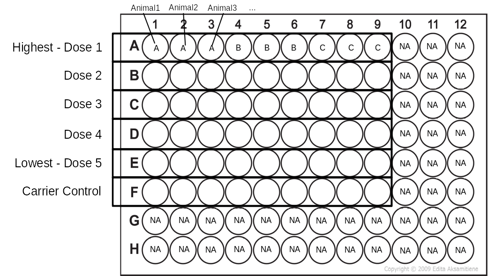

```{r setup, include=FALSE}
knitr::opts_chunk$set(echo = TRUE)
options(scipen = 9)
```

```{r libraries, include=FALSE}
library(knitr)
library(kableExtra)
library(gridExtra)
library(rlang)
library(Rcurvep)
library(DescTools)
library(plyr)
library(ggplot2)
library(dplyr)
library(tidyr)
library(readr)
library(stringr)
library(tibble)
library(data.table)
library(car)
library(lazyeval)
source("Functions/cal_auc_simi_endpoints.R")
source("Functions/behavioural_endpoint_calc.R")
```


# Rmd Report Assignment - BIOL5502

## Version Control
```{r version_control, comment="", class.source ='fold-hide'}
# - My Machine Info:
#   - R version 4.1.3 (2022-03-10) -- "One Push-Up"
#   - Platform: x86_64-pc-linux-gnu (64-bit)         5.11.0-34-generic / Ubuntu 20.04.4
#   - Desktop: GNOME 3.36.5
#   - Hardware: CPU - Intel Core i5-9400F 6 core 4.1GHz / RAM - 15924MiB
# - Package Versions:
#   - lazyeval_0.2.2
#   - car_3.0-12
#   - tibble_3.1.6
#   - ggplot2 Package: Version 3.3.5
#   - dplyr Package: Version 1.0.8
#   - plyr_1.8.7
#   - tidyr: Version 1.2.0
#   - readr Package: Version 2.1.2
#   - stringr: 1.4.0
#   - data.table: 1.14.2
#   - car: 3.0-12
#   - DescTools_0.99.44
#   - Rcurvep_1.2.0
#   - rlang_1.0.2
```

## Background
  About me: I come from an environmental ecotoxicology laboratory that explores the feasibility of using acute tests to estimate chronic toxicity for aquatic wildlife (e.g., early behavioural perturbation analyses, early metabolism analyses, and transcriptomic dose-response modelling).\
  The data supplied in the zip folder pertains to behavioural data collected from 5 day-old (120hpf) zebrafish embryos using a [Viewpoint ZebraBox and Viewpoint ZebraLab software](https://www.viewpoint.fr/en/p/equipment/zebrabox-for-embryos-or-larvae/publications). This is real data that I collected!! It's bound to have some errors.\
The dose ranges chosen for the exposure studies were extremely low for an acute-exposure study. We chose such low doses ranges because we are also conducting an RNA-sequencing dose-response analysis as well, which is much more sensitive (can detect changes earlier -- at lower doses) than the behavioural analysis.\
  Chemical exposures are performed in glass petri dishes (3 dishes per dose group -- A,B,C) for 120 hours post-fertilization.
```{r figure1, echo=FALSE, fig.align='center', fig.cap='Figure 1. The experimental layout of the 5-day chemical exposures in petri dishes prior to the behavioural assay', out.height="50%", out.width="50%"}
knitr::include_graphics("./Data/5-Day_Exposure_Layout.png")

```

On the final exposure day, embryos are pipetted into 96-Well plates.
There are 26 experiments/plates included in the data set, each a unique chemical, and each with 6 different dose groups including a vehicle control group. There are 9 fish per dose group and 6 dose groups -- 54 fish per plate
```{r figure2, echo=FALSE, fig.align='center', fig.cap='Figure 2. The behavioural assay plate layout for an individual experiment. In total, 54 5-day old embryos, 9 for each dose, are transferred to a 96-well plate in exposure media', out.height="60%", out.width="60%"}

```

The behavioural data is collected using an infrared camera over a 50-minute period where the first 20 minutes allow the zebrafish embryos to acclimate to their environment, and for the next 30 minutes there are 5-minute cycles of light and darkness -- 96-well plate format. Zebrafish naturally tend to be more active in the dark. Neurotoxic chemicals may change the swimming behaviours of fish
```{r experiment_protocol_visualization, echo=FALSE, fig.align='center', fig.cap='Figure 3. A visual representation of the behavioural assay protocol', out.height="75%", out.width="75%"}
ggplot(data = data.frame(x = c(1:50), y = c(1:50))) + 
  geom_blank(aes(x = x, y = y)) + 
  geom_rect(
  data = data.frame(start = c(20, 30, 40), end = c(25, 35, 45)),
  aes(
    xmin = start,
    xmax = end,
    ymin = -Inf,
    ymax = Inf
  ),
  fill = 'black',
  alpha = 0.2
) + 
  geom_vline(xintercept = 20, linetype = "dashed") + ylab("response") + xlab("time in minutes") + 
  geom_text(data = data.frame(
  xvar = c(10, 22.5, 27.5, 32.5, 37.5, 42.5, 47.5),
  yvar = c(25, 40, 10, 40, 10, 40, 10),
  labvar = c("Acclimation", "Dark", "Light", "Dark", "Light", "Dark", "Light")
),
aes(x = xvar, y = yvar, label = labvar))
```

The infrared camera traces the swim paths of fish during the entire experiment. A one-minute snapshot of raw swim paths look like this:
```{r figure4, echo=FALSE, fig.align='center', fig.cap='Figure 4. An example of what the raw swim-path tracing looks like from the Viewpoint Zebrabox infrared camera and Viewpoint Zebralab software', out.height="50%", out.width="50%"}
knitr::include_graphics("./Data/Path_Trace_Example.png")
```
The raw data contain many variables that we will explore once we import the data. You can browse the meta data in the next section of this report.

## Directory & Meta Data
```{r directory, include=FALSE}
dir <- paste0(getwd(), "/Data/All")
```

.XLS files have been converted to .csv files and are included in the directory `r dir`. These are the raw data files that this EDA will be using.
```{r directory_files_filenames, include=FALSE}
fileNames <- list.files("Data/Raw") #Get the name of each .csv file
chemicalNames <- str_split(string = fileNames, pattern = ".csv", simplify = TRUE)[,1] #Identify the chemicals included in the files
metaData <- read.csv(file = "Data/MetaData.csv") #Import the Meta Data that includes information about the data in the folders
#CAS is the Chemical Abstract Service, MOA is the Mode of Action. This table includes useful information about the exposure concentrations for each chemical dose in mg/L. We'll use this later to create our final data frame
HighDose <- setNames(metaData[,6], chemicalNames) #subsetting metadata
```

```{r metadata_table, echo=FALSE}
metaData %>%
  select(NAME, plate_id, MOA, Dose1:Dose5) %>%
  kable(
    col.names = c(
      "Chemical Name",
      "Plate ID",
      "Mode of Action",
      "Dose 1 (High)",
      "Dose 2",
      "Dose 3",
      "Dose 4",
      "Dose 5 (Low)"
    ),
    align = "lllrrrrr",
    caption = "Table 1. Information about each chemical included in the experiment with dose information in mg/L"
  ) %>%
  kable_styling(full_width = TRUE) %>%
  scroll_box(height = "400px")
```

## Importing the raw data files & taking a glimpse

Glimpse the raw data to see the structure of each variable, the number of observations and the class of the `raw_data` object
```{r glimpse_raw_data, echo=FALSE, collapse=TRUE}
list <- list()
for (i in 1:length(fileNames)) {
  list[[i]] <- read_delim(file = paste0("Data/Raw/", fileNames[[i]]),
                          col_names = TRUE,
                          col_types = "cclnninninninnin", #Where c is character, l is logical, n is numeric, i is integer
                          na = c("", 'NA', "NA", "\t NA", "\tNA") #Specify what to consider NA
  )
}
names(list) <- chemicalNames #Name List objects
raw_data <- as_tibble(rbindlist(list, idcol = "plate_id")) #name the plates by the chemical names
glimpse(raw_data)
class(raw_data)
```
From the glimpse it can be seen that there are 17 variables in the tibble/data frame:

* `plate_id` the chemical used in the exposure experiment
* `animal` represents individual animals in the experiment
* `Treatment` The Dose group, and internal replicate (petri dish A, B or C)
* `an` Unknown/not useful
* `start` start time of observation in seconds
* `end` end time of observation in seconds
* `inact` Inactivity Counts | the number of times the fish went from being active to inactive over the observation time
* `inadur` Inactivity Duration | the duration of time, in seconds, the fish went from being active to inactive over the observation time (1 minute)
* `inadist` Inactivity Distance | the distance travelled by inactive observations (this value should be 0)
* `smlct` Small Activity Counts | the number of times the fish had a small burst of swim activity over the observation time (1 minute)
* `smldur` Small Activity Duration | the duration of the small burst of swim activity over the observation time (1 minute)
* `smldist` Small Activity Distance | The distance travelled during small bursts of activity
* `larct` Large Activity Counts | the number of times the fish had a large burst of swim activity over the observation time (1 minute)
* `lardur` Large Activity Duration | the duration of the large burst of swim activity over the observation time (1 minute)
* `lardist` Large Activity Distance | The distance travelled during large bursts of activity
* `emptyct` Counts that were neither inactive or active (data recording artifact)
* `emptydur` duration of time fish was neither inactive, or active (data recording artifact) | Almost acts like a confidence value. The closer it is to 60, the more unreliable the data are

## Investigating `raw_data`
### Checking expectations
#### Number of observations/rows
It is expected that the raw data wil have `r 96*50*26` rows because there are 96 wells, 50 minutes, and 26 different plates
```{r n_rows, echo=TRUE, collapse=TRUE}
nrow(raw_data)
```
However, there are `r nrow(raw_data)` rows present in the raw data. This expectation was violated because each observation is duplicated
```{r duplicates, echo=FALSE}
raw_data %>%
  select(plate_id, Treatment, an, end, smldist, lardist, emptyct, emptydur)
```
By looking at just the head of `raw_data`, it can be seen that the variable `an` has a `TRUE` and `FALSE` row for each individual observation. The only difference between these duplicate rows is that the `FALSE` rows retain information about `emptyct` and `emptydur`.\
```{r nrow_filtered_raw_data, echo=TRUE, collapse=TRUE}
raw_data <- raw_data %>%
  filter(an == FALSE) %>% # Removing duplicate rows
  select(-c(an)) # This variable is not very useful anymore, so removing
nrow(raw_data)
```
After filtering for just the false values, there are now `r nrow(raw_data)` rows.\ 
There are `r nrow(raw_data) - (96*50*26)` extra observations in `raw_data` because there are some extra observations past 50 minutes.\ 
```{r nrow_raw_data_filtered_2, echo=TRUE, collapse=TRUE}
raw_data <- raw_data %>%
  filter(end <= 3000) # Deleting observations past 50 mins (3000 seconds)
nrow(raw_data)
identical(as.numeric(nrow(raw_data)), (96 * 50 * 26)) # is the expected number of rows consistent with the observed number of rows after processing?
```
After ensuring there are no observations past the 50-minute mark, there are now `r nrow(raw_data)` rows, as expected.

#### Treatment-level NAs
It is expected that wells 10:12, 22:24, 34:36, 46:48, 58:60, 70:96 will all be `NA` in the `Treatment` column because these are all empty wells (Figure 2). Each plate has  `r (3*6) + (12*2)` empty wells. This means that all `NA` treatments should be `r 42*50*26` observations long. After removing `NA`s there should be `r nrow(raw_data)-(42*50*26)` rows in `raw_data`.
```{r removeNAs, echo=TRUE, collapse=TRUE}
raw_data <- raw_data %>%
  filter(Treatment != is.na(Treatment))
nrow(raw_data)
identical(as.numeric(nrow(raw_data)), (54 * 50 * 26)) # Does the expected number of rows match the observed number of rows after filtering?
```

#### Variable Distributions & Outliers

Quick visualizations of the distributions of each variable are a fast and easy way to learn a lot about the data such as the range, distribution of observations, and outliers.\
\
First, the 'counts' variable distributions will be investigated.
```{r qplots_counts, echo=FALSE, warning=FALSE, message=FALSE, fig.height=6 , fig.align='center', fig.cap="Figure 5. Quick plots of the 'counts' variables in the `raw_data` object", out.height= "150%", out.width= "150%"}
grid.arrange(
  qplot(
    data = raw_data,
    x = emptyct,
    xlim = c(-15, 100),
    xlab = "Number of times counted as an empty well in a minute (artifact) `emptyct`"
  ),
  qplot(
    data = raw_data,
    x = inact,
    xlim = c(-15, 200),
    xlab = "Number of times counted as inactive in a minute `inact`"
  ),
  qplot(
    data = raw_data,
    x = smlct,
    xlim = c(-15, 400),
    xlab = "Number of times counted as a small activity in a minute `smlct`"
  ),
  qplot(
    data = raw_data,
    x = larct,
    xlim = c(-15, 400),
    xlab = "Number of times counted as a large activity in a minute `larct`"
  ),
  nrow = 4
)
```
Figure 5 (plot 1) shows that there are some artifacts in the data. Sometimes, the camera/software was not able to detect a fish even though, there certainly were fish in those wells. The `emptyct` variable (plot 1) is a good tool to use for flagging observations that need to transformed to `NA`s in the next section (Suspicious Values).\
It can be seen that the amount of times an animal goes inactive during an observation period (`inact`) is approximately 75 times per minute. As well, it can be seen that small swim bursts (`smlct`) tend to occur just over 150 times per minute. And finally, we can see that large swim bursts (`larct`) can either occur just over 100 times per minute, or 0 times per minute. This could be due to sensitive effects of light on swim inhibition, or darkness stimulating large swim behaviours.\
\
The distributions of all count variables are slightly skewed, with few outliers, except for the empty well counts which are very positively skewed.\
\
Next, the 'duration' variable distributions will be explored. Note: this variable should never exceed 60 seconds.
```{r qplots_duration, echo=FALSE, warning=FALSE, message=FALSE, fig.height=6 , fig.align='center', fig.cap="Figure 6. Quick plots of the 'duration' variables in the `raw_data` object", out.height= "150%", out.width= "150%", fig.height = 7.5, fig.width=7}
raw_data <- raw_data %>%
  mutate(activedur = smldur + lardur)
grid.arrange(
  qplot(
    data = raw_data,
    x = emptydur,
    xlim = c(-5, 65),
    xlab = "Amount of time animals were not found in a 60 second observation (artifact) `emptydur`"
  ) + geom_vline(xintercept = 3, linetype = "dashed", color = "red"),
  qplot(
    data = raw_data,
    x = inadur,
    xlab = "Amount of time animal spent inactive in a 60 second observation `inadur`",
    xlim = c(-5, 65)
  ),
  qplot(
    data = raw_data,
    x = activedur,
    xlab = "Amount of time animal spent active in a 60 second observation `activedur`",
    xlim = c(-5, 65)
  ),
  qplot(
    data = raw_data,
    x = smldur,
    xlab = "Amount of time animal spent doing small swimming motions in a 60 second observation `smldur`",
    xlim = c(-5, 65)
  ),
  qplot(
    data = raw_data,
    x = lardur,
    xlab = "Amount of time animal spent doing large swimming motions in a 60 second observation `lardur`",
    xlim = c(-5, 65)
  ) + geom_vline(xintercept = 40, linetype = "dashed", color = "red"),
  nrow = 5
)
```
Figure 6 reveals another red flag with the `emptydur` variable (plot 1 in figure 6). There are some observations that show 60 full seconds of being empty! This is likely more than just an artifact in the recording instrument/software. These are likely dead fish that never moved at all so the infrared camera was never able to start tracing their swim patterns. However, it can also be seen that there are some observations greater than 0 and less than 60 in this plot. In theory, if an animal is present in the well, the `emptydur` value should always be zero. An arbitrary threshold of 3 seconds of empty duration will be used to transform all observations (across variables) with an `emptydur` > 3 into `NA`s\
\
Again, it can also be seen that the distributions of observations for each variable is slightly skewed. Note also that `inadur` and `activedur` (plots 2 and 3 from figure 6) are approximately inversely related as expected. The emerging pattern of large swim activity duration (`lardur`) clustering around two modes (0s and ~15s) can be observed, similar to the counts variable.\
\
There are a few outliers in the data but they are a bit difficult to see in figure 6. Notably, large swim activity duration (plot 5 in figure 6) has 27 outliers past ~40 seconds. Taking a closer look at those outliers...
```{r lardur_outliers, echo=FALSE, warning=FALSE, message=FALSE}
raw_data %>%
  filter(lardur > 40) %>%
  select(plate_id, animal, Treatment, lardur) %>%
  group_by(plate_id, Treatment, animal) %>%
  summarise(distance = mean(lardur)) %>%
  kable(align = 'lllc', col.names = c("Chemical", "Individual", "Dose", "Large Activity Duration (seconds)"), caption = "Table 2. Summary of outliers in large swim activity duration variable (> 40s), showing only unique individuals") %>%
  kable_styling(full_width = TRUE) %>%
  scroll_box()
```
From table 2, it can be seen that many of the hyperactivity observations come from the same individual animals in the experiment (with a few exceptions). These are extreme observable effects on individuals, they do not necessarily represent the the rest of the population within groups.\
\
Chemicals observed in extremely hyperactive individuals:

- Bisphenol A (BPA) -- estrogen receptor binder
- Dimethylformamide -- liver toxicity
- Fadrozole -- aromatase inhibitor (estrogen blocker)
- Flutamide -- androgen antagonist (testosterone blocker)
- Vinclozolin -- androgen antagonist (testosterone blocker)

Behavioural perturbation (hyperactivity) suggests that it is possible that these chemicals can effect the nervous system of individuals early on in development. However, it is wise to be cautious and not draw any conclusions yet without any sort of statistical analyses.\
\
Next, the distributions of the 'distance' variables will be investigated.
```{r distance_qplots, echo=FALSE, fig.align='center', fig.cap="Figure 7. Quick plots of the 'distance' variable in the `raw_data` object", warning=FALSE, message=FALSE, fig.height = 5, fig.width = 7.5, out.height= "150%", out.width= "150%"}
raw_data <- raw_data %>%
  mutate(totaldist = smldist + lardist)
grid.arrange(
  qplot(
    data = raw_data,
    x = smldist,
    xlab = "Distance travelled during small swimming motions in a minute `smldist`"
  ),
  qplot(
    data = raw_data,
    x = lardist,
    xlab = "Distance travelled during large swimming motions in a minute `lardist`",
    xlim = c(-100,5000)
  ) + geom_vline(xintercept = 2500, linetype = "dashed", color = "red"),
  qplot(
    data = raw_data,
    x = totaldist,
    xlab = "Distance travelled during all swimming motions in a minute `totaldist`",
    xlim = c(-100,5000)
  ) + geom_vline(xintercept = 4000, linetype = "dashed", color = "red"),
  nrow = 3
)

```
Figure 7 shows that the distributions of of the 'distance' variables are slightly skewed with the `totaldist` variable being the most normally distributed. Notably, `totaldist` seems to be a promising effect endpoint to analyse since it is the most normally distributed of all the other effect endpoints.\
\
However, there are outliers in `totaldist` and so the following steps will be taking a closer look at those outliers...
```{r totaldist_outliers, echo=FALSE, warning=FALSE, message=FALSE}
raw_data %>%
  filter(totaldist > 4000) %>%
  select(plate_id, Treatment, animal, totaldist) %>%
  group_by(plate_id, Treatment, animal) %>%
  summarise(distance = mean(totaldist)) %>%
  kable(col.names = c("Chemical", "Dose", "Individual", "Distance travelled in 1 min"), align = 'lllc', caption = "Table 3. Summary of outliers in total distance travelled variable (>4000) showing only unique individuals") %>%
  kable_styling(full_width = TRUE) %>%
  scroll_box()
```
We see there are 3 chemicals in the extreme outliers, and that most of the individual animals are from the highest dose treatment group:\
\
Chemicals observed in extremely hyperactive individuals:

- Bisphenol A (BPA) -- estrogen receptor binder
- Fadrozole -- aromatase inhibitor (estrogen blocker)
- Vinclozolin -- androgen antagonist (testosterone blocker)

Again, we see 3 of the same chemicals that are potentially inducing hyperactivity in the same individuals. However, as previously stated, these individuals are not representative of the rest of the population within their respective dose groups and no conclusions can be drawn yet!\
\
It is important to also consider determining outliers not just between plates in the larger data frame, but within the same plate. 
```{r plate_distribution_visualizer, include=FALSE}
distVis <- function (df, chem, var, time_start = 0) {
df %>%
  filter(plate_id == chem, start >= time_start*60) %>% #Subetting to chemical of choice
  mutate(Treatment = rep(
    c(
      "Dose1_A","Dose1_B","Dose1_C","Dose2_A","Dose2_B","Dose2_C",
      "Dose3_A","Dose3_B","Dose3_C","Dose4_A","Dose4_B","Dose4_C",
      "Dose5_A","Dose5_B","Dose5_C","Control_A","Control_B","Control_C"
    ),
    times = (nrow(.)/(18)/3), #repeat 2,700/18 = 150 times (number of observations divided by number of treatments = number of treatment observations) then divide that by 3 because each will be repeating 3 times
    each = 3
  )) %>% #Separating Dose from Group letter with an underscore
  separate(col = Treatment, # Column we want to separate
           into = c('Dose', 'Group'), #Into these two column names
           convert = TRUE) %>%
  ggplot(aes(x = .data[[var]])) +
  geom_histogram() +
  xlab(var) +
  ggtitle(chem) +
  facet_wrap(~Dose)
}
```

```{r within_plate_outliers, echo=FALSE, fig.align='center', fig.cap="Figure 8. Example of within-plate outlier quick plots", warning=FALSE, message=FALSE, fig.height= 8, out.height="150%", out.width="125%"}
#Summary of outliers: TGSH > 2000, Clofib > 2000, 17beta_estradiol > 2500, 24DMP > 2500, DES > 2500, DMF > 2500, EE2 > 2500, Fluoxetine > 2500, BPA > 3000, Fadrozole > 3500, Vinclozolin > 4000
grid.arrange((
  distVis(
    df = raw_data,
    chem = "BPA",
    var = "totaldist",
    time_start = 20
  ) + geom_vline(
    xintercept = 3000,
    linetype = c("blank", "dashed", "blank", "blank", "blank", "blank"),
    color = "red"
  )
),
(
  distVis(
    df = raw_data,
    chem = "Fadrozole",
    var = "totaldist",
    time_start = 20
  ) + geom_vline(
    xintercept = 3500,
    linetype = c("blank", "dashed", "blank", "blank", "blank", "blank"),
    color = "red"
  )
),
(
  distVis(
    df = raw_data,
    chem = "Vinclozolin",
    var = "totaldist",
    time_start = 20
  ) + geom_vline(
    xintercept = 4000,
    linetype = c("blank", "dashed", "blank", "blank", "blank", "blank"),
    color = "red"
  )
))
```

After a careful examination of individual plates, the following outliers were identified in the `totaldist` variable:

```{r outliers, include=FALSE}
treatment_groups <- c("Dose1_A","Dose1_B","Dose1_C","Dose2_A","Dose2_B","Dose2_C",
  "Dose3_A","Dose3_B","Dose3_C","Dose4_A","Dose4_B","Dose4_C",
  "Dose5_A","Dose5_B","Dose5_C","Control_A","Control_B","Control_C")

raw_data <- raw_data %>%
  mutate(Treatment = rep(treatment_groups,
    times = (nrow(.)/(18)/3), #repeat 2,700/18 = 150 times (number of observations divided by number of treatments = number of treatment observations) then divide that by 3 because each will be repeating 3 times
    each = 3
  )) %>% #Separating Dose from Group letter with an underscore
  separate(col = Treatment, # Column we want to separate
           into = c('Dose', 'Group'), #Into these two column names
           convert = TRUE)

out_1 <- raw_data %>%
  filter(plate_id == "Vinclozolin") %>%
  filter(totaldist >= 4000)
out_2 <- raw_data %>%
  filter(plate_id == "Fadrozole") %>%
  filter(totaldist >= 3500)
out_3 <- raw_data %>%
  filter(plate_id == "BPA") %>%
  filter(totaldist >= 3000)
out_4 <- raw_data %>%
  filter(plate_id %in% c("Fluoxetine", "EE2", "DMF", "DES", "24DMP", "17beta_estradiol")) %>%
  filter(totaldist >= 2500)
out_5 <- raw_data %>%
  filter(plate_id %in% c("TGSH", "Clofibric_Acid")) %>%
  filter(totaldist >= 2000)
out_totaldist <- rbind(out_1, out_2, out_3, out_4, out_5)

raw_data <- raw_data %>%
  mutate(outliers = if_else(condition = (do.call(paste0, .) %in% do.call(paste0, out_totaldist)), true = TRUE, false = FALSE))
```

```{r outlier_summary, echo=FALSE, warning=FALSE, message=FALSE}
out_totaldist %>%
  group_by(plate_id, Dose) %>%
  tally() %>%
  arrange(desc(n)) %>%
  kable(col.names = c("Chemical", "Dose", "Number of outlier observations (totaldist)"), align = 'llr', caption = "Table 4. Summary of outliers in `raw_data` grouped by chemical and dose group") %>%
  kable_styling(full_width = TRUE) %>%
  row_spec(c(1,2,3,7,16,17,19,20), background = "#e5e8ed") %>%
  scroll_box(height = "400px")
```
From this summary table it can be seen that there are three chemicals that make up the majority of all the outliers based on this deeper-dive into the within-plates data. Those chemicals with the highest proportions of outliers were:

- Bisphenol-A
- Fadrozole
- Phenol, 4,4'-sulfonylbis[2-(2-propenyl)- (TGSH)

It can also be noted that the most represented dose group in the outliers is dose group 1 (the highest dose):
```{r r outlier_summary_tally_by_dose_group, echo=FALSE, warning=FALSE, message=FALSE}
out_totaldist %>%
  group_by(Dose) %>%
  tally() %>%
  arrange(desc(n)) %>%
  kable(col.names = c("Dose", "Number of outlier observations (totaldist)"), align = 'lr', caption = "Table 4. Summary of outliers in `raw_data` grouped by dose") %>%
  kable_styling(full_width = TRUE) %>%
  scroll_box()
```
This suggests that the effects of chemical exposure could be behaving monotonically:

```{r outlier_summary_tally_by_dose_group, echo=FALSE, warning=FALSE, message=FALSE, fig.cap="Figure 9. Monotonic relationship of outlier observations (totaldist) and dose groups", fig.align='center'}
out_totaldist %>%
  mutate(Dose = factor(Dose, levels = c("Control", "Dose5", "Dose4", "Dose3", "Dose2", "Dose1"), ordered = TRUE)) %>%
  group_by(Dose) %>%
  tally() %>%
  ggplot(aes(x = Dose, y = n, group = 1)) +
  geom_point() +
  geom_smooth(method = "lm", se = FALSE, linetype = "dashed", color = "black") +
  ylab("Frequency")
```
However, removing these outliers from the data set could be artificially masking the most extreme effects of exposure on individuals (especially in the highest dose). Therefore, the outliers will be kept in the data set for now to avoid removing any observations that could be the result of chemical exposure. They will be flagged as outliers in `raw_data`.

<!-- ### What is the best variable to use for analysis? -->
<!-- For the remaining downstream analysis, it should be determined if the effects of chemical exposure are behaving as expected. It is expected that effects will behave monotonically. Therefore, these should be an increasing or decreasing trend on the effect endpoint (variable) as the dose increases. -->
<!-- ```{r totaldist_test, echo=FALSE, warning=FALSE, message=FALSE, fig.cap="Figure 10. Monotonic relationship of (totaldist) and dose groups", fig.align='center'} -->
<!-- norm_to <- raw_data %>% -->
<!--     filter(Dose == "Control") %>% -->
<!--     group_by(plate_id) %>% -->
<!--     summarise(cntrl_mean = rep(mean(totaldist), each = 6)) %>% -->
<!--     mutate(Dose = factor(x = c("Control", "Dose5", "Dose4", "Dose3", "Dose2", "Dose1"), levels = c("Control", "Dose5", "Dose4", "Dose3", "Dose2", "Dose1"), ordered = TRUE)) %>% -->
<!--   select(plate_id, Dose, cntrl_mean) -->
<!-- temp_dat <- raw_data %>% -->
<!--   mutate(Dose = factor(Dose, levels = c("Control", "Dose5", "Dose4", "Dose3", "Dose2", "Dose1"), ordered = TRUE)) %>% -->
<!--   group_by(plate_id, Dose) %>% -->
<!--   summarize(mean = mean(totaldist)) -->
<!-- norm_dat <- right_join(temp_dat, norm_to) %>% -->
<!--   mutate(norm_mean = mean - cntrl_mean) -->
<!-- norm_dat %>% -->
<!--   ggplot(aes(x = Dose, y = norm_mean, group = 1)) + -->
<!--   geom_point() + -->
<!--   geom_smooth(method = "lm", se = FALSE, linetype = "dashed", color = "black") + -->
<!--   facet_wrap(~ plate_id) -->
<!-- ``` -->

### Evaluating Data Quality
Figure 6 showed that the `emptydur` variable can be used reliably to filter out observations with poor data quality. The 'empty duration' variable ranges from 0s to 60s and indicates how long the observation was not able to detect a fish in the well. An arbitrary cutoff value of `r 60*0.05` seconds will be used to determine if an observation was of poor-quality and therefore, should be converted to `NA`. By doing this, the confidence in the accuracy of observations can be increased across the entire data set.
```{r poor_quality_cutoff, echo=FALSE}
qualityCutoff <- (60*0.05)
raw_data <- raw_data %>%
  mutate(poorQual = if_else(condition = emptydur >= qualityCutoff, true = TRUE, false = FALSE)) %>%
  mutate(across(
    .cols = c("inact","inadur","inadist",
              "smlct","smldur","smldist",
              "larct","lardur","lardist"),
    .fns = ~ replace(x = ., list = poorQual, values = NA) 
  ))
```

```{r n_NAs, echo=TRUE, collapse=TRUE}
NAObservations <- raw_data %>%
  filter(poorQual == TRUE) %>% # Filter only rows with poor quality that have behavioural endpoint observations turned to NAs
  nrow()
NAObservations
```
`r NAObservations` 60-second observations (rows) were transformed to `NA`s across all of the behavioural endpoint observation variables.\
\
Overall, the animal recording set-up had an approximate failure-rate of `r round((NAObservations/nrow(raw_data))*100)` % -- the percentage of time the infrared camera failed to detect an animal when it was present in a well. 

## Exploring & Visualizing

### Pre-Processing

```{r pre_process_1, echo=TRUE, class.source ='fold-hide', message=FALSE, warning=FALSE}
# First defining an object that carries all dosing information (in mg/L) for each chemical, from the meta data
doseData <- metaData %>%
  select(plate_id, Dose1:Control) %>%
  gather(key = Dose, value = "Dose_mg_L", Dose1:Control)

# Second, creating new variables, re-ordering columns, removing columns that won't be used, and joining dose information
fishBehavDat <- raw_data %>%
  mutate(
    time_end = end / 60, # time in minutes
     Dose = factor(Dose, levels = c("Control", "Dose5", "Dose4", "Dose3", "Dose2", "Dose1"), ordered = TRUE), # factoring dose info into ordered levels
    is_VC = if_else(
      condition = Dose == "Control",
      true = 1,
      false = 0
    ),  # is vehicle control? Logical... (0|1)
    animal = as.numeric(str_extract_all(animal, "[0-9]+")), # removes redundant 'Animal' in prefix in `animal` var
    replicate = rep(c(1:9), times  = nrow(.) / 9), # replicate (1 through 9) for each dose group
    embryo_id = paste(Dose, replicate, sep = "_"), # generic embryo identifier for use later in pipeline
    activedur = lardur + smldur, # recalculating variable after poorQuality observations were removed
    totaldist = lardist + smldist # recalculating variable after poorQuality observations were removed
  ) %>%
  inner_join(doseData) %>% # join dose info
  select(plate_id, embryo_id, replicate, Dose, Dose_mg_L, is_VC, Group, time_end, inact, smlct, larct, inadur, smldur, lardur, activedur, smldist, lardist, totaldist, outliers)
```

```{r custom_ggplot_functions, include=FALSE, class.source ='fold-hide'}
#Function for visualizing the 'variable' for each dose with a geom_smooth, faceted by chemical... each geom_smooth represents the mean of 9 fish from that dose group. All 50 minutes of the experiment by default
gg_smooth_AllChems <- function (data, y, ylab, min_start = 0, min_end = 50) {
  start <- c(20,30,40)
  end <- c(25,35,45)
  dark <- data.frame(start, end)
  data %>%
    filter(time_end >= min_start & time_end <= min_end) %>%
    group_by(plate_id, Dose_mg_L, time_end) %>%
    mutate_(meanvalue = interp(~ mean(na.omit(y)), y = as.name(y))) %>% # Must use lazy evaluation in the pipe and some depracated form of mutate_
    summarise(meanvalue = unique(meanvalue)) %>%
    ggplot(data = ., mapping = aes(x = time_end, y = meanvalue, group = Dose_mg_L)) +
    geom_point(size = 0.1) +
    geom_smooth(se = FALSE, aes(color = as.factor(Dose_mg_L))) +
    scale_colour_viridis_d() +
    geom_rect(data = dark, inherit.aes = FALSE, # Adding dark rectangles to represent the dark cycles
              aes(xmin = start, xmax = end, ymin = -Inf, ymax = Inf),
              fill = 'black', alpha = 0.2) +
    geom_vline(xintercept = 20, linetype = "dashed") +
    facet_wrap(~plate_id, ncol = 6, strip.position = "top", scales = "free") +
    #theme_classic() +
    theme(strip.background = element_blank(), panel.background = element_blank()) +
    theme(axis.text.x = element_text(angle = 90, vjust = 0.5)) +
    xlab("Time [min]") +
    ylab(ylab) +
    xlim(min_start, min_end) +
    guides(color = guide_legend(title = "Dose (mg/L)"))
}

#And to get a better look at what is driving the observed effects, this next function will show a within-plates point of view... plotting individual fish in each dose group
smooth_oneChem <- function (data, chemical, y, ylab, min_start = 0, min_end = 50) {
  start <- c(20,30,40)
  end <- c(25,35,45)
  dark <- data.frame(start, end)
yintercept <- mean(na.omit(filter(.data = data, plate_id == chemical)[[y]], Dose == "Control"))
  data %>%
    filter(time_end >= min_start & time_end <= min_end) %>%
    filter(plate_id == chemical) %>%
    group_by(plate_id, Dose_mg_L, time_end) %>%
    mutate_(meanvalue = interp(~ mean(na.omit(y)), y = as.name(y))) %>%
    ungroup() %>%
    group_by(Dose_mg_L, replicate) %>%
    ggplot(aes(x = time_end, y = .[[y]], group = as.factor(replicate), color = as.factor(replicate))) +
    geom_line() +
    scale_colour_viridis_d() +
    geom_smooth(aes(x = time_end, y = meanvalue), se = FALSE, color = "black") +
    geom_rect(data = dark, inherit.aes = FALSE,
              aes(xmin = start, xmax = end, ymin = -Inf, ymax = Inf),
              fill = 'black', alpha = 0.2) +
    facet_wrap(~Dose_mg_L, ncol = 3) +
    geom_vline(xintercept = 20, linetype = "dashed") +
    geom_hline(yintercept = yintercept, linetype = "dashed", color = "red") +
    theme(strip.background = element_blank(), panel.background = element_blank()) +
    theme(axis.text.x = element_text(angle = 90, vjust = 0.5)) +
    xlab("Time [min]") +
    ylab(ylab) +
    labs(title = chemical) +
    xlim(min_start, min_end) +
    theme(legend.position = "none")
}
```


### ggplots -- All Chemicals (facet by `plate_id`)
Figures 10 through 12 show the light and dark cycle behavioural data without any acclimation period. The potency of each chemical can be observed by the deepness/darkness of the color palette in each facet. For example ethinyl estradiol (EE2) is the most potent as it is a well-known estrogen receptor binder used in the medical field as an oral contraceptive. The least potent compounds are triethylene glycol (plasticizer, aerosol disinfectant & used in 'smoke machines') and NN-Dimetylformamide (industrial solvent for processing polymer fibers, films and surface coatings).\
\
The main purpose of figures 10 through 12 is to scan for differences between dose groups quickly for each chemical.

#### Total Distance Variable -- `totaldist`

Obvious observable dose differences from my naked eye:

- 1-octanol (+'ve)
- 4-tert pentylphenol (4TPP) (+'ve)
- bisphenol-A (BPA) (+'ve)
- dimethylsulfoxide (DMSO) (+'ve)
- ethinyl estradiol (EE2) (+'ve)
- fadrozole (+'ve)
- flutamide (+'ve)
- prochloraz (-'ve)
- vinclozolin (+'ve)


```{r ggplots_all_chems_totaldist, echo=FALSE, fig.align='center', fig.cap="Figure 10.", warning=FALSE, message=FALSE, out.height="150%", out.width="250%", fig.width=11, fig.height=6}
gg_smooth_AllChems(data = fishBehavDat, y = "totaldist", ylab = "Total activity distance", min_start = 20)
```

#### Active Duration Variable -- `activedur`

Obvious observable dose differences from my naked eye:

- 1-octanol (+'ve)
- 3,4 - dichloroanaline (34DCA) (-'ve)
- 4-tert pentylphenol (4TPP) (+'ve)
- dimethylformamide (DMSO) (-'ve)
- fadrozole (+'ve)
- prochloraz (-'ve)


```{r ggplots_all_chems_activedur, echo=FALSE, fig.align='center', fig.cap="Figure 11.", warning=FALSE, message=FALSE, out.height="150%", out.width="250%", fig.width=11, fig.height=6}
gg_smooth_AllChems(data = fishBehavDat, y = "activedur", ylab = "Active Duration", min_start = 20)
```

#### Inactive Counts Variable -- `inact`

Obvious observable dose differences from my naked eye:

- 1-octanol (-'ve)
- 3,4 - dichloroanaline (34DCA) (-'ve)
- 4-tert octophenol (4TOP) (-'ve)
- 4-tert pentylphenol (4TPP) (-'ve)
- dimethylformamide (DMSO) (-'ve)
- fadrozole (-'ve)
- fenitrothion (-'ve)
- prochloraz (-'ve)

Note: a negative change in inactivity counts represents hyperactivity
```{r ggplots_all_chems_inact, echo=FALSE, fig.align='center', fig.cap="Figure 12.", warning=FALSE, message=FALSE,out.height="150%", out.width="250%", fig.width=11, fig.height=6}
gg_smooth_AllChems(data = fishBehavDat, y = "inact", ylab = "Inactivity counts", min_start = 20)
```

### ggplots -- One Chemical (facet by `Dose`)

Interesting chemicals from figure 10 through 12:

- 4tert-pentylphenol (4TPP)
- dimethylsulfoxide (DMSO)
- fadrozole

Figures 13 through 15 are just three examples of what should be done for every chemical to see if there are outlier individuals driving the effects or not. As well, when the smooth black line diverges from the red dashed horizontal line (the mean of all individuals across all dose groups), this means that the dose group is beginning to differ from the mean of the control group.

#### `totaldist` Variable

```{r ggplots_4TPP_totaldist, echo=FALSE, fig.align='center', fig.cap="Figure 13.", warning=FALSE, message=FALSE}
smooth_oneChem(data = fishBehavDat, chemical = "4TPP", y = "totaldist", ylab = "Total activity distance", min_start = 20) #Seems that one fish is driving most of the effect. Probably best to remove these outliers and replace as NA
```
It can be seen from figure 13 that the highest dose (1mg/L) seems to induce some hyperactivity in fish that is slightly above the mean of the control group.

```{r ggplots_DMSO_totaldist, echo=FALSE, fig.align='center', fig.cap="Figure 14.", warning=FALSE, message=FALSE}
smooth_oneChem(data = fishBehavDat, chemical = "DMSO", y = "totaldist", ylab = "Total activity distance", min_start = 20) # A clearer pattern of effect of chemical dose on movement distance
```
Again, in figure 14, we can see that the highest dose group (10mg/L) seems to be associated with hyperactivity when compared the mean of the control group.

```{r ggplots_Fadrozole_totaldist, echo=FALSE, fig.align='center', fig.cap="Figure 15.", warning=FALSE, message=FALSE}
smooth_oneChem(data = fishBehavDat, chemical = "Fadrozole", y = "totaldist", ylab = "Total activity distance", min_start = 20) # A few individuals driving these effects in the highest dose
```
Finally, figure 15 shows a similar trend where the highest dose group (1mg/L) is associated with hyperactivity. Also notable, is that one fish from the lowest dose group seems to be naturally more active than the others in the same group.\
\
From these figures, I would conclude that individual effects could potentially be a confounding factor to the dose-response analysis. More replicates per dose group would have been beneficial for a higher throughput analysis of the effects of chemicals on the swim behaviour of fish at different doses.\
\
The next step of the analysis to first convert the raw behavioural data into similarity scores, then see if there are any statistically significant effects of chemicals on the swim behaviour of fish (ANCOVA), and then a post-hoc Dunnett's test to see what doses are statistically different from the control dose group.

## Analysis

```{r pre_processing_4_pipeline, include=FALSE}
lfishBehavDat <- fishBehavDat %>%
  mutate(value = .[[params$value]], dose = Dose_mg_L) %>%
  filter(time_end > 20) %>% # For the analysis, we don't want the 20 minute acclimation period
  mutate(time_end = time_end-20) %>% # Display time 1-30 minutes
  select(plate_id, embryo_id, is_VC, time_end, value) %>%
  na.omit() # Pipeline is picky about the data frame
lfishBehavDat <- split(as.data.frame(lfishBehavDat), ~ plate_id) # Split into lists
```

The analysis pipeline included in this report was adapted from Hsieh et al 2018.