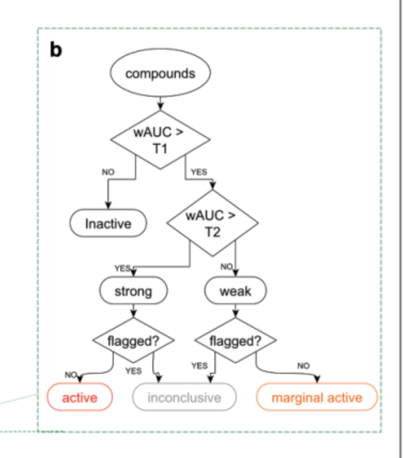

```{r 1setup, include=FALSE}
knitr::opts_chunk$set(echo = TRUE)
knitr::opts_chunk$set(warning = FALSE)
options(scipen = 9)
```

```{r 2libraries, include=FALSE}
library(knitr)
library(kableExtra)
library(gridExtra)
library(rlang)
library(Rcurvep)
library(DescTools)
library(plyr)
library(ggplot2)
library(dplyr)
library(tidyr)
library(readr)
library(stringr)
library(tibble)
library(data.table)
library(car)
library(lazyeval)
library(DT)
library(here)
library(future) 
library(future.apply) # from original future author
library(furrr) # use future.apply but similar to purrr package 
library(tidyverse)
future::plan(multisession, workers = availableCores()) # windows, Mac needs multicore
source("Functions/cal_auc_simi_endpoints.R")
source("Functions/behavioural_endpoint_calc.R")
source("Functions/RCurveP_Data_Wrangling_Functions.R")
```


# Toxicology Behavioural Analysis Report

## Version Control
```{r 3version_control, comment="", class.source ='fold-hide'}
# - My Machine Info:
#   - R version 4.2.1 (2022-06-23)
#   - Platform: x86_64-pc-linux-gnu (64-bit)         5.11.0-34-generic / Ubuntu 22.04.1 LTS
#   - Desktop: GNOME 3.36.5
#   - Hardware: CPU - Intel Core i5-9400F 6 core 4.1GHz / RAM - 15924MiB
```

```{r 4_importing_dat, include=FALSE}
fishBehavDat <- read_csv(file = "Data/fishBehavDat.csv")
fishBehavDatBin5 <- read_csv(file = "Data/fishBehavDatBin5.csv")
fishBehavDatBinLD <- read_csv(file = "Data/fishBehavDatBinLD.csv")
```

```{r 8directory, include=FALSE}
dir <- paste0(getwd(), "/Data/All")
```

```{r 9directory_files_filenames, include=FALSE}
fileNames <- list.files("Data/Raw") #Get the name of each .csv file
chemicalNames <- str_split(string = fileNames, pattern = ".csv", simplify = TRUE)[,1] #Identify the chemicals included in the files
metaData <- read.csv(file = "Data/MetaData.csv") #Import the Meta Data that includes information about the data in the folders
#CAS is the Chemical Abstract Service, MOA is the Mode of Action. This table includes useful information about the exposure concentrations for each chemical dose in mg/L. We'll use this later to create our final data frame
#HighDose <- setNames(metaData[,6], chemicalNames) #subsetting metadata
doseData <- metaData %>%
  select(plate_id, Dose1:Control) %>%
  gather(key = Dose, value = "Dose_mg_L", Dose1:Control)
number_of_dose_groups_per_chem <- 5 # Set this to the number of dose groups you have
```

```{r 1_remove_outlier_control_fish, include=FALSE}
BoxPlotOutliers <- fishBehavDat %>%
  filter(Dose == "Control") %>%
  group_by(plate_id, embryo_id) %>%
  summarise(cummulative_param = sum(get(params$value), na.rm = TRUE)) %>%
  group_by(plate_id) %>%
  summarise(Q1 = quantile(cummulative_param, 0.25),
         Q3 = quantile(cummulative_param, 0.75),
         IQR = IQR(cummulative_param),
         cummulative_param = cummulative_param,
         embryo_id = embryo_id) %>%
  mutate(lower_limit = (Q1 - 1.5*IQR),
         upper_limit = (Q3 + 1.5*IQR)) %>%
  group_by(plate_id) %>%
  mutate(z_score = (cummulative_param - mean(cummulative_param))/sd(cummulative_param)) %>%
  mutate(outlier_iqr = if_else(condition = cummulative_param > (Q1 - 1.5*IQR) & cummulative_param < (Q3 + 1.5*IQR), true = FALSE, false = TRUE)) %>%
  mutate(outlier_z = if_else(condition = z_score > 3, true = TRUE, false = FALSE))

ggBoxPlotOutliers <- BoxPlotOutliers %>%
  ggplot(data = ., mapping = aes(y = cummulative_param)) +
  geom_boxplot() +
  geom_label(inherit.aes = FALSE, x = 0, aes(y = cummulative_param, color = embryo_id, label = embryo_id)) +
  geom_point(inherit.aes = FALSE, x = 0, aes(y = cummulative_param, color = embryo_id)) +
  facet_wrap(~plate_id, scales = "free") +
  theme_classic()

BoxPlotOutliersRemove <- BoxPlotOutliers %>%
  filter(outlier_iqr | outlier_z == TRUE) %>%
  summarise(plate_id = plate_id, embryo_id = embryo_id)

print(ggBoxPlotOutliers)


#Remove any outliers before data transmformation based off of the animal's cumulative paramater across the entire assay
#fishBehavDat
temp <- semi_join(fishBehavDat, BoxPlotOutliersRemove, by = c("plate_id", "embryo_id")) %>%
  mutate(across(
    .cols = c("inact","inadur",
              "smlct","smldur","smldist","activedur",
              "larct","lardur","lardist","totaldist"),
    .fns = ~ replace(x = ., values = NA)
  )) %>%
  mutate(outliers = TRUE)
temp2 <- anti_join(fishBehavDat, BoxPlotOutliersRemove, by = c("plate_id", "embryo_id"))
fishBehavDat <- bind_rows(temp, temp2)

#fishBehavDatBin5
temp <- semi_join(fishBehavDatBin5, BoxPlotOutliersRemove, by = c("plate_id", "embryo_id")) %>%
  mutate(across(
    .cols = c("inact","inadur",
              "smlct","smldur","smldist","activedur",
              "larct","lardur","lardist","totaldist"),
    .fns = ~ replace(x = ., values = NA)
  )) %>%
  mutate(outliers = TRUE)
temp2 <- anti_join(fishBehavDatBin5, BoxPlotOutliersRemove, by = c("plate_id", "embryo_id"))
fishBehavDatBin5 <- bind_rows(temp, temp2)

#fishBehavDatBinLD
temp <- semi_join(fishBehavDatBinLD, BoxPlotOutliersRemove, by = c("plate_id", "embryo_id")) %>%
  mutate(across(
    .cols = c("inact","inadur",
              "smlct","smldur","smldist","activedur",
              "larct","lardur","lardist","totaldist"),
    .fns = ~ replace(x = ., values = NA)
  )) %>%
  mutate(outliers = TRUE)
temp2 <- anti_join(fishBehavDatBinLD, BoxPlotOutliersRemove, by = c("plate_id", "embryo_id"))
fishBehavDatBinLD <- bind_rows(temp, temp2)
```

## Analysis - Similarity Scores/Correlation coefficients


```{r 46.2pre_processing_4_pipeline, include=FALSE}
lfishBehavDat <- fishBehavDat %>%
  #filter(plate_id %in% c("BPAF", "BPA", "DES", "TGSH", "EE2")) %>%
  mutate(value = .[[params$value]], dose = Dose_mg_L) %>%
  filter(time_end > 20) %>% # For the analysis, we don't want the 20 minute acclimation period
  mutate(time_end = time_end-20) %>% # Display time 1-30 minutes
  select(plate_id, embryo_id, is_VC, time_end, value) %>%
  na.omit() # Pipeline is picky about the data frame
lfishBehavDat <- split(as.data.frame(lfishBehavDat), ~ plate_id) # Split into lists
# chemicalNames <- chemicalNames[-which(chemicalNames %in% c("BPAF", "24DMP"))]
```

Curvep is a heuristic algorithm for dose-response curve processing. It assumes monotonicity, but does not fit curve to observed responses (as isotonic regression). Instead, it minimizes the number of corrections that need to be made to restore monotonicity.
OR
CurveP assumes each dose–response curve has to exhibit monotonic behavior: increasing, decreasing, or flat (constant), and tries to find a minimal set of correctable test points to achieve that

Key parameters are 
	baseline noise threshold (-THR=) - points with smaller response are suppressed
	maximum allowed deviation from the  monotonicity (-MXDV=) - affects adjacent points
	range of response values (-RNG=) - can be negative (e.g., inhibition) or positive (e.g., agonism)
	
Curvep adjusts data points that violate monotonic concentration-response pattern and suppresses near-baseline noise using a user-defined
baseline noise threshold (AKA, BMR)

The POD (BMD for similarity scores) is defined as the concentration at which the response exceeds the assay-dependent noise threshold and is calculated by linear interpolation between the two concentration points, where their range of response includes the noise threshold.

The wAUC is the product of the point of departure (POD) and the AUC, normalized by the test concentration range:

wAUC = (AUC/range of concentration)*POD

I propose: instead of flagging active chemicals with an ANOVA (because we are violating normality assumptions) we use an approach similar to the following (which the authors of the RcurveP package have done before):

   


CurveP’s major limitation is its tacit dependency on a given order of test concentrations. Those are treated as a predefined sequence of measurements, and in case of irregularly spaced test concentrations or changes in their number or range for different samples, the comparisons of resulting CurveP values will be biased. 

```{r 10Distribution_of_concentrations, echo=FALSE, message=FALSE, warning=FALSE}
qplot(x = log10(Dose_mg_L), data = fishBehavDat, xlab = "log10(Dose in mg/L)", ylab = "count", main = "Distribution of dose concentrations")
```

CurveP is biased towards those samples that fall under the log dose range of -5 (0.00001mg/L) to 1 (10mg/L).

Those chemicals that have dose range beyond this include:
- DMF (Highest 1000)
- TEG (Highest 100)
- EE2 (Lowest 0.0000001)

Therefore, I think that should be excluded from the training set.

The analysis pipeline included in this report was adapted from [Hsieh et al 2018](https://pubmed.ncbi.nlm.nih.gov/30321397/).\
\
The general workflow is to first, calculate similarity scores (Pearson's correlation coefficient/ Spearman's rank-order correlation coefficient) for observations, normalize data to the median of control group, then perform statistical analyses and post-hoc tests (ANCOVA, Dunnett's test). Data are noise-filtered using [Rcurvep package](https://github.com/moggces/Rcurvep) prior to model fitting. Finally, a benchmark dose (BMD) is estimated for each chemical after fitting the data to various dose-response models.\
\
RcurveP is a tunable, heuristic, and non-parametric noise-filtering algorithm that attempts to find the minimum number of corrections possible that would produce a monotonic dose-response relationship. RcurveP assumes that the dose-response relationship follows a monotonic behaviour (increasing, decreasing or flat) and attempts to find a set of minimally corrected response values that fit that behaviour ( [Sedykh A.](https://pubmed.ncbi.nlm.nih.gov/27518631/) ).\
Naturally, zebrafish behavioural data is complex and noisy. Normalization of transformed data is a preliminary step prior to RCurveP to help reduce the noise of the raw data within different plates/experiments.
\
Similarity endpoints are calculated by iteratively performing pairwise comparisons between chemical-treated fish across the duration of the experiment, and all of the chemically treated treated embryos (e.g. embryo_id Dose1_1 vs embryo_id Control_1, embryo_id Dose1_1 vs embryo_id Control_2, embryo_id Dose1_1 vs embryo_id Control_3... embryo_id Dose1_1 vs embryo_id Control_9). After nine iterations (Control group n = 9), the mean Pearson's correlation coefficient/Spearman's rank-order correlation coefficient is used as the similarity endpoint.\


```{r 46.1Visual_of_how_to_calculate_simi_enpoints, echo = FALSE}
p1 <- fishBehavDat %>%
  filter(plate_id == "BPA", time_end > 20, Dose == "Dose2") %>%
  mutate(time_end = time_end-20) %>%
  ggplot(aes(x = time_end, y = totaldist, color = embryo_id)) +
  geom_line() +
  geom_point()
p2 <- fishBehavDat %>%
  filter(plate_id == "BPA", time_end > 20, Dose == "Control") %>%
  mutate(time_end = time_end-20) %>%
  ggplot(aes(x = time_end, y = totaldist, color = embryo_id)) +
  geom_line() +
  geom_point() +
  scale_color_grey()

grid.arrange(p1, p2)
```

```{r 46.2Visual_of_how_to_calculate_simi_enpoints, echo = FALSE}
 cor_dat <- fishBehavDat %>%
  filter(plate_id == "BPA", time_end > 20, embryo_id %in% c("Dose2_1", "Control_1", "Control_2", "Control_3", "Control_4", "Control_5", "Control_6", "Control_7", "Control_8", "Control_9")) %>%
  select(embryo_id, time_end, totaldist) %>%
  arrange(embryo_id) %>%
  pivot_wider(., names_from = "embryo_id", values_from = "totaldist") %>%
  summarise(cor = cor(x = as.matrix(.), method = "pearson", use = "pairwise.complete.obs"))
cor_dat <- as.data.frame(cor_dat[11,])
cor_dat <- as_tibble(cor_dat[,1]) %>%
  select(-time_end) %>%
  round(., digits = 2)

p1 <- fishBehavDat %>%
  filter(plate_id == "BPA", time_end > 20, Dose %in% c("Dose2", "Control"), embryo_id %in% c("Dose2_1", "Control_1")) %>%
  mutate(time_end = time_end-20) %>%
  ggplot(aes(x = time_end, y = totaldist, color = embryo_id)) +
  geom_line() +
  geom_point() +
  scale_color_manual(values=c("#444444", "#F8766D")) +
  geom_text(label = paste("Pearson's r = ", as.character(cor_dat$Control_1)), mapping = aes(x = 10, y = 100), inherit.aes = FALSE)

p2 <- fishBehavDat %>%
  filter(plate_id == "BPA", time_end > 20, Dose %in% c("Dose2", "Control"), embryo_id %in% c("Dose2_1", "Control_9")) %>%
  mutate(time_end = time_end-20) %>%
  ggplot(aes(x = time_end, y = totaldist, color = embryo_id)) +
  geom_line() +
  geom_point() +
  scale_color_manual(values=c("#c9c9c9", "#F8766D")) +
  geom_text(label = paste("Pearson's r = ", as.character(cor_dat$Control_9)), mapping = aes(x = 10, y = 100), inherit.aes = FALSE)

grid.arrange(p1, p2)
```

```{r 46.3Visual_of_how_to_calculate_simi_enpoints, echo = FALSE}
cor_dat_long <- cor_dat %>%
    select(-Dose2_1) %>%
    pivot_longer(cols = 1:9,names_to = "embryo_id", values_to = "totaldist")
mean_cor_dat <- mean(cor_dat_long$totaldist)

cor_dat_long %>%
  ggplot(mapping = aes(x = "Dose2_1", y = totaldist)) +
  geom_point() +
  geom_point(aes(y = mean_cor_dat), color = "blue", size = 3) +
  xlab("embryo_id") +
  ylab("Pearson's r")
```


```{r 47simi_endpoints_pearson, include = FALSE}
simi_endps_pearson <- list(seq(1, 30, by = 1)) #One per minute
names(simi_endps_pearson) <- "pearson"
simi_endpoints_nobin_pearson <- list()
for (i in chemicalNames) {
  temp <-
    create_simi_endpoints(lfishBehavDat[[i]],
                          segments = simi_endps_pearson,
                          metric = "pearson")
  simi_endpoints_nobin_pearson[[i]] <- temp[[1]]
  rm(temp)
}
```


```{r 47.1simi_endpoints_spearman, include = FALSE}
simi_endps_spearman <- list(seq(1, 30, by = 1)) #One per minute
names(simi_endps_spearman) <- "spearman"
simi_endpoints_nobin_spearman <- list()
for (i in chemicalNames) {
  temp <-
    create_simi_endpoints(lfishBehavDat[[i]],
                          segments = simi_endps_spearman,
                          metric = "spearman")
  simi_endpoints_nobin_spearman[[i]] <- temp[[1]]
  rm(temp)
}

```

Responses on each plate are normalized using the following equation: `Response = (Vchemical/Vvehicle_control)*100-100`, where Vchemical is the response of the chemical-treated embryo, Vvehicle_control is the median value of the response of the internal plate control embryos. Therefore, response less than 0 from chemical-treated embryos decrease the similarity of their movements when compared to the control embryos. Response greater than 0 increase their similarity to the vehicle control embryos.\
For this reason, it makes the most sense to use a negative direction for the BMD calculation.\
<!-- It may also make sense to filter only chemicals that induce dissimilar movement patterns when compared to the vehicle control for the benchmark concentration analysis. -->


<!-- Calculation of both similarity scores will be done in parallel throughout report -->


```{r 48normalized_data_pearson, include=FALSE}
simi_norm_nobin_pearson <- lapply(simi_endpoints_nobin_pearson, simi_normalize)
```

```{r 48.1normalized_data_spearman, include=FALSE}
simi_norm_nobin_spearman <- lapply(simi_endpoints_nobin_spearman, simi_normalize)
```

```{r 49summary_statistics_pearson, include=FALSE}
for(i in chemicalNames) {
  simi_norm_nobin_pearson[[i]]$dose <- as.factor(simi_norm_nobin_pearson[[i]]$dose)
  simi_norm_nobin_pearson[[i]][, "Group"] = factor(rep(c("A", "B", "C"), length.out = nrow(simi_norm_nobin_spearman[[i]])))
} # Adding Group column and factoring dose variable
#Obtaining Summary Statistics
summarystats_list_nobin_pearson <- lapply(simi_norm_nobin_pearson, summarystats)
```

```{r 49.1summary_statistics_spearman, include=FALSE}
for(i in chemicalNames) {
  simi_norm_nobin_spearman[[i]]$dose <- as.factor(simi_norm_nobin_spearman[[i]]$dose)
  simi_norm_nobin_spearman[[i]][, "Group"] = factor(rep(c("A", "B", "C"), length.out = nrow(simi_norm_nobin_spearman[[i]])))
} # Adding Group column and factoring dose variable
#Obtaining Summary Statistics
summarystats_list_nobin_spearman <- lapply(simi_norm_nobin_spearman, summarystats)
```


#### ANCOVA

```{r 49.2_Removing_Outliers, include=FALSE}
temp_pearson <-
  ldply(simi_norm_nobin_pearson) %>% #Convert from list to tibble
  mutate(.id = NULL)

#### Testing for Normal Distribution
qqnorm(temp_pearson$endpoint_value_norm)
qqline(temp_pearson$endpoint_value_norm)
shapiro.test(temp_pearson$endpoint_value_norm)
# Data are not normally distributed. Thus violating an assumption of ANCOVA


temp_pearson <- temp_pearson %>%
  group_by(plate_id, dose) %>%
  mutate(Q1 = quantile(endpoint_value_norm, 0.25), Q3 = quantile(endpoint_value_norm, 0.75)) %>%
  mutate(IQR = IQR(endpoint_value_norm)) %>%
  mutate(outlier = if_else(condition = endpoint_value_norm > (Q1 - 1.5*IQR) & endpoint_value_norm < (Q3 + 1.5*IQR), true = FALSE, false = TRUE)) %>%
  mutate(lower_limit = (Q1 - 1.5*IQR),
         upper_limit = (Q3 + 1.5*IQR))

outliers_pearson <- temp_pearson %>%
  filter(outlier == TRUE) %>%
  ungroup()

temp_pearson <- temp_pearson %>%
  anti_join(outliers_pearson)


#### Testing for Normal Distribution after removing outliers
qqnorm(temp_pearson$endpoint_value_norm)
qqline(temp_pearson$endpoint_value_norm)
shapiro.test(temp_pearson$endpoint_value_norm)
# Data are not normally distributed. Thus violating an assumption of ANCOVA


simi_norm_nobin_pearson <- temp_pearson %>%
  group_by(plate_id) %>%
  group_split(.keep = FALSE) %>%
  setNames(chemicalNames)

#%%%%%%%%%%%%%%%%%%%%%%%%%%%%%%%%%%%%%%%%%%%%%%%%%%%%%%%%%%%%%%%%%%%%%%%%%%%%%#

temp_spearman <-
  ldply(simi_norm_nobin_spearman) %>% #Convert from list to tibble
  mutate(.id = NULL)

#### Testing for Normal Distribution
qqnorm(temp_spearman$endpoint_value_norm)
qqline(temp_spearman$endpoint_value_norm)
shapiro.test(temp_spearman$endpoint_value_norm)
# Data are not normally distributed. Thus violating an assumption of ANCOVA
  
temp_spearman <- temp_spearman %>%
  group_by(plate_id, dose) %>%
  mutate(Q1 = quantile(endpoint_value_norm, 0.25), Q3 = quantile(endpoint_value_norm, 0.75)) %>%
  mutate(IQR = IQR(endpoint_value_norm)) %>%
  mutate(outlier = if_else(condition = endpoint_value_norm > (Q1 - 1.5*IQR) & endpoint_value_norm < (Q3 + 1.5*IQR), true = FALSE, false = TRUE)) %>%
  mutate(lower_limit = (Q1 - 1.5*IQR),
         upper_limit = (Q3 + 1.5*IQR))

outliers_spearman <- temp_spearman %>%
  filter(outlier == TRUE) %>%
  ungroup()

temp_spearman <- temp_spearman %>%
  anti_join(outliers_spearman)


#### Testing for Normal Distribution after removing outliers
qqnorm(temp_pearson$endpoint_value_norm)
qqline(temp_pearson$endpoint_value_norm)
shapiro.test(temp_pearson$endpoint_value_norm)
# Data are not normally distributed. Thus violating an assumption of ANCOVA


simi_norm_nobin_spearman <- temp_spearman %>%
  group_by(plate_id) %>%
  group_split(.keep = FALSE) %>%
  setNames(chemicalNames)
```


```{r 50ANCOVA_pearson, include=FALSE}
ancova_list_nobin_pearson <- sapply(simi_norm_nobin_pearson, combinedancova)

ancova_comb_nobin_pearson <- as_tibble(ldply(ancova_list_nobin_pearson))
ancova_comb_nobin_pearson <- ancova_comb_nobin_pearson %>%
  na.omit() %>%
  mutate(is.significant = if_else(
    condition = `Pr(>F)` < 0.05,
    true = TRUE,
    false = FALSE
  ), endpoint = "pearson")
# #Any significant results?
# ancova_comb_nobin_pearson %>%
#   filter(is.significant == TRUE)  %>%
#   select(.id, Df, `F value`, `Pr(>F)`) %>%
#   kable(
#     col.names = c("Chemical", "Degrees of Freedom", "F-Value", "P-value"),
#     align = 'llrr',
#     caption = "Table 6. Summary table of significant ANCOVA results (p < 0.05) from the `totaldist` variable after controling for within-group variability"
#   ) %>%
#   kable_styling()
# # Total distance - Yep, 4TPP is significant... be cautious look at the raw data
```

```{r 50.1ANCOVA_spearman, include=FALSE}
ancova_list_nobin_spearman <- sapply(simi_norm_nobin_spearman, combinedancova)

for (i in 1:length(chemicalNames)){
  # ancova_list_nobin_spearman[[i]]$`Pr(>F)` <- p.adjust(p = ancova_list_nobin_spearman[[i]]$`Pr(>F)`, method = "fdr")
}

ancova_comb_nobin_spearman <- as_tibble(ldply(ancova_list_nobin_spearman))
ancova_comb_nobin_spearman <- ancova_comb_nobin_spearman %>%
  na.omit() %>%
  mutate(is.significant = if_else(
    condition = `Pr(>F)` < 0.05,
    true = TRUE,
    false = FALSE
  ), endpoint = "spearman")
# #Any significant results?
# ancova_comb_nobin_spearman %>%
#   filter(is.significant == TRUE)  %>%
#   select(.id, Df, `F value`, `Pr(>F)`) %>%
#   kable(
#     col.names = c("Chemical", "Degrees of Freedom", "F-Value", "P-value"),
#     align = 'llrr',
#     caption = "Table 6. Summary table of significant ANCOVA results (p < 0.05) from the `totaldist` variable after controling for within-group variability"
#   ) %>%
#   kable_styling()
# # Total distance - Yep, 4TPP is significant... be cautious look at the raw data
```

```{r 50.2ANCOVA_Results_Summary, echo = FALSE}
ancova_summary_both_endpoints <- rbind(ancova_comb_nobin_pearson, ancova_comb_nobin_spearman)

ancova_summary_both_endpoints %>%
  filter(is.significant == TRUE)  %>%
  select(.id, Df, `F value`, `Pr(>F)`, endpoint) %>%
  kable(
    col.names = c("Chemical", "Degrees of Freedom", "F-Value", "P-value", "Endpoint"),
    align = 'llrrr',
    caption = "Table 6. Summary table of significant ANCOVA results (p < 0.05) from the `totaldist` variable after controling for within-group variability"
  ) %>%
  kable_styling()
```


#### Dunnett's Test

```{r 51Dunnett_pearson, include=FALSE}
set.seed(024)
dunnett_list_nobin_pearson <- sapply(simi_norm_nobin_pearson, combineddunnett) %>%
  setNames(., chemicalNames) %>%
  as.array()
#Dunnett's Test requires a bunch of wrangling
dunnett_temp <-
  list() #Take Dunnett's test results without any of the fancy summary information and shove it into a named list
for (i in chemicalNames) {
  dunnett_list_nobin_pearson[[i]][,"pval"] <- p.adjust(dunnett_list_nobin_pearson[[i]][,"pval"], method = "fdr")

  dunnett_temp[[names(dunnett_list_nobin_pearson[i])]] <-
    dunnett_list_nobin_pearson[[i]] %>% as.data.frame() %>% rownames_to_column(var = "dose") #Coerce to a data frame temporarily so what we can take the row names of the reults and turn them into a variable with rownames_to_column
}
dunnett_comb_nobin_pearson <-
  ldply(dunnett_temp) #this function combines all of the lists together and gives them a variable name according to the chemical
dunnett_comb_nobin_pearson$dose = substr(dunnett_comb_nobin_pearson$dose,
                           start = 1,
                           stop = nchar(dunnett_comb_nobin_pearson$dose) - 6) #Here we are fixing the dose column... the dose column has the test dose related to the control... but we just want to see what the test dose is without it giving us redundant information about the comparison to the control for every observation...
dunnett_comb_nobin_pearson <- as_tibble(dunnett_comb_nobin_pearson)
dunnett_comb_nobin_pearson <- dunnett_comb_nobin_pearson %>%
  na.omit() %>%
  mutate(is.significant = if_else(
    condition = pval < 0.05,
    true = TRUE,
    false = FALSE
  ), endpoint = "pearson")
```

```{r 51.1Dunnett_spearman, include=FALSE}
set.seed(024)
dunnett_list_nobin_spearman <- sapply(simi_norm_nobin_spearman, combineddunnett) %>%
  setNames(., chemicalNames) %>%
  as.array()
#Dunnett's Test requires a bunch of wrangling
dunnett_temp <-
  list() #Take Dunnett's test results without any of the fancy summary information and shove it into a named list
for (i in chemicalNames) {
  dunnett_list_nobin_spearman[[i]][,"pval"] <- p.adjust(dunnett_list_nobin_spearman[[i]][,"pval"], method = "fdr")

  dunnett_temp[[names(dunnett_list_nobin_spearman[i])]] <-
    dunnett_list_nobin_spearman[[i]] %>% as.data.frame() %>% rownames_to_column(var = "dose") #Coerce to a data frame temporarily so what we can take the row names of the reults and turn them into a variable with rownames_to_column
}
dunnett_comb_nobin_spearman <-
  ldply(dunnett_temp) #this function combines all of the lists together and gives them a variable name according to the chemical
dunnett_comb_nobin_spearman$dose = substr(dunnett_comb_nobin_spearman$dose,
                           start = 1,
                           stop = nchar(dunnett_comb_nobin_spearman$dose) - 6) #Here we are fixing the dose column... the dose column has the test dose related to the control... but we just want to see what the test dose is without it giving us redundant information about the comparison to the control for every observation...
dunnett_comb_nobin_spearman <- as_tibble(dunnett_comb_nobin_spearman)
dunnett_comb_nobin_spearman <- dunnett_comb_nobin_spearman %>%
  na.omit() %>%
  mutate(is.significant = if_else(
    condition = pval < 0.05,
    true = TRUE,
    false = FALSE
  ), endpoint = "spearman")
```

```{r 52.2Dunnett_results_summary, echo=FALSE}
# Any significant results?
Nobin_dunnet_results_both_endpoints <- rbind(dunnett_comb_nobin_pearson, dunnett_comb_nobin_spearman)

Nobin_dunnet_results_both_endpoints %>%
  filter(is.significant == TRUE) %>%
  select(.id, dose, diff, pval, endpoint) %>%
  kable(
    col.names = c("Chemical", "Dose", "Difference in similarity score (+/- 100)", "P-value", "Endpoint"),
    align = 'llcr',
    caption = "Table 7. Summary table of significant Dunnett's test results (p < 0.05) from the `totaldist` variable after controling for within-group variability"
  ) %>%
  kable_styling()
```

\

```{r 53normalized_data_to_tibble_pearson, include=FALSE}
doseData <- doseData %>%
  mutate(dose = Dose) #Renaming dose variable to inner_join

simi_norm_tib_pearson <-
  ldply(simi_norm_nobin_pearson) %>% #Convert from list to tibble
  rename(plate_id = .id)

simi_norm_tib_pearson <- simi_norm_tib_pearson %>%
  inner_join(doseData, by = c("plate_id", "dose")) %>%
  mutate(is_VC = as.integer(is_VC)) %>%
  select(plate_id,
         dose,
         Dose_mg_L,
         is_VC,
         Group,
         endpoint,
         endpoint_value_norm)
```

```{r 53.1normalized_data_to_tibble_spearman, include=FALSE}
simi_norm_tib_spearman <-
  ldply(simi_norm_nobin_spearman) %>%#Convert from list to tibble
  rename(plate_id = .id)
  
simi_norm_tib_spearman <- simi_norm_tib_spearman %>%
  inner_join(doseData, by = c("plate_id", "dose")) %>%
  mutate(is_VC = as.integer(is_VC)) %>%
  select(plate_id,
         dose,
         Dose_mg_L,
         is_VC,
         Group,
         endpoint,
         endpoint_value_norm)
```

```{r 54normalized_data_ggplot, include=FALSE, message=FALSE, warning=FALSE, fig.align='center', fig.cap="Figure 16. Dose response relationship of normalized pearson's similarity scores from 26 different chemicals -- `totaldsit` variable", fig.width=10, fig.height=7.5, out.height="100%", out.width="125%"}
Dunnett_results <- Nobin_dunnet_results_both_endpoints %>%
  rename(plate_id = .id) %>%
  mutate(dose = str_split(string = dose, pattern = "-", simplify = TRUE)[,1])

ANCOVA_results <- ancova_summary_both_endpoints %>%
  rename(plate_id = .id) %>%
  filter(Df == 5) %>%
  mutate(ANCOVA_is_sig = is.significant)
  

p_pearson <- simi_norm_tib_pearson %>%
  full_join(Dunnett_results, by = c("plate_id", "dose", "endpoint")) %>%
  summarise(plate_id = plate_id, 
            endpoint = endpoint,
            dose = dose,
            endpoint_value_norm = endpoint_value_norm,
            Group = Group,
            pval = pval) %>%
  inner_join(ANCOVA_results, by = c("plate_id", "endpoint")) %>%
  mutate(dose = factor(
    dose,
    levels = c("Control", "Dose5", "Dose4", "Dose3", "Dose2", "Dose1"),
    ordered = TRUE
  )) %>%
  group_by(plate_id, dose) %>%
  summarise(dose = dose,
            endpoint_value_norm = endpoint_value_norm,
            Group = Group,
            pval = pval,
            ANCOVA_is_sig = ANCOVA_is_sig,
            `Pr(>F)` = `Pr(>F)`) %>%
  mutate(pval = if_else(condition = is.na(pval), true = 1, false = pval)) %>%
  na.omit() %>%
  ggplot(aes(x = dose, y = endpoint_value_norm, group = 1)) +
  geom_boxplot(
    aes(x = dose, y = endpoint_value_norm, group = dose, color = ANCOVA_is_sig),
    outlier.shape = NA,
    width = 0.5
  ) +
  # geom_jitter(position = position_jitter(width = 0.2,
  #                                        height = 0, seed = 42069),
  #             colour = "black") +
  geom_jitter(position = position_jitter(
    width = 0.2,
    height = 0,
    seed = 42069
  ),
  size = 0.5) +
  geom_text(
      aes(
        label = if_else(
          condition = pval > 0.1,
          true = "",
          false = if_else(
            condition = pval <= 0.1 &
              pval > 0.05,
            true = "",
            if_else(
              condition = pval <= 0.05 &
                pval > 0.01,
              true = "*",
              false = if_else(
                condition = pval <= 0.01 &
                  pval > 0.001,
                true = "**",
                false = if_else(pval <= 0.001 &
                                  pval >= 0, true = "***", false = "")
              )
            )
          )
        ),
        group = dose,
        y = max(endpoint_value_norm) + 10
      ),
      position = position_dodge(width = 0.9),
      color = "black",
      size = 3.75
    ) +
  # geom_smooth(se = FALSE) +
  labs(x = "Dose (mg/L)", y = "Response") +
  theme_classic() +
  theme(axis.text.x = element_text(angle = 90, vjust = 0.5)) +
  facet_wrap( ~ plate_id, strip.position = "top") +
  theme(strip.background = element_blank(),
        panel.background = element_blank()) +
  ylim(-100, 100)

p_spearman <- simi_norm_tib_spearman %>%
  full_join(Dunnett_results, by = c("plate_id", "dose", "endpoint")) %>%
  summarise(plate_id = plate_id, 
            endpoint = endpoint,
            dose = dose,
            endpoint_value_norm = endpoint_value_norm,
            Group = Group,
            pval = pval) %>%
  inner_join(ANCOVA_results, by = c("plate_id", "endpoint")) %>%
  mutate(dose = factor(
    dose,
    levels = c("Control", "Dose5", "Dose4", "Dose3", "Dose2", "Dose1"),
    ordered = TRUE
  )) %>%
  group_by(plate_id, dose) %>%
  summarise(dose = dose,
            endpoint_value_norm = endpoint_value_norm,
            Group = Group,
            pval = pval,
            ANCOVA_is_sig = ANCOVA_is_sig,
            `Pr(>F)` = `Pr(>F)`) %>%
  mutate(pval = if_else(condition = is.na(pval), true = 1, false = pval)) %>%
  na.omit() %>%
  ggplot(aes(x = dose, y = endpoint_value_norm, group = 1)) +
  geom_boxplot(
    aes(x = dose, y = endpoint_value_norm, group = dose, color = ANCOVA_is_sig),
    outlier.shape = NA,
    width = 0.5
  ) +
  # geom_jitter(position = position_jitter(width = 0.2,
  #                                        height = 0, seed = 42069),
  #             colour = "black") +
  geom_jitter(position = position_jitter(
    width = 0.2,
    height = 0,
    seed = 42069
  ),
  size = 0.5) +
    geom_text(
      aes(
        label = if_else(
          condition = pval > 0.1,
          true = "",
          false = if_else(
            condition = pval <= 0.1 &
              pval > 0.05,
            true = "",
            if_else(
              condition = pval <= 0.05 &
                pval > 0.01,
              true = "*",
              false = if_else(
                condition = pval <= 0.01 &
                  pval > 0.001,
                true = "**",
                false = if_else(pval <= 0.001 &
                                  pval >= 0, true = "***", false = "")
              )
            )
          )
        ),
        group = dose,
        y = max(endpoint_value_norm) + 10
      ),
      position = position_dodge(width = 0.9),
      color = "black",
      size = 3.75
    ) +
  # geom_smooth(se = FALSE) +
  labs(x = "Dose (mg/L)", y = "Response") +
  theme_classic() +
  theme(axis.text.x = element_text(angle = 90, vjust = 0.5)) +
  facet_wrap( ~ plate_id, strip.position = "top") +
  theme(strip.background = element_blank(),
        panel.background = element_blank()) +
  ylim(-100, 100)

p_both_endpoints <- list(p_pearson, p_spearman)
names(p_both_endpoints) <- c("Pearson", "Spearman")
```

#### Boxplots by endpoint {.tabset}
```{r 54.1meantotaldist_BinnedDat, echo = FALSE, results = 'asis', warning=FALSE, message=FALSE, out.height="1080px", out.width="1920px"}
for (i in seq_along(p_both_endpoints)){
  temp <- p_both_endpoints[[i]]
  cat("#####", names(p_both_endpoints)[i], " \n")
  print(temp)
  cat(' \n\n')
}
```

#### {-}

## Similarity Scores/Correlation coefficients

### Benchmark Dose


```{r 55prep_4_rcurvep, include=FALSE}
simi_norm_tib_4rcurvep_spearman <- simi_norm_tib_spearman %>%
  rename(resp = endpoint_value_norm,
         chemical = plate_id) %>%
 #filter(is_VC == 0) %>%
  mutate(Dose_mg_L = Dose_mg_L/0.00001) %>% #Normalize the doses to lowest dose in dataset (excluding EE2 from this so lowest will be 0.00001)
  mutate(conc = log10(Dose_mg_L)) %>%
  mutate(conc = if_else(condition = conc == -Inf, true = 0, false = conc)) %>%
  select(endpoint, chemical, conc, resp)
```

```{r 55.1prep_4_rcurvep, include=FALSE}
simi_norm_tib_4rcurvep_pearson <- simi_norm_tib_pearson %>%
  rename(resp = endpoint_value_norm,
         chemical = plate_id) %>%
  #filter(is_VC == 0) %>%
  mutate(Dose_mg_L = Dose_mg_L/0.00001) %>% #Normalize the doses to lowest dose in dataset (excluding EE2 from this so lowest will be 0.00001)
  mutate(conc = log10(Dose_mg_L)) %>%
   mutate(conc = if_else(condition = conc == -Inf, true = 0, false = conc)) %>%
  select(endpoint, chemical, conc, resp)
```

Those chemicals that have dose range beyond this include:
- DMF (Highest 1000)
- TEG (Highest 100)
- EE2 (Lowest 0.0000001)
```{r 55prep_4_rcurvep_noextrm, include=FALSE}
filter_out <- simi_norm_tib_4rcurvep_pearson %>%
  filter(chemical %in% c("Dimethylformamide", "TEG", "EE2")) %>%
  summarise(unique(chemical))

simi_norm_tib_4rcurvep_spearman_no_extrm <- simi_norm_tib_spearman %>%
  rename(resp = endpoint_value_norm,
         chemical = plate_id) %>%
 #filter(is_VC == 0) %>%
  mutate(Dose_mg_L = Dose_mg_L/0.00001) %>% #Normalize the doses to lowest dose in dataset (excluding EE2 from this so lowest will be 0.00001)
  mutate(conc = log10(Dose_mg_L)) %>%
   mutate(conc = if_else(condition = conc == -Inf, true = 0, false = conc)) %>%
  filter(!(chemical %in% as.vector(filter_out)[[1]])) %>%
  select(endpoint, chemical, conc, resp)
```

```{r 55.1prep_4_rcurvep_noextrm, include=FALSE}
simi_norm_tib_4rcurvep_pearson_no_extrm <- simi_norm_tib_pearson %>%
  rename(resp = endpoint_value_norm,
         chemical = plate_id) %>%
 #filter(is_VC == 0) %>%
  mutate(Dose_mg_L = Dose_mg_L/0.00001) %>% #Normalize the doses to lowest dose in dataset (excluding EE2 from this so lowest will be 0.00001)
  mutate(conc = log10(Dose_mg_L)) %>%
   mutate(conc = if_else(condition = conc == -Inf, true = 0, false = conc)) %>%
  filter(!(chemical %in% as.vector(filter_out)[[1]])) %>%
  select(endpoint, chemical, conc, resp)
```

Since we do not know what the benchmark response is for each one of the chemicals, a method will be used that can estimate a benchmark response (empirically) when given a large enough set of data. The RcurveP package includes an automated process to select an appropriate BMR based off of the data. From Hsieh et al. 2019 manuscript: "The pooled variance of potency of all chemicals per [threshold value (i.e. 5 through 99)] was calculated. The BMR was considered as the [threshold value] at which the potency variance was sufficiently reduced and was the lowest threshold that potency variance was stabilized".

```{r 55.1Clear_Memory, include=FALSE}
rm(p_spearman, p_pearson, ANCOVA_results, Dunnett_results, Nobin_dunnet_results_both_endpoints, dunnett_comb_nobin_pearson, ancova_summary_both_endpoints, ancova_comb_nobin_spearman, ancova_comb_nobin_pearson, temp_pearson, temp_spearman, outliers_pearson, outliers, spearman, summarystats_list_nobin_spearman, summarystats_list_nobin_pearson, simi_endpoints_nobin_spearman, simi_endpoints_nobin_pearson, cor_dat_long, p1, p2, cor_dat, temp, temp2, simi_norm_nobin_pearson, simi_endpoints_nobin_spearman, p_both_endpoints, outliers_pearson, outliers_spearman, ggBoxPlotOutliers, filter_out, dunnett_temp, dunnett_list_nobin_pearson, dunnett_comb_nobin_spearman, dunnett_list_nobin_spearman, BoxPlotOutliers, BoxPlotOutliersRemove, ancova_list_nobin_pearson, ancova_list_nobin_spearman)
gc()
```


#### Negative Direction


<!-- Start - Calculating the Benchmark Response Threshold for both correlation coefficients in the negative direction  -->

```{r 56estimating_BMR/CurveSimulation, include=FALSE, warning=FALSE, message=FALSE}
set.seed(42069)

#Whole set of data to train
#BMR of Pearson - 35
#BMR of Spearman - 35
#Active Pearson - 4TPP, Clofibric, Fluoxetine, Vinclozolin
#Active Spearman - 1decanol, fadrozole, clofib, fluozxetine, prochloraz, trenbolone

#Whole set of training data minus EE2, DMF and TEG
#BMR of Pearson - 35
#BMR of Spearman - 35
#Active pearson - 
#Active Spearman - 

#%%%%%%%%%%%%%%%%%%%%%%%%%%%%%%%%%%%%%%%%%%%%%%%%%%%%%%%%%%%%%%%%%%%%%%#

# train_set <- c("1octanol", "24DNP", "4TPP", "Fadrozole", "Fenitrothion", "Fluoxetine", "Malathion", "Prochloraz", "24DNP", "BPA", "DES", "Trenbolone", "DMSO", "EE2")
#Train_set - Positive ANCOVA results
#BMR of pearson - 35
#BMR of spearman - 35

# filter_out <- simi_norm_tib_4rcurvep_pearson %>%
#   filter(chemical %in% train_set) %>%
#   filter(conc > 1 | conc < -5) %>%
#   summarise(unique(chemical))

#%%%%%%%%%%%%%%%%%%%%%%%%%%%%%%%%%%%%%%%%%%%%%%%%%%%%%%%%%%%%%%%%%%%%%%%#

#train_set <- c("4TPP", "ClofibricAcid", "Fluoxetine", "Prochloraz", "Fadrozole", "Vinclozolin")
# Only 'active' chemicals - Hit confidence > 0.5 (after training with entire data set)
# BMR of pearson - 40
# BMR os spearman - 40

# BMR_training_set_pearson <- simi_norm_tib_4rcurvep_pearson %>%
#   filter(!(conc > 1 | conc < -5)) %>%
#   filter(chemical %in% train_set) %>%
#   select(endpoint, chemical, conc, resp)
# BMR_training_set_spearman <- simi_norm_tib_4rcurvep_spearman %>%
#   filter(!(conc > 1 | conc < -5)) %>%
#   filter(chemical %in% train_set) %>%
#   select(endpoint, chemical, conc, resp)

#%%%%%%%%%%%%%%%%%%%%%%%%%%%%%%%%%%%%%%%%%%%%%%%%%%%%%%%%%%%%%%%%%%%%%%%#

#train_set <- c("4TPP", "ClofibricAcid", "Fluoxetine", "Prochloraz", "Fadrozole", "Vinclozolin", "Trenbolone", "1decanol")
#Only 'active' chemicals - Hit confidence > 0.5 (after training with entire data set AKA - BMR of 35 for both)
#BMR of pearson - 
#BMR os spearman - 

# BMR_training_set_pearson <- simi_norm_tib_4rcurvep_pearson %>%
#   filter(!(conc > 1 | conc < -5)) %>%
#   filter(chemical %in% train_set) %>%
#   select(endpoint, chemical, conc, resp)
# BMR_training_set_spearman <- simi_norm_tib_4rcurvep_spearman %>%
#   filter(!(conc > 1 | conc < -5)) %>%
#   filter(chemical %in% train_set) %>%
#   select(endpoint, chemical, conc, resp)

#%%%%%%%%%%%%%%%%%%%%%%%%%%%%%%%%%%%%%%%%%%%%%%%%%%%%%%%%%%%%%%%%%%%%%%#

# train_set <- c("ClofibricAcid", "Fluoxetine", "Prochloraz", "Vinclozolin", "4TPP")
# #Only 'active' chemicals - Hit confidence > 0.5 (after training with entire data set AKA - BMR of 35 for both)
# #BMR of pearson - 35
# #BMR os spearman - 35
# 
# BMR_training_set_pearson <- simi_norm_tib_4rcurvep_pearson %>%
#   filter(!(conc > 1 | conc < -5)) %>%
#   filter(chemical %in% train_set) %>%
#   select(endpoint, chemical, conc, resp)
# 
# train_set <- c("4TPP", "ClofibricAcid", "Fluoxetine", "Prochloraz", "Fadrozole", "Vinclozolin", "Trenbolone", "1decanol")
# #Only 'active' chemicals - Hit confidence > 0.5 (after training with entire data set AKA - BMR of 35 for both)
# #BMR of pearson - 35
# #BMR os spearman - 35
# 
# BMR_training_set_spearman <- simi_norm_tib_4rcurvep_spearman %>%
#   filter(!(conc > 1 | conc < -5)) %>%
#   filter(chemical %in% train_set) %>%
#   select(endpoint, chemical, conc, resp)

#%%%%%%%%%%%%%%%%%%%%%%%%%%%%%%%%%%%%%%%%%%%%%%%%%%%%%%%%%%%%%%%%%%%%%%#

#First try training with 'active' hits from the run with all chemicals except for EE2, DES, TEG
# training_set_pearson <- c("4TPP", "Prochloarz")
# training_set_spearman <- c("ClofibricAcid", "Fadrozole", "Fluoxetine", "Vinclozolin")
#BMR Pearson 40
#BMR Spearman 40


#Now training with also the fitted results that came back as active
# training_set_pearson <- c("4TPP", "Prochloraz", "Fluoxetine")
# training_set_spearman <- c("ClofibricAcid", "Fadrozole", "Fluoxetine", "Vinclozolin", "4TPP", "Trenbolone")
#BMR Pearson 50
#BMR Spearman 40

# BMR_training_set_pearson <- simi_norm_tib_4rcurvep_pearson %>%
#   filter(!(conc > 1 | conc < -5)) %>%
#   filter(chemical %in% training_set_pearson) %>%
#   select(endpoint, chemical, conc, resp)
# BMR_training_set_spearman <- simi_norm_tib_4rcurvep_spearman %>%
#   filter(!(conc > 1 | conc < -5)) %>%
#   filter(chemical %in% training_set_spearman) %>%
#   select(endpoint, chemical, conc, resp)

#%%%%%%%%%%%%%%%%%%%%%%%%%%%%%%%%%%%%%%%%%%%%%%%%%%%%%%%%%%%%%%%%%%%%%%%%#

# #Training both seperately based off of active chemicals in each endpoint
# traning_set_pearson <- c("4TPP", "ClofibricAcid", "Fluoxetine", "Prochloraz")
# training_set_spearman <- c("1decanol", "ClofibricAcid", "Fadrozole", "Fluoxetine", "Prochloraz", "Vinclozolin")
# #Pearson - bmr = 40
# BMR_training_set_pearson <- simi_norm_tib_4rcurvep_pearson_no_extrm %>%
#   filter(chemical %in% training_set_pearson) %>%
#   select(endpoint, chemical, conc, resp)
# #Spearman - bmr = 40
# BMR_training_set_spearman <- simi_norm_tib_4rcurvep_spearman_no_extrm %>%
#   filter(chemical %in% training_set_spearman) %>%
#   select(endpoint, chemical, conc, resp)
# 
# 
# #Braining Both with the same chemicals regardless of what endpoint it is from
# training_set <- c("4TPP", "ClofibricAcid", "Fluoxetine", "Prochloraz", "1decanol", "Fadrozole", "Vinclozolin")
# #Pearson - bmr = 35
# BMR_training_set_pearson <- simi_norm_tib_4rcurvep_pearson_no_extrm %>%
#   filter(chemical %in% training_set) %>%
#   select(endpoint, chemical, conc, resp)
# #Spearman - bmr = 40
# BMR_training_set_spearman <- simi_norm_tib_4rcurvep_spearman_no_extrm %>%
#   filter(chemical %in% training_set) %>%
#   select(endpoint, chemical, conc, resp)

#%%%%%%%%%%%%%%%%%%%%%%%%%%%%%%%%%%%%%%%%%%%%%%%%%%%%%%%%%%%%%%%%%%%%%%%%#
#Different Seed
# train_set <- c("ClofibricAcid", "Fluoxetine", "Prochloraz", "Vinclozolin", "4TPP")
# #Only 'active' chemicals - Hit confidence > 0.5 (after training with entire data set AKA - BMR of 35 for both)
# #BMR of pearson - 35
# 
# BMR_training_set_pearson <- simi_norm_tib_4rcurvep_pearson %>%
#   filter(!(conc > 1 | conc < -5)) %>%
#   filter(chemical %in% train_set) %>%
#   select(endpoint, chemical, conc, resp)
# 
# train_set <- c("4TPP", "ClofibricAcid", "Fluoxetine", "Prochloraz", "Fadrozole", "Vinclozolin", "Trenbolone", "1decanol")
# #Only 'active' chemicals - Hit confidence > 0.5 (after training with entire data set AKA - BMR of 35 for both)
# #BMR os spearman - 35
# 
# BMR_training_set_spearman <- simi_norm_tib_4rcurvep_spearman %>%
#   filter(!(conc > 1 | conc < -5)) %>%
#   filter(chemical %in% train_set) %>%
#   select(endpoint, chemical, conc, resp)

#%%%%%%%%%%%%%%%%%%%%%%%%%%%%%%%%%%%%%%%%%%%%%%%%%%%%%%%%%%%%%%%%%%%%%%#


# BMR_training_set_act_pearson_eval <- expression(
#   value(
#     future({
#       combi_run_rcurvep(
#   simi_norm_tib_4rcurvep_pearson_no_extrm,
#   n_samples = params$sample_size, #Increase this number to 100 or 1000 for better results (takes a long time to run)
#   keep_sets = c("act_set", "resp_set", "fp_set"),
#   TRSH = seq(5, 95, by = 5),
#   RNGE = -1000000,
#   TrustHi = FALSE #We assume that there is more noise at the higher concentration, so if two correction sets are equal, go with the lower concentration set
#       )
#     }, seed = 42069)
#   )
# )
# 
# BMR_training_set_act_pearson <- eval(BMR_training_set_act_pearson_eval)


```


```{r store_bmr, include=FALSE}
# bmr_output_pearson <-
#   estimate_dataset_bmr(BMR_training_set_act_pearson, plot = TRUE)
# bmr_output_pearson_out <- bmr_output_pearson$outcome

#BMR of 35 after 1000 samples seed 42069 - Nov 10 2022
bmr_output_pearson_out <- tibble(RNGE = -1000000, endpoint = "pearson", bmr_exp = 35)
```

```{r 56.1Clear_up_Memory_Before_moving_on_to_next_step, include=FALSE}
# rm(BMR_training_set_act_pearson)
# gc()
```

```{r 56.1estimating_BMR/CurveSimulation, include=FALSE, warning=FALSE, message=FALSE}
BMR_training_set_act_spearman_eval <- expression(
  value(
    future({
      combi_run_rcurvep(
  simi_norm_tib_4rcurvep_spearman_no_extrm,
  n_samples = params$sample_size, #Increase this number to 100 or 1000 for better results (takes a long time to run)
  keep_sets = c("act_set", "resp_set", "fp_set"),
  TRSH = seq(5, 95, by = 5),
  RNGE = -1000000,
  TrustHi = FALSE #We assume that there is more noise at the higher concentration, so if two correction sets are equal, go with the lower concentration set
      )
    }, seed = 42069)
  )
)

BMR_training_set_act_spearman <- eval(BMR_training_set_act_spearman_eval)

```

```{r 57.2estimating_BMR_2, include=FALSE, fig.cap= "Figure 17. Summary of Benchmark response estimation", fig.align='center', warning=FALSE, message=FALSE}
bmr_output_spearman <-
  estimate_dataset_bmr(BMR_training_set_act_spearman, plot = TRUE)
bmr_output_spearman_out <- bmr_output_spearman$outcome

# bmr_output_summary <- list(plot(bmr_output_pearson), plot(bmr_output_spearman))
# names(bmr_output_summary) <- c("Pearson", "Spearman")
# bmr_output <- rbind(bmr_output_pearson$outcome, bmr_output_spearman$outcome)


# Bmr is 35 after 1000 samples
```

```{r 57.2Clear_up_Memory_Before_moving_on_to_next_step, include=FALSE}
rm(BMR_training_set_act_spearman)
gc()
```

##### Benchmark Response Plots {.tabset}
```{r 57.3estimating_BMR_2, echo=FALSE, fig.cap= "Figure 17. Summary of Benchmark response estimation", fig.align='center', warning=FALSE, message=FALSE, results='asis', out.height="1080px", out.width="1920px"}
# for (i in seq_along(bmr_output_summary)){
#   temp <- bmr_output_summary[[i]]
#   cat("######", names(bmr_output_summary)[i], " \n")
#   print(temp)
#   cat(' \n\n')
# }
```

##### {-}


```{r 58estimating_BMR_3, echo=FALSE}
# bmr_output %>%
#   select(endpoint, qc, cor_exp_fit, cor_lm_fit, bmr_exp, bmr_ori) %>%
#   kable(
#     col.names = c(
#       "Endpoint",
#       "Quality Control Message",
#       "Correlation of expotential fit",
#       "Correlation of linear model fit",
#       "BMR of exponential model",
#       "BMR of linear model"
#     ),
#     align = 'llrrrr',
#     caption = "Table 8. Summary of the estimated BMR"
#   ) %>%
#   kable_styling() %>%
#   scroll_box()
```


```{r 59lowest_BMR, include=FALSE}
# bmr_output_pearson$outcome[which(is.na(bmr_output_pearson$outcome))] = 0
# bmr_thresh_pearson <- bmr_output_pearson$outcome %>%
#     mutate(bmr = if_else(condition = .$cor_lm_fit > .$cor_exp_fit, true = .$bmr_ori, false = .$bmr_exp)) %>%
#     pull(bmr)
# 
# input_pearson_tib <- bmr_output_pearson_out %>%
#   nest_join(simi_norm_tib_4rcurvep_pearson_no_extrm, by = c("endpoint"), keep = TRUE, name = "data") %>%
#   select(RNGE, endpoint, bmr_exp, data)
```

```{r 59.1lowest_BMR, include=FALSE}
bmr_output_spearman$outcome[which(is.na(bmr_output_spearman$outcome))] = 0
bmr_thresh_spearman <- bmr_output_spearman$outcome %>%
    mutate(bmr = if_else(condition = .$cor_lm_fit > .$cor_exp_fit, true = .$bmr_ori, false = .$bmr_exp)) %>%
    pull(bmr)

input_spearman_tib <- bmr_output_spearman_out %>%
  nest_join(simi_norm_tib_4rcurvep_spearman_no_extrm, by = c("endpoint"), keep = TRUE, name = "data") %>%
  select(RNGE, endpoint, bmr_exp, data)
```


From the sampling method, it the benchmark response threshold should be set to `r bmr_thresh_pearson` for the pearson endpoint and `r bmr_thresh_spearman` for the spearman endpoint.

BMR - The lowest response threshold at which the variance in potency estimation is sufficiently reduced

CurveP adjust data points that violate monotonic concentration-reponse pattern and supppress near-baseline noise using a baseline noise threshold  (the BMR)

```{r 59.2Clear_up_Memory_Before_moving_on_to_next_step, include=FALSE}
rm(BMR_training_set_act_spearman, BMR_training_set_act_pearson, bmr_output_pearson, bmr_output_spearman, bmr_output)
gc()
```


<!-- End - Calculating the Benchmark Response Threshold for both correlation coefficients in the negative direction  -->


<!-- Start - Calculating th Benchmark Dose for each chemical in the negative direction -->

```{r 60calculating_benchmark_dose, include = FALSE}
# bmd_dat_nobin_neg_pearson <- combi_run_rcurvep(
#   simi_norm_tib_4rcurvep_pearson_no_extrm, 
#   n_samples = params$sample_size, #Increase this number to 100 or 1000 for better results (takes a long time to run)
#   keep_sets = c("act_set", "resp_set"), 
#   TRSH = bmr_thresh_pearson,
#   RNGE = -1000000,
#   TrustHi = FALSE, #We assume that there is more noise at the higher concentration, so if two correction sets are equal, go with the lower concentration set
#   seed = 42069
# )

system.time(
  bmd_dat_nobin_neg_pearson <-
    future_pmap(
      input_pearson_tib,
      ~ combi_run_rcurvep(
        ..4,
        TRSH = ..3,
        RNGE = ..1,
        n_samples = params$sample_size,
        keep_sets = c("act_set", "resp_set"),
        TrustHi = FALSE
      ),
      .options = furrr_options(seed = 42069)
    )
)
```

```{r 60.1calculating_benchmark_dose, include = FALSE}
# bmd_dat_nobin_neg_spearman <- combi_run_rcurvep(
#   simi_norm_tib_4rcurvep_spearman_no_extrm, 
#   n_samples = params$sample_size, #Increase this number to 100 or 1000 for better results (takes a long time to run)
#   keep_sets = c("act_set", "resp_set"), 
#   TRSH = bmr_thresh_spearman,
#   RNGE = -1000000,
#   TrustHi = FALSE, #We assume that there is more noise at the higher concentration, so if two correction sets are equal, go with the lower concentration set
#   seed = 42069
# )


system.time(
  bmd_dat_nobin_neg_spearman <-
    future_pmap(
      input_spearman_tib,
      ~ combi_run_rcurvep(
        ..4,
        TRSH = ..3,
        RNGE = ..1,
        n_samples = params$sample_size,
        keep_sets = c("act_set", "resp_set"),
        TrustHi = FALSE
      ),
      .options = furrr_options(seed = 42069)
    )
)
```

```{r 61calculating_benchmark_dose_2, echo=FALSE, collapse=TRUE, warning=FALSE}
sum_bmd_dat_nobin_neg_pearson <- summarize_rcurvep_output(bmd_dat_nobin_neg_pearson[[1]], inactivate = c("U_SHAPE", "NOISY", "BLIP", "PART_U?"), ci_level = 0.95)
sum_bmd_dat_nobin_neg_spearman <- summarize_rcurvep_output(bmd_dat_nobin_neg_spearman[[1]], inactivate = c("U_SHAPE", "NOISY", "BLIP", "PART_U?"), ci_level = 0.95)

sum_bmd_dat_nobin_neg <- rbind(sum_bmd_dat_nobin_neg_pearson$act_summary, sum_bmd_dat_nobin_neg_spearman$act_summary)
```


```{r 61.1write_data, include=FALSE}
saveRDS(object = sum_bmd_dat_nobin_neg_pearson, file = "Output/sum_bmd_dat_nobin_neg_pearson.rds")
saveRDS(object = bmd_dat_nobin_neg_spearman, file = "Output/bmd_dat_nobin_neg_spearman.rds")
saveRDS(object = bmd_dat_nobin_neg_pearson, file = "Output/bmd_dat_nobin_neg_pearson.rds")
saveRDS(object = sum_bmd_dat_nobin_neg_spearman, file = "Output/sum_bmd_dat_nobin_neg_spearman.rds")
saveRDS(object = sum_bmd_dat_nobin_neg, file = "Output/sum_bmd_dat_nobin_neg.rds")
saveRDS(object = input_pearson_tib, file = "Output/input_pearson_tib.rds")
saveRDS(object = input_spearman_tib, file = "Output/input_spearman_tib.rds")

############

saveRDS(object = bmds_fitted_pearson, file = "Output/bmds_fitted_pearson.rds")
saveRDS(object = fitted_hits_pearson, file = "Output/fitted_hits_pearson.rds")
saveRDS(object = pearson_fitted_output_summary, file = "Output/pearson_fitted_output_summary.rds")

saveRDS(object = bmds_fitted_spearman, file = "Output/bmds_fitted_spearman.rds")
saveRDS(object = fitted_hits_spearman, file = "Output/fitted_hits_spearman.rds")
saveRDS(object = spearman_fitted_output_summary, file = "Output/spearman_fitted_output_summary.rds")
```

```{r 61.1read_data, include=FALSE}
sum_bmd_dat_nobin_neg_pearson <- readRDS(file = "Output/sum_bmd_dat_nobin_neg_pearson.rds")
bmd_dat_nobin_neg_spearman <- readRDS(file = "Output/bmd_dat_nobin_neg_spearman.rds")
bmd_dat_nobin_neg_pearson <- readRDS(file = "Output/bmd_dat_nobin_neg_pearson.rds")
sum_bmd_dat_nobin_neg_spearman <- readRDS(file = "Output/sum_bmd_dat_nobin_neg_spearman.rds")
sum_bmd_dat_nobin_neg <- readRDS(file = "Output/sum_bmd_dat_nobin_neg.rds")
input_pearson_tib <- readRDS(file = "Output/input_pearson_tib.rds")
input_spearman_tib <- readRDS(file = "Output/input_spearman_tib.rds")

############
bmds_fitted_pearson <- readRDS(file = "Output/bmds_fitted_pearson.rds")
fitted_hits_pearson <- readRDS(file = "Output/fitted_hits_pearson.rds")
pearson_fitted_output_summary <- readRDS(file = "Output/pearson_fitted_output_summary.rds")

bmds_fitted_spearman <- readRDS(file = "Output/bmds_fitted_spearman.rds")
fitted_hits_spearman <- readRDS(file = "Output/fitted_hits_spearman.rds")
spearman_fitted_output_summary <- readRDS(file = "Output/spearman_fitted_output_summary.rds")
```


```{r 61.1simulated_curveps, include = FALSE}

#Pearson Negative Direction RCurveP - Entire code chunk is for 'Not binned' data
#%%%%%%%%%%%%%%%%%%%%%%%%%%%%%%%%%%%%%%%%%%%%%%%%%%%%%%%%%%%%%%%%%%%%%%%%%%%%%#

simulated_curves_pearson_summary <-
  summarise_rcurvep_results(
    resp_set = sum_bmd_dat_nobin_neg_pearson$result$resp_set,
    act_set = sum_bmd_dat_nobin_neg_pearson$result$act_set,
    act_summary = sum_bmd_dat_nobin_neg_pearson$act_summary,
    reject_hit_conf_under = 0.5
  )

bmds_pearson <- bmd_results(simulated_curves_pearson_summary)

curve_hits_pearson <- simulated_curves_pearson_summary %>%
  filter(hit == 1)

#confident_curves_pearson <- confident_hits(summary_dat = simulated_curves_pearson_summary, reject_hit_conf_under = 0.5)
# If Error says "out of bounds", reduce conf filter

p_pearson <- ggplot(NULL, aes(conc, resp)) +
  geom_line(data = simulated_curves_pearson_summary, mapping = aes(x = conc, y = resp, group = sample_id), color = "gray75", alpha = 0.2) +
  geom_line(data = curve_hits_pearson, mapping = aes(x = conc, y = resp, group = sample_id), color = "#a9a9a9",  alpha = 0.7) +
  # geom_line(data = confident_curves_pearson[["cil"]], mapping = aes(x = conc, y = resp, group = sample_id), color = "purple") +
  # geom_line(data = confident_curves_pearson[["ciu"]], mapping = aes(x = conc, y = resp, group = sample_id), color = "yellow") +
  # geom_line(data = confident_curves_pearson[["mean"]], mapping = aes(x = conc, y = resp, group = sample_id), color = "green") +
    # geom_line(data = confident_curves_pearson[["median"]], mapping = aes(x = conc, y = resp, group = sample_id), color = "blue") +
  geom_hline(yintercept = -bmr_thresh_pearson, linetype = "dashed", color = "red") +
  geom_vline(data = bmds_pearson, aes(xintercept = median_POD), color = "blue") +
  geom_vline(data = bmds_pearson, aes(xintercept = ciu_POD), color = "yellow") +
  # geom_vline(data = bmds_pearson, aes(xintercept = mean_POD), color = "green") +
  geom_vline(data = bmds_pearson, aes(xintercept = cil_POD), color = "purple") +
  geom_text(data = bmds_pearson, mapping = aes(label = paste("Hit =", hit_confidence), x = lowest_conc+1), y = -85, inherit.aes = FALSE, size = 4) +
  facet_wrap(~chemical, scales = "free") +
  ylim(-100,50) +
  theme_minimal() +
  theme(panel.border = element_rect(colour = "grey50", fill = NA), panel.grid.major = element_blank(), panel.grid.minor = element_blank())

#%%%%%%%%%%%%%%%%%%%%%%%%%%%%%%%%%%%%%%%%%%%%%%%%%%%%%%%%%%%%%%%%%%%%%%%%%%%%%#


#Spearman Negative Direction RCurveP
#%%%%%%%%%%%%%%%%%%%%%%%%%%%%%%%%%%%%%%%%%%%%%%%%%%%%%%%%%%%%%%%%%%%%%%%%%%%%%#

simulated_curves_spearman_summary <-
  summarise_rcurvep_results(
    resp_set = sum_bmd_dat_nobin_neg_spearman$result$resp_set,
    act_set = sum_bmd_dat_nobin_neg_spearman$result$act_set,
    act_summary = sum_bmd_dat_nobin_neg_spearman$act_summary,
    reject_hit_conf_under = 0.5
  )

bmds_spearman <- bmd_results(simulated_curves_spearman_summary)

curve_hits_spearman <- simulated_curves_spearman_summary %>%
  filter(hit == 1)

#confident_curves_spearman <- confident_hits(simulated_curves_spearman_summary, reject_hit_conf_under = 0.5)
# If Error says "out of bounds", reduce conf filter

p_spearman <- ggplot(NULL, aes(conc, resp)) +
  geom_line(data = simulated_curves_spearman_summary, mapping = aes(x = conc, y = resp, group = sample_id), color = "gray75", alpha = 0.2) +
  geom_line(data = curve_hits_spearman, mapping = aes(x = conc, y = resp, group = sample_id), color = "#a9a9a9",  alpha = 0.7) +
  # geom_line(data = confident_curves_spearman[["cil"]], mapping = aes(x = conc, y = resp, group = sample_id), color = "purple") +
  # geom_line(data = confident_curves_spearman[["ciu"]], mapping = aes(x = conc, y = resp, group = sample_id), color = "yellow") +
  # geom_line(data = confident_curves_spearman[["mean"]], mapping = aes(x = conc, y = resp, group = sample_id), color = "green") +
  # geom_line(data = confident_curves_spearman[["median"]], mapping = aes(x = conc, y = resp, group = sample_id), color = "blue") +
  geom_hline(yintercept = -bmr_thresh_spearman, linetype = "dashed", color = "red") +
  geom_vline(data = bmds_spearman, aes(xintercept = median_POD), color = "blue") +
  geom_vline(data = bmds_spearman, aes(xintercept = ciu_POD), color = "yellow") +
  # geom_vline(data = bmds_spearman, aes(xintercept = mean_POD), color = "green") +
  geom_vline(data = bmds_spearman, aes(xintercept = cil_POD), color = "purple") +
  geom_text(data = bmds_spearman, mapping = aes(label = paste("Hit =", hit_confidence), x = lowest_conc+1), y = -85, inherit.aes = FALSE, size = 4) +
  facet_wrap(~chemical, scales = "free") +
  ylim(-100,50) +
  theme_minimal() +
  theme(panel.border = element_rect(colour = "grey50", fill = NA), panel.grid.major = element_blank(), panel.grid.minor = element_blank())

#%%%%%%%%%%%%%%%%%%%%%%%%%%%%%%%%%%%%%%%%%%%%%%%%%%%%%%%%%%%%%%%%%%%%%%%%%%%%%#


#Testing TCPL Package Functions
#%%%%%%%%%%%%%%%%%%%%%%%%%%%%%%%%%%%%%%%%%%%%%%%%%%%%%%%%%%%%%%%%%%%%%%%%%%%%%#

# fit_rcurvep_data <- function(data, grouping, fit_models) {
#   # Convert log conc to mg/L
#   data <- data %>%
#     mutate(conc = 10^conc) %>%
#     group_by(chemical)
#   
#   # Group and nest by 'grouping'
#   nestData <- data %>%
#     # select(conc, resp) %>%
#     group_by(across(all_of(grouping))) %>%
#     nest()
#   
#   #Apply model fits
#   nestData <- nestData %>%
#     mutate(tcpl_fit = map(data, sapply_tcplfit))
#   
#   return(nestData)
# }
# 
# 
# 
# 
# sapply_tcplfit <- function(data) {
#   sapply(data, tcplfit2_core(conc = list(conc), resp = list(resp), fitmodels = fit_models))
# }
# 
# 
# 
# test <- simulated_curves_pearson_summary %>%
#   group_by(all_of(chemical)) %>%
#   nest() %>%
#   mutate(tcplfit_result = map(., sapply_tcplfit()))


# conc <- simulated_curves_pearson_summary %>%
#   filter(chemical == "1decanol") %>%
#   ungroup() %>%
#   mutate(conc = 10^conc) %>%
#   list(.$conc)
# 
# 
# resp <- simulated_curves_pearson_summary %>%
#   filter(chemical == "1decanol") %>%
#   ungroup() %>%
#   list(.$resp)
# 
# result <-
#   tcplfit2_core(
#     conc = conc[[2]],
#     resp = resp[[2]],
#     cutoff = 100000,
#     force.fit = T,
#     do.plot = T,
#     verbose = T,
#     fitmodels = c(
#       "cnst",
#       "hill",
#       "gnls",
#       "poly1",
#       "poly2",
#       "pow",
#       "exp2",
#       "exp3",
#       "exp4",
#       "exp5"
#     )
#   )
# 
# result_2 <- tcplhit2_core(params = result, conc[[2]], resp[[2]], cutoff = 0, onesd = 1, bmr_scale = bmr_thresh_pearson, identifiers = "1decanol")
# 
# row <- list(conc = conc[[2]], resp = resp[[2]], bmed = 0, cutoff = -100, onesd = 1, bmr_scale = bmr_thresh_pearson, name = "1decanol", assay = "pearson")
# 
# result_3 <- concRespCore(row, fitmodels = c(
#       "cnst",
#       "hill",
#       "gnls",
#       "poly1",
#       "poly2",
#       "pow",
#       "exp2",
#       "exp3",
#       "exp4",
#       "exp5"
#     ), conthits = T, do.plot = T)
# 
# concresp <- data.frame(conc = conc[[2]], resp = resp[[2]])
# ggplot(data = concresp, aes(x = conc, y = resp)) +
#   geom_point()
# 
# temp <- data.frame(fitted_resp = result$"exp4"$"modl")

#%%%%%%%%%%%%%%%%%%%%%%%%%%%%%%%%%%%%%%%%%%%%%%%%%%%%%%%%%%%%%%%%%%%%%%%%%%%%%#


#Run Hill model and linear model fit
#%%%%%%%%%%%%%%%%%%%%%%%%%%%%%%%%%%%%%%%%%%%%%%%%%%%%%%%%%%%%%%%%%%%%%%%%%%%%%#
#Pearson negative direction
#%%%%%%%%%%%%%%%%%%%%%%%%%%%%%%%%%%%%%#
#se the NORMALIZED data
temp_pearson <- simi_norm_tib_4rcurvep_pearson %>%
  select(endpoint, chemical, conc, resp) %>%
  group_by(chemical)

pearson_fitted_expr <- expression(value(future({
  run_fit(
    create_dataset(d = temp_pearson, n_samples = params$sample_size),
    modls = c("hill", "cnst"),
    keep_sets = c("fit_set", "resp_set"),
    n_samples = 100,
    hill_pdir = -1
  )
}, seed = 42069)))

pearson_fitted <- eval(pearson_fitted_expr)

#%%%%%%%%%%%%%%%%%%%%%%%%%%%%%%%%%%%%%#


#Spearman Negative Direction
#%%%%%%%%%%%%%%%%%%%%%%%%%%%%%%%%%%%%%#
# Use the NORMALIZED data
temp_spearman <- simi_norm_tib_4rcurvep_spearman %>%
  select(endpoint, chemical, conc, resp) %>%
  group_by(chemical)

spearman_fitted_expr <- expression(value(future({
  run_fit(
    create_dataset(d = temp_spearman, n_samples = params$sample_size),
    modls = c("hill", "cnst"),
    keep_sets = c("fit_set", "resp_set"),
    n_samples = 100,
    hill_pdir = -1
  )
}, seed = 42069)))

spearman_fitted <- eval(spearman_fitted_expr)

#%%%%%%%%%%%%%%%%%%%%%%%%%%%%%%%%%%%%%#
#%%%%%%%%%%%%%%%%%%%%%%%%%%%%%%%%%%%%%%%%%%%%%%%%%%%%%%%%%%%%%%%%%%%%%%%%%%%%#


#Wrangling
#%%%%%%%%%%%%%%%%%%%%%%%%%%%%%%%%%%%%%%%%%%%%%%%%%%%%%%%%%%%%%%%%%%%%%%%%%%%%%#
number_of_dose_groups_per_chem <- 5 # Set this to the number of dose groups you have
#Pearson
#%%%%%%%%%%%%%%%%%%%%%%%%%%%%%%%%%%%%%#
pearson_fitted_output <-
  summarize_fit_output(d = pearson_fitted, thr_resp = bmr_thresh_pearson)

pearson_fitted_output_summary <-
  summarise_fitted_results(
    resp_set = pearson_fitted_output$result$resp_set,
    act_set = pearson_fitted_output$result$act_set,
    act_summary = pearson_fitted_output$act_summary,
    reject_hit_conf_under = 0.5
  )
# Weird bug in the RCurveP_Data_Wrangling_Functions.R source 'summarise_fitted_results' function where the hit_confidence vriable needs to be divided by an addional 100 ??? - 2022/10/27

fitted_hits_pearson <- pearson_fitted_output_summary %>%
  filter(hit == 1)

#confident_fitted_hits_pearson <- confident_hits(summary_dat = fitted_hits_pearson, reject_hit_conf_under = 0)
#If error message says 'out of bounds', there are likely no confident hits at all

bmds_fitted_pearson <- pearson_fitted_output_summary %>%
  group_by(chemical) %>%
  summarise(
    median_POD = unique(median_POD),
    cil_POD = unique(cil_POD),
    mean_POD = unique(mean_POD),
    ciu_POD = unique(ciu_POD),
    hit_confidence = unique(hit_confidence),
    lowest_conc = unique(lowest_conc),
    highest_conc = unique(highest_conc)
  )


#%%%%%%%%%%%%%%%%%%%%%%%%%%%%%%%%%%%%%#


#Spearman
#%%%%%%%%%%%%%%%%%%%%%%%%%%%%%%%%%%%%%#
spearman_fitted_output <-
  summarize_fit_output(d = spearman_fitted, thr_resp = bmr_thresh_spearman)


spearman_fitted_output_summary <-
  summarise_fitted_results(
    resp_set = spearman_fitted_output$result$resp_set,
    act_set = spearman_fitted_output$result$act_set,
    act_summary = spearman_fitted_output$act_summary,
    reject_hit_conf_under = 0.5
  )


fitted_hits_spearman <- spearman_fitted_output_summary %>%
  filter(hit == 1)

confident_fitted_hits_spearman <-
  confident_hits(summary_dat = fitted_hits_spearman, reject_hit_conf_under = 0)
# If error message says 'out of bounds', there are likely no confident hits at all

bmds_fitted_spearman <- spearman_fitted_output_summary %>%
  group_by(chemical) %>%
  summarise(
    median_POD = unique(median_POD),
    cil_POD = unique(cil_POD),
    mean_POD = unique(mean_POD),
    POD_med = unique(POD_med),
    ciu_POD = unique(ciu_POD),
    hit_confidence = unique(hit_confidence),
    lowest_conc = unique(lowest_conc),
    highest_conc = unique(highest_conc)
  )
#%%%%%%%%%%%%%%%%%%%%%%%%%%%%%%%%%%%%%#
#%%%%%%%%%%%%%%%%%%%%%%%%%%%%%%%%%%%%%%%%%%%%%%%%%%%%%%%%%%%%%%%%%%%%%%%%%%%%%#


#Plotting
#%%%%%%%%%%%%%%%%%%%%%%%%%%%%%%%%%%%%%%%%%%%%%%%%%%%%%%%%%%%%%%%%%%%%%%%%%%%%%#
#Pearson
#%%%%%%%%%%%%%%%%%%%%%%%%%%%%%%%%%%%%%#
p_pearson_fitted <- ggplot(NULL, aes(conc, resp)) +
  geom_line(
    data = pearson_fitted_output_summary,
    mapping = aes(x = conc, y = fitted_resp, group = sample_id),
    color = "gray75",
    alpha = 0.4
  ) +
  # geom_point(data = pearson_fitted_output_summary, mapping = aes(x = conc, y = fitted_resp, group = sample_id), color = "#a9a9a9", alpha = 0.7) +
  geom_line(
    data = fitted_hits_pearson,
    mapping = aes(x = conc, y = fitted_resp, group = sample_id),
    color = "#a9a9a9",
    alpha = 0.7
  ) +
  # geom_line(data = confident_fitted_hits_pearson[["cil"]], mapping = aes(x = conc, y = fitted_resp, group = sample_id), color = "purple") +
  # geom_line(data = confident_fitted_hits_pearson[["ciu"]], mapping = aes(x = conc, y = fitted_resp, group = sample_id), color = "yellow") +
  # geom_line(data = confident_fitted_hits_pearson[["median"]], mapping = aes(x = conc, y = fitted_resp, group = sample_id), color = "blue") +
  geom_hline(
    yintercept = -bmr_thresh_pearson,
    linetype = "dashed",
    color = "red"
  ) +
  geom_vline(data = bmds_fitted_pearson,
             aes(xintercept = median_POD),
             color = "blue") +
  geom_vline(data = bmds_fitted_pearson, aes(xintercept = ciu_POD), color = "yellow") +
  geom_vline(data = bmds_fitted_pearson, aes(xintercept = cil_POD), color = "purple") +
  # geom_vline(data = bmds_fitted_pearson, aes(xintercept = POD_cil), color = "purple") +
  geom_text(
    data = pearson_fitted_output_summary,
    mapping = aes(label = paste("Hit =", hit_confidence), x = lowest_conc +
                    1),
    y = -85,
    inherit.aes = FALSE,
    size = 4
  ) +
  facet_wrap( ~ chemical, scales = "free_x") +
  ylim(-100, 50) +
  theme_minimal() +
  theme(
    panel.border = element_rect(colour = "grey50", fill = NA),
    panel.grid.major = element_blank(),
    panel.grid.minor = element_blank()
  )
#%%%%%%%%%%%%%%%%%%%%%%%%%%%%%%%%%%%%%#


#Spearman
#%%%%%%%%%%%%%%%%%%%%%%%%%%%%%%%%%%%%%#
p_spearman_fitted <- ggplot(NULL, aes(conc, resp)) +
  geom_line(
    data = spearman_fitted_output_summary,
    mapping = aes(x = conc, y = fitted_resp, group = sample_id),
    color = "gray75",
    alpha = 0.4
  ) +
  # geom_point(data = spearman_fitted_output_summary, mapping = aes(x = conc, y = fitted_resp, group = sample_id), color = "#a9a9a9", alpha = 0.7) +
  geom_line(
    data = fitted_hits_spearman,
    mapping = aes(x = conc, y = fitted_resp, group = sample_id),
    color = "#a9a9a9",
    alpha = 0.7
  ) +
  # geom_line(data = confident_fitted_hits_spearman[["cil"]], mapping = aes(x = conc, y = fitted_resp, group = sample_id), color = "purple") +
  # geom_line(data = confident_fitted_hits_spearman[["ciu"]], mapping = aes(x = conc, y = fitted_resp, group = sample_id), color = "yellow") +
  # geom_line(data = confident_fitted_hits_spearman[["median"]], mapping = aes(x = conc, y = fitted_resp, group = sample_id), color = "blue") +
  geom_hline(
    yintercept = -bmr_thresh_spearman,
    linetype = "dashed",
    color = "red"
  ) +
  geom_vline(data = bmds_fitted_spearman,
             aes(xintercept = median_POD),
             color = "blue") +
  geom_vline(data = bmds_fitted_spearman, aes(xintercept = ciu_POD), color = "yellow") +
  geom_vline(data = bmds_fitted_spearman, aes(xintercept = cil_POD), color = "purple") +
  geom_text(
    data = spearman_fitted_output_summary,
    mapping = aes(label = paste("Hit =", hit_confidence), x = lowest_conc +
                    1),
    y = -85,
    inherit.aes = FALSE,
    size = 4
  ) +
  facet_wrap( ~ chemical, scales = "free_x") +
  ylim(-100, 50) +
  theme_minimal() +
  theme(
    panel.border = element_rect(colour = "grey50", fill = NA),
    panel.grid.major = element_blank(),
    panel.grid.minor = element_blank()
  )
#%%%%%%%%%%%%%%%%%%#
#%%%%%%%%%%%%%%%%%%%%%%%%%%%%%%%%%%%%%%%%%%%%%%%%%%%%%%%%%%%%%%%%%%%%%%%%%%%%%#

p_list <- list(p_pearson, p_spearman, p_pearson_fitted, p_spearman_fitted)
# p_list <- list(p_pearson, p_spearman)
# names(p_list) <- c("Pearson simulated curves", "Spearman simulated curves")
names(p_list) <- c("Pearson simulated curves", "Spearman simulated curves", "Pearson fitted curves (Hill/Constant)", "Spearman fitted curves (Hill/Constant)")
```

##### Simulated Curve Plots with median BMDs (Blue), mean BMDs (Green), and the RcurveP BMDs (Yellow) {.tabset}
```{r 61.2Simulated_curves, echo=FALSE, results='asis', message=FALSE, warning=FALSE, out.height="1080px", out.width="1920px"}
for (i in seq_along(p_list)){
  temp <- p_list[[i]]
  cat("######", names(p_list)[i], " \n")
  print(temp)
  cat(' \n\n')
}
```

##### {-}

```{r save_plots, include=FALSE}
ggsave(plot = p_pearson, filename = "Output/Pearson_processed_curves_1000_samples.svg", device = "svg", units = "px", width = 1920, height = 1080, bg = "white", scale = 2)
ggsave(plot = p_spearman, filename = "Output/Spearman_processed_curves_1000_samples.svg", device = "svg", units = "px", width = 1920, height = 1080, bg = "white", scale = 2)
ggsave(plot = p_spearman_fitted, filename = "Output/Spearman_fitted_curves_100_samples.svg", device = "svg", units = "px", width = 1920, height = 1080, bg = "white", scale = 2)
ggsave(plot = p_pearson_fitted, filename = "Output/Pearson_fitted_curves_100_samples.svg", device = "svg", units = "px", width = 1920, height = 1080, bg = "white", scale = 2)
```


From the Hsieh et al 2019 manuscript: The BMD value is the median value (over all `r params$sample_size` simulated curves) of the dose that crosses the BMR. The lower and upper bounds of the 95% confidence intervals were categorized as the BMDL and BMDU respectively. Hit confidences represent the percentage of simulated curves (out of `r params$sample_size`) that were not flat (AKA, 'active') after curve fitting. Another additional condition of 


<!-- # ```{r 87.1Distribution_of_responses, include=FALSE} -->
<!-- #  -->
<!-- # grid.arrange( -->
<!-- #   qplot( -->
<!-- #     data = simulated_curves_pearson_summary, -->
<!-- #     x = resp, -->
<!-- #     xlim = c(-100, 100), -->
<!-- #     xlab = "Pearson Corrected Responses Distribution" -->
<!-- #   ), -->
<!-- #   qplot( -->
<!-- #     data = simulated_curves_pearson, -->
<!-- #     x = resp, -->
<!-- #     xlim = c(-100, 100), -->
<!-- #     xlab = "Pearson Non-Corrected Responses Distribution" -->
<!-- #   ), -->
<!-- #   qplot( -->
<!-- #     data = simulated_curves_spearman_summary, -->
<!-- #     x = resp, -->
<!-- #     xlim = c(-100, 100), -->
<!-- #     xlab = "Spearman Corrected Responses Distribution" -->
<!-- #   ), -->
<!-- #   qplot( -->
<!-- #     data = simulated_curves_spearman, -->
<!-- #     x = resp, -->
<!-- #     xlim = c(-100, 100), -->
<!-- #     xlab = "Spearman Non-Corrected Responses Distribution" -->
<!-- #   ), -->
<!-- #   nrow = 4 -->
<!-- # ) -->
<!-- #  -->
<!-- # ``` -->


```{r 87.2Distribution_of_PODs, echo = FALSE}
p_rcurvep_pearson_distribution_bmds <- curve_hits_pearson %>%
  group_by(chemical) %>%
  ggplot(data = ., aes(x = POD)) +
  geom_histogram() +
  facet_wrap( ~ chemical, scales = "free_x") +
  geom_vline(aes(xintercept = median_POD), color = "blue") +
  geom_vline(aes(xintercept = cil_POD), color = "purple") +
  geom_vline(aes(xintercept = ciu_POD), color = "yellow") +
  geom_vline(aes(xintercept = lowest_conc),
             color = "black",
             linetype = "dashed") +
  geom_vline(aes(xintercept = highest_conc),
             color = "black",
             linetype = "solid") +
  theme_classic() +
  scale_x_continuous(expand = expansion(add = 1)) +
  xlab("BMD") +
  geom_text(
    mapping = aes(label = paste("Hit =", hit_confidence), x = lowest_conc +
                    2),
    y = 1000,
    inherit.aes = FALSE,
    size = 4
  )


p_rcurvep_spearman_distribution_bmds <- curve_hits_spearman %>%
  group_by(chemical) %>%
  ggplot(data = ., aes(x = POD)) +
  geom_histogram() +
  facet_wrap( ~ chemical, scales = "free_x") +
  geom_vline(aes(xintercept = median_POD), color = "blue") +
  geom_vline(aes(xintercept = cil_POD), color = "purple") +
  geom_vline(aes(xintercept = ciu_POD), color = "yellow") +
  geom_vline(aes(xintercept = lowest_conc),
             color = "black",
             linetype = "dashed") +
  geom_vline(aes(xintercept = highest_conc),
             color = "black",
             linetype = "solid") +
  theme_classic() +
  scale_x_continuous(expand = expansion(add = 1)) +
  xlab("BMD") +
  geom_text(
    mapping = aes(label = paste("Hit =", hit_confidence), x = lowest_conc +
                    2),
    y = 1000,
    inherit.aes = FALSE,
    size = 4
  )

p_list <-
  list(p_rcurvep_pearson_distribution_bmds,
       p_rcurvep_spearman_distribution_bmds)
names(p_list) <-
  c(
    "Distribution of BMDs from Rcurvep - Pearson c.c.",
    "Distribution of BMDs from Rcurvep - Spearman c.c."
  )
```
#### Distribution of BMDs {.tabset}
```{r 87.2Plot_distributions, echo=FALSE, results='asis', message=FALSE, warning=FALSE, out.height="1080px", out.width="1920px"}
for (i in seq_along(p_list)){
  temp <- p_list[[i]]
  cat("#####", names(p_list)[i], " \n")
  print(temp)
  cat(' \n\n')
}
```

#### {-}

##### {-}

```{r save_plots_again, include=FALSE}
ggsave(plot = p_rcurvep_pearson_distribution_bmds, filename = "Output/p_rcurvep_pearson_distribution_bmds_1000_samples.svg", device = "svg", units = "px", width = 1920, height = 1080, bg = "white", scale = 2)
ggsave(plot = p_rcurvep_spearman_distribution_bmds, filename = "Output/p_rcurvep_spearman_distribution_bmds_1000_samples.svg", device = "svg", units = "px", width = 1920, height = 1080, bg = "white", scale = 2)
```

```{r 62calculating_benchmark_dose_3, echo=FALSE}
 temp <- list(bmds_pearson, bmds_spearman, bmds_fitted_pearson, bmds_fitted_spearman)
 names(temp) <- c("rcurvep_pearson", "rcurvep_spearman", "fitted_pearson", "fitted_spearman")
# temp <- list(bmds_pearson, bmds_spearman)
#  names(temp) <- c("rcurvep_pearson", "rcurvep_spearman")
 all_summarized_bmd_dat <- ldply(temp)
 all_summarized_bmd_dat <- all_summarized_bmd_dat %>%
   arrange(chemical)

 all_summarized_bmd_dat %>%
   mutate(
     lowest_conc = (10 ^ lowest_conc)*0.00001,
     highest_conc = sprintf((10 ^ highest_conc)*0.00001, fmt = '%.7f'),
     cil_POD = (10 ^ cil_POD)*0.00001,
     POD_med = (10 ^ POD_med)*0.00001,
     ciu_POD = (10 ^ ciu_POD)*0.00001,
     median_POD = (10 ^ median_POD)*0.00001,
     mean_POD = (10 ^ mean_POD)*0.00001
   ) %>%
   mutate(POD_med = if_else(is.na(POD_med), true = median_POD, false = POD_med)) %>%
   select(
     chemical,
     .id,
     lowest_conc,
     highest_conc,
     cil_POD,
     POD_med,
     ciu_POD,
     hit_confidence
   ) %>%
   kable(
     col.names = c(
       "Chemical",
       "endpoint",
       "Low Dose",
       "High Dose",
       "BMD - low confidence interval (0.05)",
       "BMD",
       "BMD - high confidence interval (0.95)",
       "Hit Confidence"
     ),
     caption = "Table 9. Summary of all the benchmark doses (BMDs) of every chemical"
   ) %>%
   kable_styling() %>%
   row_spec(
     which(
       all_summarized_bmd_dat$median_POD < all_summarized_bmd_dat$highest_conc
     ),
     bold = TRUE,
     background = "gray"
   ) %>%
   scroll_box()
```

From table 8 it can be seen that this method was not very effective on the current data set likely due to the very low doses used in the chemical exposure study and/or a lack of neurotoxic effects for some chemicals.\
\

```{r write_results, include=FALSE}
data <- all_summarized_bmd_dat %>%
   mutate(
     lowest_conc = (10 ^ lowest_conc)*0.00001,
     highest_conc = sprintf((10 ^ highest_conc)*0.00001, fmt = '%.7f'),
     cil_POD = (10 ^ cil_POD)*0.00001,
     POD_med = (10 ^ POD_med)*0.00001,
     ciu_POD = (10 ^ ciu_POD)*0.00001,
     median_POD = (10 ^ median_POD)*0.00001,
     mean_POD = (10 ^ mean_POD)*0.00001
   ) %>%
   mutate(POD_med = if_else(is.na(POD_med), true = median_POD, false = POD_med))

write_csv(x = data, file = "Output/Behaviour_simi_score_BMDs_1000_samples.csv")
```

```{r Buffer, include=FALSE}
print("finally done!")
```

