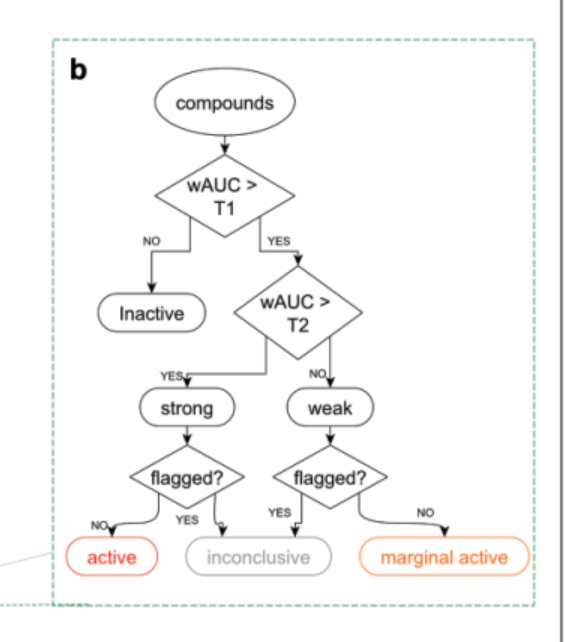

```{r 1setup, include=FALSE}
knitr::opts_chunk$set(echo = TRUE)
knitr::opts_chunk$set(warning = FALSE)
options(scipen = 9)
```

```{r 2libraries, include=FALSE}
library(knitr)
library(kableExtra)
library(gridExtra)
library(rlang)
library(Rcurvep)
library(DescTools)
library(data.table)
library(car)
library(lazyeval)
library(DT)
library(here)
library(future) 
library(future.apply) # from original future author
library(furrr) # use future.apply but similar to purrr package
library(tidyverse)
future::plan(multisession, workers = availableCores()) # windows, Mac needs multicore
source("Functions/cal_auc_simi_endpoints.R")
source("Functions/behavioural_endpoint_calc.R")
source("Functions/RCurveP_Data_Wrangling_Functions.R")
```


# Toxicology Behavioural Analysis Report

## Version Control
```{r 3version_control, comment="", class.source ='fold-hide'}
# - My Machine Info:
#   - R version 4.2.1 (2022-06-23)
#   - Platform: x86_64-pc-linux-gnu (64-bit)         5.11.0-34-generic / Ubuntu 22.04.1 LTS
#   - Desktop: GNOME 3.36.5
#   - Hardware: CPU - Intel Core i5-9400F 6 core 4.1GHz / RAM - 15924MiB
```

```{r 4_importing_dat, include=FALSE}
#They already have outliers removed
fishBehavDat <- read_csv(file = "Data/fishBehavDat.csv")
fishBehavDatBin5 <- read_csv(file = "Data/fishBehavDatBin5.csv")
fishBehavDatBinLD <- read_csv(file = "Data/fishBehavDatBinLD.csv")
```

```{r 8directory, include=FALSE}
dir <- paste0(getwd(), "/Data/All")
```

```{r 9directory_files_filenames, include=FALSE}
fileNames <- list.files("Data/Raw") #Get the name of each .csv file
chemicalNames <- str_split(string = fileNames, pattern = ".csv", simplify = TRUE)[,1] #Identify the chemicals included in the files
metaData <- read.csv(file = "Data/MetaData.csv") #Import the Meta Data that includes information about the data in the folders
#CAS is the Chemical Abstract Service, MOA is the Mode of Action. This table includes useful information about the exposure concentrations for each chemical dose in mg/L. We'll use this later to create our final data frame
#HighDose <- setNames(metaData[,6], chemicalNames) #subsetting metadata
doseData <- metaData %>%
  select(plate_id, Dose1:Control) %>%
  gather(key = Dose, value = "Dose_mg_L", Dose1:Control)
number_of_dose_groups_per_chem <- 6 # Set this to the number of dose groups you have (including control)
lowest_dose_treatment_group <- doseData %>%
    filter(Dose != "Control") %>%
    dplyr::summarize(lowest_dose_treatment_group = min(Dose_mg_L))
lowest_dose_treatment_group <- lowest_dose_treatment_group[1,][[1]]
```

```{r 1_remove_outlier_control_fish, include=FALSE}
# BoxPlotOutliers <- fishBehavDat %>%
#    filter(Dose == "Control") %>%
#    dplyr::group_by(plate_id, embryo_id) %>%
#    dplyr::summarise(cummulative_param = sum(get(params$value), na.rm = TRUE)) %>%
#    dplyr::group_by(plate_id) %>%
#    dplyr::summarise(Q1 = quantile(cummulative_param, 0.25),
#           Q3 = quantile(cummulative_param, 0.75),
#           IQR = IQR(cummulative_param),
#           cummulative_param = cummulative_param,
#           embryo_id = embryo_id) %>%
#    mutate(lower_limit = (Q1 - 1.5*IQR),
#           upper_limit = (Q3 + 1.5*IQR)) %>%
#    group_by(plate_id) %>%
#   mutate(z_score = (cummulative_param - mean(cummulative_param))/sd(cummulative_param)) %>%
#    mutate(outlier_iqr = if_else(condition = cummulative_param > (Q1 - 1.5*IQR) & cummulative_param < (Q3 + 1.5*IQR), true = FALSE, false = TRUE)) %>%
#    mutate(outlier_z = if_else(condition = z_score > 3, true = TRUE, false = FALSE))
# 
#  ggBoxPlotOutliers <- BoxPlotOutliers %>%
#    ggplot(data = ., mapping = aes(y = cummulative_param)) +
#    geom_boxplot() +
#    geom_label(inherit.aes = FALSE, x = 0, aes(y = cummulative_param, color = embryo_id, label = embryo_id)) +
#    geom_point(inherit.aes = FALSE, x = 0, aes(y = cummulative_param, color = embryo_id)) +
#    facet_wrap(~plate_id, scales = "free") +
#    theme_classic()

# BoxPlotOutliersRemove <- BoxPlotOutliers %>%
#   filter(outlier_iqr | outlier_z == TRUE) %>%
#   dplyr::summarise(plate_id = plate_id, embryo_id = embryo_id)
#
# print(ggBoxPlotOutliers)
#
#
# #Remove any outliers before data transmformation based off of the animal's cumulative paramater across the entire assay
# #fishBehavDat
# temp <- semi_join(fishBehavDat, BoxPlotOutliersRemove, by = c("plate_id", "embryo_id")) %>%
#   mutate(across(
#     .cols = c("inact","inadur",
#               "smlct","smldur","smldist","activedur",
#               "larct","lardur","lardist","totaldist"),
#     .fns = ~ replace(x = ., values = NA)
#   )) %>%
#   mutate(outliers = TRUE)
# temp2 <- anti_join(fishBehavDat, BoxPlotOutliersRemove, by = c("plate_id", "embryo_id"))
# fishBehavDat <- bind_rows(temp, temp2)
#
# #fishBehavDatBin5
# temp <- semi_join(fishBehavDatBin5, BoxPlotOutliersRemove, by = c("plate_id", "embryo_id")) %>%
#   mutate(across(
#     .cols = c("inact","inadur",
#               "smlct","smldur","smldist","activedur",
#               "larct","lardur","lardist","totaldist"),
#     .fns = ~ replace(x = ., values = NA)
#   )) %>%
#   mutate(outliers = TRUE)
# temp2 <- anti_join(fishBehavDatBin5, BoxPlotOutliersRemove, by = c("plate_id", "embryo_id"))
# fishBehavDatBin5 <- bind_rows(temp, temp2)
#
# #fishBehavDatBinLD
# temp <- semi_join(fishBehavDatBinLD, BoxPlotOutliersRemove, by = c("plate_id", "embryo_id")) %>%
#   mutate(across(
#     .cols = c("inact","inadur",
#               "smlct","smldur","smldist","activedur",
#               "larct","lardur","lardist","totaldist"),
#     .fns = ~ replace(x = ., values = NA)
#   )) %>%
#   mutate(outliers = TRUE)
# temp2 <- anti_join(fishBehavDatBinLD, BoxPlotOutliersRemove, by = c("plate_id", "embryo_id"))
# fishBehavDatBinLD <- bind_rows(temp, temp2)
```

```{r remove_control_fish, include=FALSE, eval=false}
p <- fishBehavDat %>%
  filter(Dose == "Control") %>%
  group_by(plate_id, embryo_id) %>%
  summarise(mean_totaldist = mean(totaldist, na.rm=TRUE)) %>%
  ungroup() %>%
  group_by(plate_id) %>%
  ggplot(aes(sample = mean_totaldist)) +
  geom_qq() +
  geom_qq_line() +
  facet_wrap(~ plate_id, scales = "free") +
  ylab("Sample") +
  xlab("Theoretical") +
  theme_classic() +
  ggtitle("QQ plots showing approximatey normal distributions for each Control fish for every experiment")

print(p)

library(outliers)

####Outliers####
grubbs.flag <- function(x) {
  outliers <- NULL
  test <- x
  grubbs.result <- grubbs.test(test)
  pv <- grubbs.result$p.value
  while(pv < 0.05) {
    outliers <- c(outliers,as.numeric(strsplit(grubbs.result$alternative," ")[[1]][3]))
    test <- x[!x %in% outliers]
    grubbs.result <- grubbs.test(test)
    pv <- grubbs.result$p.value
  }
  return(data.frame(mean_totaldist=x,Outlier=(x %in% outliers))) #Note mean_totaldist is baked into function
}

#Testing for Outliers...
embryo_id_join <- fishBehavDat %>%
  filter(Dose == "Control") %>%
  group_by(plate_id, embryo_id) %>%
  summarise(mean_totaldist = mean(totaldist, na.rm=TRUE),
            embryo_id = embryo_id) %>%
  unique() %>%
  ungroup() %>%
  group_by(plate_id) %>%
  mutate(mean_totaldist = round(mean_totaldist, digits = 3))

input_behavdata <- fishBehavDat %>%
  filter(Dose == "Control") %>%
  group_by(plate_id, embryo_id) %>%
  summarise(mean_totaldist = mean(totaldist, na.rm=TRUE),
            embryo_id = embryo_id) %>%
  unique() %>%
  ungroup() %>%
  group_by(plate_id) %>%
  mutate(mean_totaldist = round(mean_totaldist, digits = 3)) %>% #Bug with grubbs and large decimal places
  #filter(plate_id %in% c("BPA", "BPAF")) %>% #Testing with smaller data set
  nest()

grubbs_results <- input_behavdata %>%
  mutate(grubbs_results = map(data, ~grubbs.flag(x = .x[[2]])))

behavdata_join <- grubbs_results %>%
  dplyr::select(-data) %>%
  unnest(cols = c(grubbs_results)) %>%
  inner_join(embryo_id_join) %>%
  dplyr::select(-mean_totaldist)

#Outlier fish
outlier_control_fish <- data.frame(plate_id = behavdata_join$plate_id[which(behavdata_join$Outlier == TRUE)], embryo_id = behavdata_join$embryo_id[which(behavdata_join$Outlier == TRUE)], Outlier_control_fish = c(TRUE))

#Outliers removed (replacing the values with NA)
# Change the .cols argument to what ever endpoint you are turning into NAs
# #fishBehavDat
fishBehavDat <- fishBehavDat %>%
  dplyr::select(-Outlier, -outliers)
fishBehavDatBin5 <- fishBehavDatBin5 %>%
  dplyr::select(-Outlier, -outliers)
fishBehavDatBinLD <- fishBehavDatBinLD %>%
  dplyr::select(-Outlier, -outliers)

temp <- inner_join(fishBehavDat, behavdata_join, by = c("plate_id", "embryo_id")) %>%
  mutate(across(
    .cols = c("inact","inadur",
              "smlct","smldur","smldist","activedur",
              "larct","lardur","lardist","totaldist"),
    .fns = ~ replace(x = ., list = Outlier, values = NA)
  ))
temp2 <- anti_join(fishBehavDat, behavdata_join, by = c("plate_id", "embryo_id"))
fishBehavDat <- bind_rows(temp, temp2)

#_____________________________________________________________________________#

# #fishBehavDatBin5
#Outliers removed (replacing the values with NA)
# Change the .cols argument to what ever endpoint you are turning into NAs

temp <- inner_join(fishBehavDatBin5, behavdata_join, by = c("plate_id", "embryo_id")) %>%
  mutate(across(
    .cols = c("inact","inadur",
              "smlct","smldur","smldist","activedur",
              "larct","lardur","lardist","totaldist"),
    .fns = ~ replace(x = ., list = Outlier, values = NA)
  ))
temp2 <- anti_join(fishBehavDatBin5, behavdata_join, by = c("plate_id", "embryo_id"))
fishBehavDatBin5 <- bind_rows(temp, temp2)

#_____________________________________________________________________________#

# #fishBehavDatBinLD
#Outliers removed (replacing the values with NA)
# Change the .cols argument to what ever endpoint you are turning into NAs

temp <- inner_join(fishBehavDatBinLD, behavdata_join, by = c("plate_id", "embryo_id")) %>%
  mutate(across(
    .cols = c("inact","inadur",
              "smlct","smldur","smldist","activedur",
              "larct","lardur","lardist","totaldist"),
    .fns = ~ replace(x = ., list = Outlier, values = NA)
  ))
temp2 <- anti_join(fishBehavDatBinLD, behavdata_join, by = c("plate_id", "embryo_id"))
fishBehavDatBinLD <- bind_rows(temp, temp2)

```


## Analysis - Similarity Scores/Correlation coefficients


```{r 46.2pre_processing_4_pipeline, include=FALSE}
lfishBehavDat <- fishBehavDat %>%
  #filter(plate_id %in% c("BPAF", "BPA", "DES", "TGSH", "EE2")) %>%
  mutate(value = .[[params$value]], dose = Dose_mg_L) %>%
  filter(time_end > 20) %>% # For the analysis, we don't want the 20 minute acclimation period
  mutate(time_end = time_end-20) %>% # Display time 1-30 minutes
  select(plate_id, embryo_id, is_VC, time_end, value) %>%
  na.omit() # Pipeline is picky about the data frame
lfishBehavDat <- split(as.data.frame(lfishBehavDat), ~ plate_id) # Split into lists
# chemicalNames <- chemicalNames[-which(chemicalNames %in% c("BPAF", "24DMP"))]
```

Curvep is a heuristic algorithm for dose-response curve processing. It assumes monotonicity, but does not fit curve to observed responses (as isotonic regression). Instead, it minimizes the number of corrections that need to be made to restore monotonicity.
OR
CurveP assumes each dose–response curve has to exhibit monotonic behavior: increasing, decreasing, or flat (constant), and tries to find a minimal set of correctable test points to achieve that

Key parameters are 
	baseline noise threshold (-THR=) - points with smaller response are suppressed
	maximum allowed deviation from the  monotonicity (-MXDV=) - affects adjacent points
	range of response values (-RNG=) - can be negative (e.g., inhibition) or positive (e.g., agonism)
	
Curvep adjusts data points that violate monotonic concentration-response pattern and suppresses near-baseline noise using a user-defined
baseline noise threshold (AKA, MXDV)

The POD (BMD for similarity scores) is defined as the concentration at which the response exceeds the assay-dependent noise threshold and is calculated by linear interpolation between the two concentration points, where their range of response includes the noise threshold.

The wAUC is the product of the point of departure (POD) and the AUC, normalized by the test concentration range:

wAUC = (AUC/range of concentration)*POD

I propose: instead of flagging active chemicals with an ANOVA (because we are violating normality assumptions) we use an approach similar to the following (which the authors of the RcurveP package have done before):

   


CurveP’s major limitation is its tacit dependency on a given order of test concentrations. Those are treated as a predefined sequence of measurements, and in case of irregularly spaced test concentrations or changes in their number or range for different samples, the comparisons of resulting CurveP values will be biased. 

```{r 10Distribution_of_concentrations, echo=FALSE, message=FALSE, warning=FALSE}
qplot(x = log10(Dose_mg_L), data = fishBehavDat, xlab = "log10(Dose in mg/L)", ylab = "count", main = "Distribution of dose concentrations")
```

CurveP is biased towards those samples that fall under the log dose range of -5 (0.00001mg/L) to 1 (10mg/L).

Those chemicals that have dose range beyond this include:
- DMF (Highest 1000)
- TEG (Highest 100)
- EE2 (Lowest 0.0000001)

Therefore, I think that should be excluded from the training set.

The analysis pipeline included in this report was adapted from [Hsieh et al 2018](https://pubmed.ncbi.nlm.nih.gov/30321397/).\
\
The general workflow is to first, calculate similarity scores (Pearson's correlation coefficient/ Spearman's rank-order correlation coefficient) for observations, normalize data to the median of control group, then perform statistical analyses and post-hoc tests (ANCOVA, Dunnett's test). Data are noise-filtered using [Rcurvep package](https://github.com/moggces/Rcurvep) prior to model fitting. Finally, a benchmark dose (BMD) is estimated for each chemical after fitting the data to various dose-response models.\
\
RcurveP is a tunable, heuristic, and non-parametric noise-filtering algorithm that attempts to find the minimum number of corrections possible that would produce a monotonic dose-response relationship. RcurveP assumes that the dose-response relationship follows a monotonic behaviour (increasing, decreasing or flat) and attempts to find a set of minimally corrected response values that fit that behaviour ( [Sedykh A.](https://pubmed.ncbi.nlm.nih.gov/27518631/) ).\
Naturally, zebrafish behavioural data is complex and noisy. Normalization of transformed data is a preliminary step prior to RCurveP to help reduce the noise of the raw data within different plates/experiments.
\
Similarity endpoints are calculated by iteratively performing pairwise comparisons between chemical-treated fish across the duration of the experiment, and all of the chemically treated treated embryos (e.g. embryo_id Dose1_1 vs embryo_id Control_1, embryo_id Dose1_1 vs embryo_id Control_2, embryo_id Dose1_1 vs embryo_id Control_3... embryo_id Dose1_1 vs embryo_id Control_9). After nine iterations (Control group n = 9), the mean Pearson's correlation coefficient/Spearman's rank-order correlation coefficient is used as the similarity endpoint.\


```{r 46.1Visual_of_how_to_calculate_simi_enpoints, echo = FALSE}
p1 <- fishBehavDat %>%
  filter(plate_id == "BPA", time_end > 20, Dose == "Dose2") %>%
  mutate(time_end = time_end-20) %>%
  ggplot(aes(x = time_end, y = totaldist, color = embryo_id)) +
  geom_line() +
  geom_point()
p2 <- fishBehavDat %>%
  filter(plate_id == "BPA", time_end > 20, Dose == "Control") %>%
  mutate(time_end = time_end-20) %>%
  ggplot(aes(x = time_end, y = totaldist, color = embryo_id)) +
  geom_line() +
  geom_point() +
  scale_color_grey()

grid.arrange(p1, p2)
```

```{r 46.2Visual_of_how_to_calculate_simi_enpoints, echo = FALSE}
cor_dat <- fishBehavDat %>%
  dplyr::filter(plate_id == "BPA", time_end > 20, embryo_id %in% c("Dose2_1", "Control_1", "Control_2", "Control_3", "Control_4", "Control_5", "Control_6", "Control_7", "Control_8", "Control_9")) %>%
  dplyr::select(embryo_id, time_end, totaldist) %>%
  dplyr::arrange(embryo_id) %>%
  tidyr::pivot_wider(., names_from = "embryo_id", values_from = "totaldist") %>%
  dplyr::select(-time_end) %>%
  dplyr::summarize(cor = cor(x = as.matrix(.), method = "pearson", use = "pairwise.complete.obs"))
cor_dat <- as.data.frame(cor_dat[10,]) %>%
  round(., digits = 2)
cor_dat <- as_tibble(cor_dat[,1])

p1 <- fishBehavDat %>%
  filter(plate_id == "BPA", time_end > 20, Dose %in% c("Dose2", "Control"), embryo_id %in% c("Dose2_1", "Control_1")) %>%
  mutate(time_end = time_end-20) %>%
  ggplot(aes(x = time_end, y = totaldist, color = embryo_id)) +
  geom_line() +
  geom_point() +
  scale_color_manual(values=c("#444444", "#F8766D")) +
  geom_text(label = paste("Pearson's r = ", as.character(cor_dat$Control_1)), mapping = aes(x = 10, y = 100), inherit.aes = FALSE)

p2 <- fishBehavDat %>%
  filter(plate_id == "BPA", time_end > 20, Dose %in% c("Dose2", "Control"), embryo_id %in% c("Dose2_1", "Control_9")) %>%
  mutate(time_end = time_end-20) %>%
  ggplot(aes(x = time_end, y = totaldist, color = embryo_id)) +
  geom_line() +
  geom_point() +
  scale_color_manual(values=c("#c9c9c9", "#F8766D")) +
  geom_text(label = paste("Pearson's r = ", as.character(cor_dat$Control_9)), mapping = aes(x = 10, y = 100), inherit.aes = FALSE)

grid.arrange(p1, p2)
```

```{r 46.3Visual_of_how_to_calculate_simi_enpoints, echo = FALSE}
cor_dat_long <- cor_dat %>%
  select(-Dose2_1) %>%
  pivot_longer(cols = 1:9,names_to = "embryo_id", values_to = "totaldist")
mean_cor_dat <- mean(cor_dat_long$totaldist)

cor_dat_long %>%
  ggplot(mapping = aes(x = "Dose2_1", y = totaldist)) +
  geom_point() +
  geom_point(aes(y = mean_cor_dat), color = "blue", size = 3) +
  xlab("embryo_id") +
  ylab("Pearson's r")
```


```{r 47simi_endpoints_pearson, include = FALSE}
simi_endps_pearson <- list(seq(1, 30, by = 1)) #Segments - One per minute
names(simi_endps_pearson) <- "pearson"
simi_endpoints_nobin_pearson <- list()
for (i in chemicalNames) {
  temp <-
    create_simi_endpoints(lfishBehavDat[[i]],
                          segments = simi_endps_pearson,
                          metric = "pearson")
  simi_endpoints_nobin_pearson[[i]] <- temp[[1]]
  rm(temp)
}
```

Responses on each plate are normalized using the following equation: `Response = (Vchemical/Vvehicle_control)*100-100`, where Vchemical is the response of the chemical-treated embryo, Vvehicle_control is the median value of the response of the internal plate control embryos. Therefore, response approaching zero 0 from chemical-treated embryos decrease the similarity of their movements when compared to the control embryos. Response greater than 0 increase their similarity to the vehicle control embryos.\
Similarity scores below zero (before normalization) are reset to 0.\
For this reason, it makes the most sense to use a negative direction for the BMD calculation.\
<!-- It may also make sense to filter only chemicals that induce dissimilar movement patterns when compared to the vehicle control for the benchmark concentration analysis. -->


```{r 48normalized_data_pearson, include=FALSE}
simi_norm_nobin_pearson <- lapply(simi_endpoints_nobin_pearson, simi_normalize)
```

```{r 49summary_statistics_pearson, include=FALSE}
for(i in chemicalNames) {
  simi_norm_nobin_pearson[[i]]$dose <- as.factor(simi_norm_nobin_pearson[[i]]$dose)
  simi_norm_nobin_pearson[[i]][, "Group"] = factor(rep(c("A", "B", "C"), length.out = nrow(simi_norm_nobin_pearson[[i]])))
} # Adding Group column and factoring dose variable
#Obtaining Summary Statistics
summarystats_list_nobin_pearson <- lapply(simi_norm_nobin_pearson, summarystats)
```


#### ANCOVA

```{r 49.2_Removing_Outliers, include=FALSE}
temp_pearson <-
  plyr::ldply(simi_norm_nobin_pearson) %>% #Convert from list to tibble
  mutate(.id = NULL)

#### Testing for Normal Distribution
temp_pearson %>%
  group_by(plate_id) %>%
  ggplot(aes(sample = endpoint_value_norm)) +
  geom_qq() +
  geom_qq_line() +
  facet_wrap(~ plate_id, scales = "free") +
  ylab("Sample") +
  xlab("Theoretical") +
  theme_classic() +
  ggtitle("QQ plots showing approximatey normal distributions for each experiment after outlier removal")
# Data are approximately normally distributed. Thus violating an assumption of ANCOVA


#### Testing for Homogeneity of Variance
# Homogeneity of variance test -- of totaldistance
LeveneResults <- temp_pearson %>%
  group_by(plate_id) %>%
  summarise(car::leveneTest(endpoint_value_norm, as.factor(dose)))
#Adding an is.significant column to easily parse significant values in a spreadsheet
LeveneResults <- LeveneResults %>%
  na.omit() %>%
  mutate(is.significant = if_else(
    condition = `Pr(>F)` < 0.05,
    true = TRUE,
    false = FALSE
  ))
DT::datatable(LeveneResults)
#Variance is homogeneous across groups
#Therefore ANOVA nand Dunnett's test are appropriate


# temp_pearson <- temp_pearson %>%
#   group_by(plate_id, dose) %>%
#   mutate(Q1 = quantile(endpoint_value_norm, 0.25), Q3 = quantile(endpoint_value_norm, 0.75)) %>%
#   mutate(IQR = IQR(endpoint_value_norm)) %>%
#   mutate(outlier = if_else(condition = endpoint_value_norm > (Q1 - 1.5*IQR) & endpoint_value_norm < (Q3 + 1.5*IQR), true = FALSE, false = TRUE)) %>%
#   mutate(lower_limit = (Q1 - 1.5*IQR),
#          upper_limit = (Q3 + 1.5*IQR))

# outliers_pearson <- temp_pearson %>%
#   filter(outlier == TRUE) %>%
#   ungroup()
# 
# temp_pearson <- temp_pearson %>%
#   anti_join(outliers_pearson)


# #### Testing for Normal Distribution after removing outliers
# qqnorm(temp_pearson$endpoint_value_norm)
# qqline(temp_pearson$endpoint_value_norm)
# shapiro.test(temp_pearson$endpoint_value_norm)
# # Data are not normally distributed. Thus violating an assumption of ANCOVA


# simi_norm_nobin_pearson <- temp_pearson %>%
#   group_by(plate_id) %>%
#   group_split(.keep = FALSE) %>%
#   setNames(chemicalNames)
```

```{r Checking_For_Group_Effects, include=FALSE, eval=FALSE}
#One-way ANOVA to test for repliacte subgroup effect
anova_group_eff_test <- temp_pearson %>%
  group_by(plate_id, dose) %>%
  nest() %>%
  mutate(model = map(data, ~ aov(
    endpoint_value_norm ~ as.factor(Group),
    data = .
  ))) %>%
  mutate(tidy_aov = map(model, ~ broom::tidy(x = .x)))

#Adjust P values
anova_group_eff_adj_p <- anova_group_eff_test %>%
  dplyr::select(plate_id, dose, tidy_aov) %>%
  unnest(tidy_aov) %>%
  filter(term == "as.factor(Group)") %>%
  ungroup() %>%
  mutate(adj.p.value = p.adjust(p = p.value, method = "BH")) %>%
  group_by(plate_id, dose)

#Further analysis is not necessary because there are no significant sub-group effects
```

```{r 50ANCOVA_pearson, include=FALSE}
anova_list_nobin_pearson <- sapply(simi_norm_nobin_pearson, combinedanova)

anova_comb_nobin_pearson <- as_tibble(plyr::ldply(anova_list_nobin_pearson))
anova_comb_nobin_pearson <- anova_comb_nobin_pearson %>%
  na.omit() %>%
  mutate(`Pr(>F)` = p.adjust(`Pr(>F)`, method = "fdr")) %>%
  mutate(is.significant = if_else(
    condition = `Pr(>F)` < 0.05,
    true = TRUE,
    false = FALSE
  ), endpoint = "pearson")
```

```{r 50.2ANCOVA_Results_Summary, echo = FALSE}
anova_comb_nobin_pearson %>%
  select(.id, Df, `F value`, `Pr(>F)`, endpoint) %>%
  kable(
    col.names = c("Chemical", "Degrees of Freedom", "F-Value", "P-value", "Endpoint"),
    align = 'llrrr',
    caption = "Table 6. Summary table of ANOVA results from the `pearson` endpoint after pooling sub-groups"
  ) %>%
  kable_styling()
```


#### Dunnett's Test

```{r 51Dunnett_pearson, include=FALSE}
set.seed(024)
dunnett_list_nobin_pearson <- sapply(simi_norm_nobin_pearson, combineddunnett) %>%
  setNames(., chemicalNames) %>%
  as.array()
#Dunnett's Test requires a bunch of wrangling
dunnett_temp <-
  list() #Take Dunnett's test results without any of the fancy summary information and shove it into a named list
for (i in chemicalNames) {
  # dunnett_list_nobin_pearson[[i]][,"pval"] <- p.adjust(dunnett_list_nobin_pearson[[i]][,"pval"], method = "fdr")

  dunnett_temp[[names(dunnett_list_nobin_pearson[i])]] <-
    dunnett_list_nobin_pearson[[i]] %>% as.data.frame() %>% rownames_to_column(var = "dose") #Coerce to a data frame temporarily so what we can take the row names of the reults and turn them into a variable with rownames_to_column
}
dunnett_comb_nobin_pearson <-
  plyr::ldply(dunnett_temp) #this function combines all of the lists together and gives them a variable name according to the chemical
dunnett_comb_nobin_pearson$dose = substr(dunnett_comb_nobin_pearson$dose,
                           start = 1,
                           stop = nchar(dunnett_comb_nobin_pearson$dose) - 8) #Here we are fixing the dose column... the dose column has the test dose related to the control... but we just want to see what the test dose is without it giving us redundant information about the comparison to the control for every observation...
dunnett_comb_nobin_pearson <- as_tibble(dunnett_comb_nobin_pearson)
dunnett_comb_nobin_pearson <- dunnett_comb_nobin_pearson %>%
  na.omit() %>%
  mutate(pval = p.adjust(pval, method = "fdr")) %>%
  mutate(is.significant = if_else(
    condition = pval < 0.05,
    true = TRUE,
    false = FALSE
  ), endpoint = "pearson")
```

```{r 52.2Dunnett_results_summary, echo=FALSE}
dunnett_comb_nobin_pearson %>%
  select(.id, dose, diff, pval, endpoint) %>%
  kable(
    col.names = c("Chemical", "Dose", "Difference in similarity score (+/- 100)", "P-value", "Endpoint"),
    align = 'llcr',
    caption = "Table 7. Summary table of Dunnett's test results from the `totaldist` variable"
  ) %>%
  kable_styling()
```

\

```{r 53normalized_data_to_tibble_pearson, include=FALSE}
doseData <- doseData %>%
  mutate(dose = Dose) #Renaming dose variable to inner_join

simi_norm_tib_pearson <-
  plyr::ldply(simi_norm_nobin_pearson) #Convert from list to tibble
  #rename(plate_id = .id)

simi_norm_tib_pearson <- simi_norm_tib_pearson %>%
  inner_join(doseData, by = c("plate_id", "dose")) %>%
  mutate(is_VC = as.integer(is_VC)) %>%
  select(plate_id,
         dose,
         Dose_mg_L,
         is_VC,
         endpoint,
         endpoint_value_norm)
```


```{r 54normalized_data_ggplot, include=FALSE, message=FALSE, warning=FALSE, fig.align='center', fig.cap="Figure 16. Dose response relationship of normalized pearson's similarity scores from 26 different chemicals -- `totaldsit` variable", fig.width=10, fig.height=7.5, out.height="100%", out.width="125%"}
Dunnett_results <- dunnett_comb_nobin_pearson %>%
  rename(plate_id = .id) %>%
  mutate(dose = str_split(string = dose, pattern = "-", simplify = TRUE)[,1])

ANOVA_results <- anova_comb_nobin_pearson %>%
  rename(plate_id = .id) %>%
  filter(Df == 5) %>%
  mutate(ANOVA_is_sig = is.significant)
  

p_pearson <- simi_norm_tib_pearson %>%
  full_join(Dunnett_results, by = c("plate_id", "dose", "endpoint")) %>%
  dplyr::summarise(plate_id = plate_id, 
            endpoint = endpoint,
            dose = dose,
            endpoint_value_norm = endpoint_value_norm,
            pval = pval) %>%
  inner_join(ANOVA_results, by = c("plate_id", "endpoint")) %>%
  mutate(dose = factor(
    dose,
    levels = c("Control", "Dose5", "Dose4", "Dose3", "Dose2", "Dose1"),
    ordered = TRUE
  )) %>%
  group_by(plate_id, dose) %>%
  dplyr::summarise(dose = dose,
            endpoint_value_norm = endpoint_value_norm,
            pval = pval,
            ANOVA_is_sig = ANOVA_is_sig,
            `Pr(>F)` = `Pr(>F)`) %>%
  mutate(pval = if_else(condition = is.na(pval), true = 1, false = pval)) %>%
  na.omit() %>%
  ggplot(aes(x = dose, y = endpoint_value_norm, group = 1)) +
  geom_boxplot(
    aes(x = dose, y = endpoint_value_norm, group = dose, color = ANOVA_is_sig),
    outlier.shape = NA,
    width = 0.5
  ) +
  # geom_jitter(position = position_jitter(width = 0.2,
  #                                        height = 0, seed = 42069),
  #             colour = "black") +
  geom_jitter(position = position_jitter(
    width = 0.2,
    height = 0,
    seed = 42069
  ),
  size = 0.5) +
  geom_text(
      aes(
        label = if_else(
          condition = pval > 0.1,
          true = "",
          false = if_else(
            condition = pval <= 0.1 &
              pval > 0.05,
            true = "",
            if_else(
              condition = pval <= 0.05 &
                pval > 0.01,
              true = "*",
              false = if_else(
                condition = pval <= 0.01 &
                  pval > 0.001,
                true = "**",
                false = if_else(pval <= 0.001 &
                                  pval >= 0, true = "***", false = "")
              )
            )
          )
        ),
        group = dose,
        y = max(endpoint_value_norm) + 10
      ),
      position = position_dodge(width = 0.9),
      color = "black",
      size = 3.75
    ) +
  # geom_smooth(se = FALSE) +
  labs(x = "Dose (mg/L)", y = "Response") +
  theme_classic() +
  theme(axis.text.x = element_text(angle = 90, vjust = 0.5)) +
  facet_wrap( ~ plate_id, strip.position = "top") +
  theme(strip.background = element_blank(),
        panel.background = element_blank()) +
  ylim(-100, 100)

p_both_endpoints <- list(p_pearson)
names(p_both_endpoints) <- c("pearson")
```

#### Boxplots by endpoint {.tabset}
```{r 54.1meantotaldist_BinnedDat, echo = FALSE, results = 'asis', warning=FALSE, message=FALSE, fig.height=9, fig.width=14}
for (i in seq_along(p_both_endpoints)){
  temp <- p_both_endpoints[[i]]
  cat("#####", names(p_both_endpoints)[i], " \n")
  print(temp)
  cat(' \n\n')
}
```

```{r save_image, echo=FALSE}
ggsave(
  plot = p_both_endpoints$pearson,
  filename = "Output/ANCOVA_Dunnetts_pearson.png",
  device = "png",
  scale = 3,
  units = "px",
  width = 1920,
  height = 1080
)
```

#### {-}

## Similarity Scores/Correlation coefficients

### Benchmark Dose

```{r 55.1prep_4_rcurvep, include=FALSE}

simi_norm_tib_4rcurvep_pearson <- simi_norm_tib_pearson %>%
  rename(resp = endpoint_value_norm,
         chemical = plate_id) %>%
  #filter(is_VC == 0) %>%
  mutate(Dose_mg_L = Dose_mg_L/lowest_dose_treatment_group[[1]]) %>%
  mutate(conc = log10(Dose_mg_L)) %>%
  group_by(chemical, endpoint) %>%
  mutate(control_conc = max(conc)-5) %>% #making sure there are no infinite values for conncentrations. Controls are made to be 1 dose group down from the lowest concentration
  mutate(conc = if_else(condition = conc == -Inf, true = control_conc, false = conc)) %>%
  select(endpoint, chemical, conc, resp)
```

Since we do not know what the benchmark response is for each one of the chemicals, a method will be used that can estimate a benchmark response (empirically) when given a large enough set of data. The RcurveP package includes an automated process to select an appropriate BMR based off of the data. From Hsieh et al. 2019 manuscript: "The pooled variance of potency of all chemicals per [threshold value (i.e. 5 through 99)] was calculated. The BMR was considered as the [threshold value] at which the potency variance was sufficiently reduced and was the lowest threshold that potency variance was stabilized". AKA, "the lowest threshold (which gives the highest potency), at which a decrease of variance in potency estimation is stabilized"

```{r 55.1Clear_Memory, include=FALSE}
rm(
  p_pearson,
  p_pearson,
  ANCOVA_results,
  Dunnett_results,
  Nobin_dunnet_results_both_endpoints,
  dunnett_comb_nobin_pearson,
  ancova_summary_both_endpoints,
  ancova_comb_nobin_pearson,
  ancova_comb_nobin_pearson,
  temp_pearson,
  temp_pearson,
  outliers_pearson,
  outliers,
  pearson,
  summarystats_list_nobin_pearson,
  summarystats_list_nobin_pearson,
  simi_endpoints_nobin_pearson,
  simi_endpoints_nobin_pearson,
  cor_dat_long,
  p1,
  p2,
  cor_dat,
  temp,
  temp2,
  simi_norm_nobin_pearson,
  simi_endpoints_nobin_pearson,
  p_both_endpoints,
  outliers_pearson,
  outliers_pearson,
  ggBoxPlotOutliers,
  filter_out,
  dunnett_temp,
  dunnett_list_nobin_pearson,
  dunnett_comb_nobin_pearson,
  dunnett_list_nobin_pearson,
  BoxPlotOutliers,
  BoxPlotOutliersRemove,
  ancova_list_nobin_pearson,
  ancova_list_nobin_pearson,
  fishBehavDat,
  fishBehavDatBin5,
  fishBehavDatBinLD,
  lfishBehavDat,
  simi_norm_tib_pearson
)
gc(reset=TRUE, full = TRUE)
```

```{r saveObjects, include=FALSE}
saveRDS(object = simi_norm_tib_4rcurvep_pearson, file = paste0("Data/", "simi_norm_tib_4rcurvep_pearson.rds"))
```