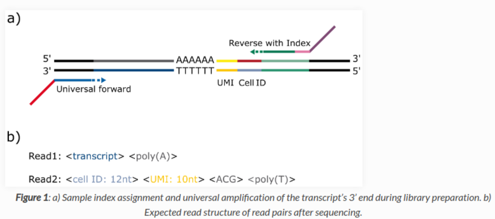
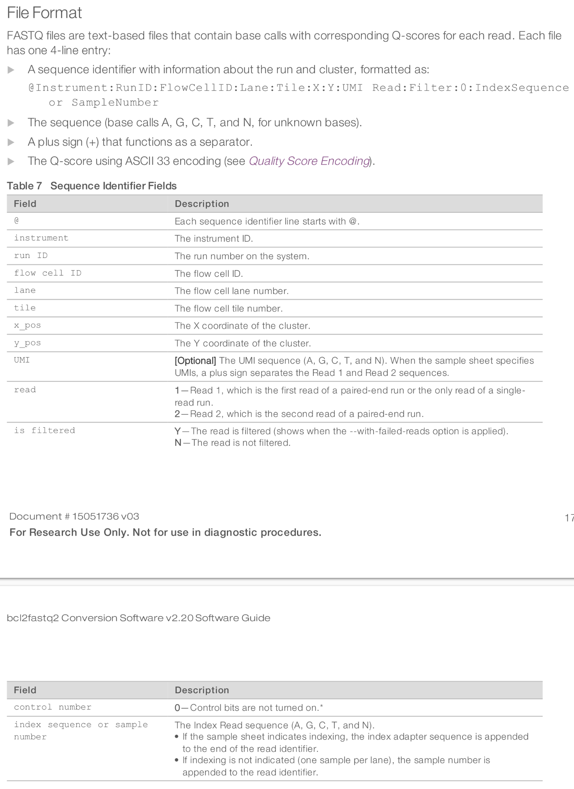
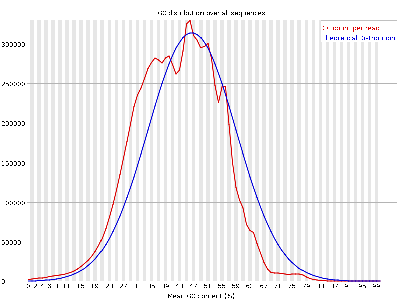
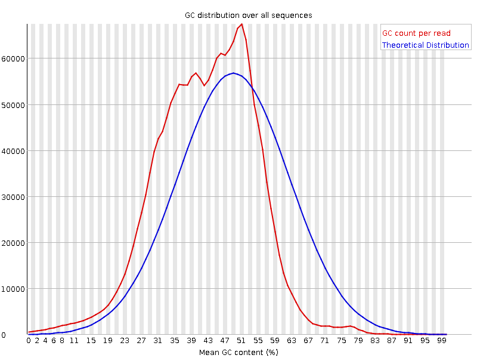
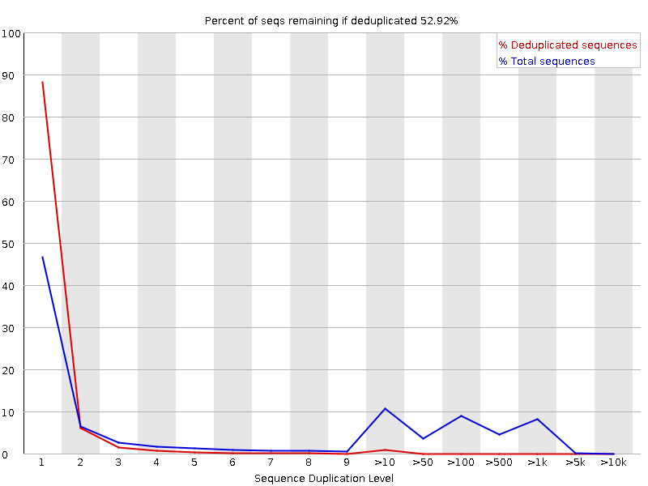
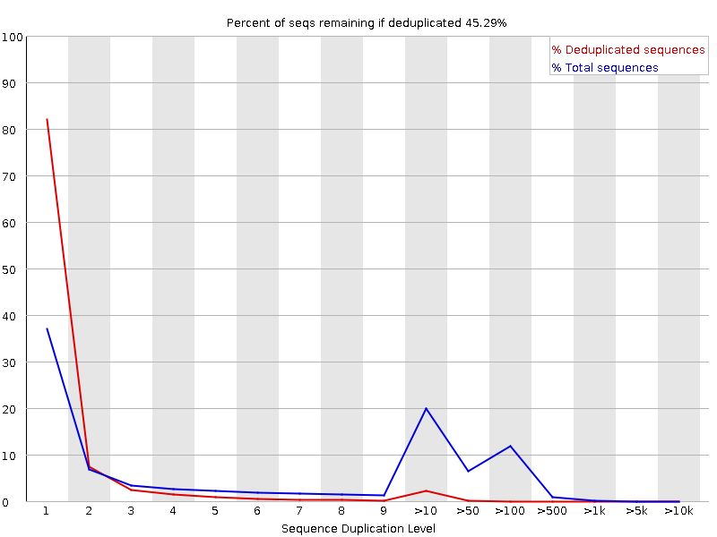

```{r 1setup, include=FALSE}
knitr::opts_chunk$set(echo = TRUE)
options(scipen = 9)
```

```{r, include=FALSE}
library(rlang)
library(tidyverse)
library(knitr)
```


## RNA Quality/Quantity

- RIN/RIS Numbers
- amount of total RNA?

## Library Preparation

- QiaSeq 3' UPX
- Qiagen's new kit???
- Sequencing depth? (Samples per lane - different sequencing techniques provide higher or lower read counts)
- Paired end or single end sequencing?

## Checking our data

```{bash check for paired end, echo = TRUE}
cd ~/MastersBackup/Data/RAW_Qiagen_Data_1_Sept_2021/QNS30480_JasonOBrien_FASTQ
# The output of this should read out both 1 and 2 in the output if paired end, and 
grep --max-count=10000 -P "^@" *.fastq | grep -oP "\s\d+" | sort | uniq -c
```
We use paired-end sequencing with two reads per sample.\
\
Read one has a length of 100bp\
Read two has a length of 27bp\
\
\
Qiagen explains visually what each read file should contain\


Here is a glimpse of what the transcripts (read 1) look like
```{bash fastq reads, echo = FALSE}
head -8 ~/MastersBackup/Data/RAW_Qiagen_Data_1_Sept_2021/QNS30480_JasonOBrien_FASTQ/30480-001_C1_R1.fastq
```
read1 is 100bp long

Here is a glimpse of what the Cell ID & UMIs look like (read 2)
```{bash read2 glimpse, echo = FALSE}
head -8 ~/MastersBackup/Data/RAW_Qiagen_Data_1_Sept_2021/QNS30480_JasonOBrien_FASTQ/30480-001_C1_R2.fastq
```
We can see that Line 1 has some meta information about the transcript (read1),
Line 2 has the 100bp sequence
Line 3 is a seperator (+)
Line 4 are the Quality scores for the base calls
\
Note: 
- read2 only has a sequencing length of 17bp when it should have 27
- The UMI has been omitted from the FASTQ files
\
Qiagen uses `bcl2fastq2 software (Illumina inc.)` for converting raw base calling data into FASTQ files after de-multiplexing.\
From the bcl2fastq2 software manual\
\

Note that the `UMI` field is also missing from read1
\
\
From Qiagen:\
"In short, the reads are annotated with their UMI and are then trimmed for poly(A) and adapter sequences, minimum reads length (15 nucleotides), read quality, and ambiguous nucleotides (maximum of 2). They are then deduplicated using their UMI."
\
"Reads are grouped into UMI groups when they: 
- (1) start at the same position based on the end of the read to which the UMI is ligated (i.e., Read2 for paired data), 
- (2) are from the same strand, and 
- (3) have identical UMIs. 
Groups that contain only one read (singletons) are merged into non-singleton groups if the singleton’s UMI can be converted to a UMI of a non-singleton group by introducing an SNP (the biggest group is chosen)."\
\
The FASTQ files are then aligned and mapped to the danio rerio genome GRCz11... [Ensemble](https://www.ensembl.org/info/data/ftp/index.html?redirect=no).\
To align and map yourself you would use the [soft-masked primary assembly reference genome (.fasta)](http://ftp.ensembl.org/pub/release-107/fasta/danio_rerio/dna/Danio_rerio.GRCz11.dna_sm.primary_assembly.fa.gz), and the [gene transfer format (.gtf) file](http://ftp.ensembl.org/pub/release-107/gtf/danio_rerio/Danio_rerio.GRCz11.107.gtf.gz)\
\
\
Qiagen used `‘Empirical analysis of DGE’ algorithm of the CLC Genomics Workbench 21.0.4 ` for DGE analysis. it is an implementation of the 'Exact Test' for two-group comparisons from the `EdgeR Bioconductor` package\
\
We will use Deseq2\
\

The FastQ files we have are previously Filtered & Trimmed:

1. Round 1
    + Remove adapter sequences:
    + polyA + CGT (AAAAAAAAAACGT) for read1, 
      + when the adapter is found, trim the 3' end
      + when no adapter, keep the read
    + Score
    + ACG + PolyT (ACGTTTT) for read2,
      + when adapter is found, keep the 3' end
      + when no adapter, keep the read
    + Score
    + Remove sequences shorter than 15 nucleotides
2. Round 2
    + Removal of homopolymer AG sequences
      + at read 3' when 9 nucleotides in a window of length 10 are homoploymer
    + Remove any sequences left with less than 15 nucleotides
3. Round 3: 
    + Remove low quality sequences (probability of error limit @ 0.05 or ~Q-score of 13) [Q-scores](http://drive5.com/usearch/manual/quality_score.html)
    + Remove ambiguous nucleotides: maximal 2 nucleotides allowed
    + Remove any sequences left that are less than 15 nucleotides

Reports for the filtering results are available in a sample-by-sample .pdf format supplied by qiagen... or
\
I have run the fastq files through FastQC and generated html reports for each sample.
\
\
```{r FastQC_Summary1, echo=FALSE}
summary <- read.delim(file = "~/MastersBackup/Data/RAW_Qiagen_Data_1_Sept_2021/QNS30480_JasonOBrien_FASTQ/FastQc_Report/mergedfile.txt", header= FALSE) %>%
  mutate(Lane = str_split(string = V3, pattern = "_", simplify = TRUE)[,1], Sample = str_split(string = V3, pattern = "_", simplify = TRUE)[,2], Read = str_split(string = V3, pattern = "_", simplify = TRUE)[,3]) %>%
  setNames(., c("QC_result", "Paramater", "File", "Lane", "Sample", "Read")) %>%
  mutate(Lane = str_split(string = Lane, pattern = "-", simplify = TRUE)[,2])

kable1 <- summary %>%
  group_by(QC_result) %>%
  tally()

kable(kable1, caption = "Distribution of QC Results")
```

```{r FastQC_Summary2, echo=FALSE}
kable2 <- summary %>%
  filter(QC_result == "FAIL") %>%
  group_by(Paramater) %>%
  tally()

kable(kable2, caption = "Most common paramaters to cause FastQC to flag as `FAIL`")
```
  
Here we can seee that of all of the results that came up as a failure to pass the QC thresholds, the most common-to-fail test was the `Per base sequence content`, with `Per base sequence quality`, and `Per base sequence GC content` comin in second and third respectively.\
\
Keep in mind that there are 90 samples, and 2 reads for each. so the maximum number of failures possible is 180.
### `Per base sequence content` example: `PASS` vs `FAIL`\
PASS:
N/A
FAIL:

All samples failed to pass this quality filter.


### `Per base sequence quality` example: `PASS` vs `FAIL`\
```{r fastQC_summary3, echo=FALSE}
kable3 <- summary %>%
  filter(QC_result == "FAIL", Paramater == "Per base sequence quality") %>%
  group_by(Read) %>%
  tally()

kable(kable3, caption = "Closer look at `Per base sequence quality` FAILs show only read2s fail to pass QC based on PHRED/Q scores")
```

PASS:

FAIL:


### `Per sequence GC content` example: PASS vs FAIL
```{r FastQc_Summary4, echo = FALSE}
kable4 <- summary %>%
  filter(Paramater == "Per sequence GC content", QC_result == "FAIL") %>%
  group_by(Read) %>%
  tally()
kable(kable4, caption = "# of FAILS in the per sequence GC content paramater summarised by read #")
```
Almost all 62/90 samples failed the GC content quality control test

PASS:

FAIL:


### `Sequence Duplication Levels` examples: PASS vs FAIL
```{r FastQC_summary5, echo = FALSE}
kable5 <- summary %>%
  filter(Paramater == "Sequence Duplication Levels", QC_result == "FAIL") %>%
  group_by(Read, Sample) %>%
  tally()
kable(kable5, caption = "Sequence duplication level FAILs summarized by sample and Read")
```
Only Read1s failed to pass this parameter. And only 12/90 samples failed this QC paramater

PASS:


FAIL:
