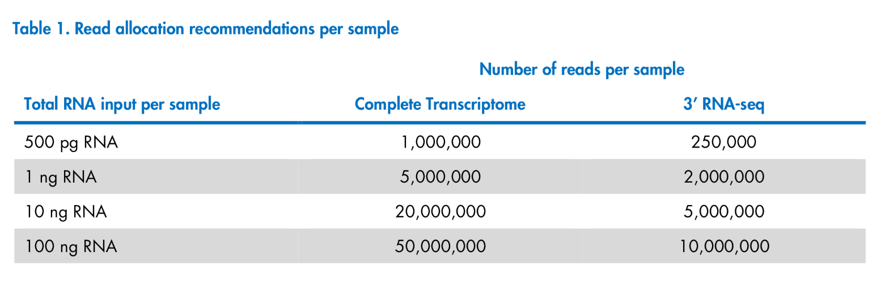
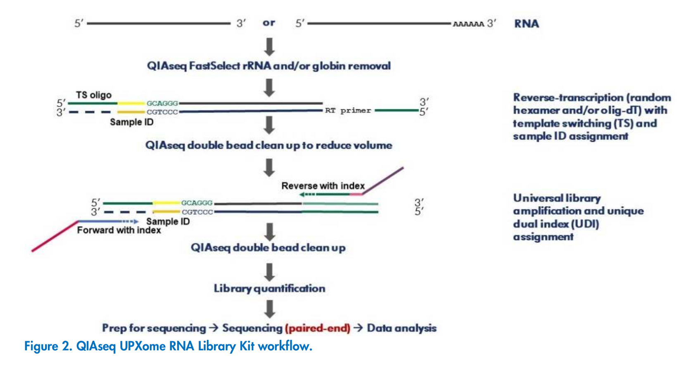
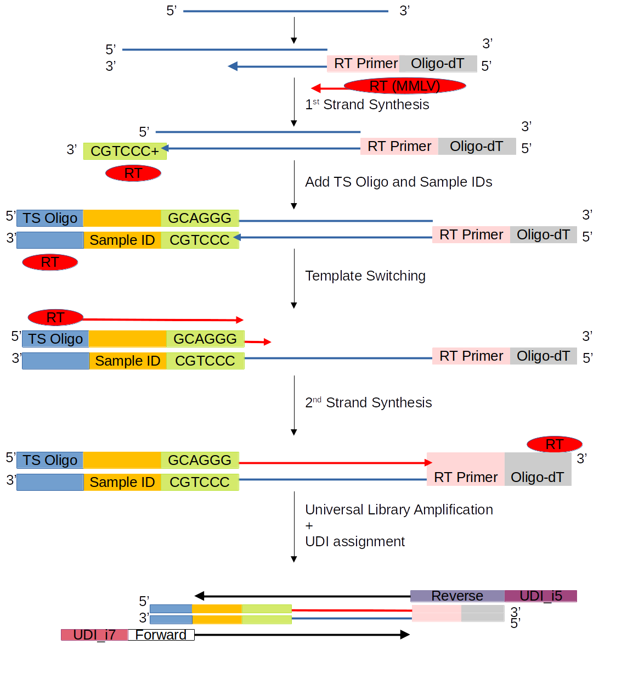
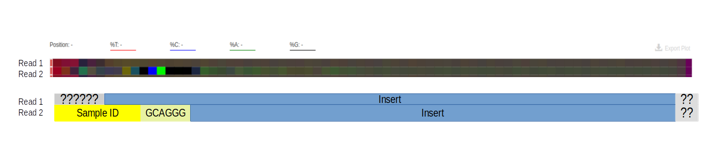

```{r 1setup, include=FALSE}
knitr::opts_chunk$set(echo = TRUE)
knitr::opts_chunk$set(engine.opts = list(bash = "-l"))
options(scipen = 9)
```

```{r, warning=FALSE, message=FALSE, include=FALSE}
library(tidyverse)
library(DT)
```


## Notes

### QIASeq UPXome RNA Library Manual Notes

* Inclusion of QIAseq FastSelect in the workflow enables rapid and efficient removal of
ribosomal RNA (rRNA) during the preparation of the NGS RNA library -- increases the number of usable reads during
sequencing
* Library Indexes (Unique dual-index) are 10-bases long





* Qiagen recommends 20 million reads per sample for complete transcriptome sequencing... (We sent 10ng RNA samples)
* Qiagen says ideally, RINs should be at or above 8
  * Our sample RINs were on average around 7


* During reverse transcription, a unique sample ID (10 bases) is incorporated into each transcript
* "For standard expression analysis, 74 bp paired-end sequencing with dual 10 bp indexes should be used" --  So reads should be 74bp
* Read1
  * 74bp = 74bp Insert
* Read2
  * 74bp = 10bp Sample_IDs + 6bp Hexamer (leftover from TS mechanism) + 58bp Insert





* Sam provided this description of what the library structure looks like (before adapter trimming):
  * CTACACGACGCTCTTCCGATCT[22bp]--[Insert]--CCCTGC[6bp]--[10bpID]--AGATCGGAAGAGCACACGTCTG[22bp]


Our Sequences had a per-base sequence-read structure as follows:




Note: The fastq files we have, are already demultiplexed into their respective pools by UDI... The UDIs are contained in the headers of the fastq files (I will prove this later in the notebook). The sample IDs are still contained in the Read2s for each set of paired-end fastq files.

Therefore, the reads can be demultiplexed further by Sample_ID

### Demultiplex Workflow

```{bash, eval=FALSE}
#!/bin/bash

# Put this file into a directory that contains a read1 and read2 .fastq.gz
READ1=*R1_001.fastq.gz
READ2=*R2_001.fastq.gz
~/anaconda3/bin/demultiplex demux -r -e 10 ~/MastersBackup/Data/Qiaseq_UPXome_Whole_transcriptome_results/Compressed_Fastq_Files/Sample_IDs.tsv $READ2 $READ1
```


```{bash, eval=FALSE}
# First, make sure there are only the un-demultiplexed read 1 and read 2 files present in directory & the small `demultiplex_script.sh`
# cd ~/MastersBackup/Data/Qiaseq_UPXome_Whole_transcriptome_results/Compressed_Fastq_Files/Demultiplexed_Fastq_Files

search_dir=~/MastersBackup/Data/Qiaseq_UPXome_Whole_transcriptome_results/Compressed_Fastq_Files/Demultiplexed_Fastq_Files
for entry in "$search_dir"*/*/*/
do
cd $entry
bash demultiplex_script.sh
done

# This little script takes a long time to run! I recommend doing it overnight. Took me ~15 hours
# This script also leaves behind the original pooled files!
```

```{bash, eval=FALSE}
# To delete the leftover fastq.gz files in each directory just run this chunk of code in bash

search_dir=~/MastersBackup/Data/Qiaseq_UPXome_Whole_transcriptome_results/Compressed_Fastq_Files/Demultiplexed_Fastq_Files
for orig_files in "$search_dir"*/*/*/*_001.fastq.gz
do
rm $orig_files
done
```

```{bash, eval=FALSE}

# Perform fastqc on all of the fastq.gz files in a (this) directory

search_dir=~/MastersBackup/Data/Qiaseq_UPXome_Whole_transcriptome_results/Compressed_Fastq_Files/Demultiplexed_Fastq_Files
for entry in "$search_dir"*/*/*/
do
cd $entry
bash fastqc_whole_dir.sh
done


```

```{bash, eval=FALSE}

# Extract all of the zipped fastqc files in each directory

search_dir=~/MastersBackup/Data/Qiaseq_UPXome_Whole_transcriptome_results/Compressed_Fastq_Files/Demultiplexed_Fastq_Files
for entry in "$search_dir"*/*/*/Fastqc/
do
cd $entry
unzip -o \*.zip
done
```

```{r, include=FALSE, eval=FALSE}

# R script to read the first 10 lines of all of the `fastqc_data.txt` files
# Navigate to the directory of folder containing the `fastqc_data.txt` files in subdirectories
  # Example: ~/MastersBackup/Data/Qiaseq_UPXome_Whole_transcriptome_results/Compressed_Fastq_Files/Demultiplexed_Fastq_Files/

fastqc_data <- list.files(path = "~/MastersBackup/Data/Qiaseq_UPXome_Whole_transcriptome_results/Compressed_Fastq_Files/Demultiplexed_Fastq_Files/", recursive = TRUE, pattern = "fastqc_data.txt", full.names = TRUE, include.dirs = TRUE)

demux_fastqc_dat <- list()
names <- c()
for (i in 1:length(fastqc_data)) {
temp <- read_delim(file = fastqc_data[i], delim = "\t", col_names = FALSE, skip = 3, n_max = 7, progress = TRUE)
demux_fastqc_dat[[i]] <- tribble(~file, ~n_reads,
                                 pull(temp[1,2]), pull(temp[4,2]))
names[i] <- str_split(string = demux_fastqc_dat[[i]][1,1], pattern = ".fastq", simplify = TRUE)[,1]
}
names(demux_fastqc_dat) <- names

tib_demux_fastqc_dat <- ldply(demux_fastqc_dat) %>%
  select(.id, n_reads) %>%
  mutate(Pool = str_split(string = .id, pattern = "_", simplify = TRUE)[,1],
         Lane = str_split(string = .id, pattern = "_", simplify = TRUE)[,3],
         Read = str_split(string = .id, pattern = "_", simplify = TRUE)[,4],
         Sample = str_split(string = .id, pattern = "_", simplify = TRUE)[,6]) %>%
  select(-.id) %>%
  select(Pool, Lane, Read, Sample, n_reads)
# names(demux_fastqc_dat[[i]]) <- str_split(string = demux_fastqc_dat[[i]][1,2], pattern = ".fastq", simplify = TRUE)[,1]
```

```{r, eval=FALSE, include=FALSE}
write_csv(x = tib_demux_fastqc_dat, file = "~/MastersBackup/Data/Qiaseq_UPXome_Whole_transcriptome_results/Compressed_Fastq_Files/Demultiplexed_Fastq_Files/Demux_N_Reads.csv", num_threads = 4)
```

```{r, include=FALSE, echo=FALSE, message=FALSE, warning=FALSE}
tib_demux_fastqc_dat <- read_csv("~/MastersBackup/Data/Qiaseq_UPXome_Whole_transcriptome_results/Compressed_Fastq_Files/Demultiplexed_Fastq_Files/Demux_N_Reads.csv")
```


```{r, echo=FALSE, include=FALSE}
Sample_Multiplex_IDs <- read_tsv(file = "~/MastersBackup/Data/Qiaseq_UPXome_Whole_transcriptome_results/Compressed_Fastq_Files/Demultiplexed_Fastq_Files/Sample_Multiplex_IDs.csv")
```


### Demultiplex Report

```{r, message=FALSE, warning=FALSE, echo=FALSE}
Demux_data_by_pool_sample <- tib_demux_fastqc_dat %>%
  mutate(n_reads = as.numeric(n_reads)) %>%
  group_by(Pool, Sample) %>%
  summarise(Number_of_reads = sum(n_reads, na.rm = TRUE)) %>%
  ungroup() %>%
  group_by(Pool) %>%
  mutate(Percentage_of_reads_per_pool = Number_of_reads/sum(Number_of_reads)*100) %>%
  arrange(Pool) %>%
  full_join(Sample_Multiplex_IDs)
datatable(Demux_data_by_pool_sample)
```

```{r, message=FALSE, warning=FALSE, echo=FALSE}


Demux_data_by_sample <- tib_demux_fastqc_dat %>%
  mutate(n_reads = as.numeric(n_reads)) %>%
  group_by(Sample) %>%
  summarise(Number_of_reads = sum(n_reads, na.rm = TRUE)) %>%
  arrange(Sample) %>%
  full_join(Sample_Multiplex_IDs) %>%
  group_by(Chemical, Dose) %>%
  summarise(Number_of_reads = sum(Number_of_reads), Avg_RIN = mean(RIN, na.rm=TRUE)) %>%
  ungroup() %>%
  mutate(Percentage_of_reads = Number_of_reads/sum(Number_of_reads)*100) %>%
  arrange(Chemical, Dose)

datatable(Demux_data_by_sample)
```