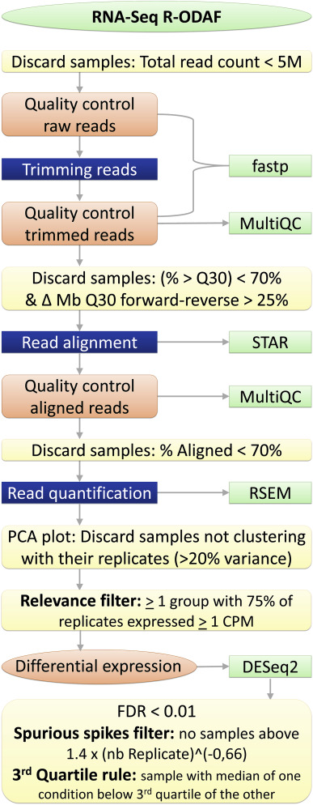
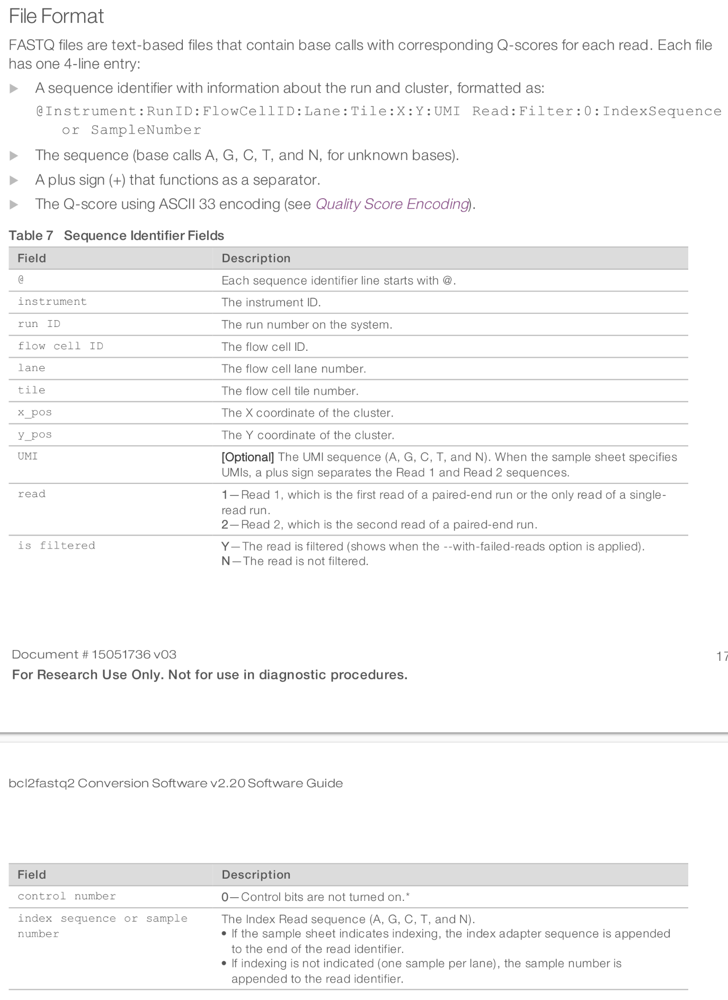
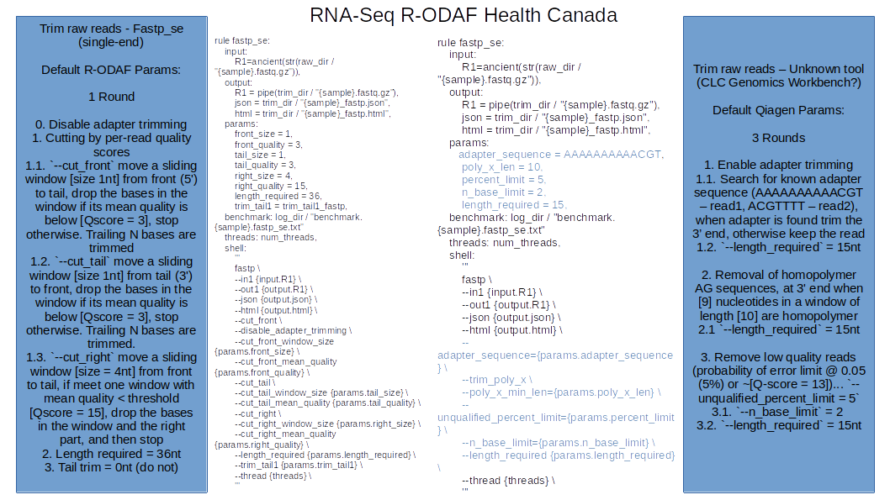
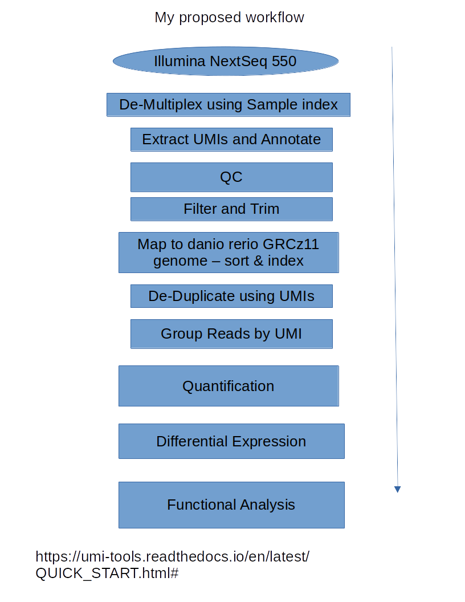
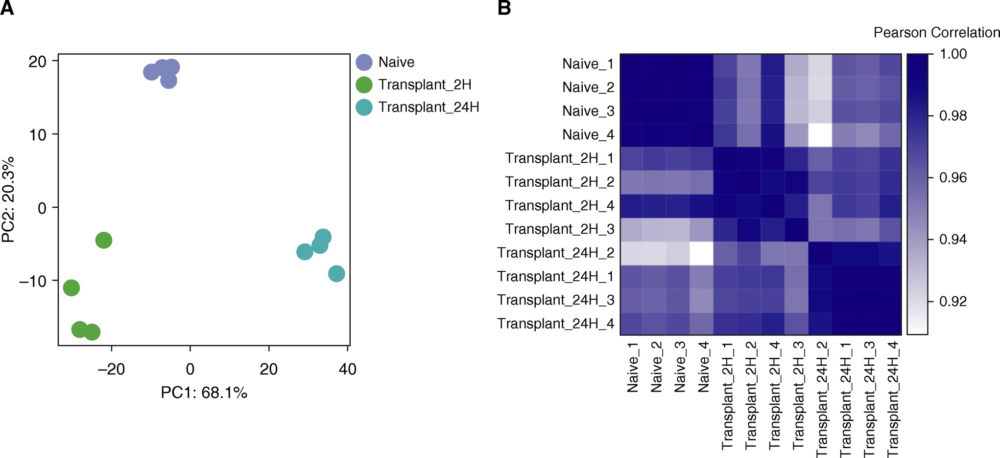

```{r 1setup, include=FALSE}
knitr::opts_chunk$set(echo = TRUE)
options(scipen = 9)
```

```{r, include=FALSE}
library(rlang)
library(tidyverse)
library(knitr)
```


## Questions

* What steps were taken beforehand before sending us the .fastq files, if any?
  * reads should be 27nt, but are 17nt. `Index Sequence` header in line one is only 6nt. What are the other 4nt, and have they been trimmed of the read files we were sent?
    * Is the `Index Sequence` part of the `Cell ID`?
  * Are UMIs present at the beginning of the end of the reads (5' or 3')?
  * Have the files been trimmed and filtered? (no? --  header says `N`)
  * Why were the Q scores for all of the read2s so poor? This is contributing to more than 50% of samples not being able to be grouped by UMI...
* Can we get a copy of the raw unprocessed files (off the illumina NextSeq --  before de-multiplexing)?
* Trimming reports say "Removal of homopolymer AG sequences, at 3' end when [9] nucleotides in a window of length [10] are homopolymer"... Does this mean trimming of both PolyA and POlyG (ex: AAATAAAAA - gets trimmed & GGGGGCGGG - gets trimmed, or AGAGAGAGAG - gets trimmed?)
* In the Filtering and trimming reports (round 1), Adapter sequences are defined: AAAAAAAAAACGT & ACGTTTT... are these accurate?
* In the filtering and trimming report (round 1), reads that don't have any adapter sequences are... "Keep the read, Score: [2 : 3 : 10 : 4]". Can you clarify what this "Score" means?

* Can you describe the general workflow from the very beginning starting from the Illumina Sequencer? e.g.

<!-- * Can you describe the general workflow from the very beginning starting from the Illumina Sequencer? e.g.  -->
<!--   * Sequencer -[base calls]-> -->
<!--   * bc2fq2 -[fastq]-> -->
<!--   * De-multiplexing -[fastq]-> -->
<!--   * QC (FastQC) -[fastq]-> -->
<!--   * UMI Extraction (UMI-tools) -[fastq]-> -->
<!--   * QC (FastQC) -[fastq]-> -->
<!--   * [.fasta + .gtf] Filtering and trimming (filtering and trimming tool? fastp?) -[trimmed fastq]-> -->
<!--   * QC (FastQC) -[trimmed fastq]-> -->
<!--   * Mapping and aligning (to genome? to transcriptome? -- what aligner? STAR, HiSAT2) -[BAM/SAM]-> -->
<!--   * UMI Collapsing (UMI-tools/UMICollapse) -[BAM/SAM?]-> -->
<!--   * Group reads by UMI + extract concensus reads with the best phred scores (tool? UMI-tools?) -[BAM/SAM]-> -->
<!--   * [.gtf] Quantify (RSEM, featurecounts) -[Counts]-> -->
<!--   * [Sample Information" group, replicate, etc.] Differential Expression (DESeq2) -[DE genes]-> -->
<!--   * [Gene Ontology, KEGG, Panther, BIOCarta] Functional Analysis (EnrichR, GSEA, DAVID, GOstats) -->


## Checking our data



Note that, "any major problems encountered during the sequencing itself would be identified prior to use of the samples by the sequencing facility (e.g., failure in the percentage of clusters passing threshold, base calling and demultiplexing) and are not included in the R-ODAF. We also did not include any removal of samples based on quality prior to trimming, since we considered that these decisions should be based on the number of reads remaining after cleaning the data rather than on the raw fastq files"


```{bash check for paired end, echo = TRUE}
cd ~/MastersBackup/Data/RAW_Qiagen_Data_1_Sept_2021/QNS30480_JasonOBrien_FASTQ
# The output of this should read out both 1 and 2 in the output if paired end, and 
grep --max-count=10000 -P "^@" *.fastq | grep -oP "\s\d+" | sort | uniq -c
```
We have two reads per sample. The first is the transcript, the second contains our UMIs that need to be extracted and added to the file headers of the read1 fastq files\
\
Read one has a length of 100bp\
Read two has a length of 27bp\
\
Therefore, we have one read of the transcript from a single end.
\
Qiagen explains visually what each read file should contain\


Qiagen explains in their report that they first de-multiplexed the raw fastq files (they separated the fastq file(s) into further separate files organized by which sample they came from). Each sample has a unique barcode that is used to make the separate files (organized by sample). These barcodes get stripped off of the read after de-multiplexing. Therefore, Qiagen must have sent us the de-multiplexed and barcode-stripped fastq files for every 'read2'. Therefore, I expect that the 'read2' files should still have their UMI (10nt) + ACG (3nt) + polyT (according to qiagen's filtering reports, these tails have 4nt 'TTTT') = 17nt.

Here is a glimpse of what the transcripts (read 1) look like
```{bash fastq reads, echo = FALSE}
tail -8 ~/MastersBackup/Data/RAW_Qiagen_Data_1_Sept_2021/QNS30480_JasonOBrien_FASTQ/30480-001_C1_R1.fastq
```
read1 is 100bp long

Here is a glimpse of what the Cell ID & UMIs look like (read 2)
```{bash read2 glimpse, echo = FALSE}
tail -8 ~/MastersBackup/Data/RAW_Qiagen_Data_1_Sept_2021/QNS30480_JasonOBrien_FASTQ/30480-001_C1_R2.fastq
```
We can see that Line 1 has some meta information about the transcript (read1),
Line 2 has the 100bp sequence
Line 3 is a separator (+)
Line 4 are the Quality scores for the base calls
\
Note: 
- read2 only has a sequencing length of 17bp when it should have 27
- Therefore, it is reasonable to assume (without any knowledge from Qiagen) that these reads still contain the UMI, and are just missing the cell ID barcode...
- However, the numbers don't quite add up... 2nt are un-accounted for ([Cell ID]12nt + [UMI]10nt + [Adapter - PolyT + ACG]7nt = 29nt != 27nt)
- Also notice that the `Index Sequence` on top of the header is 6nt long (What happened to the other 6nt?)
\
Qiagen uses `bcl2fastq2 software (Illumina inc.)` for converting raw base calling data into FASTQ files after de-multiplexing.\
From the bcl2fastq2 software manual\
\

Note that the `UMI` field is also missing from read1. This means that the fastq files we have do not have the UMIs extracted yet... This will have to be done with UMI-tools
\
\
From Qiagen:\
"In short, the reads are annotated with their UMI and are then trimmed for poly(A) and adapter sequences, minimum reads length (15 nucleotides), read quality, and ambiguous nucleotides (maximum of 2). They are then deduplicated using their UMI."\
\
The FastQ Filtering steps:
1. Round 1
    + Remove adapter sequences:
    + polyA + CGT (AAAAAAAAAACGT) for read1, 
      + when the adapter is found, trim the 3' end
      + when no adapter, keep the read
    + Score
    + ACG + PolyT (ACGTTTT) for read2,
      + when adapter is found, keep the 3' end
      + when no adapter, keep the read
    + Score
    + Remove sequences shorter than 15 nucleotides
2. Round 2
    + Removal of homopolymer AG sequences
      + at read 3' when 9 nucleotides in a window of length 10 are homoploymer
    + Remove any sequences left with less than 15 nucleotides
3. Round 3: 
    + Remove low quality sequences (probability of error limit @ 0.05 or ~Q-score of 13) [Q-scores](http://drive5.com/usearch/manual/quality_score.html)
    + Remove ambiguous nucleotides: maximal 2 nucleotides allowed
    + Remove any sequences left that are less than 15 nucleotides
\
\
\
This filtering step differes quite a bit from the R-ODAF Pipeline:

\
\
\
From the looks of things (their summary report), Qiagen deduplicates before aligning and mapping... Other papers and sources I have read do this after alignment & mapping (with a BAM file and not a fastq file). However, deduplicating from a fastq file can speed up the alignment and mapping step downstream... This could be an incorrect interpretation\
\
After deduplication...\
"Reads are grouped into UMI groups when they: 
- (1) start at the same position based on the end of the read to which the UMI is ligated (i.e., Read2 for paired data), 
- (2) are from the same strand, and 
- (3) have identical UMIs. 
Groups that contain only one read (singletons) are merged into non-singleton groups if the singleton’s UMI can be converted to a UMI of a non-singleton group by introducing an SNP (the biggest group is chosen)." the UMICollapse tool has this function\
\
The FASTQ files are then aligned and mapped to the danio rerio genome GRCz11... [Ensemble](https://www.ensembl.org/info/data/ftp/index.html?redirect=no).\
To align and map yourself you would use the [soft-masked primary assembly reference genome (.fasta)](http://ftp.ensembl.org/pub/release-107/fasta/danio_rerio/dna/Danio_rerio.GRCz11.dna_sm.primary_assembly.fa.gz), and the [gene transfer format (.gtf) file](http://ftp.ensembl.org/pub/release-107/gtf/danio_rerio/Danio_rerio.GRCz11.107.gtf.gz)\
\
\
Qiagen used `‘Empirical analysis of DGE’ algorithm of the CLC Genomics Workbench 21.0.4 ` for DGE analysis. it is an implementation of the 'Exact Test' for two-group comparisons from the `EdgeR Bioconductor` package\
\
We will use Deseq2\
\
\
\
\
\
\
Gather all of this information, it looks like this is the general workflow that Qiagen uses and we should use too if we want to replicate the quantified data:


Here's what I propose we do:
Reference - [UMITools](https://umi-tools.readthedocs.io/en/latest/QUICK_START.html#)



Here's some more information about RNAseq with UMIs:

"RNA sequencing has become one of the most important research tools for investigating gene expression. By analyzing RNA-seq data, we can obtain comprehensive genome-scale information on Expression, Splicing and RNA editing of a sample.

However, in RNA-seq data, there usually are identical reads in various proportions, ranging from 40% to 70% in the FastQC step.These duplicated/repeated reads may possibly be false-positive signals, lead to INACCURATE quantification on expression, Splicing or RNA editing.

Repeated reads arise largely from the library preparation step. During this process, RNAs are first fragmented into small pieces about 200-400 nt, followed by reverse transcripiton, adapter ligation and finally PCR amplification.

Two steps in this process may introduce repeated reads. 

Firstly, when RNAs are ion fragmented, different mRNA copies of the same gene may break at the same site, producing identical RNA fragments. Repeated reads from these “molecular duplicates” indicate that multiple mRNA copies of a the gene are present in the sample, thus TRUE repeats. 

Secondly, when cDNAs are amplified, a single cDNA copy may be amplified to multiple identical ones. Repeated reads from these “PCR duplicates” are actually originated from the same mRNA copy, thus FALSE POSITIVE repeats. PCR amplification bias can introduce different duplication levels to different genes, which is the main source of inaccuracy.

To get accurate gene expression information, we need to get rid of PCR duplicates and keep the “molecular duplicates”. Unfortunately, these two kinds of duplicates can’t be treated differently because they are indistinguishable in current RNA-seq data. 

To solve this problem, SeqHealth company developed UMI-enhanced deep sequencing technology, and applies it to RNA sequencing (KC-DigitalTM RNA-seq), miRNA sequencing, 16s rDNA sequencing, and TCR/BCR sequencing. KC-DigitalTM RNA-seq lables each RNA fragment with a Unique Molecular Identifier (UMI) before amplification.

TRUE repeats have different UMIs, while FALSE repeats from the same mRNA copy have the same UMI. When analyzing the sequencing data, by combining all the duplicated reads with the same UMI, we can remove artificial “PCR duplicates” while keeping the meaningful “molecular duplicates”. 

The duplicated reads may also be produced in the sequencing process. Patterned flow-cells used on Hiseq4000/X/Novaseq can produce “ExAmp duplicates". If the molecules in a nanowell hybridise to nearby empty nanowells, one or more "ExAmp duplicate" clusters can be created, which are also artificial duplicates.

UMI-enhanced sequencing technology also has the power to get rid of these ExAmp duplicates: since all the ExAmp-derived duplicated reads have the same UMI label with the source read, they can be merged into one copy during data analysis.

In addition, UMI enhanced sequencing technology can correct ERRORs from PCR/sequencing steps. With the help of UMI, we can trace the source of all the duplicated reads. The duplicated reads from the same source should have an identical sequence. By aligning all the reads from the same sources, we can generate an error-free consensus sequence for each alignment. This function is especially valuable when analyzing cSNP and RNA editing changes. 

In summary, the UMI-enhanced deep sequencing technology developed by SeqHealth can help to get more accurate gene expression, alternative splicing and RNA editing information, improving the quality of deep sequencing in all aspects." [https://youtu.be/nFcKar9hOkc]


<!-- ## Normalizing Quantified (counts) data -->
<!-- [Stat Quest - Normalization methods](https://www.youtube.com/watch?v=TTUrtCY2k-w) -->

<!-- We should normalize using TPM (transcripts per million) to account for sequencing depth and gene length -->


<!-- ## Determine Intra- and Intergroup Variability and outliers (Quantified data) -->

<!--  -->

<!-- Using PCA or Correlation scores in a heatmap -->

<!-- ## Filter out Noise -->
