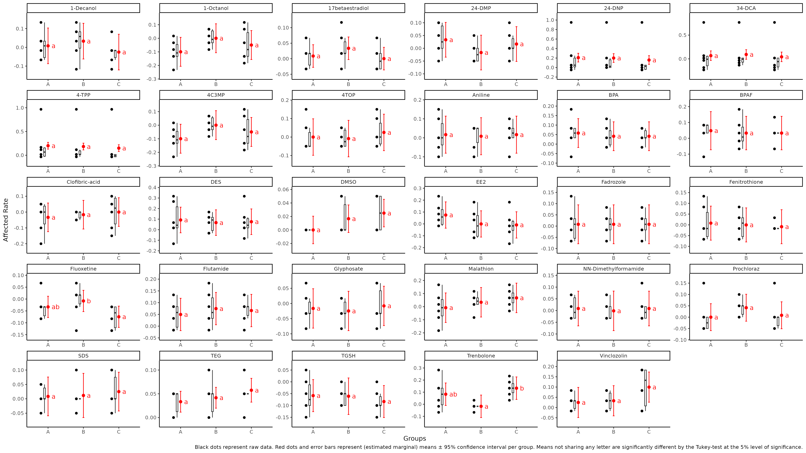
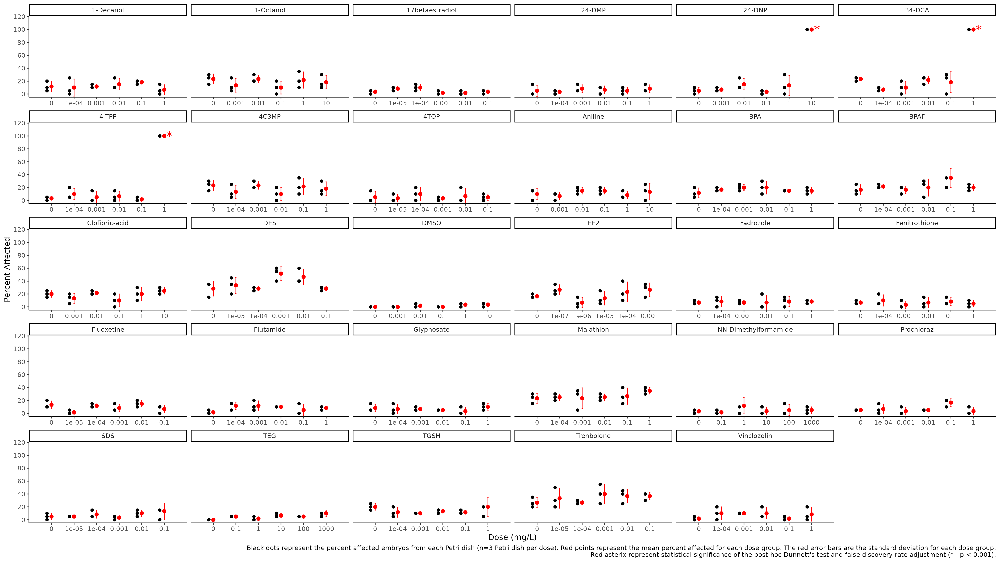

```{r setup, include=FALSE}
#knitr::opts_chunk$set(echo = TRUE)
```

```{r Libraries, include = FALSE}
library(multcomp)
library(stringr)
library(dplyr)
library(readr)
library(tidyr)
library(purrr)
library(tibble)
library(ggplot2)
library(scales)
# library(plyr)
library(broom)
library(car)
library(stats)
library(DT)
library(outliers)
library(DescTools)
library(emmeans)
library(forcats)
```

```{r directories, include=FALSE}
### FOLDERS, FILES AND FUNCTIONS
# setwd("~/MolToxLab/Lethality_and_Deformities/") # Please set your own working directory
temp1 <- list.files("Data/Apical_Data_Sheets/", "*.csv") #List all of the files in the working directory
apicaldata <- lapply(paste0("Data/Apical_Data_Sheets/", temp1), read.csv) #Import the data to a single object
rm(temp1)
chemnames <- gsub("\\.csv$", "", list.files("Data/Apical_Data_Sheets/", "*.csv"))
names(apicaldata) <- chemnames

#Fix Hatch Rate denominator to the # of alive fish instead of 20
lapply(X = apicaldata, FUN = function(x){mutate(x, Hatch.Rate = Hatched/Alive)})
```

```{r export_Data_sheet, include=FALSE}
#Output Sheets
all_apicaldata <- plyr::ldply(apicaldata) %>%
  rename(Chemical = .id)
#write_csv(all_apicaldata, file = "Data/master_apical_data.csv")
```

```{r normalize_afected_rate, include=FALSE}
all_apicaldata <- all_apicaldata %>%
  group_by(Chemical) %>%
  filter(Dose == "Control") %>%
  summarise(norm_factor = mean(Affected.Rate)) %>%
  inner_join(all_apicaldata) %>%
  mutate(Norm.Affected.Rate = Affected.Rate-norm_factor) %>%
  rename(Raw.Affected.Rate = Affected.Rate, Affected.Rate = Norm.Affected.Rate)
```

```{r Test_for_normality, echo=FALSE}
all_apicaldata %>%
  group_by(Chemical) %>%
  ggplot(aes(sample = Affected.Rate)) +
  geom_qq() +
  geom_qq_line() +
  facet_wrap(~ Chemical, scales = "free") +
  ylab("Sample") +
  xlab("Theoretical") +
  theme_classic() +
  ggtitle("QQ plots showing approximatey normal distributions for each experiment")
```


```{r Outiers, echo=TRUE, warning=FALSE, message=FALSE}
####Outliers####
grubbs.flag <- function(x) {
  outliers <- NULL
  test <- x
  grubbs.result <- grubbs.test(test)
  pv <- grubbs.result$p.value
  while(pv < 0.05) {
    outliers <- c(outliers,as.numeric(strsplit(grubbs.result$alternative," ")[[1]][3]))
    test <- x[!x %in% outliers]
    grubbs.result <- grubbs.test(test)
    pv <- grubbs.result$p.value
  }
  return(data.frame(Affected.Rate=x,Outlier=(x %in% outliers))) #Note Affected.Rate is baked into function
}

#Testing for Outliers...
input_apicaldata <- all_apicaldata %>%
  group_by(Chemical) %>%
  dplyr::select(Affected.Rate) %>%
  mutate(Affected.Rate = round(Affected.Rate, digits = 3)) %>% #Bug with grubbs and large decimal places
  # filter(Chemical %in% c("BPA", "BPAF")) %>% #Testing with smaller data set
  nest()

grubbs_results <- input_apicaldata %>%
  mutate(grubbs_results = map(data, ~grubbs.flag(x = .x[[1]])))

apicaldata_join <- grubbs_results %>%
  dplyr::select(-data) %>%
  unnest(cols = c(grubbs_results))

apicaldata_test <- all_apicaldata %>%
  mutate(Affected.Rate = round(Affected.Rate, digits = 3)) %>%
  inner_join(apicaldata_join, by = c("Chemical", "Affected.Rate"))
apicaldata_test <- apicaldata_test[-which(duplicated(apicaldata_test)),] #Delete duplicates introduced by join

test <- apicaldata_test %>%
  group_by(Chemical, Dose..mg.L.) %>%
  tally()

#Outliers removed
apicaldata_ol_rm <- apicaldata_test %>%
  mutate(across(
    .cols = c("Affected.Rate"),
    .fns = ~ replace(x = ., list = Outlier, values = NA) 
  ))

#Write outlier removed data
#write_csv(x = apicaldata_ol_rm, file = "Data/apicaldata_ol_rm.csv")

#Write outlier removed data and filter out the 7th dose group (group 6) for some of the chemicals where the dose was lethal (This is to make rcurvep function as expected with the same number of dose groups for every chemical)
apicaldata_ol_rm %>%
  filter(Dose != "Dose_6") %>%
write_csv(x = ., file = "Data/apicaldata_ol_rm_and_Lethal_Dose-lowest_dose_removed.csv")
apicaldata_ol_rm <- read_csv(file = "Data/apicaldata_ol_rm_and_Lethal_Dose-lowest_dose_removed.csv")

#nest/list data again
apicaldata <- apicaldata_ol_rm %>%
  group_by(Chemical) %>%
  split(f = .$Chemical)
```

```{r Normality_test_ol_rm, echo=FALSE, warning=FALSE}
apicaldata_ol_rm %>%
  group_by(Chemical) %>%
  ggplot(aes(sample = Affected.Rate)) +
  geom_qq() +
  geom_qq_line() +
  facet_wrap(~ Chemical, scales = "free") +
  ylab("Sample") +
  xlab("Theoretical") +
  theme_classic() +
  ggtitle("QQ plots showing approximatey normal distributions for each experiment after outlier removal")
```

```{r Levene_test, echo=TRUE}
####Levene Test####
# Homogeneity of variance -- of Affected Rate
LeveneResults <- apicaldata_ol_rm %>%
  group_by(Chemical) %>%
  summarise(car::leveneTest(Affected.Rate, as.factor(Dose..mg.L.)))
#Adding an is.significant column to easily parse significant values in a spreadsheet
LeveneResults <- LeveneResults %>%
  na.omit() %>%
  mutate(is.significant = if_else(
    condition = `Pr(>F)` < 0.05,
    true = TRUE,
    false = FALSE
  ))
DT::datatable(LeveneResults)

write_csv(x = LeveneResults, file = "Output/Levene_Test_Results.csv")
#rm(VarianceCheck)
```

```{r ANOVAs, echo=TRUE, warning=FALSE}
####ANOVA####
#Survival Rate
ancova_output_SR <- list()
for(i in 1:length(apicaldata)) {
  temp2 <- aov(data = apicaldata[[i]], Survival.Rate ~ as.factor(Dose) + as.factor(Replicate))
  ancova_output_SR[i] <- summary(temp2)
  rm(temp2)
}
names(ancova_output_SR) <- chemnames
#print(anova_output_SR)
ancova_SR_summary <- plyr::ldply(ancova_output_SR, broom::tidy) %>%
  mutate(adj.p.value = p.adjust(p.value, "fdr"))
write_csv(ancova_SR_summary, file = "Output/ancova_SR_summary.csv")

#Deformity Rate
ancova_output_DR <- list()
for(i in 1:length(apicaldata)) {
  temp2 <- aov(data = apicaldata[[i]], Deformity.Rate ~ as.factor(Dose) + as.factor(Replicate))
  ancova_output_DR[i] <- summary(temp2)
  rm(temp2)
}
names(ancova_output_DR) <- chemnames
#print(anova_output_DR)
ancova_DR_summary <- plyr::ldply(ancova_output_DR, broom::tidy) %>%
  mutate(adj.p.value = p.adjust(p.value, "fdr"))
write_csv(ancova_DR_summary, file = "Output/ancova_DR_summary.csv")

#Hatch Rate
ancova_output_HR <- list()
for(i in 1:length(apicaldata)) {
  temp2 <- aov(data = apicaldata[[i]], Hatch.Rate ~ as.factor(Dose) + as.factor(Replicate))
  ancova_output_HR[i] <- summary(temp2)
  rm(temp2)
}
names(ancova_output_HR) <- chemnames
#print(anova_output_HR)
ancova_HR_summary <- plyr::ldply(ancova_output_HR, broom::tidy) %>%
  mutate(adj.p.value = p.adjust(p.value, "fdr"))
write_csv(ancova_HR_summary, file = "Output/ancova_HR_summary.csv")

#Affected Rate
ancova_output_AR <- list()
for(i in 1:length(apicaldata)) {
  temp2 <- aov(data = apicaldata[[i]], Affected.Rate ~ as.factor(Dose) + as.factor(Replicate))
  ancova_output_AR[i] <- summary(temp2)
  rm(temp2)
}
names(ancova_output_AR) <- chemnames
#print(anova_output_AR)
ancova_AR_summary <- plyr::ldply(ancova_output_AR, broom::tidy) %>%
  mutate(adj.p.value = p.adjust(p.value, "fdr"))
write_csv(ancova_AR_summary, file = "Output/ancova_AR_summary.csv")
```

```{r Means_and_SD_summary_data, echo=TRUE, warning=FALSE, message=FALSE}
####Means and SD####
apicaldatasummary <- list()
for(i in 1:length(apicaldata)) {
  temp2 <- apicaldata[[i]] %>% group_by(Dose..mg.L., Dose) %>%
    summarise("Survival Rate" = mean(Survival.Rate, na.rm=TRUE), SD_SR = sd(Survival.Rate, na.rm=TRUE),
              "Deformity Rate" = mean(Deformity.Rate, na.rm=TRUE), SD_DR = sd(Deformity.Rate, na.rm=TRUE),
              "Hatch Rate" = mean(Hatch.Rate, na.rm=TRUE), SD_HR = sd(Hatch.Rate, na.rm=TRUE),
              "Affected Rate" = mean(Affected.Rate, na.rm=TRUE), SD_AR = sd(Affected.Rate, na.rm=TRUE))
  colnames(temp2) <- c("Dose_mg_L", "Dose", "Survival_Rate", "SR_SD", "Deformity_Rate", "DR_SD", "Hatch_Rate", "HR_SD", "Affected_Rate", "AR_SD")
  apicaldatasummary[[i]] <- as.data.frame(temp2)
  rm(temp2)
}
names(apicaldatasummary) <- chemnames
#print(apicaldatasummary)
apicaldatasummary_tibble <- apicaldatasummary %>%
  plyr::ldply()
DT::datatable(apicaldatasummary_tibble)

#Output Sheets
all_apicaldata <- plyr::ldply(apicaldata) %>%
  dplyr::select(-.id)
write_csv(all_apicaldata, file = "Data/master_apical_data.csv")
```

```{r Tukey_Test, echo=TRUE, warning=FALSE, message=FALSE}
#TukeyHSD's Test on Groups - testing for 'Group Effects'
Variable <- "Affected.Rate"

tukey_input <- apicaldata_ol_rm %>%
  group_by(Chemical) %>%
  nest() %>%
  mutate(model = map(data, ~ aov(
    Affected.Rate ~ as.factor(Dose..mg.L.) + as.factor(Replicate),
    data = .
  ))) %>%
dplyr::select(model)

Tukey_results <- tukey_input %>%
  mutate(model = map(model, ~ TukeyHSD(x = .x))) %>%
  dplyr:: select(model)
  

#%%%%%%%%%%%%%%%%%%%%%%%%%%%%%%%%%%%%%%%%%%%%%%%%%%%%%%%%%%%%%%%%%%%%%%%%%%%%%
#Following guide here https://schmidtpaul.github.io/DSFAIR/compactletterdisplay.html
#contrasts
#option 1
option1 <- Tukey_results %>%
  mutate(data = map(model, ~ broom::tidy(x = .x)))
#option 2
option2 <- tukey_input %>%
  mutate(option2 = map(model, ~ emmeans::emmeans(object = .x, specs = "Replicate"))) %>%
  mutate(option2 = map(option2, ~ pairs(x = .x,  adjust = "tukey")))
#option 3
option3 <- tukey_input %>%
  mutate(option3 = map(model, ~ multcomp::cld(emmeans::emmeans(object = .x, specs = "Replicate"), adjust = "tukey", details = TRUE, Letters = letters, alpha = 0.05)))

#uniform format
option1 <- option1 %>%
  dplyr::select(data) %>%
  unnest(cols = c(data)) %>% #Tidying Output
  filter(term == "as.factor(Replicate)") %>%
  mutate(adj.p.value = p.adjust(adj.p.value, method = "fdr"))

option2 <- option2 %>%
  dplyr::select(option2) %>%
  mutate(data = map(option2, ~ as_tibble(x = .x))) %>%
  dplyr::select(data) %>%
  unnest(cols = c(data)) %>%
  mutate(adj.p.value = p.adjust(p.value, method = "fdr"))
  
option3_t <- option3 %>%
  dplyr::select(option3) %>%
  mutate(data = map(option3, pluck(.x = "comparisons"))) %>%
  mutate(data2 = map(data, ~ as_tibble(x = .x))) %>%
  dplyr::select(data2) %>%
  unnest(cols = c(data2)) %>%
  mutate(adj.p.value = p.adjust(p.value, method = "fdr"))
option3 <- option3 %>%
  dplyr::select(option3) %>%
  mutate(data = map(option3, pluck(.x = "emmeans"))) %>%
  mutate(data2 = map(data, ~ as_tibble(x = .x))) %>%
  dplyr::select(data2) %>%
  unnest(cols = c(data2))

#%%%%%%%%%%%%%%%%%%%%%%%%%%%%%%%%%%%%%%%%%%%%%%%%%%%%%%%%%%%%%%%%%%%%%%%%%%%%%


#TukeyHSD's Test on Groups - testing for 'Group Effects' continued
Tukey_results <- Tukey_results %>% 
  mutate(data = map(model, ~ broom::tidy(x = .x))) %>%
  dplyr::select(-model) %>% 
  unnest(cols = c(data)) %>% #Tidying Output
  mutate(adj.p.value = p.adjust(adj.p.value, method = "fdr"))

Tukey_Sig_results <- Tukey_results %>%
  filter(adj.p.value < 0.05)

Tukey_join_to <- Tukey_results %>%
  filter(term == "as.factor(Replicate)") %>%
  mutate(Group = str_split(string = contrast, pattern = "-", simplify = TRUE)[,1],
         contrast = str_split(string = contrast, pattern = "-", simplify = TRUE)[,2],
         Group_1 = Group,
         contrast_1 = contrast) %>%
  pivot_longer(cols = c(Group, contrast), values_to = "Group", names_to = "X") %>%
  mutate(contrast = if_else(condition = X == "contrast", true = Group_1, false = contrast_1)) %>%
  dplyr::select(Chemical, Group, contrast, term, null.value, estimate, conf.low, conf.high, adj.p.value)

gg_Tukey <- Tukey_join_to %>%
  dplyr::select(Chemical, Group, contrast, adj.p.value)


#Write to a .csv
write_csv(Tukey_results, file = "Output/Tukey_HSD_results.csv")
#write_csv(option_3_t)


DT::datatable(Tukey_results)
```


```{r Tukey_Group_Eff_Plot, echo=TRUE, warning=FALSE, message=FALSE}
#Group Variance v2
y_values_4_geom_text <- apicaldata_ol_rm %>%
  group_by(Chemical) %>%
  summarise(max_y = max(Affected.Rate, na.rm = TRUE))
gg_Tukey <- gg_Tukey %>%
  inner_join(y_values_4_geom_text)

gg_data <- apicaldata_ol_rm %>%
  na.omit() %>%
  group_by(Chemical) %>%
  mutate(Affected.Rate_show = as.numeric(
    between(
      x = Affected.Rate,
      left = quantile(Affected.Rate, na.rm = TRUE)[2] - 1.5 * IQR(Affected.Rate, na.rm = TRUE),
      right = quantile(Affected.Rate, na.rm = TRUE)[4] + 1.5 * IQR(Affected.Rate, na.rm = TRUE)
    )
  )) %>%
  mutate(
    Affected.Rate_ol_rm = if_else(Affected.Rate_show == 1, true = Affected.Rate, false = NA)
  ) %>%
  rename(Group = Replicate) %>%
  dplyr::select(
    Chemical,
    Group,
    Dose..mg.L.,
    Dose,
    Affected.Rate,
    Affected.Rate_show,
    Affected.Rate_ol_rm
  )
model <- ancova_output_AR
model_means_cld <- option3 %>%
  group_by(Chemical) %>%
  rename(Group = Replicate) %>%
  mutate(Group = forcats::fct_reorder(Group, emmean)) %>%
  mutate(cont_group = .group)
# gg_data <- gg_data %>%
#   group_by(Chemical) %>%
#   mutate(Group = fct_relevel(Group, levels(model_means_cld$Group)))

p <- ggplot() +
  #y axis
  scale_y_continuous(
    name = "Affected Rate",
    breaks = pretty_breaks(),
    expand = expansion(mult = (c(0.2, 0.2)))
  ) +
  #x axis
  scale_x_discrete(
    name = "Groups"
  ) +
  #layout
  theme_classic() +
  #black data points
  geom_point(
    data = gg_data,
    aes(y = Affected.Rate, x = Group),
    position = position_nudge(x = -0.2)
  ) +
  #black boxplot
  geom_boxplot(
    data = gg_data,
    aes(y = Affected.Rate, x = Group),
    width = 0.05,
    outlier.shape = NA,
    position = position_nudge(x = -0.1)
  ) +
  #red mean value
  geom_point(
    data = model_means_cld,
    aes(y = emmean, x = Group),
    size = 2,
    color = "red"
  ) +
  #red mean errorbar
  geom_errorbar(
    data = model_means_cld,
    aes(ymin = lower.CL, ymax = upper.CL, x = Group),
    width = 0.05,
    color = "red"
  ) +
  #red letters
  geom_text(
    data = model_means_cld,
    aes(
      y = emmean,
      x = Group,
      label = str_trim(cont_group)
    ),
    position = position_nudge(x = 0.1),
    hjust = 0,
    color = "red"
  ) +
  facet_wrap( ~ Chemical, scales = "free") +
  # ylim(c(-0.1, 1)) +
  labs(
    caption = str_wrap("Black dots represent raw data. Red dots and error bars represent (estimated marginal) means ± 95% confidence interval per group. Means not sharing any letter are significantly different by the Tukey-test at the 5% level of significance.", width = 70)
  )
```

```{r 2.plot_Group_variance_check, echo=FALSE}
ggsave(
  width = 1920,
  height = 1080,
  units = "px",
  scale = 3,
  filename = "Output/Images/Affected_Rate_Group_Eff_Tukey.png",
  plot = p,
  path = getwd(),
  device = "png"
)
```

```{r 3.plot_Group_variance_check, echo=FALSE}

```

```{r Dunnett, echo=TRUE}
####Dunnett's Test####
#PostHoc tests
set.seed(2345)

#Dunnett's Test
Dunnett_results <- apicaldata_ol_rm %>%
  group_by(Chemical) %>%
  nest() %>%
  mutate(model = map(data, ~ DunnettTest(
    x = .$Affected.Rate, g = .$Dose..mg.L.
  ), data = .)) #Performing the Dunnett's test and saving it is a variable

#Creating list of summaries
#Since the PostHocTest object cannot be coerced to a tidy tibble using broom::tidy()... we got creative
Dunnett_list <-
  list() #What we are trying to do is index the results and see what the significant results were... so we are using a list which can be later coerced into a tibble to easily index...
for (i in 1:length(unique(apicaldata_ol_rm$Chemical))) {
  Dunnett_list[[Dunnett_results$Chemical[i]]] <-
    Dunnett_results$model[[i]][["0"]] %>% #Take Dunnett's test results without any of the fancy summary information and shove it into a named list
    as.data.frame() %>% #Coerce to a data frame temporarily so what we can take the row names of the reults and turn them into a variable with rownames_to_column
    rownames_to_column(var = "dose")
}
Dunnett_comb <-
  plyr::ldply(Dunnett_list) #this function combines all of the lists together and gives them a variable name according to the chemical
Dunnett_comb$dose = substr(Dunnett_comb$dose,
                           start = 1,
                           stop = nchar(Dunnett_comb$dose) - 2) %>%
  as.numeric() #Here we are fixing the dose column... the dose column has the test dose related to the control... but we just want to see what the test dose is without it giving us redundant information about the comparison to the control for every observation...
Dunnett_comb <- as_tibble(Dunnett_comb) #Coerce to a tidy tibble
#Great, a nice tibble that we can export

#Now just to add one more column
Dunnett_comb <- Dunnett_comb %>%
  mutate(adj_p.value = p.adjust(pval, method = "fdr")) %>%
  mutate(is.significant = if_else(
    condition = adj_p.value < 0.05,
    true = TRUE,
    false = FALSE
  )) %>%
  rename(Dose = dose)
DT::datatable(Dunnett_comb)

#Write to a .csv
write_csv(Dunnett_comb, file = "Output/Dunnett_test_results.csv")

# #indexing what the significant results were...
# Dunnett_Sig_Results <-
#   Dunnett_comb[which(Dunnett_comb$adj_p.value <= 0.05), ]
# Dunnett_Sig_Results
```

```{r Plot_1, echo=TRUE, warning=FALSE, message=FALSE}
#Survival Rate
#Saving Images
for(i in 1:length(apicaldatasummary)) {
  p <- apicaldatasummary[[i]] %>%
    as.data.frame() %>%
    mutate(Dose_mg_L = as.factor(Dose_mg_L)) %>%
  ggplot(aes(x=Dose_mg_L, y=Survival_Rate)) +
    geom_point(stat="identity", color="black", fill="white", 
             position=position_dodge()) +
    geom_errorbar(aes(ymin=Survival_Rate-SR_SD, ymax=Survival_Rate+SR_SD), width=.2,
                  position=position_dodge(.9)) +
    theme(panel.grid.major = element_blank(), panel.grid.minor = element_blank(),
          panel.background = element_blank(), axis.line = element_line(colour = "black")) +
    labs(title=names(apicaldatasummary)[i]) +
    xlab("Dose (mg/L)") +
    scale_y_continuous(name = "Survival Rate",
                       breaks = pretty_breaks(),
                       expand = expansion(mult = (c(0, 0))),
                       limits = c(0,1.2))
                       
    # print(p)
    ggsave(paste0(names(apicaldatasummary[i]), ".png"), device = "png", path = paste0(getwd(), "/Output/Images/Survival_Rate"))
}
```

```{r Plot_2, echo=TRUE, warning=FALSE, message=FALSE}
#Deformity Rate
for(i in 1:length(apicaldatasummary)) {
  p <- apicaldatasummary[[i]] %>%
    as.data.frame() %>%
    mutate(Dose_mg_L = as.factor(Dose_mg_L)) %>%
    ggplot(aes(x=Dose_mg_L, y=Deformity_Rate)) +
    geom_point(stat="identity", color="black", fill="white", 
             position=position_dodge()) +
    geom_errorbar(aes(ymin=Deformity_Rate-DR_SD, ymax=Deformity_Rate+DR_SD), width=.2,
                  position=position_dodge(.9)) +
    theme(panel.grid.major = element_blank(), panel.grid.minor = element_blank(),
          panel.background = element_blank(), axis.line = element_line(colour = "black")) +
    labs(title=names(apicaldatasummary)[i]) +
    xlab("Dose (mg/L)") +
    scale_y_continuous(name = "Rate of Deformity",
                       breaks = pretty_breaks(),
                       expand = expansion(mult = (c(0, 0))),
                       limits = c(-0.1,1.2))
  # print(p)
  ggsave(paste0(names(apicaldatasummary[i]), ".png"), device = "png", path = paste0(getwd(), "/Output/Images/Deformity_Rate"))
}
```

```{r Plot_3, echo=TRUE, warning=FALSE, message=FALSE}
#Hatch Rate
for(i in 1:length(apicaldatasummary)) {
  p <- apicaldatasummary[[i]] %>%
    as.data.frame() %>%
    mutate(Dose_mg_L = as.factor(Dose_mg_L)) %>%
    ggplot(aes(x=Dose_mg_L, y=Hatch_Rate)) +
    geom_point(stat="identity", color="black", fill="white", 
             position=position_dodge()) +
    geom_errorbar(aes(ymin=Hatch_Rate-HR_SD, ymax=Hatch_Rate+HR_SD), width=.2,
                  position=position_dodge(.9)) +
    theme(panel.grid.major = element_blank(), panel.grid.minor = element_blank(),
          panel.background = element_blank(), axis.line = element_line(colour = "black")) +
    labs(title=names(apicaldatasummary)[i]) +
    xlab("Dose (mg/L)") +
    scale_y_continuous(name = "Hatch Rate",
                       breaks = pretty_breaks(),
                       expand = expansion(mult = (c(0, 0))),
                       limits = c(-0.1,1.5))
  # print(p)
  ggsave(paste0(names(apicaldatasummary[i]), ".png"), device = "png", path = paste0(getwd(), "/Output/Images/Hatch_Rate"))
}
```

```{r Plot_4, echo=TRUE, warning=FALSE, message=FALSE}
#Affected Rate
#Saving Images
Dunnett_comb <- Dunnett_comb %>%
  rename(Dose_mg_L = Dose)

apicaldatasummary_2 <- full_join(apicaldatasummary_tibble, Dunnett_comb, by = c("Dose_mg_L", ".id")) %>%
  group_by(.id) %>%
  split(f = .$.id)

for(i in 1:length(apicaldatasummary_2)) {
  p <- apicaldatasummary_2[[i]] %>%
    as.data.frame() %>%
    mutate(Dose_mg_L = as.factor(Dose_mg_L)) %>%
    ggplot(aes(x = Dose_mg_L, y = Affected_Rate)) +
    geom_point(
      stat = "identity",
      color = "black",
      fill = "white",
      position = position_dodge()
    ) +
    geom_errorbar(
      aes(ymin = Affected_Rate - AR_SD, ymax = Affected_Rate + AR_SD),
      width = .2,
      position = position_dodge(.9)
    ) +
    geom_text(
      aes(
        label = if_else(
          condition = adj_p.value > 0.1,
          true = "",
          false = if_else(
            condition = adj_p.value <= 0.1 &
              adj_p.value > 0.05,
            true = "",
            if_else(
              condition = adj_p.value <= 0.05 &
                adj_p.value > 0.01,
              true = "*",
              false = if_else(
                condition = adj_p.value <= 0.01 &
                  adj_p.value > 0.001,
                true = "**",
                false = if_else(
                  adj_p.value <= 0.001 &
                    adj_p.value >= 0,
                  true = "***",
                  false = ""
                )
              )
            )
          )
        ),
        group = Dose_mg_L,
        y = Affected_Rate + AR_SD + 0.1,
        x = Dose_mg_L
      ),
      color = "red",
      size = 3.75
    ) +
    theme(
      panel.grid.major = element_blank(),
      panel.grid.minor = element_blank(),
      panel.background = element_blank(),
      axis.line = element_line(colour = "black")
    ) +
    labs(title = names(apicaldatasummary)[i]) +
    xlab("Dose (mg/L)") +
    ylab("Affected Rate") +
    scale_y_continuous(
      name = "Relative Affected Rate",
      breaks = pretty_breaks(),
      expand = expansion(mult = (c(0, 0))),
      limits = c(-0.3, 1.2)
    )
  # print(p)
  ggsave(
    paste0(names(apicaldatasummary[i]), ".png"),
    device = "png",
    path = paste0(getwd(), "/Output/Images/Affected_Rate")
  )
}
```

```{r 5_Plot, include=FALSE}
y_values_4_geom_text <- apicaldata_ol_rm %>%
  group_by(Chemical, Dose..mg.L., Dose) %>%
  summarise(max_y = max(Affected.Rate, na.rm = TRUE),
            min_y = min(Affected.Rate, na.rm = TRUE),
            median_y = median(Affected.Rate, na.rm = TRUE)) %>%
  rename(Dose_mg_L = Dose..mg.L.)

gg_Dunnett <- Dunnett_comb %>%
  rename(Chemical = .id) %>%
  inner_join(y_values_4_geom_text, by = c("Chemical", "Dose_mg_L"))

gg_ANOVA <- ancova_AR_summary %>%
  na.omit() %>%
  dplyr::filter(term %in% "as.factor(Dose)") %>%
  dplyr::rename(Chemical = .id) %>%
  dplyr::mutate(is.significant = if_else(condition = adj.p.value < 0.05, true = TRUE, false = FALSE)) %>%
  dplyr::select(Chemical, term, adj.p.value, is.significant)

gg_data <- apicaldata_ol_rm %>%
  inner_join(gg_ANOVA) %>%
  na.omit() %>%
  group_by(Chemical) %>%
  mutate(Affected.Rate_show = as.numeric(
    between(
      x = Affected.Rate,
      left = quantile(Affected.Rate, na.rm = TRUE)[2] - 1.5 * IQR(Affected.Rate, na.rm = TRUE),
      right = quantile(Affected.Rate, na.rm = TRUE)[4] + 1.5 * IQR(Affected.Rate, na.rm = TRUE)
    )
  )) %>%
  mutate(
    Affected.Rate_ol_rm = if_else(Affected.Rate_show == 1, true = Affected.Rate, false = NA),
    Dose = factor(Dose, levels = c("Control", "Dose_6", "Dose_5", "Dose_4", "Dose_3", "Dose_2", "Dose_1"), ordered = TRUE)
  ) %>%
  dplyr::rename(Group = Replicate,
                Dose_mg_L = Dose..mg.L.) %>%
  dplyr::select(
    Chemical,
    Group,
    Dose,
    Dose_mg_L,
    Affected.Rate,
    Affected.Rate_show,
    Affected.Rate_ol_rm,
    term,
    adj.p.value,
    is.significant
  )

apicaldatasummary_tibble <- apicaldatasummary_tibble %>%
  mutate(Dose = factor(
    Dose,
    levels = c(
      "Control",
      "Dose_6",
      "Dose_5",
      "Dose_4",
      "Dose_3",
      "Dose_2",
      "Dose_1"
    ),
    ordered = TRUE
  )) %>%
  rename(Chemical = .id) %>%
  group_by(Chemical)
```

```{r 6.Plot, include=FALSE}
p <- ggplot() +
  #y axis
  scale_y_continuous(
    name = "Relative Affected Rate",
    breaks = pretty_breaks(),
    expand = expansion(mult = (c(0.2, 0.2)))
  ) +
  #x axis
  scale_x_discrete(
    name = "Dose",
    expand = expansion(mult = (c(0.2, 0.2)))
  ) +
  #layout
  theme_classic() +
  #black data points
  geom_point(
    data = gg_data,
    aes(y = Affected.Rate, x = Dose, group = Dose, color = is.significant),
    position = position_nudge(x = -0.5),
    show.legend = FALSE
  ) +
  scale_color_manual(values = c("TRUE" = "black", "FALSE" = "grey")) +
  #black boxplot
  geom_boxplot(
    data = gg_data,
    aes(y = Affected.Rate, x = Dose, group = Dose),
    width = 0.2,
    outlier.shape = NA,
    position = position_nudge(x = -0.2)
  ) +
   #red mean value
  geom_point(
    data = apicaldatasummary_tibble,
    aes(y = Affected_Rate, x = Dose),
    size = 2,
    color = "red"
  ) +
  #red mean errorbar
  geom_errorbar(
    data = apicaldatasummary_tibble,
    aes(ymin = Affected_Rate-AR_SD, ymax = Affected_Rate+AR_SD, x = Dose),
    width = 0.05,
    color = "red"
  ) +
  #red text
  geom_text(
    data = gg_Dunnett,
    aes(
      label = if_else(
        condition = adj_p.value > 0.1,
        true = "",
        false = if_else(
          condition = adj_p.value <= 0.1 &
            adj_p.value > 0.05,
          true = "",
          if_else(
            condition = adj_p.value <= 0.05 &
              adj_p.value > 0.01,
            true = "*",
            false = if_else(
              condition = adj_p.value <= 0.01 &
                adj_p.value > 0.001,
              true = "**",
              false = if_else(adj_p.value <= 0.001 &
                                adj_p.value >= 0, true = "***", false = "")
            )
          )
        )
      ),
      group = Dose,
      y = median_y,
      x = Dose,
    ),
    position = position_nudge(x = 0.1),
    hjust = 0,
    color = "red",
    size = 6
  ) +
  facet_wrap( ~ Chemical, scales = "free") +
  labs(
    caption = str_wrap("Black dots represent animals what were significantly impacted from exposure to the toxic substance. Grey dots represent animals that were not significantly impacted from exposure to the substance. The endpoint of interest is the affected rate which includes animal mortality and deformities. Red points represent the mean Affected Rate and the the red error bars are the standard deviation. Red asterix represent statistical significance of the post-hoc Dunnett's test ('***' - adj_p.value < 0.001, '**' - adj_p.value < 0.01 & > 0.001, '*' - adj_p.value < 0.05 & > 0.01).", width = 100)) +
  theme(axis.text.x=element_text(angle=55,hjust=1))

```

```{r 7.Plot, include=FALSE}
ggsave(
  width = 1920,
  height = 1080,
  units = "px",
  scale = 3,
  filename = "Output/Images/Affected_Rate.png",
  plot = p,
  path = getwd(),
  device = "png"
)
```

```{r 8.Plot,echo=FALSE}

```